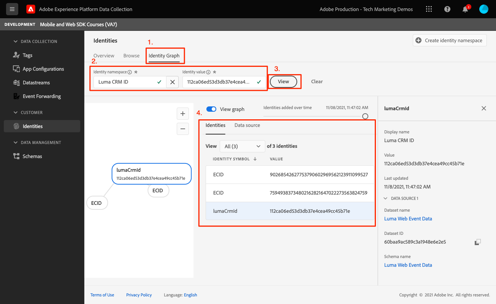

# Identidade

Saiba como coletar dados de identidade em um aplicativo móvel.

O Serviço de identidade da Adobe Experience Platform ajuda você a obter uma melhor visualização dos clientes e de seus comportamentos, unindo identidades em dispositivos e sistemas, permitindo que você forneça experiências digitais pessoais e de impacto em tempo real. Campos de identidade e namespaces são a cola que une diferentes fontes de dados para criar o perfil do cliente em tempo real de 360 graus.

Saiba mais sobre o [Extensão de identidade](https://developer.adobe.com/client-sdks/documentation/identity-for-edge-network/) e a variável [serviço de identidade](https://experienceleague.adobe.com/docs/experience-platform/identity/home.html?lang=pt-BR) na documentação.

## Pré-requisitos

* O aplicativo com SDKs instalados e configurados foi criado e executado com sucesso.

## Objetivos de aprendizagem

Nesta lição, você vai:

* Atualizar uma identidade padrão.
* Configurar uma identidade personalizada.
* Atualizar uma identidade personalizada.
* Valide o gráfico de identidade.
* Obtenha a ECID e outras identidades.

## Atualizar uma identidade padrão

Comece atualizando o mapa de identidade do usuário quando ele fizer logon.

1. Navegue até `Login.swift` se o aplicativo Luma e encontrar a função chamada `loginButt`.

   No aplicativo de amostra Luma, não há validação de nome de usuário ou senha. Basta tocar nos botões para &quot;fazer logon&quot;.

1. Crie o `IdentityMap` e `IdentityItem`.

   ```swift
   let identityMap: IdentityMap = IdentityMap()
   let emailIdentity = IdentityItem(id: emailAddress, authenticatedState: AuthenticatedState.authenticated)
   ```

1. Adicione o `IdentityItem` para o `IdentityMap`

   ```swift
   identityMap.add(item:emailIdentity, withNamespace: "Email")
   ```

1. Chame `updateIdentities` para enviar os dados para a Rede de borda da Platform.

   ```swift
   Identity.updateIdentities(with: identityMap)
   ```

>[!NOTE]
>
>Você pode enviar várias identidades em uma única chamada updateIdentities. Você também pode modificar identidades enviadas anteriormente.


## Configurar um namespace de identidade personalizado

Os namespaces de identidade são componentes de [Serviço de identidade](https://experienceleague.adobe.com/docs/experience-platform/identity/home.html?lang=pt-BR) que servem como indicadores do contexto ao qual uma identidade está relacionada. Por exemplo, eles distinguem um valor &quot;name@email.com&quot; como um endereço de email ou &quot;443522&quot; como uma ID de CRM numérica.

1. Na interface da Coleção de dados, selecione **[!UICONTROL Identidades]** no painel de navegação esquerdo.
1. Selecione **[!UICONTROL Criar namespace de identidade]**.
1. Forneça um **[!UICONTROL Nome de exibição]** de `Luma CRM ID` e uma **[!UICONTROL Símbolo de identidade]** valor de `lumaCrmId`.
1. Selecionar **[!UICONTROL ID entre dispositivos]**.
1. Selecione **[!UICONTROL Criar]**.


## Atualizar uma identidade personalizada

Agora que você criou uma identidade personalizada, comece a coletá-la modificando o `updateIdentities` o código que você adicionou na etapa anterior. Basta criar um IdentityItem e adicioná-lo ao IdentityMap. Esta é a aparência do bloco de código completo:

```swift
//Hardcoded identity values
let emailAddress = "testuser@gmail.com"
let crmId = "112ca06ed53d3db37e4cea49cc45b71e"

// Create identity map
let identityMap: IdentityMap = IdentityMap()
// Add email (standard)
let emailIdentity = IdentityItem(id: emailAddress, authenticatedState: AuthenticatedState.authenticated)
identityMap.add(item:emailIdentity, withNamespace: "Email")
// Add lumaCrmId (custom)
let crmIdentity = IdentityItem(id: crmId, authenticatedState: AuthenticatedState.authenticated)
identityMap.add(item: crmIdentity, withNamespace: "lumaCrmId")
// Update
Identity.updateIdentities(with: identityMap)
```

## Remover uma identidade

Você pode usar `removeIdentity` para remover a identidade do IdentityMap armazenado do lado do cliente. A extensão Identity interrompe o envio do identificador para a Rede de borda. O uso dessa API não remove o identificador do gráfico de perfil do usuário do lado do servidor ou do gráfico de identidade.

Adicione o seguinte `removeIdentity` código para o botão de logout clique em `Account.swift`.

```swift
// Logout
let logout = UIAlertAction(title: "Logout", style: .destructive, handler: { (action) -> Void in
    isLoggedIn = false;
    ////Hardcoded identity values
    let emailAddress = "testuser@gmail.com"
    let crmId = "112ca06ed53d3db37e4cea49cc45b71e"
    // Adobe Experience Platform - Remove Identity
    Identity.removeIdentity(item: IdentityItem(id: emailAddress), withNamespace: "Email")
    Identity.removeIdentity(item: IdentityItem(id: crmId), withNamespace: "lumaCrmId")
})
```

>[!NOTE]
>Nos exemplos acima, `crmId` e `emailAddress` são codificados, mas em um aplicativo do mundo real, os valores seriam dinâmicos.

## Validar com garantia

1. Revise o [instruções de configuração](assurance.md) e conecte seu simulador ou dispositivo ao Assurance.
1. No aplicativo, selecione o ícone Conta na parte inferior direita.

   
1. Selecione o **Fazer logon** botão.
1. Você é apresentado com a opção para inserir um nome de usuário e senha, ambos são opcionais e você pode simplesmente selecionar **Fazer logon**.

   
1. Examine a interface do usuário da Web do Assurance para `Edge Identity Update Identities` evento do `com.adobe.griffon.mobile` fornecedor.
1. Selecione o evento e revise os dados na variável `ACPExtensionEventData` objeto. Você deve ver as identidades atualizadas.
   

## Validar com gráfico de identidade

Depois de concluir as etapas no [lição do Experience Platform](platform.md), você também poderá confirmar a captura de identidade no visualizador de gráficos de identidade de Plataformas:




Próximo: **[Perfil](profile.md)**

>[!NOTE]
>
>Obrigado por investir seu tempo aprendendo sobre o Adobe Experience Platform Mobile SDK. Se você tiver dúvidas, quiser compartilhar feedback geral ou tiver sugestões sobre conteúdo futuro, compartilhe-as nesta [Publicação de discussão da comunidade do Experience League](https://experienceleaguecommunities.adobe.com/t5/adobe-experience-platform-launch/tutorial-discussion-implement-adobe-experience-cloud-in-mobile/td-p/443796)