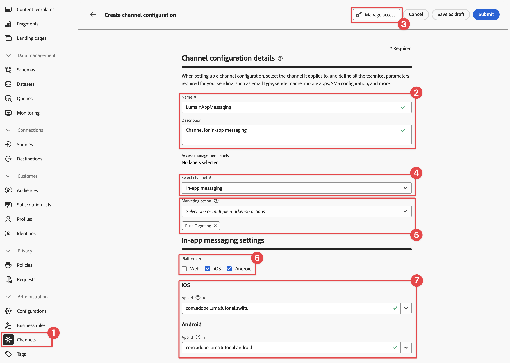
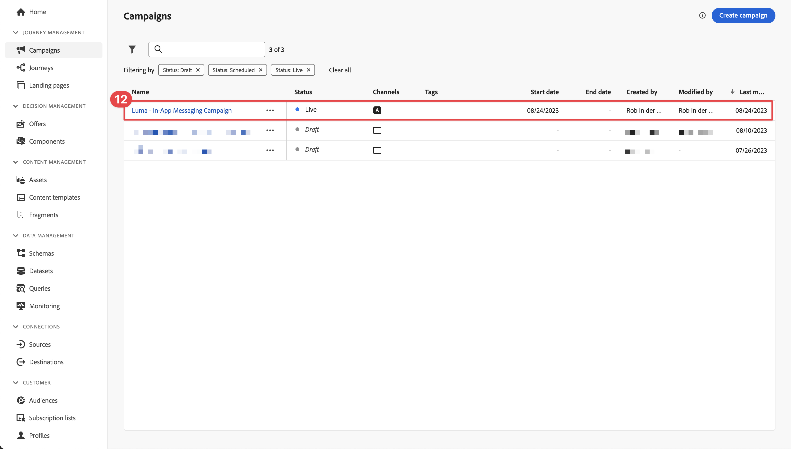
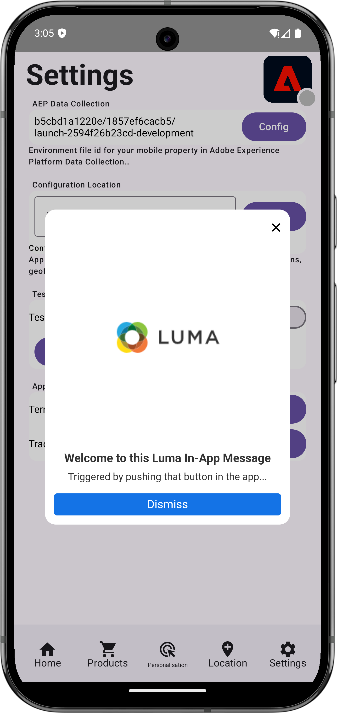

# Criar e enviar mensagens no aplicativo

Saiba como criar mensagens no aplicativo para aplicativos móveis com o Experience Platform Mobile SDK e o Journey Optimizer.

O Journey Optimizer permite criar campanhas para enviar mensagens no aplicativo a públicos-alvo direcionados. As campanhas no Journey Optimizer são usadas para fornecer conteúdo único a um público específico usando vários canais. Com campanhas, as ações são executadas simultaneamente, imediatamente ou com base em um cronograma especificado. Ao usar as jornadas (consulte a lição [Notificações por push do Journey Optimizer](journey-optimizer-push.md)), as ações são executadas em sequência.

{zoomable="yes"}

Antes de enviar mensagens no aplicativo com o Journey Optimizer, você deve garantir que as configurações e integrações adequadas estejam em vigor. Para entender o fluxo de dados de mensagens no aplicativo no Journey Optimizer, consulte [a documentação](https://experienceleague.adobe.com/en/docs/journey-optimizer/using/in-app/inapp-configuration).

>[!NOTE]
>
>Essa lição é opcional e se aplica somente aos usuários do Journey Optimizer que desejam enviar mensagens no aplicativo.


## Pré-requisitos

* O aplicativo com SDKs instalados e configurados foi criado e executado com sucesso.
* Configure o aplicativo para Adobe Experience Platform.
* Acesso ao Journey Optimizer e [permissões suficientes para notificações por push](https://experienceleague.adobe.com/en/docs/journey-optimizer/using/push/push-config/push-configuration). Além disso, você precisa de permissão suficiente para os seguintes recursos do Journey Optimizer.
   * Gerenciar campanhas.
* Dispositivo ou simulador físico iOS para teste.


## Objetivos de aprendizagem

Nesta lição, você

* Crie uma configuração de canal no Journey Optimizer.
* Instalar e configurar a extensão de tag do Journey Optimizer.
* Atualize seu aplicativo para registrar a extensão de tag da Journey Optimizer.
* Validar configuração no Assurance.
* Defina sua própria experiência de campanha e mensagens no aplicativo no Journey Optimizer.
* Envie sua própria mensagem no aplicativo de dentro do aplicativo.

## Configurar

>[!TIP]
>
>Se você já configurou o ambiente como parte da lição [mensagens por push do Journey Optimizer](journey-optimizer-push.md), talvez já tenha executado algumas das etapas desta seção de configuração.


### Criar uma configuração de canais

Para começar, você deve criar uma configuração de canal para enviar notificações de mensagens do aplicativo do Journey Optimizer.

1. Na interface do Journey Optimizer, abra o menu **[!UICONTROL Canais]** > **[!UICONTROL Configurações gerais]** > **[!UICONTROL Configurações de canal]** e selecione **[!UICONTROL Criar configuração de canal]**.

1. Insira um nome e uma descrição (opcional) para a configuração. Por exemplo, `LumaInAppMessaging` e `Channel for in-app messaging`.

   >[!NOTE]
   >
   > Os nomes devem começar com uma letra (A-Z). Ele só pode conter caracteres alfanuméricos. Também é possível usar os caracteres de sublinhado `_`, ponto `.` e hífen `-`.

1. Para atribuir rótulos de uso de dados personalizados ou de núcleo à configuração, você pode selecionar **[!UICONTROL Gerenciar acesso]**. [Saiba mais sobre o OLAC (Controle de Acesso em Nível de Objeto)](https://experienceleague.adobe.com/en/docs/journey-optimizer/using/access-control/object-based-access).

1. Selecione o canal **Mensagens no aplicativo**.

1. Selecione **[!UICONTROL Ação de marketing]**(s) para associar políticas de consentimento às mensagens que usam essa configuração. Todas as políticas de consentimento associadas à ação de marketing são usadas para respeitar as preferências dos clientes. [Saiba mais sobre ações de marketing](https://experienceleague.adobe.com/en/docs/journey-optimizer/using/privacy/consent/consent#surface-marketing-actions). Por exemplo: Direcionamento por push.

1. Selecione a Platform para a qual deseja definir as configurações. Essa configuração permite especificar o aplicativo de destino para cada plataforma e garante uma entrega de conteúdo consistente em várias plataformas.

   >[!NOTE]
   >
   >Para plataformas iOS e Android, a entrega é baseada exclusivamente na ID do aplicativo. Se ambos os aplicativos compartilharem a mesma ID de aplicativo, o conteúdo será entregue a ambos, independentemente da plataforma selecionada na **[!UICONTROL Configuração de canal]**.

1. Insira as IDs do aplicativo para a plataforma que você deseja que seja compatível.

   {zoomable="yes"}

1. Selecione **[!UICONTROL Enviar]** para salvar suas alterações.

### Atualizar configuração da sequência de dados

Para garantir que os dados enviados do aplicativo móvel para a Edge Network sejam encaminhados para a Journey Optimizer, atualize a configuração da Experience Edge.


1. Na interface da Coleção de dados, selecione **[!UICONTROL Datastreams]** e selecione sua sequência de dados, por exemplo **[!DNL Luma Mobile App]**.
1. Selecione  para **[!UICONTROL Experience Platform]** e selecione  **[!UICONTROL Editar]** no menu de contexto.
1. Na tela **[!UICONTROL Datastreams]** >  > **[!UICONTROL Adobe Experience Platform]**, verifique se o **[!UICONTROL Adobe Journey Optimizer]** está selecionado. Consulte [configurações do Adobe Experience Platform](https://experienceleague.adobe.com/en/docs/experience-platform/datastreams/configure) para obter mais informações.
1. Para salvar a configuração da sequência de dados, selecione **[!UICONTROL Salvar]**.


   {zoomable="yes"}


### Instalar extensão de tags do Journey Optimizer

Para que seu aplicativo funcione com a Journey Optimizer, é necessário atualizar a propriedade da tag.

1. Navegue até **[!UICONTROL Marcas]** > **[!UICONTROL Extensões]** > **[!UICONTROL Catálogo]**.
1. Abra a propriedade, por exemplo **[!DNL Luma Mobile App Tutorial]**.
1. Selecione **[!UICONTROL Catálogo]**.
1. Pesquise a extensão **[!UICONTROL Adobe Journey Optimizer]**.
1. Instale a extensão.

Quando *somente* usa mensagens no aplicativo em seu aplicativo, em **[!UICONTROL Instalar Extensão]** ou **[!UICONTROL Configurar Extensão]**, não é necessário configurar nada. Se você já tiver seguido a lição [Notificações por push](journey-optimizer-push.md) no tutorial, verá que, para o ambiente **[!UICONTROL Desenvolvimento]**, o **[!UICONTROL Conjunto de dados de eventos de experiência de rastreamento de push do AJO]** está selecionado na lista **[!UICONTROL Conjunto de dados de eventos]**.


### Implementar o Journey Optimizer no aplicativo

Conforme discutido nas lições anteriores, a instalação de uma extensão de tag móvel fornece apenas a configuração. Em seguida, você deve instalar e registrar o Messaging SDK. Se essas etapas não estiverem claras, reveja a seção [Instalar SDKs](install-sdks.md).

>[!NOTE]
>
>Se você concluiu a seção [Instalar SDKs](install-sdks.md), o SDK já está instalado e você pode ignorar essa etapa.
>

>[!BEGINTABS]

>[!TAB iOS]

1. No Xcode, verifique se [Mensagens do AEP](https://github.com/adobe/aepsdk-messaging-ios) foram adicionadas à lista de pacotes nas Dependências de Pacote. Consulte [Gerenciador de pacotes do Swift](install-sdks.md#swift-package-manager).
1. Navegue até **[!DNL Luma]** > **[!DNL Luma]** > **[!UICONTROL AppDelegate]** no navegador de projetos Xcode.
1. Certifique-se de que `AEPMessaging` faça parte da sua lista de importações.

   `import AEPMessaging`

1. Verifique se `Messaging.self` faz parte da matriz de extensões que você está registrando.

   ```swift
   let extensions = [
       AEPIdentity.Identity.self,
       Lifecycle.self,
       Signal.self,
       Edge.self,
       AEPEdgeIdentity.Identity.self,
       Consent.self,
       UserProfile.self,
       Places.self,
       Messaging.self,
       Optimize.self,
       Assurance.self
   ]
   ```

>[!TAB Android]

1. No Android Studio, verifique se [aepsdk-messaging-android](https://github.com/adobe/aepsdk-messaging-android) faz parte das dependências no **[!UICONTROL build.gradle.kts]** no **[!UICONTROL Android]**  > **[!UICONTROL Gradle Scripts]**. Consulte [Gradle](install-sdks.md#gradle).
1. Navegue até **[!UICONTROL Android]**  **[!DNL app]** > **[!DNL kotlin+java]** > **[!UICONTROL com.adobe.luma.tutorial.android]** > **[!UICONTROL LumaApplication]** no navegador de projetos do Android Studio.
1. Certifique-se de que `com.adobe.marketing.mobile.Messaging` faça parte da sua lista de importações.

   `import import com.adobe.marketing.mobile.Messaging`

1. Verifique se `Messaging.EXTENSION` faz parte da matriz de extensões que você está registrando.

   ```kotlin
   val extensions = listOf(
       Identity.EXTENSION,
       Lifecycle.EXTENSION,
       Signal.EXTENSION,
       Edge.EXTENSION,
       Consent.EXTENSION,
       UserProfile.EXTENSION,
       Places.EXTENSION,
       Messaging.EXTENSION,
       Optimize.EXTENSION,
       Assurance.EXTENSION
   )
   ```

>[!ENDTABS]

## Validar configuração com o Assurance

1. Revise a seção [instruções de instalação](assurance.md#connecting-to-a-session) para conectar seu simulador ou dispositivo ao Assurance.
1. Na interface do Assurance, selecione **[!UICONTROL Configurar]**.
   {zoomable="yes"}
1. Selecione o botão  ao lado de **[!UICONTROL Mensagens no Aplicativo]**.
1. Selecione **[!UICONTROL Salvar]**.
   {zoomable="yes"}
1. Selecione **[!UICONTROL Mensagens no aplicativo]** na navegação à esquerda.
1. Selecione a guia **[!UICONTROL Validação]**. Confirme se não está recebendo erros.

   {zoomable="yes"}


## Criar sua própria mensagem no aplicativo

Para criar sua própria mensagem no aplicativo, você deve definir uma campanha no Journey Optimizer que acione uma mensagem no aplicativo com base nos eventos que ocorrem. Esses eventos podem ser:

* dados enviados para o Adobe Experience Platform,
* eventos principais de rastreamento, como ação ou estado ou coleção de dados PII, por meio das APIs genéricas principais móveis,
* eventos do ciclo de vida do aplicativo, como iniciar, instalar, atualizar, fechar ou falhar,
* eventos de geolocalização, como entrar ou sair de um ponto de interesse.

Neste tutorial, você usará as APIs genéricas e independentes de extensão do Mobile Core (consulte [APIs genéricas do Mobile Core](https://developer.adobe.com/client-sdks/documentation/mobile-core/#mobile-core-generic-apis)) para facilitar o rastreamento de eventos de telas de usuários, ações e dados de PII. Os eventos gerados por essas APIs são publicados no hub de eventos do SDK e estão disponíveis para uso por extensões. O hub de eventos do SDK fornece a estrutura de dados principal vinculada a todas as extensões do SDK da plataforma móvel. O hub de eventos mantém uma lista de extensões registradas e módulos internos, uma lista de ouvintes de eventos registrados e um banco de dados de estado compartilhado.

O hub de eventos da SDK publica e recebe dados de eventos de extensões registradas para simplificar as integrações com a Adobe e soluções de terceiros. Por exemplo, quando a extensão Otimize está instalada, o hub de eventos lida com todas as solicitações e interações com o mecanismo de oferta da Journey Optimizer - Gestão de decisões.

1. Na interface do usuário do Journey Optimizer, selecione **[!UICONTROL Campanhas]** no painel esquerdo.
1. Selecione **[!UICONTROL Criar Campanha]**.
1. Na caixa de diálogo **[!UICONTROL Criar sua campanha]**, selecione  **[!UICONTROL Agendado - Marketing]** e selecione **[!UICONTROL Confirmar]**.
1. Na tela **[!UICONTROL Campaign - *AAAA-MM-DD HH:MM:SS UTC+XX:XX*]**:

   1. Na guia **[!UICONTROL Propriedades]**:

      1. Insira um nome para a campanha. Por exemplo, `Luma Mobile In-App Campaign`.
      1. Opcionalmente, adicione uma descrição.


   1. Selecione a guia **[!UICONTROL Ação]**.

      1. Abaixo de **[!UICONTROL Mostrar mensagem se]**, selecione  **[!UICONTROL Adicionar ação]**. No menu suspenso, selecione **[!UICONTROL Mensagem no aplicativo]**.
      1. No menu suspenso **[!UICONTROL Configuração de mensagem no aplicativo]**, selecione sua configuração. Por exemplo, **[!UICONTROL LumaInAppMessaging]**.
      1. Selecione  **[!UICONTROL Editar acionadores]**.
      1. Na caixa de diálogo **[!UICONTROL Acionador de mensagem no aplicativo]**:

         1. Selecione **[!UICONTROL Inicialização do aplicativo]** e selecione **[!UICONTROL Rastrear ação]** no menu suspenso.
         1. Selecione  **[!UICONTROL Adicionar condição]**.
         1. Selecione **[!UICONTROL Ação]** e **[!UICONTROL igual]** nos menus suspensos.
         1. Digite `in-app`.
         1. Selecione  **[!UICONTROL Adicionar condição]**.
         1. Selecione **[!UICONTROL Dados de contexto]** no menu suspenso e digite `showMessage`.
         1. Selecione **[!UICONTROL igual]** no menu suspenso e digite `true`.

            {zoomable="yes"}
         1. Selecione **[!UICONTROL Concluído]**.

   1. De volta à tela principal de definição da campanha, selecione a guia **[!UICONTROL Content]**.

      1. Habilitar **[!UICONTROL Formatação avançada]**.
      1. Selecione **[!UICONTROL Modal]** como o **[!UICONTROL Layout de mensagens]**. Na caixa de diálogo **[!UICONTROL Alternar layout]**, selecione **[!UICONTROL Alterar layout]**.
      1. Na guia **[!UICONTROL Conteúdo]**.
         1. Digite `https://luma.enablementadobe.com/content/dam/luma/en/logos/Luma_Logo.png` para a **[!UICONTROL URL de mídia]**.
         1. Insira um **[!UICONTROL Cabeçalho]**, por exemplo `Welcome to this Luma In-App Message`, e insira um **[!UICONTROL Corpo]**, por exemplo `Triggered by pushing that button in the app...`.

         {zoomable="yes"}

      1. Selecione a guia **[!UICONTROL Configurações]**.
         1. Selecione **[!UICONTROL Personalizar tamanho]** em **[!UICONTROL Mensagem]**.
         1. Desabilitar **[!UICONTROL Ajustar ao conteúdo]**.
         1. Defina a **[!UICONTROL Altura]** como **[!UICONTROL 75%]**.

         {zoomable="yes"}

1. Selecione **[!UICONTROL Revisar para ativar]**. Para editar opcionalmente qualquer uma das configurações de **[!UICONTROL Conteúdo]**, **[!UICONTROL Propriedades]**, **[!UICONTROL Ações]** ou mais, selecione .
1. Na tela **[!UICONTROL Revisar para ativar (*nome da campanha*)]**, selecione **[!UICONTROL Ativar]**.
1. Após alguns instantes, você verá seu **_nome da campanha_** com o status **[!UICONTROL Live]** na lista **[!UICONTROL Campanhas]**.
   {zoomable="yes"}


## Acionar a mensagem no aplicativo

Você tem todos os ingredientes em vigor para enviar uma mensagem no aplicativo. O que resta é como acionar essa mensagem no aplicativo.

>[!BEGINTABS]

>[!TAB iOS]

1. Vá para **[!DNL Luma]** > **[!DNL Luma]** > **[!DNL Utils]** > **[!UICONTROL MobileSDK]** no navegador do Projeto Xcode. Localize a função `func sendTrackAction(action: String, data: [String: Any]?)` e adicione o seguinte código, que chama a função [`MobileCore.track`](https://developer.adobe.com/client-sdks/documentation/mobile-core/api-reference/#trackaction), com base nos parâmetros `action` e `data`.


   ```swift
   // Send trackAction event
   MobileCore.track(action: action, data: data)
   ```

1. Vá para **[!DNL Luma]** > **[!DNL Luma]** > **[!DNL Views]** > **[!DNL General]** > **[!UICONTROL ConfigView]** no Navegador de Projetos Xcode. Localize o código do botão Mensagens no aplicativo e adicione o seguinte código:

   ```swift
   // Setting parameters and calling function to send in-app message
   Task {
       MobileSDK.shared.sendTrackAction(action: "in-app", data: ["showMessage": "true"])
   }
   ```

>[!TAB Android]

1. Vá para **[!UICONTROL Android]**  > **[!DNL app]** > **[!DNL kotlin+java]** > **[!DNL com.adobe.luma.tutorial.android]** > **[!DNL models]** > **[!UICONTROL MobileSDK]** no navegador do Android Studio. Localize a função `fun sendTrackAction(action: String, data: Map<String, String>?)` e adicione o seguinte código, que chama a função [`MobileCore.track`](https://developer.adobe.com/client-sdks/documentation/mobile-core/api-reference/#trackaction), com base nos parâmetros `action` e `data`.


   ```kotlin
   // Send trackAction event
   MobileCore.track(action, data)
   ```

1. Vá para **[!UICONTROL Android]**  > **[!DNL app]** > **[!DNL kotlin+java]** > **[!DNL com.adobe.luma.tutorial.androi]** > **[!DNL views]** > **[!UICONTROL ConfigView.kt]** no navegador do Android Studio. Localize o código do botão do manipulador `onInAppMessageClick` e adicione o seguinte código:

   ```kotlin
   // Setting parameters and calling function to send in-app message
   MobileSDK.shared.sendTrackAction(
       "in-app",
       mapOf("showMessage" to "true")
   )
   ```

>[!ENDTABS]

## Validar usando seu aplicativo

Você pode validar as mensagens no aplicativo de dentro do próprio aplicativo.

>[!BEGINTABS]

>[!TAB iOS]

1. Recrie e execute o aplicativo no simulador ou em um dispositivo físico do Xcode, usando .

1. Vá para a guia **[!UICONTROL Configurações]**.

1. Toque Em **[!UICONTROL Mensagem No Aplicativo]**. Você vê a mensagem no aplicativo aparecer no seu aplicativo.

   


>[!TAB Android]

1. Recrie e execute o aplicativo no simulador ou em um dispositivo físico do Android Studio, usando .

1. Vá para a guia **[!UICONTROL Configurações]**.

1. Toque Em **[!UICONTROL Mensagem No Aplicativo]**. Você vê a mensagem no aplicativo aparecer no seu aplicativo.

   


>[!ENDTABS]


## Validar a implementação no Assurance

Você pode validar as mensagens no aplicativo na interface do usuário do Assurance.

1. Revise a seção [instruções de instalação](assurance.md#connecting-to-a-session) para conectar seu simulador ou dispositivo ao Assurance.
1. Selecione **[!UICONTROL Mensagens no aplicativo]**.
1. Selecione **[!UICONTROL Lista de Eventos]**.
1. Selecione uma entrada de **[!UICONTROL Exibir mensagem]**.
1. Inspecione o evento bruto, especialmente o `html`, que contém o layout completo e o conteúdo da mensagem no aplicativo.
   {zoomable="yes"}


## Próximas etapas

Agora você deve ter todas as ferramentas para começar a adicionar mensagens no aplicativo, quando relevante e aplicável. Por exemplo, promover produtos com base em interações específicas que você está rastreando no aplicativo.

>[!SUCCESS]
>
>Você habilitou o aplicativo para mensagens no aplicativo e adicionou uma campanha de mensagens no aplicativo usando o Journey Optimizer e a extensão Journey Optimizer para o Experience Platform Mobile SDK.
>
>Obrigado por investir seu tempo aprendendo sobre o Adobe Experience Platform Mobile SDK. Se tiver dúvidas, quiser compartilhar comentários gerais ou tiver sugestões sobre conteúdo futuro, compartilhe-os nesta [postagem de discussão da Comunidade Experience League](https://experienceleaguecommunities.adobe.com/t5/adobe-experience-platform-data/tutorial-discussion-implement-adobe-experience-cloud-in-mobile/td-p/443796).

Próximo: **[Criar e exibir ofertas](journey-optimizer-offers.md)**
