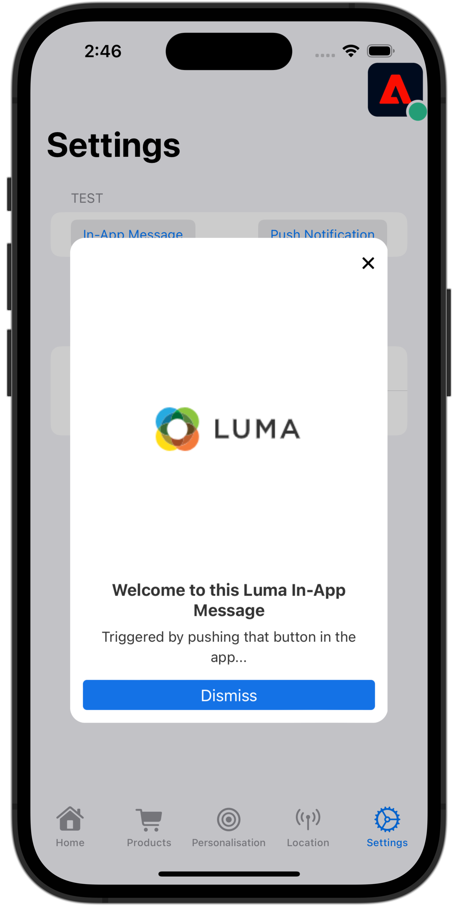

# Criar e enviar mensagens no aplicativo

Saiba como criar mensagens no aplicativo para aplicativos móveis com o SDK móvel do Experience Platform e o Journey Optimizer.

O Journey Optimizer permite criar campanhas para enviar mensagens no aplicativo a públicos-alvo direcionados. As campanhas no Journey Optimizer são usadas para fornecer conteúdo único a um público específico usando vários canais. Com campanhas, as ações são executadas simultaneamente, imediatamente ou com base em um cronograma especificado. Ao usar as jornadas (consulte a lição [Notificações por push do Journey Optimizer](journey-optimizer-push.md)), as ações são executadas em sequência.


Antes de enviar mensagens no aplicativo com o Journey Optimizer, você deve garantir que as configurações e integrações adequadas estejam em vigor. Para entender o fluxo de dados de mensagens no aplicativo no Journey Optimizer, consulte [a documentação](https://experienceleague.adobe.com/docs/journey-optimizer/using/in-app/inapp-configuration.html?lang=en).

>[!NOTE]
>
>Essa lição é opcional e se aplica somente aos usuários do Journey Optimizer que desejam enviar mensagens no aplicativo.


## Pré-requisitos

* O aplicativo com SDKs instalados e configurados foi criado e executado com sucesso.
* Configure o aplicativo para Adobe Experience Platform.
* Acesso ao Journey Optimizer e permissões suficientes conforme descrito [aqui](https://experienceleague.adobe.com/docs/journey-optimizer/using/push/push-config/push-configuration.html). Além disso, você precisa de permissão suficiente para os seguintes recursos do Journey Optimizer.
   * Gerenciar campanhas.
* Dispositivo ou simulador físico iOS para teste.


## Objetivos de aprendizagem

Nesta lição, você

* Crie uma superfície de aplicativo no AJO.
* Instalar e configurar a extensão de tag do Journey Optimizer.
* Atualize seu aplicativo para registrar a extensão de tag da Journey Optimizer.
* Valide a configuração no Assurance.
* Defina sua própria experiência de campanha e mensagens no aplicativo no Journey Optimizer.
* Envie sua própria mensagem no aplicativo de dentro do aplicativo.

## Configurar

>[!TIP]
>
>Se você já configurou o ambiente como parte da lição [mensagens por push do Journey Optimizer](journey-optimizer-push.md), talvez já tenha executado algumas das etapas desta seção de configuração.


### Adicionar uma superfície de aplicativo na Coleção de dados

1. Na [interface da Coleção de Dados](https://experience.adobe.com/data-collection/), selecione **[!UICONTROL Superfícies do Aplicativo]** no painel esquerdo.
1. Para criar uma configuração, selecione **[!UICONTROL Criar Superfície do Aplicativo]**.
   
1. Insira um **[!UICONTROL Nome]** para a configuração, por exemplo `Luma App Tutorial`.
1. Em **[!UICONTROL Configuração do Aplicativo Móvel]**, selecione **[!UICONTROL Apple iOS]**.
1. Insira a ID do pacote do aplicativo móvel no campo **[!UICONTROL ID do aplicativo (ID do pacote iOS)]**. Por exemplo, `com.adobe.luma.tutorial.swiftui`.
1. Selecione **[!UICONTROL Salvar]**.

   

### Atualizar configuração da sequência de dados

Para garantir que os dados enviados do aplicativo móvel para o Edge Network sejam encaminhados para o Journey Optimizer, atualize a configuração do Experience Edge.


1. Na interface da Coleção de dados, selecione **[!UICONTROL Datastreams]** e selecione sua sequência de dados, por exemplo **[!DNL Luma Mobile App]**.
1. Selecione  para **[!UICONTROL Experience Platform]** e selecione  **[!UICONTROL Editar]** no menu de contexto.
1. Na tela **[!UICONTROL Datastreams]** >  > **[!UICONTROL Adobe Experience Platform]**, verifique se o **[!UICONTROL Adobe Journey Optimizer]** está selecionado. Consulte [configurações do Adobe Experience Platform](https://experienceleague.adobe.com/docs/experience-platform/datastreams/configure.html?lang=en#aep) para obter mais informações.
1. Para salvar a configuração da sequência de dados, selecione **[!UICONTROL Salvar]**.


   


### Instalar extensão de tags do Journey Optimizer

Para que seu aplicativo funcione com a Journey Optimizer, é necessário atualizar a propriedade da tag.

1. Navegue até **[!UICONTROL Marcas]** > **[!UICONTROL Extensões]** > **[!UICONTROL Catálogo]**.
1. Abra a propriedade, por exemplo **[!DNL Luma Mobile App Tutorial]**.
1. Selecione **[!UICONTROL Catálogo]**.
1. Pesquise a extensão **[!UICONTROL Adobe Journey Optimizer]**.
1. Instale a extensão.

Quando *somente* usa mensagens no aplicativo em seu aplicativo, em **[!UICONTROL Instalar Extensão]** ou **[!UICONTROL Configurar Extensão]**, não é necessário configurar nada. No entanto, se você já tiver seguido a lição [Notificações por push](journey-optimizer-push.md) no tutorial, verá que, para o ambiente **[!UICONTROL Desenvolvimento]**, o **[!UICONTROL Conjunto de dados do evento de experiência de rastreamento de push do AJO]** está selecionado na lista **[!UICONTROL Conjunto de dados do evento]**.


### Implementar o Journey Optimizer no aplicativo

Conforme discutido nas lições anteriores, a instalação de uma extensão de tag móvel fornece apenas a configuração. Em seguida, você deve instalar e registrar o SDK de mensagens. Se essas etapas não estiverem claras, reveja a seção [Instalar SDKs](install-sdks.md).

>[!NOTE]
>
>Se você concluiu a seção [Instalar SDKs](install-sdks.md), o SDK já está instalado e você pode ignorar essa etapa.
>

1. No Xcode, verifique se [Mensagens AEP](https://github.com/adobe/aepsdk-messaging-ios) foram adicionadas à lista de pacotes nas dependências de pacote. Consulte [Gerenciador de pacotes do Swift](install-sdks.md#swift-package-manager).
1. Navegue até **[!DNL Luma]** > **[!DNL Luma]** > **[!UICONTROL AppDelegate]** no navegador de projetos Xcode.
1. Certifique-se de que `AEPMessaging` faça parte da sua lista de importações.

   `import AEPMessaging`

1. Verifique se `Messaging.self` faz parte da matriz de extensões que você está registrando.

   ```swift
   let extensions = [
       AEPIdentity.Identity.self,
       Lifecycle.self,
       Signal.self,
       Edge.self,
       AEPEdgeIdentity.Identity.self,
       Consent.self,
       UserProfile.self,
       Places.self,
       Messaging.self,
       Optimize.self,
       Assurance.self
   ]
   ```


## Validar configuração com o Assurance

1. Revise a seção [instruções de configuração](assurance.md#connecting-to-a-session) para conectar seu simulador ou dispositivo ao Assurance.
1. Na interface do Assurance, selecione **[!UICONTROL Configurar]**.
   
1. Selecione o botão  ao lado de **[!UICONTROL Mensagens no Aplicativo]**.
1. Selecione **[!UICONTROL Salvar]**.
   
1. Selecione **[!UICONTROL Mensagens no aplicativo]** na navegação à esquerda.
1. Selecione a guia **[!UICONTROL Validação]**. Confirme se não está recebendo erros.

   


## Criar sua própria mensagem no aplicativo

Para criar sua própria mensagem no aplicativo, você deve definir uma campanha no Journey Optimizer que acione uma mensagem no aplicativo com base nos eventos que ocorrem. Esses eventos podem ser:

* dados enviados para o Adobe Experience Platform,
* eventos principais de rastreamento, como ação ou estado ou coleção de dados PII, por meio das APIs genéricas principais móveis,
* eventos do ciclo de vida do aplicativo, como iniciar, instalar, atualizar, fechar ou falhar,
* eventos de geolocalização, como entrar ou sair de um ponto de interesse.

Neste tutorial, você usará as APIs genéricas e independentes de extensão do Mobile Core (consulte [APIs genéricas do Mobile Core](https://developer.adobe.com/client-sdks/documentation/mobile-core/#mobile-core-generic-apis)) para facilitar o rastreamento de eventos de telas de usuários, ações e dados de PII. Os eventos gerados por essas APIs são publicados no hub de eventos do SDK e estão disponíveis para uso por extensões. O hub de eventos do SDK fornece a estrutura de dados principal vinculada a todas as extensões do SDK da plataforma móvel, mantendo uma lista de extensões registradas e módulos internos, uma lista de ouvintes de eventos registrados e um banco de dados de estado compartilhado.

O hub de eventos do SDK publica e recebe dados de eventos de extensões registradas para simplificar as integrações com o Adobe e soluções de terceiros. Por exemplo, quando a extensão Otimize é instalada, todas as solicitações e interações com o mecanismo de oferta da Journey Optimizer - Gestão de decisões são tratadas pelo hub de eventos.

1. Na interface do usuário do Journey Optimizer, selecione **[!UICONTROL Campanhas]** no painel esquerdo.
1. Selecione **[!UICONTROL Criar Campanha]**.
1. Na tela **[!UICONTROL Criar campanha]**:
   1. Selecione **[!UICONTROL Mensagem no aplicativo]** e selecione uma superfície de aplicativo na lista **[!UICONTROL Superfície de aplicativo]**, por exemplo **[!DNL Luma Mobile App]**.
   1. Selecionar **[!UICONTROL Criar]**
      
1. Na tela Definição de campanha, em **[!UICONTROL Propriedades]**, digite um **[!UICONTROL Nome]** para a campanha, por exemplo `Luma - In-App Messaging Campaign`, e uma **[!UICONTROL Descrição]**, por exemplo `In-app messaging campaign for Luma app`.
   
1. Role para baixo até **[!UICONTROL Ação]** e selecione **[!UICONTROL Editar conteúdo]**.
1. Na tela **[!UICONTROL Mensagem no aplicativo]**:
   1. Selecione **[!UICONTROL Modal]** como o **[!UICONTROL Layout da Mensagem]**.
   2. Digite `https://luma.enablementadobe.com/content/dam/luma/en/logos/Luma_Logo.png` para a **[!UICONTROL URL de mídia]**.
   3. Insira um **[!UICONTROL Cabeçalho]**, por exemplo `Welcome to this Luma In-App Message`, e insira um **[!UICONTROL Corpo]**, por exemplo `Triggered by pushing that button in the app...`.
   4. Insira **[!UICONTROL Dispensar]** como o **[!UICONTROL Botão #1 texto (primário)]**.
   5. Observe como a visualização é atualizada.
   6. Selecione **[!UICONTROL Revisar para ativar]**.
      
1. Na tela **[!UICONTROL Revisar para ativar (Luma - Campanha de Mensagens no Aplicativo)]**, selecione  no bloco **[!UICONTROL Agendar]**.
   
1. De volta à tela **[!DNL Luma - In-App Messaging Campaign]**, selecione  **[!UICONTROL Editar acionadores]**.
1. Na caixa de diálogo **[!UICONTROL Acionador de mensagem no aplicativo]**, configure os detalhes da ação de rastreamento que aciona a mensagem no aplicativo:
   1. Para remover o **[!UICONTROL Evento de inicialização de aplicativo]**, selecione .
   1. Use  **[!UICONTROL Adicionar condição]** repetidamente para criar a seguinte lógica para **[!UICONTROL Mostrar mensagem se]**.
   1. Clique em **[!UICONTROL Concluído]**.
      

   Você definiu uma ação de rastreamento, onde **[!UICONTROL Ação]** é igual a `in-app` e os **[!UICONTROL Dados de contexto]** com a ação são um par de valores chave de `"showMessage" : "true"`.

1. Na tela **[!DNL Luma - In-App Messaging Campaign]**, selecione **[!UICONTROL Revisar para ativar]**.
1. Na tela **[!UICONTROL Revisar para ativar (Luma - Campanha de mensagens no aplicativo)]**, selecione **[!UICONTROL Ativar]**.
1. Você vê seu **[!DNL Luma - In-App Messaging Campaign]** com o status **[!UICONTROL Ao vivo]** na lista **[!UICONTROL Campanhas]**.
   


## Acionar a mensagem no aplicativo

Você tem todos os ingredientes em vigor para enviar uma mensagem no aplicativo. O que resta é como acionar essa mensagem no aplicativo.

1. Vá para **[!DNL Luma]** > **[!DNL Luma]** > **[!DNL Utils]** > **[!UICONTROL MobileSDK]** no navegador do Projeto Xcode. Localize a função `func sendTrackAction(action: String, data: [String: Any]?)` e adicione o seguinte código, que chama a função [`MobileCore.track`](https://developer.adobe.com/client-sdks/documentation/mobile-core/api-reference/#trackaction), com base nos parâmetros `action` e `data`.


   ```swift
   // Send trackAction event
   MobileCore.track(action: action, data: data)
   ```

1. Vá para **[!DNL Luma]** > **[!DNL Luma]** > **[!DNL Views]** > **[!DNL General]** > **[!UICONTROL ConfigView]** no Navegador de Projetos Xcode. Localize o código do botão Mensagens no aplicativo e adicione o seguinte código:

   ```swift
   // Setting parameters and calling function to send in-app message
   Task {
       MobileSDK.shared.sendTrackAction(action: "in-app", data: ["showMessage": "true"])
   }
   ```

## Validar usando seu aplicativo

1. Recrie e execute o aplicativo no simulador ou em um dispositivo físico do Xcode, usando .

1. Vá para a guia **[!UICONTROL Configurações]**.

1. Toque Em **[!UICONTROL Mensagem No Aplicativo]**. Você vê a mensagem no aplicativo aparecer no seu aplicativo.

   


## Validar implementação no Assurance

Você pode validar as mensagens no aplicativo na interface do usuário do Assurance.

1. Revise a seção [instruções de configuração](assurance.md#connecting-to-a-session) para conectar seu simulador ou dispositivo ao Assurance.
1. Selecione **[!UICONTROL Mensagens no aplicativo]**.
1. Selecione **[!UICONTROL Lista de Eventos]**.
1. Selecione uma entrada de **[!UICONTROL Exibir mensagem]**.
1. Inspect o evento raw, especialmente o `html`, que contém o layout completo e o conteúdo da mensagem no aplicativo.
   


## Próximas etapas

Agora você deve ter todas as ferramentas para começar a adicionar mensagens no aplicativo, quando relevante e aplicável. Por exemplo, promover produtos com base em interações específicas que você está rastreando no aplicativo.

>[!SUCCESS]
>
>Você habilitou o aplicativo para mensagens no aplicativo e adicionou uma campanha de mensagens no aplicativo usando o Journey Optimizer e a extensão Journey Optimizer para o SDK móvel do Experience Platform.
>
>Obrigado por investir seu tempo aprendendo sobre o Adobe Experience Platform Mobile SDK. Se você tiver dúvidas, quiser compartilhar comentários gerais ou tiver sugestões sobre conteúdo futuro, compartilhe-os nesta [postagem de Discussão da Comunidade Experience League](https://experienceleaguecommunities.adobe.com/t5/adobe-experience-platform-data/tutorial-discussion-implement-adobe-experience-cloud-in-mobile/td-p/443796).

Próximo: **[Criar e exibir ofertas](journey-optimizer-offers.md)**
