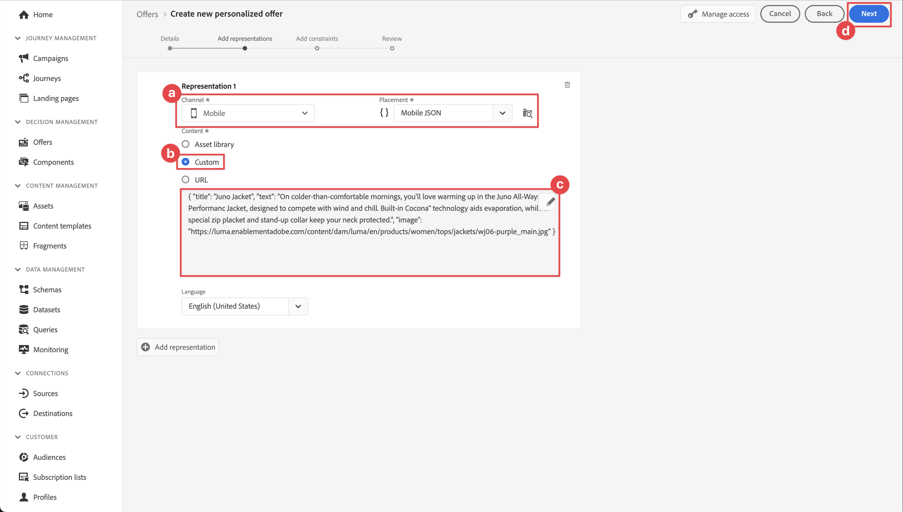

# Criar e exibir ofertas com o Gerenciamento de decisão

Saiba como mostrar ofertas da Gestão de decisões da Journey Optimizer em seus aplicativos móveis com o SDK móvel do Experience Platform.

O Gerenciamento de decisão da Journey Optimizer ajuda você a fornecer a melhor oferta e experiência aos seus clientes em todos os pontos de contato na hora certa. Depois de projetado, direcione o público com ofertas personalizadas.


A gestão de decisões facilita a personalização com uma biblioteca central de ofertas de marketing e um mecanismo de decisão que aplica regras e restrições a perfis em tempo real avançados criados pelo Adobe Experience Platform. Como resultado, ele permite enviar aos clientes a oferta certa na hora certa. Consulte [Sobre o Gerenciamento de Decisão](https://experienceleague.adobe.com/docs/journey-optimizer/using/offer-decisioning/get-started-decision/starting-offer-decisioning.html?lang=en) para obter mais informações.


>[!NOTE]
>
>Esta lição é opcional e se aplica somente aos usuários do Journey Optimizer que desejam usar a funcionalidade de Gestão de decisões para exibir ofertas em um aplicativo móvel.


## Pré-requisitos

* O aplicativo com SDKs instalados e configurados foi criado e executado com sucesso.
* Configure o aplicativo para Adobe Experience Platform.
* Acesso ao Journey Optimizer - Gerenciamento de decisões com as permissões adequadas para gerenciar ofertas e decisões conforme descrito [aqui](https://experienceleague.adobe.com/docs/journey-optimizer/using/access-control/privacy/high-low-permissions.html?lang=en#decisions-permissions).


## Objetivos de aprendizagem

Nesta lição, você

* Atualize sua configuração do Edge para a Gestão de decisões.
* Atualize sua propriedade de tag com a extensão Journey Optimizer - Decisioning.
* Atualize seu esquema para capturar eventos de apresentação.
* Valide a configuração no Assurance.
* Crie uma decisão de oferta com base em ofertas no Journey Optimizer - Gestão de decisões.
* Atualize seu aplicativo para registrar a extensão Otimizer.
* Implemente ofertas da Gestão de decisões no seu aplicativo.


## Configurar

>[!TIP]
>
>Se você já configurou o ambiente como parte da lição [Configurar testes A/B com o Target](target.md), talvez já tenha executado algumas das etapas desta seção de configuração.

### Atualizar configuração da sequência de dados

Para garantir que os dados enviados do aplicativo móvel para o Platform Edge Network sejam encaminhados para o Journey Optimizer - Gerenciamento de decisão, atualize o fluxo de dados.

1. Na interface da Coleção de dados, selecione **[!UICONTROL Datastreams]** e selecione sua sequência de dados, por exemplo **[!DNL Luma Mobile App]**.
1. Selecione  para **[!UICONTROL Experience Platform]** e selecione  **[!UICONTROL Editar]** no menu de contexto.
1. Na tela **[!UICONTROL Datastreams]** >  > **[!UICONTROL Adobe Experience Platform]**, verifique se o **[!UICONTROL Offer Decisioning]**, o **[!UICONTROL Edge Segmentation]** e o **[!UICONTROL Adobe Journey Optimizer]** estão selecionados. Se você for fazer a lição Direcionamento, selecione **[!UICONTROL Personalization Destinations]** também. Consulte [configurações do Adobe Experience Platform](https://experienceleague.adobe.com/docs/experience-platform/datastreams/configure.html?lang=en#aep) para obter mais informações.
1. Para salvar a configuração da sequência de dados, selecione **[!UICONTROL Salvar]**.

   


### Instalar a extensão Journey Optimizer - Decisioning tags

1. Navegue até **[!UICONTROL Tags]**, localize sua propriedade de tag móvel e abra a propriedade.
1. Selecione **[!UICONTROL Extensões]**.
1. Selecione **[!UICONTROL Catálogo]**.
1. Procure a extensão **[!UICONTROL Adobe Journey Optimizer - Decisão]**.
1. Instale a extensão. A extensão não requer configuração adicional.

   


### Atualizar seu esquema

1. Navegue até a interface Coleção de dados e selecione **[!UICONTROL Esquemas]** no painel esquerdo.
1. Selecione **[!UICONTROL Procurar]** na barra superior.
1. Selecione seu esquema para abri-lo.
1. No editor de esquema, selecione  **[!UICONTROL Adicionar]** ao lado de Grupos de campos.
1. Na caixa de diálogo **[!UICONTROL Adicionar grupos de campos]**,  procure `proposition`, selecione **[!UICONTROL Evento de Experiência - Interações de Apresentação]** e selecione **[!UICONTROL Adicionar grupos de campos]**. Este grupo de campos coleta os dados do evento de experiência relevantes para ofertas: qual oferta é apresentada, como parte de qual coleção, decisão e outros parâmetros (consulte mais adiante nesta lição). Mas também o que está acontecendo com a oferta? Ele é exibido, interage com, rejeitado e assim por diante.
   
1. Selecione **[!UICONTROL Salvar]** para salvar as alterações no esquema.


## Validar configuração no Assurance

Para validar sua configuração no Assurance:

1. Vá para a interface do usuário do Assurance.
1. Selecione **[!UICONTROL Configurar]** no painel esquerdo e selecione  ao lado de **[!UICONTROL Validar Instalação]** abaixo de **[!UICONTROL ADOBE JOURNEY OPTIMIZER DECISIONING]**.
1. Selecione **[!UICONTROL Salvar]**.
1. Selecione **[!UICONTROL Validar instalação]** no painel esquerdo. A configuração da sequência de dados e a configuração do SDK em seu aplicativo são validadas.
   


## Criar posicionamento

Antes de realmente criar ofertas, é necessário definir como e onde essas ofertas podem ser colocadas no aplicativo móvel. Na Gestão de decisões, você define disposições para essa finalidade e uma disposição para o canal móvel que oferece suporte a uma carga JSON:

1. Na interface do usuário do Journey Optimizer, selecione  **[!UICONTROL Componentes]** em **[!UICONTROL GERENCIAMENTO DE DECISÃO]** no painel esquerdo.

1. Selecione **[!UICONTROL Disposições]** na barra superior.

1. Se nenhum posicionamento com o nome **[!UICONTROL JSON Móvel]**, **[!UICONTROL Móvel]** como **[!UICONTROL Tipo de canal]** e **[!UICONTROL JSON]** como **[!UICONTROL Tipo de conteúdo]** for listado, você deverá criar um posicionamento. Caso contrário, continue em [Criar ofertas](#create-offers).

Para criar a disposição JSON para dispositivos móveis:

1. Selecione  Criar posicionamento.

   1. na seção **[!UICONTROL Detalhes]**, digite `Mobile JSON` como o **[!UICONTROL Nome]**, selecione **[!UICONTROL Celular]** de **[!UICONTROL Tipo de canal]** e **[!UICONTROL JSON]** de **[!UICONTROL Tipo de conteúdo]**.
   1. Selecione **[!UICONTROL Salvar]** para salvar o posicionamento.

   


## Criar ofertas

1. Na interface do usuário do Journey Optimizer, selecione  **[!UICONTROL Ofertas]** de **[!UICONTROL GERENCIAMENTO DE DECISÃO]** no painel esquerdo.
1. Na tela **[!UICONTROL Ofertas]**, selecione **[!UICONTROL Procurar]** para ver a lista de ofertas.
1. Selecione **[!UICONTROL Criar oferta]**.
1. Na caixa de diálogo **[!UICONTROL Nova oferta]**, selecione **[!UICONTROL Oferta personalizada]** e clique em **[!UICONTROL Avançar]**.
1. Na etapa **[!UICONTROL Detalhes]** de **[!UICONTROL Criar nova oferta personalizada]**:
   1. Insira um **[!UICONTROL Nome]** para a oferta, por exemplo `Luma - Juno Jacket`, e insira uma **[!UICONTROL Data e hora de início]** e uma **[!UICONTROL Data e hora de término]**. Fora dessas datas, a oferta não será selecionada pelo mecanismo de decisão.
   1. Selecione **[!UICONTROL Próximo]**.
      

1. Na etapa **[!UICONTROL Adicionar representações]** de **[!UICONTROL Criar nova oferta personalizada]**:
   1. Selecione  **[!UICONTROL Móvel]** da lista **[!UICONTROL Canal]** e selecione **[!UICONTROL Móvel JSON]** da lista **[!UICONTROL Posicionamento]**.
   1. Selecione **[!UICONTROL Personalizado]** para **[!UICONTROL Conteúdo]**.
   1. Selecione **[!UICONTROL Adicionar conteúdo]**. Na caixa de diálogo **[!UICONTROL Adicionar personalização]**:
      1. Caso haja um seletor de [!UICONTROL Modo] disponível, verifique se ele está definido como **[!UICONTROL JSON]**.
      1. Insira o seguinte JSON:

         ```json
         { 
             "title": "Juno Jacket",
             "text": "On colder-than-comfortable mornings, you'll love warming up in the Juno All-Ways Performance Jacket, designed to compete with wind and chill. Built-in Cocona&trade; technology aids evaporation, while a special zip placket and stand-up collar keep your neck protected.", 
             "image": "https://luma.enablementadobe.com/content/dam/luma/en/products/women/tops/jackets/wj06-purple_main.jpg" 
         }  
         ```

      1. Selecione **[!UICONTROL Salvar]**.
         
   1. Selecione **[!UICONTROL Próximo]**.
      

1. Na etapa **[!UICONTROL Adicionar restrições]** da **[!UICONTROL Criar nova oferta personalizada]**:
   1. Definir **[!UICONTROL Prioridade]** a `10`.
   1. Ativar/desativar **[!UICONTROL Incluir limite]**.
   1. Selecione **[!UICONTROL Próximo]**.
      

1. Na etapa **[!UICONTROL Revisão]** de **[!UICONTROL Criar nova oferta personalizada]**:
   1. Revise a oferta e selecione **[!UICONTROL Concluir]**.
   1. Na caixa de diálogo **[!UICONTROL Salvar oferta]**, selecione **[!UICONTROL Salvar e aprovar]**.

1. Repita as etapas de 3 a 8 para criar mais quatro ofertas com nomes e conteúdo diferentes. Todos os outros valores de configuração, por exemplo, Data e hora inicial ou Prioridade, são semelhantes à primeira oferta criada. Você pode criar e editar ofertas rapidamente.

   1. Na interface do usuário do Journey Optimizer, selecione  **[!UICONTROL Ofertas]** no painel esquerdo e, em seguida, selecione Ofertas na barra superior.
   1. Selecione a linha da oferta que você criou.
   1. No painel direito, selecione  **[!UICONTROL Mais ações]** e, no menu de contexto, selecione  **[!UICONTROL Duplicar]**.

      Use a tabela abaixo para definir as quatro outras ofertas.

      | Nome da oferta | Conteúdo de oferta em JSON |
      |---|---|
      | Luma - Afirmar Garrafa de Água | `{ "title": "Affirm Water Bottle", "text": "You'll stay hydrated with ease with the Affirm Water Bottle by your side or in hand. Measurements on the outside help you keep track of how much you're drinking, while the screw-top lid prevents spills. A metal carabiner clip allows you to attach it to the outside of a backpack or bag for easy access.", "image": "https://luma.enablementadobe.com/content/dam/luma/en/products/gear/fitness-equipment/ug06-lb-0.jpg" }` |
      | Luma - Tee fitness desejado | `{ "title": "Desiree Fitness Tee", "text": "When you're too far to turn back, thank yourself for choosing the Desiree Fitness Tee. Its ultra-lightweight, ultra-breathable fabric wicks sweat away from your body and helps keeps you cool for the distance.", "image": "https://luma.enablementadobe.com/content/dam/luma/en/products/women/tops/tees/ws05-yellow_main.jpg" }` |
      | Luma - Adrienne Trek Jacket | `{ "title": "Adrienne Trek Jacket", "text": "You're ready for a cross-country jog or a coffee on the patio in the Adrienne Trek Jacket. Its style is unique with stand collar and drawstrings, and it fits like a jacket should.", "image": "https://luma.enablementadobe.com/content/dam/luma/en/products/women/tops/jackets/wj08-gray_main.jpg" }` |
      | Luma - Camiseta fitness diário do Aero | `{ "title": "Aero Daily Fitness Tee", "text": "Need an everyday action tee that helps keep you dry? The Aero Daily Fitness Tee is made of 100% polyester wicking knit that funnels moisture away from your skin. Don't be fooled by its classic style; this tee hides premium performance technology beneath its unassuming look.", "image": "https://luma.enablementadobe.com/content/dam/luma/en/products/men/tops/tees/ms01-black_main.jpg" }` |

      {style="table-layout:fixed"}

1. Como etapa final, você deve criar uma oferta substituta, que é uma oferta enviada aos clientes se eles não estiverem qualificados para outras ofertas.
   1. Selecione **[!UICONTROL Criar oferta]**.
   1. Na caixa de diálogo **[!UICONTROL Nova oferta]**, selecione **[!UICONTROL Oferta personalizada]** e selecione **[!UICONTROL Avançar]**.
   1. Na etapa **[!UICONTROL Detalhes]** de **[!UICONTROL Criar nova oferta substituta]**, digite um **[!UICONTROL Nome]** para a oferta, por exemplo `Luma - Fallback Offer`, e selecione **[!UICONTROL Próximo]**.

   1. Na etapa **[!UICONTROL Adicionar representações]** de **[!UICONTROL Criar nova oferta substituta]**:
      1. Selecione  **[!UICONTROL Móvel]** da lista **[!UICONTROL Canal]** e selecione **[!UICONTROL Móvel JSON]** da lista **[!UICONTROL Posicionamento]**.
      1. Selecione **[!UICONTROL Personalizado]** para **[!UICONTROL Conteúdo]**.
      1. Selecione **[!UICONTROL Adicionar conteúdo]**.
      1. Na caixa de diálogo **[!UICONTROL Adicionar personalização]**, insira o seguinte JSON e selecione **[!UICONTROL Salvar]**:

         ```json
         {  
            "title": "Luma",
            "text": "Your store for sports wear and equipment.", 
            "image": "https://luma.enablementadobe.com/content/dam/luma/en/logos/Luma_Logo.png" 
         }  
         ```

      1. Selecione **[!UICONTROL Próximo]**.


1. Na etapa **[!UICONTROL Revisão]** da oferta **[!UICONTROL Criar novo fallback]**:
   1. Revise a oferta e selecione **[!UICONTROL Concluir]**.
   1. Na caixa de diálogo **[!UICONTROL Salvar oferta]**, selecione **[!UICONTROL Salvar e aprovar]**.

Agora você deve ter a seguinte lista de ofertas:


## Criar uma coleção

Para apresentar uma oferta ao usuário do aplicativo móvel, você deve definir uma coleção de ofertas que consiste em uma ou mais ofertas criadas.

1. Na interface do usuário do Journey Optimizer, selecione **[!UICONTROL Ofertas]** no painel esquerdo.
1. Selecione **[!UICONTROL Coleções]** na barra superior.
1. Selecione  **[!UICONTROL Criar coleção]**.
1. Na caixa de diálogo **[!UICONTROL Nova coleção]**, digite um **[!UICONTROL Nome]** para sua coleção, por exemplo `Luma - Mobile App Collection`, selecione **[!UICONTROL Criar coleção estática]** e clique em **[!UICONTROL Avançar]**.
1. Em **[!DNL Luma - Mobile App Collection]**, selecione as ofertas que deseja incluir na coleção. Para este tutorial, escolha as cinco ofertas que você criou. Filtre facilmente a lista usando o campo de pesquisa, por exemplo, digitando **[!DNL Luma]**.
1. Selecione **[!UICONTROL Salvar]**.

   


## Criar uma decisão

A etapa final é definir uma decisão, que é a combinação de um ou mais escopos de decisão e sua oferta substituta.

Um escopo de decisão é uma combinação de um posicionamento específico (por exemplo, HTML em um email ou JSON em um aplicativo móvel) e um ou mais critérios de avaliação.

Um critério de avaliação é a combinação de

* uma coleção de ofertas,
* regras de elegibilidade: por exemplo, a oferta está disponível somente para um público-alvo específico?
* um método de classificação: quando várias ofertas estão disponíveis para seleção, qual método você usa para classificá-las (por exemplo, por prioridade de oferta, usando uma fórmula ou um modelo de IA).

Consulte [Etapas principais para criar e gerenciar ofertas](https://experienceleague.adobe.com/docs/journey-optimizer/using/offer-decisioning/get-started-decision/key-steps.html?lang=en) se quiser entender melhor como as disposições, regras, classificações, ofertas, representações, coleções, decisões e assim por diante interagem e se relacionam entre si. Esta lição está focada apenas no uso do resultado de uma decisão em vez da flexibilidade na definição de decisões no Journey Optimizer - Gestão de decisões.

1. Na interface do usuário do Journey Optimizer, selecione **[!UICONTROL Ofertas]** no painel esquerdo.
1. Selecione **[!UICONTROL Decisões]** na barra superior.
1. Selecione  **[!UICONTROL Criar decisão]**.
1. Na etapa **[!UICONTROL Detalhes]** de **[!UICONTROL Criar uma nova decisão de oferta]**:
   1. Insira um **[!UICONTROL Nome]** para a decisão, por exemplo `Luma - Mobile App Decision`, insira **[!UICONTROL Data e hora de início]** e **[!UICONTROL Data e hora de término]**.
   1. Selecione **[!UICONTROL Próximo]**.

1. Na etapa **[!UICONTROL Adicionar escopos de decisão]** de **[!UICONTROL Criar uma nova decisão de oferta]**:
   1. Selecione **[!UICONTROL JSON Móvel]** da lista **[!UICONTROL Posicionamento]**.
   1. No bloco **[!UICONTROL Critérios de Avaliação]**, selecione  **[!UICONTROL Adicionar]**.
      1. Na caixa de diálogo **[!UICONTROL Adicionar coleção de ofertas]**, selecione sua coleção de ofertas. Por exemplo, **[!DNL Luma - Mobile App Collection]**.
      1. Selecione **[!UICONTROL Adicionar]**.
         
   1. Verifique se **[!UICONTROL Nenhum]** está selecionado para **[!UICONTROL Qualificação]** e se **[!UICONTROL A prioridade da oferta]** está selecionada como o **[!UICONTROL Método de classificação]**.
   1. Selecione **[!UICONTROL Próximo]**.
      .
1. Na etapa **[!UICONTROL Adicionar oferta substituta]** de **[!UICONTROL Criar uma nova decisão de oferta]**:
   1. Selecione sua oferta substituta, por exemplo, o **[!DNL Luma - Fallback offer]**.
   1. Selecione **[!UICONTROL Próximo]**.
1. Na etapa **[!UICONTROL Resumo]** de **[!UICONTROL Criar uma nova decisão de oferta]**:
   1. Selecione **[!UICONTROL Concluir]**.
   1. Na caixa de diálogo **[!UICONTROL Salvar decisão de oferta]**, selecione **[!UICONTROL Salvar e ativar]**.
   1. Na guia **[!UICONTROL Decisões]**, você verá sua decisão com o status **[!UICONTROL Live]**.

Sua decisão de oferta, que consiste em um conjunto de ofertas, agora está pronta para uso. Para usar a decisão em seu aplicativo, você precisa consultar no código o escopo da decisão.

1. Na interface do Journey Optimizer, selecione **[!UICONTROL Ofertas]**.
1. Selecione **[!UICONTROL Decisões]** na barra superior.
1. Selecione sua decisão, por exemplo **[!DNL Luma - Mobile App Decision]**.
1. No bloco **[!UICONTROL Escopos de decisão]**, selecione  **[!UICONTROL Cópia]**.
1. No menu contextual, selecione **[!UICONTROL Escopo da decisão]**.
   
1. Use qualquer editor de texto para colar o escopo de decisão para uso posterior. O escopo de decisão tem o seguinte formato JSON.

   ```json
   {
       "xdm:activityId":"xcore:offer-activity:xxxxxxxxxxxxxxx",
       "xdm:placementId":"xcore:offer-placement:xxxxxxxxxxxxxxx"
   }
   ```

## Implementar ofertas no aplicativo

Conforme discutido nas lições anteriores, a instalação de uma extensão de tag móvel fornece apenas a configuração. Em seguida, instale e registre o SDK Otimize. Se essas etapas não estiverem claras, reveja a seção [Instalar SDKs](install-sdks.md).

>[!NOTE]
>
>Se você concluiu a seção [Instalar SDKs](install-sdks.md), o SDK já está instalado e você pode ignorar essa etapa.
>

1. No Xcode, verifique se [Otimização da AEP](https://github.com/adobe/aepsdk-messaging-ios) foi adicionado à lista de pacotes nas dependências de pacote. Consulte [Gerenciador de pacotes do Swift](install-sdks.md#swift-package-manager).
1. Navegue até **[!DNL Luma]** > **[!DNL Luma]** > **[!UICONTROL AppDelegate]** no navegador de projetos Xcode.
1. Certifique-se de que `AEPOptimize` faça parte da sua lista de importações.

   ```swift
   import AEPOptimize
   ```

1. Verifique se `Optimize.self` faz parte da matriz de extensões que você está registrando.

   ```swift
   let extensions = [
       AEPIdentity.Identity.self,
       Lifecycle.self,
       Signal.self,
       Edge.self,
       AEPEdgeIdentity.Identity.self,
       Consent.self,
       UserProfile.self,
       Places.self,
       Messaging.self,
       Optimize.self,
       Assurance.self
   ]
   ```

1. Navegue até **[!DNL Luma]** > **[!DNL Luma]** > **[!DNL Model]** > **[!DNL Data]** > **[!UICONTROL decisões]** no navegador do Projeto Xcode. Atualize os valores `activityId` e `placementId` com os detalhes do escopo de decisão copiados da interface do Journey Optimizer.

1. Navegue até **[!DNL Luma]** > **[!DNL Luma]** > **[!DNL Utils]** > **[!UICONTROL MobileSDK]** no navegador do Projeto Xcode. Localize a função `func updatePropositionOD(ecid: String, activityId: String, placementId: String, itemCount: Int) async`. Adicione o seguinte código:

   ```swift
   // set up the XDM dictionary, define decision scope and call update proposition API
   Task {  
      let ecid = ["ECID" : ["id" : ecid, "primary" : true] as [String : Any]]
      let identityMap = ["identityMap" : ecid]
      let xdmData = ["xdm" : identityMap]
      let decisionScope = DecisionScope(activityId: activityId, placementId: placementId, itemCount: UInt(itemCount))
      Optimize.clearCachedPropositions()
      Optimize.updatePropositions(for: [decisionScope], withXdm: xdmData)
   }
   ```

   Esta função:

   * O configura um dicionário XDM `xdmData`, contendo a ECID para identificar o perfil para o qual você deve apresentar as ofertas.
   * O define `decisionScope`, um objeto baseado na decisão que você definiu na interface Journey Optimizer - Gestão de Decisões e que é definido com o uso do escopo de decisão copiado de [Criar uma decisão](#create-a-decision).  O aplicativo Luma usa um arquivo de configuração (`decisions.json`) que recupera os parâmetros de escopo, com base no seguinte formato JSON:

     ```swift
     "scopes": [
         {
             "name": "name of the scope",
             "activityId": "xcore:offer-activity:xxxxxxxxxxxxxxx",
             "placementId": "xcore:offer-placement:xxxxxxxxxxxxxxx",
             "itemCount": 2
         }
     ]
     ```

     No entanto, você pode usar qualquer tipo de implementação para garantir que as APIs de Otimização obtenham os parâmetros adequados (`activityId`, `placementId` e `itemCount`), para construir um objeto [`DecisionScope`](https://developer.adobe.com/client-sdks/documentation/adobe-journey-optimizer-decisioning/api-reference/#decisionscope) válido para sua implementação. <br/>Para sua informação: os outros valores-chave no arquivo `decisions.json` são para uso futuro e não são relevantes e usados atualmente nesta lição e como parte do tutorial.

   * chama duas APIs: [`Optimize.clearCachePropositions`](https://support.apple.com/en-ie/guide/mac-help/mchlp1015/mac) e [`Optimize.updatePropositions`](https://developer.adobe.com/client-sdks/documentation/adobe-journey-optimizer-decisioning/api-reference/#updatepropositions).  Essas funções limpam todas as propostas em cache e atualizam as propostas para esse perfil.

1. Navegue até **[!DNL Luma]** > **[!DNL Luma]** > **[!DNL Views]** > **[!UICONTROL Personalization]** > **[!UICONTROL EdgeOffersView]** no navegador de projetos Xcode. Localize a função `func onPropositionsUpdateOD(activityId: String, placementId: String, itemCount: Int) async` e inspecione o código dessa função. A parte mais importante desta função é a chamada à API [`Optimize.onPropositionsUpdate`](https://developer.adobe.com/client-sdks/documentation/adobe-journey-optimizer-decisioning/api-reference/#onpropositionsupdate), que

   * recupera as apresentações do perfil atual com base no escopo de decisão (que você definiu na Journey Optimizer - Gestão de decisões),
   * recupera a oferta da proposta,
   * desenvolve o conteúdo da oferta para que ela possa ser exibida corretamente no aplicativo e
   * aciona a ação `displayed()` na oferta que envia um evento de volta para o Edge Network informando que a oferta é exibida.

1. Ainda em **[!DNL EdgeOffersView]**, adicione o seguinte código ao modificador `.onFirstAppear`. Esse código garante que a chamada de retorno para atualizar as ofertas seja registrada apenas uma vez.

   ```swift
   // Invoke callback for offer updates
   Task {
       await self.onPropositionsUpdateOD(activityId: decision.activityId, placementId: decision.placementId, itemCount: decision.itemCount)
   }
   ```

1. Ainda em **[!UICONTROL EdgeOffersView]**, adicione o seguinte código ao modificador `.task`. Esse código atualiza as ofertas quando a exibição é atualizada.

   ```swift
   // Clear and update offers
   await self.updatePropositionsOD(ecid: currentEcid, activityId: decision.activityId, placementId: decision.placementId, itemCount: decision.itemCount)
   ```


## Validar usando o aplicativo

1. Recrie e execute o aplicativo no simulador ou em um dispositivo físico do Xcode, usando .

1. Vá até a guia **[!DNL Personalisation]**.

1. Selecione **[!DNL Edge Personalisation]**.

1. Role para cima e veja duas ofertas aleatórias exibidas da coleção que você definiu no bloco **[!DNL DECISION LUMA - MOBILE APP DECISION]**.

   

   As ofertas são aleatórias, pois você deu a todas as ofertas a mesma prioridade e a classificação da decisão é baseada na prioridade.


## Validar implementação no Assurance

Para validar a implementação das ofertas no Assurance:

1. Revise a seção [instruções de configuração](assurance.md#connecting-to-a-session) para conectar seu simulador ou dispositivo ao Assurance.
1. Selecione **[!UICONTROL Configurar]** no painel esquerdo e selecione  ao lado de **[!UICONTROL Revisar e simular]** abaixo de **[!UICONTROL ADOBE JOURNEY OPTIMIZER DECISIONING]**.
1. Selecione **[!UICONTROL Salvar]**.
1. Selecione **[!UICONTROL Revisar e simular]** no painel esquerdo. A configuração da sequência de dados é validada e a configuração do SDK em seu aplicativo.
1. Selecione **[!UICONTROL Solicitações]** na barra superior. Você vê suas solicitações de **[!UICONTROL Ofertas]**.
   

1. Você pode explorar as guias **[!UICONTROL Simular]** e **[!UICONTROL Lista de Eventos]** para obter mais funcionalidades, verificando sua configuração do Journey Optimizer Decision Management.

## Próximas etapas

Agora você deve ter todas as ferramentas para começar a adicionar mais funcionalidade à implementação do Journey Optimizer - Gestão de decisões. Por exemplo:

* aplicar parâmetros diferentes às suas ofertas (por exemplo, prioridade, limite)
* colete atributos de perfil no aplicativo (consulte [Perfil](profile.md)) e use esses atributos de perfil para compilar públicos. Em seguida, use esses públicos-alvo como parte das regras de qualificação na sua decisão.
* combinar mais de um escopo de decisão.

>[!SUCCESS]
>
>Você ativou o aplicativo para exibir ofertas usando a extensão Journey Optimizer - Decisioning para o SDK móvel do Experience Platform.
>
>Obrigado por investir seu tempo aprendendo sobre o Adobe Experience Platform Mobile SDK. Se você tiver dúvidas, quiser compartilhar comentários gerais ou tiver sugestões sobre conteúdo futuro, compartilhe-os nesta [postagem de Discussão da Comunidade Experience League](https://experienceleaguecommunities.adobe.com/t5/adobe-experience-platform-data/tutorial-discussion-implement-adobe-experience-cloud-in-mobile/td-p/443796).

Próximo: **[Realizar testes A/B](target.md)**
