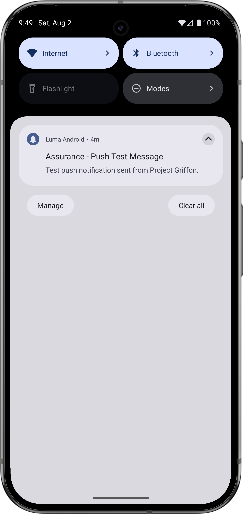
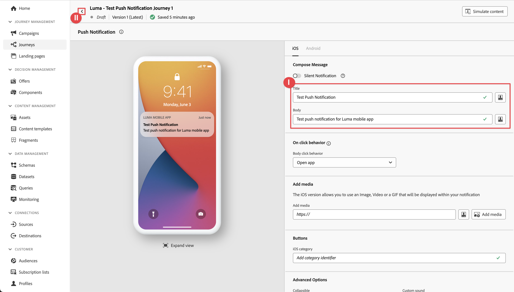
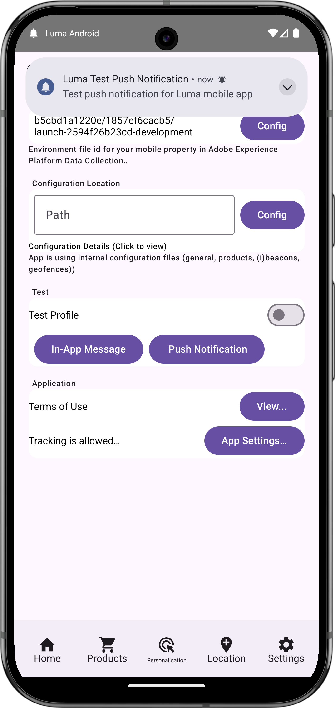

# Criar e enviar notificações por push

Saiba como criar notificações por push para aplicativos móveis com o Experience Platform Mobile SDK e o Journey Optimizer.

O Journey Optimizer permite criar jornadas e enviar mensagens para públicos-alvo direcionados. Antes de enviar notificações por push com o Journey Optimizer, você deve garantir que as configurações e integrações adequadas estejam em vigor. Para entender o fluxo de dados das Notificações por push no Journey Optimizer, consulte a [documentação](https://experienceleague.adobe.com/pt-br/docs/journey-optimizer/using/channels/push/push-config/push-gs).

{zoomable="yes"}

>[!NOTE]
>
>Essa lição é opcional e se aplica somente aos usuários do Journey Optimizer que desejam enviar notificações por push.


## Pré-requisitos

* O aplicativo foi criado e executado com sucesso com SDKs instalados e configurados.
* Configure o aplicativo para Adobe Experience Platform.
* Acesso ao Journey Optimizer e [permissões suficientes](https://experienceleague.adobe.com/pt-br/docs/journey-optimizer/using/channels/push/push-config/push-configuration). Além disso, você precisa de permissão suficiente para os seguintes recursos do Journey Optimizer.
   * Criar uma credencial de push.
   * Criar uma configuração de canal de push.
   * Criar uma jornada.
   * Criar uma mensagem.
   * Criar predefinições de mensagem.
* Para a iOS, uma **conta paga de desenvolvedor do Apple** com acesso suficiente para criar certificados, identificadores e chaves.
* Para o Android, uma conta de desenvolvedor do Google com acesso suficiente para criar certificados e chaves.
* Dispositivo ou simulador físico iOS ou Android para testes.

## Objetivos de aprendizagem

Nesta lição, você

* Registre a ID do aplicativo com o serviço de notificação por push (APNs) da Apple.
* Crie uma configuração de canal no Journey Optimizer.
* Atualize seu esquema para incluir campos de mensagens de push.
* Instale e configure a extensão de tag da Journey Optimizer.
* Atualize seu aplicativo para registrar a extensão de tag da Journey Optimizer.
* Validar configuração no Assurance.
* Enviar uma mensagem de teste do Assurance
* Defina seu próprio evento de notificação por push, jornada e experiência no Journey Optimizer.
* Envie sua própria notificação por push de dentro do aplicativo.


## Configurar

>[!TIP]
>
>Se você já configurou o ambiente como parte da [lição Mensagens no aplicativo do Journey Optimizer](journey-optimizer-inapp.md), talvez já tenha executado algumas das etapas desta seção de configuração.

### Criar credenciais de push

Para notificações por push, primeiro é necessário registrar seu aplicativo para notificações por push.

>[!BEGINTABS]

>[!TAB iOS]

As etapas a seguir não são específicas do Adobe Experience Cloud e foram projetadas para orientá-lo pela configuração de APNs.

1. No portal do desenvolvedor do Apple, navegue até **[!UICONTROL Chaves]**.
1. Para criar uma chave, selecione **[!UICONTROL +]**.

   {zoomable="yes"}

1. Forneça um **[!UICONTROL Nome da Chave]**.
1. Selecione o **[!UICONTROL Serviço de notificação por push do Apple] (APNs)** e selecione **[!UICONTROL Configurar]**.
   1. Na tela **[!UICONTROL Configurar Chave]**, selecione **[!UICONTROL Sandbox e Produção]** no menu suspenso **[!UICONTROL Ambiente]**.
   1. Selecione **[!UICONTROL Salvar]**.
1. Selecione **[!UICONTROL Continuar]**.

   {zoomable="yes"}

1. Revise a configuração e selecione **[!UICONTROL Registrar]**.
1. Baixe a chave privada `.p8`. Ele é usado no próximo exercício, quando você configura a credencial de push do Journey Optimizer.
1. Anote a **[!UICONTROL Key ID]**. Ele é usado no próximo exercício, quando você configura a credencial de push do Journey Optimizer.
1. Anote a **[!UICONTROL ID da Equipe]**. Ele é usado no próximo exercício, quando você configura a credencial de push do Journey Optimizer. A ID da equipe pode ser encontrada no canto superior direito da tela, próximo ao seu nome de logon.
   {zoomable="yes"}

A documentação adicional pode ser [encontrada aqui](https://help.apple.com/developer-account/#/devcdfbb56a3).

>[!TAB Android]

As etapas a seguir não são específicas do Adobe Experience Cloud e foram projetadas para orientá-lo pela configuração do Firebase.

1. Acesse o console Firebase.
1. Selecione **[!UICONTROL Criar um projeto Firebase]**.
   1. Insira um **[!UICONTROL Nome do projeto]**.
   1. Selecione **[!UICONTROL Continuar]** em **[!UICONTROL Criar um projeto]** - **[!UICONTROL Vamos começar com um nome para o seu projeto]**. Por exemplo, `Luma Android App.`
   1. Desative o **[!UICONTROL Gemini no Firebase]** e selecione **[!UICONTROL Continuar]** em **[!UICONTROL Criar um projeto]** - **[!UICONTROL Assistência de IA para seu projeto do Firebase]**.
   1. Desative o **[!UICONTROL Google Analytics para este projeto]** e selecione **[!UICONTROL Continuar]** em **[!UICONTROL Criar um projeto]** - **[!UICONTROL Google Analytics para seu projeto Firebase]**.
   1. Selecione **[!UICONTROL Criar Projeto]**.
   1. Depois que o projeto estiver pronto, selecione **[!UICONTROL Continuar]**.

1. De volta ao console do Firebase, verifique se o projeto está selecionado na parte superior. Por exemplo, **[!UICONTROL Aplicativo Luma Android]**.

   {zoomable="yes"}

1. Selecione  > **[!UICONTROL Configurações do Projeto]**.

1. Em **[!UICONTROL Configurações do projeto]**, selecione **[!UICONTROL Adicionar aplicativo]**.
   1. Em **[!UICONTROL Adicionar Firebase ao seu aplicativo]**, selecione **[!UICONTROL Android]** como plataforma.
   1. No **[!UICONTROL Adicionar o Firebase ao aplicativo do Android:]**
      1. Na etapa 1, **[!UICONTROL Registrar aplicativo]**:
         1. Insira um nome de pacote do Android, semelhante ao identificador do aplicativo. Por exemplo, `com.adobe.luma.tutorial.android`.
         1. Digite um **[!UICONTROL apelido de aplicativo]** opcional.
         1. Selecione **[!UICONTROL Registrar aplicativo]**.
      1. Na etapa 2, **[!UICONTROL Baixe e adicione o arquivo de configuração]**.
         1. Selecione  **[!UICONTROL Baixar google-services.json]**. Ao criar sua própria versão do aplicativo Android, você deve substituir o arquivo `google-services.json` atual no projeto de amostra do Android Studio pela versão do arquivo gerada por essa nova configuração de aplicativo.
As outras etapas já estão disponíveis no aplicativo de amostra.

   Sua tela deve ter a aparência abaixo:

   {zoomable="yes"}

1. Em **[!UICONTROL Configurações do Projeto]**, selecione **[!UICONTROL Contas de serviço]**.
1. Selecione **[!UICONTROL Gerar nova chave privada]**. Um arquivo `luma-android-app-firebase-adminsdk-xxxx-xxxxxxxx.json` é gerado. Armazene esse arquivo em um local seguro, conforme necessário, em um estágio posterior.

Para obter mais informações, consulte a [documentação para desenvolvedor do Firebase](https://firebase.google.com/docs).

>[!ENDTABS]

### Adicionar suas credenciais de push do aplicativo na Coleção de dados

Em seguida, você precisa adicionar suas credenciais de push do aplicativo móvel para autorizar o Adobe a enviar notificações por push em seu nome. Você pode adicionar credenciais de push na Coleção de dados ou no Journey Optimizer. Neste tutorial, a interface da Coleção de dados é usada. As credenciais de push são vinculadas a uma configuração de canal no Journey Optimizer.

1. Em Coleção de dados, selecione **[!UICONTROL Superfícies do aplicativo]**.
1. Selecione **[!UICONTROL Criar Superfície do Aplicativo]**.
1. Na interface **[!UICONTROL Criar Superfície de Aplicativo]**:
   1. Insira um **[!UICONTROL Nome]**.
   1. Selecione **[!UICONTROL Apple iOS]** se desejar enviar notificações por push para o iOS.
      1. Digite sua **[!UICONTROL ID do aplicativo]**, por exemplo `com.adobe.luma.tutorial.swiftui`.
      1. Selecione a sandbox (opcional).
      1. Habilitar **[!UICONTROL Credenciais por Push]**.
      1. Solte o arquivo de chave privada `.p8` salvo em **[!UICONTROL Arraste e solte seu arquivo]**.
      1. Insira a **[!UICONTROL Key ID]**.
      1. Insira a **[!UICONTROL Identificação da Equipe]**.
   1. Selecione **[!UICONTROL Android]** se desejar enviar notificações por push para o Android.
      1. Digite sua **[!UICONTROL ID do aplicativo]**, por exemplo `com.adobe.luma.tutorial.android`.
      1. Selecione a sandbox (opcional).
      1. Habilitar **[!UICONTROL Credenciais por Push]**.
      1. Solte o arquivo salvo `luma-android-app-firebase-adminsdk-xxxx-xxxxxxxx.json` em **[!UICONTROL Arraste e solte seu arquivo]**.

   {zoomable="yes"}

1. Selecione **[!UICONTROL Salvar]**. Se todas as informações estiverem corretas, você criou credenciais de push para associar a uma configuração de canal.


### Criar uma configuração de canal para push no Journey Optimizer

Depois de criar uma configuração de credencial de push, você deve criar uma configuração para poder enviar notificações por push do Journey Optimizer.

1. Na interface do Journey Optimizer, abra o menu **[!UICONTROL Canais]** > **[!UICONTROL Configurações gerais]** > **[!UICONTROL Configurações de canal]** e selecione **[!UICONTROL Criar configuração de canal]**.

   {zoomable="yes"}

1. Insira um nome e uma descrição (opcional) para a configuração.

   >[!NOTE]
   >
   > Os nomes devem começar com uma letra (A-Z). Ele só pode conter caracteres alfanuméricos. Também é possível usar os caracteres de sublinhado `_`, ponto `.` e hífen `-`.


1. Para atribuir rótulos de uso de dados personalizados ou de núcleo à configuração, você pode selecionar **[!UICONTROL Gerenciar acesso]**. [Saiba mais sobre o OLAC (Controle de Acesso em Nível de Objeto)](https://experienceleague.adobe.com/pt-br/docs/journey-optimizer/using/access-control/object-based-access).

1. Selecione o canal **Push**.


1. Selecione **[!UICONTROL Ação(ões) de marketing]** para associar políticas de consentimento às mensagens que usam essa configuração. Todas as políticas de consentimento associadas às ações de marketing são usadas para respeitar as preferências dos clientes. [Saiba mais sobre ações de marketing](https://experienceleague.adobe.com/pt-br/docs/journey-optimizer/using/privacy/consent/consent#surface-marketing-actions).

1. Escolha sua **[!UICONTROL Plataforma]**. Você pode configurar o **[!UICONTROL iOS]** e o **[!UICONTROL Android]** para uma configuração de canal.

1. Selecione a **[!UICONTROL ID do aplicativo]** apropriada que você usou anteriormente para definir suas credenciais de push. Por exemplo, **[!UICONTROL com.adobe.luma.tutorial.swiftui]** para iOS e **[!UICONTROL com.adobe.luma.tutorial.android]** para Android. O  verde indica que credenciais de push válidas estão associadas a uma configuração de canal.


   {zoomable="yes"}

1. Selecione **[!UICONTROL Enviar]** para salvar suas alterações.


### Atualizar configuração da sequência de dados

Para garantir que os dados enviados do aplicativo móvel para a Edge Network sejam encaminhados para o Journey Optimizer, atualize a configuração do Experience Edge.

1. Na interface da Coleção de dados, selecione **[!UICONTROL Datastreams]** e selecione sua sequência de dados, por exemplo **[!DNL Luma Mobile App]**.
1. Selecione  para **[!UICONTROL Experience Platform]** e selecione  **[!UICONTROL Editar]** no menu de contexto.
1. Na tela **[!UICONTROL Datastreams]** >  > **[!UICONTROL Adobe Experience Platform]**:

   1. Se ainda não estiver selecionado, selecione **[!UICONTROL Conjunto de Dados de Perfis por Push da AJO]** em **[!UICONTROL Conjunto de Dados de Perfil]**. Este conjunto de dados de perfil é necessário ao usar a chamada de API `MobileCore.setPushIdentifier` (consulte [Registrar token de dispositivo para notificações por push](#register-device-token-for-push-notifications)). Essa seleção também garante que o identificador exclusivo para notificações por push (também conhecido como identificador por push) seja armazenado como parte do perfil do usuário.

   1. **[!UICONTROL Adobe Journey Optimizer]** está selecionado. Consulte [configurações do Adobe Experience Platform](https://experienceleague.adobe.com/pt-br/docs/experience-platform/datastreams/configure) para obter mais informações.

   1. Para salvar a configuração da sequência de dados, selecione **[!UICONTROL Salvar]**.

   {zoomable="yes"}


### Instalar extensão de tags do Journey Optimizer

Para que seu aplicativo funcione com a Journey Optimizer, é necessário atualizar a propriedade da tag.

1. Navegue até **[!UICONTROL Marcas]** > **[!UICONTROL Extensões]** > **[!UICONTROL Catálogo]**,
1. Abra a propriedade, por exemplo **[!DNL Luma Mobile App Tutorial]**.
1. Selecione **[!UICONTROL Catálogo]**.
1. Pesquise a extensão **[!UICONTROL Adobe Journey Optimizer]**.
1. Instale a extensão.
1. Na caixa de diálogo **[!UICONTROL Instalar Extensão]**
   1. Selecione um ambiente, por exemplo **[!UICONTROL Desenvolvimento]**.
   1. Selecione o conjunto de dados **[!UICONTROL Conjunto de dados do evento de experiência de rastreamento de push do AJO]** na lista **[!UICONTROL Conjunto de dados do evento]**.
   1. Selecione **[!UICONTROL Salvar na Biblioteca e na Build]**.
      {zoomable="yes"}

>[!NOTE]
>
>Se você não vir o **[!UICONTROL Conjunto de dados do evento de experiência de rastreamento de push do AJO]** como uma opção, entre em contato com o Atendimento ao cliente.
>

## Validar configuração com o Assurance

1. Revise a seção [instruções de instalação](assurance.md#connecting-to-a-session) para conectar seu simulador ou dispositivo ao Assurance.
1. Na interface do Assurance, selecione **[!UICONTROL Configurar]**.
   {zoomable="yes"}
1. Selecione  ao lado de **[!UICONTROL Depuração de push]**.
1. Selecione **[!UICONTROL Salvar]**.
   {zoomable="yes"}
1. Selecione **[!UICONTROL Depuração de push]** na navegação à esquerda.
1. Selecione a guia **[!UICONTROL Validar Instalação]**.
1. Selecione seu dispositivo na lista **[!UICONTROL Cliente]**.
1. Confirme se não está recebendo erros.
   {zoomable="yes"}
1. Selecione a guia **[!UICONTROL Enviar teste por push]**.
1. (opcional) Altere os detalhes padrão para **[!UICONTROL Título]** e **[!UICONTROL Corpo]** e certifique-se de fornecer todos os parâmetros esperados pelo seu aplicativo, como **[!UICONTROL Avançado]** > **[!UICONTROL Canal de Notificação]** (necessário para o Android, por exemplo `LUMA_CHANNEL_ID`).
1. Selecione  **[!UICONTROL Enviar Notificação Por Push De Teste]**.
1. Verifique os **[!UICONTROL Resultados de Teste]**.

   {zoomable="yes"}
1. Você deve ver a notificação por push de teste aparecer no aplicativo.

>[!BEGINTABS]

>[!TAB iOS]


>[!TAB Android]



>[!ENDTABS]

## Assinatura

>[!IMPORTANT]
>
>É necessário assinar um aplicativo iOS para enviar notificações por push no iOS e **requer uma conta de desenvolvedor paga do Apple**. Você não precisa assinar um aplicativo Android para enviar notificações por push.


Para atualizar a assinatura do seu aplicativo:

1. Acesse seu aplicativo no Xcode.
1. Selecione **[!DNL Luma]** no Navegador de projetos.
1. Selecione o destino **[!DNL Luma]**.
1. Selecione a guia **Assinatura e Recursos**.
1. Configure o **[!UICONTROL Gerenciamento automático de assinatura]**, a **[!UICONTROL Equipe]** e o **[!UICONTROL Identificador do Pacote]** ou use seus detalhes específicos de provisionamento de desenvolvimento do Apple.

   >[!IMPORTANT]
   >
   >Use um identificador de conjunto _exclusivo_ e substitua o identificador de conjunto `com.adobe.luma.tutorial.swiftui`, pois cada identificador de conjunto deve ser exclusivo. Normalmente, você usa um formato de DNS reverso para cadeias de caracteres de ID de pacote, como `com.organization.brand.uniqueidentifier`. A versão Concluída deste tutorial, por exemplo, usa `com.adobe.luma.tutorial.swiftui`.


   {zoomable="yes"}


## Adicionar recursos de notificação por push ao seu aplicativo

>[!IMPORTANT]
>
>Para implementar e testar a notificação por push em um aplicativo iOS, você deve ter uma conta de desenvolvedor do Apple **paga**.

>[!BEGINTABS]

>[!TAB iOS]

1. No Xcode, selecione **[!DNL Luma]** na lista **[!UICONTROL TARGETS]**, selecione a guia **[!UICONTROL Assinatura e Recursos]**, selecione o botão **[!UICONTROL + Recurso]** e selecione **[!UICONTROL Notificações por push]**. Esta seleção permite que seu aplicativo receba notificações por push.

1. Em seguida, adicione uma Extensão de notificação ao aplicativo. Volte para a guia **[!DNL General]** e selecione o ícone **[!UICONTROL +]** na parte inferior da seção **[!UICONTROL TARGETS]**.

1. Será solicitado que você selecione o modelo para seu novo alvo. Selecione **[!UICONTROL Extensão de Serviço de Notificação]** e **[!UICONTROL Avançar]**.

1. Na próxima janela, use `NotificationExtension` como o nome da extensão e clique no botão **[!UICONTROL Concluir]**.

Agora você deve ter uma extensão de notificação por push adicionada ao seu aplicativo, semelhante à tela abaixo.

{zoomable="yes"}

>[!TAB Android]

O projeto do Android Studio já está configurado para notificações por push. Não é necessário executar etapas adicionais para habilitar a versão para Android do aplicativo Luma para notificações por push. Consulte [Sobre notificações](https://developer.android.com/develop/ui/views/notifications) para obter mais informações.

As notificações por push do Android exigem a definição de uma ID de canal de notificação, tanto no aplicativo quanto ao envio de uma notificação por push. A ID de notificação do canal usada no aplicativo Android Luma é `LUMA_CHANNEL ID`.

>[!ENDTABS]


## Implementar o Journey Optimizer no aplicativo

Conforme discutido nas lições anteriores, a instalação de uma extensão de tag móvel fornece apenas a configuração. Em seguida, você deve instalar e registrar o Messaging SDK. Se essas etapas não estiverem claras, reveja a seção [Instalar SDKs](install-sdks.md).

>[!NOTE]
>
>Se você concluiu a seção [Instalar SDKs](install-sdks.md), o SDK já está instalado e você pode ignorar essa etapa.
>

>[!BEGINTABS]

>[!TAB iOS]

1. No Xcode, verifique se [Mensagens do AEP](https://github.com/adobe/aepsdk-messaging-ios) foram adicionadas à lista de pacotes nas Dependências de Pacote. Consulte [Gerenciador de pacotes do Swift](install-sdks.md#swift-package-manager).
1. Navegue até **[!DNL Luma]** > **[!DNL Luma]** > **[!UICONTROL AppDelegate]** no navegador de projetos Xcode.
1. Certifique-se de que `AEPMessaging` faça parte da sua lista de importações.

   `import AEPMessaging`

1. Verifique se `Messaging.self` faz parte da matriz de extensões que você está registrando.

   ```swift
   let extensions = [
       AEPIdentity.Identity.self,
       Lifecycle.self,
       Signal.self,
       Edge.self,
       AEPEdgeIdentity.Identity.self,
       Consent.self,
       UserProfile.self,
       Places.self,
       Messaging.self,
       Optimize.self,
       Assurance.self
   ]
   ```

>[!TAB Android]

1. No Android Studio, verifique se [aepsdk-messing-android](https://github.com/adobe/aepsdk-messaging-android) faz parte das dependências no **[!UICONTROL build.gradle.kts (Módulo :app)]** no **[!UICONTROL Android]**  **[!UICONTROL Gradle Scripts]**. Consulte [Gradle](install-sdks.md#gradle).
1. Navegue até **[!UICONTROL Android]**  > **[!DNL app]** > **[!DNL kotlin+java]** > **[!UICONTROL com.adobe.luma.tutorial.android]** > **[!UICONTROL LumaApplication]** no navegador de projetos do Android Studio.
1. Certifique-se de que `com.adobe.marketing.mobile.Messaging` faça parte da sua lista de importações.

   `import import com.adobe.marketing.mobile.Messaging`

1. Verifique se `Messaging.EXTENSION` faz parte da matriz de extensões que você está registrando.

   ```kotlin
   val extensions = listOf(
       Identity.EXTENSION,
       Lifecycle.EXTENSION,
       Signal.EXTENSION,
       Edge.EXTENSION,
       Consent.EXTENSION,
       UserProfile.EXTENSION,
       Places.EXTENSION,
       Messaging.EXTENSION,
       Optimize.EXTENSION,
       Assurance.EXTENSION
   )
   ```

>[!ENDTABS]


## Registrar um token de dispositivo para notificações por push

É necessário registrar o token do dispositivo para notificações por push.

>[!BEGINTABS]

>[!TAB iOS]

1. Navegue até **[!DNL Luma]** > **[!DNL Luma]** > **[!UICONTROL AppDelegate]** no navegador de projetos Xcode.
1. Adicione a API [`MobileCore.setPushIdentifier`](https://developer.adobe.com/client-sdks/documentation/mobile-core/api-reference/#setpushidentifier) à função `func application(_ application: UIApplication, didRegisterForRemoteNotificationsWithDeviceToken deviceToken: Data)`.

   ```swift
   // Send push token to Mobile SDK
   MobileCore.setPushIdentifier(deviceToken)
   ```

   Essa função recupera o token do dispositivo exclusivo para o dispositivo no qual o aplicativo está instalado. Em seguida, define o token para delivery de notificação por push usando a configuração definida e que depende do Serviço de notificação por push (APNs) da Apple.

>[!TAB Android]

1. Navegue até **[!UICONTROL Android]**  > **[!DNL app]** > **[!DNL kotlin+java]** > **[!UICONTROL com.adobe.luma.tutorial.android]** > **[!UICONTROL LumaApplication]** no navegador de projetos do Android Studio.
1. Adicione a API [`MobileCore.setPushIdentifier`](https://developer.adobe.com/client-sdks/documentation/mobile-core/api-reference/#setpushidentifier) à função `override fun onCreate()` em `class LumaAplication : Application`, em `FirebaseMessaging.getInstance().token.addOnCompleteListener`.

   ```kotlin
   // Send push token to Mobile SDK
   MobileCore.setPushIdentifier(token)
   ```

   Essa função recupera o token do dispositivo exclusivo para o dispositivo no qual o aplicativo está instalado. Em seguida, o define o token para delivery de notificação por push usando a configuração definida e que depende do Firebase Cloud Messaging (FCM).

>[!ENDTABS]

>[!IMPORTANT]
>
>**Somente para iOS**: o `MobileCore.updateConfigurationWith(configDict: ["messaging.useSandbox": true])` determina se as notificações por push estão usando uma sandbox APNs ou um servidor de produção para enviar notificações por push. Ao testar seu aplicativo no simulador ou em um dispositivo, verifique se `messaging.useSandbox` está definido como `true` para que você receba notificações por push. Ao implantar seu aplicativo para produção a ser testada usando o Testflight da Apple, verifique se definiu `messaging.useSandbox` como `false`; caso contrário, seu aplicativo de produção não poderá receber notificações por push.<br/><br/>
>&#x200B;>O Firebase Cloud Messaging (FCM) **não** suporta o conceito de sandboxes para notificações por push.


## Criar sua própria notificação por push

Para criar sua própria notificação por push, você deve definir um evento no Journey Optimizer que acione uma jornada que controle o envio de uma notificação por push.

### Atualizar seu esquema

Você definirá um novo tipo de evento, ainda não disponível como parte da lista de eventos definidos no esquema. Você pode usar esse tipo de evento posteriormente ao acionar notificações por push.

1. Na interface do usuário do Journey Optimizer, selecione **[!UICONTROL Esquemas]** no painel esquerdo.
1. Selecione **[!UICONTROL Procurar]** na barra de guias.
1. Selecione seu esquema, por exemplo **[!DNL Luma Mobile App Event Schema]** para abri-lo.
1. No Editor de esquemas:
   1. Selecione o campo **[!UICONTROL eventType]**.
   1. No painel **[!UICONTROL Propriedades do campo]**, role para baixo para ver a lista de valores possíveis para o tipo de evento. Selecione **[!UICONTROL Adicionar linha]** e adicione `application.test` como **[!UICONTROL VALUE]** e `[!UICONTROL Test event for push notification]` como `DISPLAY NAME`.
   1. Selecione **[!UICONTROL Aplicar]**.
   1. Selecione **[!UICONTROL Salvar]**.

      {zoomable="yes"}

### Definir um evento

Os eventos no Journey Optimizer permitem acionar jornadas para enviar mensagens, por exemplo, notificações por push. Consulte [Sobre eventos](https://experienceleague.adobe.com/pt-br/docs/journey-optimizer/using/configure-journeys/events-journeys/about-events) para obter mais informações.

1. Na interface do usuário do Journey Optimizer, selecione **[!UICONTROL Configurações]** no painel esquerdo.

1. Na tela **[!UICONTROL Painel]**, selecione o botão **[!UICONTROL Gerenciar]** no bloco **[!UICONTROL Eventos]**.

1. Na tela **[!UICONTROL Eventos]**, selecione **[!UICONTROL Criar Evento]**.

1. No painel **[!UICONTROL Editar evento1]**:

   1. Digite `LumaTestEvent` como **[!UICONTROL Nome]** do evento.
   1. Forneça uma **[!UICONTROL Descrição]**, por exemplo `Test event to trigger push notifications in Luma app`.

   1. Selecione o esquema de evento de experiência de aplicativo móvel criado anteriormente em [Criar um esquema XDM](create-schema.md) da lista **[!UICONTROL Esquema]**, por exemplo **[!DNL Luma Mobile App Event Schema v.1]**.
   1. Selecione  ao lado da lista **[!UICONTROL Campos]**.

      {zoomable="yes"}

      Na caixa de diálogo **[!UICONTROL Campos]**, verifique se os campos a seguir estão selecionados (na parte superior dos campos padrão que estão sempre selecionados (**[!UICONTROL _id]**, **[!UICONTROL id]** e **[!UICONTROL carimbo de data/hora]**)). Você pode alternar, usando a lista suspensa, entre **[!UICONTROL Selecionado]**, **[!UICONTROL Todos]** e **[!UICONTROL Primário]** ou usar o campo .

      * **[!UICONTROL Aplicativo Identificado (id)]**,
      * **[!UICONTROL Tipo de Evento (eventType)]**,
      * **[!UICONTROL Principal (principal)]**.

      {zoomable="yes"}

      Em seguida, selecione **[!UICONTROL Ok]**.

   1. Selecione  ao lado do campo **[!UICONTROL Condição de ID de evento]**.

      1. Na caixa de diálogo **[!UICONTROL Adicionar uma condição de ID de evento]**, arraste e solte o **[!UICONTROL Tipo de Evento (eventType)]** em **[!UICONTROL Arraste e solte um elemento aqui]**.
      1. No popover, role até a parte inferior e selecione **[!UICONTROL application.test]** (que é o tipo de evento adicionado anteriormente à lista de tipos de evento como parte de [Atualizar seu esquema](#update-your-schema)). Em seguida, role para cima e selecione **[!UICONTROL Ok]**.
      1. Selecione **[!UICONTROL Ok]** para salvar a condição.
         {zoomable="yes"}

   1. Selecione **[!UICONTROL ECID (ECID)]** na lista **[!UICONTROL Namespace]**. Automaticamente, o campo **[!UICONTROL Identificador de perfil]** é preenchido com **[!UICONTROL A ID do primeiro elemento da chave ECID para o mapa identityMap]**.
   1. Selecione **[!UICONTROL Salvar]**.
      {zoomable="yes"}

Você acabou de criar uma configuração de evento baseada no schema de eventos de experiência do aplicativo móvel criado anteriormente como parte deste tutorial. Essa configuração de evento filtrará os eventos de experiência recebidos usando seu tipo de evento específico (`application.test`), de modo que somente os eventos com esse tipo específico, iniciados no aplicativo móvel, acionarão a jornada que você criou na próxima etapa. Em um cenário real, talvez você queira enviar notificações por push de um serviço externo. No entanto, os mesmos conceitos se aplicam: no aplicativo externo, envie um evento de experiência para o Experience Platform que tem campos específicos que você pode usar para aplicar condições antes que esses eventos acionem uma jornada.

### Criar a jornada

A próxima etapa é criar a jornada que aciona o envio da notificação por push ao receber o evento apropriado.

1. Na interface do usuário do Journey Optimizer, selecione **[!UICONTROL Jornadas]** no painel esquerdo.
1. Selecione **[!UICONTROL Criar Jornada]**.
1. No painel **[!UICONTROL Propriedades da Jornada]**:

   1. Digite um **[!UICONTROL Nome]** para a jornada, por exemplo `Luma - Test Push Notification Journey`.
   1. Insira uma **[!UICONTROL Descrição]** para a jornada, por exemplo `Journey for test push notifications in Luma mobile app`.
   1. Verifique se **[!UICONTROL Permitir reentrada]** está selecionado e defina **[!UICONTROL Período de espera de reentrada]** como **[!UICONTROL 30]** **[!UICONTROL Segundos]**.
   1. Selecione **[!UICONTROL Ok]**.
      {zoomable="yes"}

1. De volta à tela de jornada, a partir de **[!UICONTROL EVENTS]**, arraste e solte seu  **[!DNL LumaTestEvent]** na tela, onde ele mostra **[!UICONTROL Selecione um evento de entrada ou uma atividade de leitura de público]**.

   * No painel **[!UICONTROL Events: LumaTestEvent]**, digite um **[!UICONTROL Label]**, por exemplo `Luma Test Event`.

1. Na lista suspensa **[!UICONTROL AÇÕES]**, arraste e solte  **[!UICONTROL Push]** em  que aparece à direita da atividade **[!DNL LumaTestEvent]**. No painel **[!UICONTROL Ações: push]**:

   1. Forneça um **[!UICONTROL Rótulo]**, por exemplo `Luma Test Push Notification`, forneça uma **[!UICONTROL Descrição]**, por exemplo `Test push notification for Luma mobile app`, selecione **[!UICONTROL Transacional]** da lista **[!UICONTROL Categoria]** e selecione **[!DNL Luma]** da **[!UICONTROL Superfície de push]**.
   1. Selecione  **[!UICONTROL Editar conteúdo]** para começar a editar a notificação por push real.

      {zoomable="yes"}

      No editor de **[!UICONTROL Notificação por push]**:

      1. Insira um **[!UICONTROL Título]**, por exemplo `Luma Test Push Notification`, e insira um **[!UICONTROL Corpo]**, por exemplo `Test push notification for Luma mobile app`.
      1. Opcionalmente, você pode inserir um link para uma imagem (.png ou .jpg) em **[!UICONTROL Adicionar mídia]**. Se você fizer isso, a imagem fará parte da notificação por push. Observe que, se você fizer isso, precisará cuidar do manuseio correto da imagem no aplicativo móvel.
      1. Para salvar e sair do editor, selecione .

         {zoomable="yes"}

   1. Para salvar e concluir a definição de notificação por push, selecione **[!UICONTROL Ok]**.

1. Sua jornada deve ser parecida com a exibida abaixo. Selecione **[!UICONTROL Publicar]** para publicar e ativar sua jornada.
   {zoomable="yes"}


## Acionar a notificação por push

Você tem todos os ingredientes em vigor para enviar uma notificação por push. O que resta é como acionar essa notificação por push. Em essência, é o mesmo que você viu antes: basta enviar um evento de experiência com a carga útil adequada (como em [Eventos](events.md)).

Desta vez, o evento de experiência que você está prestes a enviar não foi construído criando um dicionário XDM simples. Você usará um `struct` que representa uma carga de notificação por push. Definir um tipo de dados dedicado é uma maneira alternativa de como implementar a construção de cargas de evento de experiência no seu aplicativo.

Esteja ciente de que, exclusivamente para fins de ilustração, você envia uma notificação por push de dentro do aplicativo. Um cenário mais típico é você enviar o evento de experiência (que aciona a jornada de notificação por push) de outro aplicativo ou serviço.

>[!BEGINTABS]

>[!TAB iOS]

1. Navegue até **[!DNL Luma]** > **[!DNL Luma]** > **[!UICONTROL Modelo]** > **[!UICONTROL XDM]** > **[!UICONTROL TestPushPayload]** no navegador do Projeto Xcode e inspecione o código.

   ```swift
   import Foundation
   
   // MARK: - TestPush
   struct TestPushPayload: Codable {
      let application: Application
      let eventType: String
   }
   
   // MARK: - Application
   struct Application: Codable {
      let id: String
   }
   ```

   O código é uma representação da seguinte carga simples que você enviará para acionar a jornada de notificação por push de teste.

   ```json
   {
      "eventType": string,
      "application" : [
          "id": string
      ]
   }
   ```

1. Navegue até **[!DNL Luma]** > **[!DNL Luma]** > **[!DNL Utils]** > **[!UICONTROL MobileSDK]** no navegador do Projeto Xcode e adicione o seguinte código a `func sendTestPushEvent(applicationId: String, eventType: String)`:

   ```swift
   // Create payload and send experience event
   Task {
       let testPushPayload = TestPushPayload(
           application: Application(
               id: applicationId
           ),
           eventType: eventType
       )
       // send the final experience event
       await sendExperienceEvent(
           xdm: testPushPayload.asDictionary() ?? [:]
       )
   }
   ```

   Este código cria uma instância `testPushPayload` usando os parâmetros fornecidos para a função (`applicationId` e `eventType`) e, em seguida, chama `sendExperienceEvent` ao converter a carga em um dicionário. Esse código também leva em conta os aspectos assíncronos de chamar a SDK do Adobe Experience Platform por meio do uso do modelo de simultaneidade do Swift, com base em `await` e `async`.

1. Navegue até **[!DNL Luma]** > **[!DNL Luma]** > **[!DNL Views]** > **[!DNL General]** > **[!UICONTROL ConfigView]** no navegador de projetos Xcode. Na definição do Botão de notificação por push, adicione o seguinte código para enviar a carga do evento de experiência de notificação por push de teste para acionar a jornada sempre que esse botão for tocado.

   ```swift
   // Setting parameters and calling function to send push notification
   Task {
       let eventType = testPushEventType
       let applicationId = Bundle.main.bundleIdentifier ?? "No bundle id found"
       await MobileSDK.shared.sendTestPushEvent(applicationId: applicationId, eventType: eventType)
   }
   ```

>[!TAB Android]

1. Navegue até **[!UICONTROL Android]**  > **[!DNL app]** > **[!DNL kotlin+java]** > **[!UICONTROL com.adobe.luma.tutorial.android]** > **[!UICONTROL xdm]** > **[!UICONTROL TestPushPayload.kt]** no navegador do Android Studio e inspecione o código.

   ```kotlin
   import com.google.gson.annotations.SerializedName
   
   data class TestPushPayload(
      @SerializedName("application") val application: Application,
      @SerializedName("eventType") val eventType: String
   ) {
      fun asMap(): Map<String, Any> {
         return mapOf(
               "application" to application.asMap(),
               "eventType" to eventType
         )
      }
   }
   
   data class Application(
      @SerializedName("id") val id: String
   ) {
      fun asMap(): Map<String, Any> {
         return mapOf(
               "id" to id
         )
      }
   }
   ```

   O código é uma representação da seguinte carga simples que você enviará para acionar a jornada de notificação por push de teste.

   ```json
   {
      "eventType": string,
      "application" : [
          "id": string
      ]
   }
   ```

1. Navegue até **[!UICONTROL Android]**  > **[!DNL app]** > **[!DNL kotlin+java]** > **[!DNL com.adobe.luma.tutorial.android]** > **[!UICONTROL templates]** > **[!UICONTROL MobileSDK]** no navegador do Android Studio e adicione o seguinte código a `func sendTestPushEvent(applicationId: String, eventType: String)`:

   ```kotlin
   // Create payload and send experience event
   val testPushPayload = TestPushPayload(
      Application(applicationId),
      eventType
   )
   sendExperienceEvent(testPushPayload.asMap())
   ```

   Este código cria uma instância `testPushPayload` usando os parâmetros fornecidos para a função (`applicationId` e `eventType`) e, em seguida, chama `sendExperienceEvent` ao converter a carga em um mapa.

1. Navegue até **[!UICONTROL Android]**  > **[!DNL app]** > **[!DNL kotlin+java]** > **[!DNL com.adobe.luma.android.tutorial]** > **[!DNL views]** > **[!UICONTROL ConfigView.kt]** no navegador do Android Studio. Na definição do Botão de notificação por push, adicione o seguinte código para enviar a carga do evento de experiência de notificação por push de teste para acionar a jornada sempre que esse botão for tocado.

   ```kotlin
   // Setting parameters and calling function to send push notification
   val eventType = testPushEventType
   val applicationId = context.packageName
   scope.launch {
         MobileSDK.shared.sendTestPushEvent(
            applicationId,
            eventType
         )
   }
   ```


>[!ENDTABS]

## Validar usando seu aplicativo

Para validar o evento e a jornada de notificação por push:

>[!BEGINTABS]

>[!TAB iOS]

1. Recrie e execute o aplicativo no simulador ou em um dispositivo físico do Xcode, usando .

1. Vá para a guia **[!UICONTROL Configurações]**.

1. Toque em **[!UICONTROL Notificação por push]**.


   Você verá a notificação por push aparecer na parte superior do aplicativo.

   

>[!TAB Android]

1. Recrie e execute o aplicativo no simulador ou em um dispositivo físico do Android Studio, usando .

1. Vá para a guia **[!UICONTROL Configurações]**.

1. Toque em **[!UICONTROL Notificação por push]**.

   Você verá a notificação por push aparecer na parte superior do aplicativo.

   

>[!ENDTABS]

Como lidar e exibir a notificação por push no próprio aplicativo está além do tópico desta seção. Cada plataforma implementa o manuseio e exibe a notificação de uma maneira específica. Consulte para obter mais informações:

* Para iOS: [Notificações de Usuário](https://developer.apple.com/documentation/usernotifications)
* Para o Android: [Cloud Messaging](https://firebase.google.com/docs/cloud-messaging)

## Próximas etapas

Agora você deve ter todas as ferramentas para lidar com notificações por push no seu aplicativo. Por exemplo, você pode criar uma jornada no Journey Optimizer que envia uma notificação por push de boas-vindas quando um usuário do aplicativo faz logon. Ou uma notificação por push de confirmação quando um usuário compra um produto no aplicativo. Ou insere a geofence de um local (como você vê na lição [Places](places.md)).

>[!SUCCESS]
>
>Agora você ativou o aplicativo para notificação por push usando o Journey Optimizer e a extensão do Journey Optimizer para o Experience Platform Mobile SDK.
>
>Obrigado por investir seu tempo aprendendo sobre o Adobe Experience Platform Mobile SDK. Se tiver dúvidas, quiser compartilhar comentários gerais ou tiver sugestões sobre conteúdo futuro, compartilhe-os nesta [postagem de discussão da Comunidade Experience League](https://experienceleaguecommunities.adobe.com/t5/adobe-experience-platform-data/tutorial-discussion-implement-adobe-experience-cloud-in-mobile/td-p/443796?profile.language=pt).

Próximo: **[Criar e enviar mensagens no aplicativo](journey-optimizer-inapp.md)**
