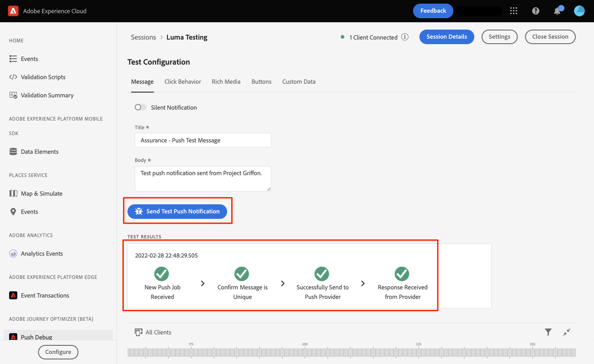

# mensagens por push do Adobe Journey Optimizer

Saiba como criar mensagens de push para aplicativos móveis com o SDK móvel da plataforma e o Adobe Journey Optimizer.

>[!INFO]
>
> Este tutorial será substituído por um novo tutorial usando um novo aplicativo móvel de amostra no final de novembro de 2023

O Journey Optimizer permite criar suas jornadas e enviar mensagens para públicos-alvo direcionados. Antes de enviar notificações por push com o Journey Optimizer, você deve garantir que as configurações e integrações adequadas estejam em vigor. Para entender o fluxo de dados de notificações por push no Adobe Journey Optimizer, consulte [a documentação](https://experienceleague.adobe.com/docs/journey-optimizer/using/configuration/configuration-message/push-config/push-gs.html).

>[!NOTE]
>
>Esta lição é opcional e se aplica somente aos usuários do Adobe Journey Optimizer que desejam enviar mensagens de push.


## Pré-requisitos

* O aplicativo com SDKs instalados e configurados foi criado e executado com sucesso.
* Acesso ao Adobe Journey Optimizer e permissões suficientes, conforme descrito [aqui](https://experienceleague.adobe.com/docs/journey-optimizer/using/configuration/configuration-message/push-config/push-configuration.html?lang=en). Além disso, você precisa de permissões suficientes para os seguintes recursos do Adobe Journey Optimizer.
   * Crie uma superfície de aplicativo.
   * Criar uma jornada
   * Criar uma mensagem.
   * Criar predefinições de mensagem.
* Conta de desenvolvedor paga do Apple com acesso suficiente para criar certificados, identificadores e chaves.
* Dispositivo iOS físico para teste.

## Objetivos de aprendizagem

Nesta lição, você vai:

* Registrar a ID do aplicativo no serviço de notificação por push (APN) da Apple.
* Criar um **[!UICONTROL Superfície do aplicativo]** no AJO.
* Atualize seu **[!UICONTROL schema]** para incluir campos de mensagens por push.
* Instalar e configurar o **[!UICONTROL Adobe Journey Optimizer]** extensão de tag.
* Atualize seu aplicativo para incluir a extensão de tag do AJO.
* Valide a configuração no Assurance.
* Envie uma mensagem de teste.


## Registrar ID do aplicativo com APN

As etapas a seguir não são específicas do Adobe Experience Cloud e foram projetadas para orientá-lo pela configuração do APN.

### Criar um `.p8` chave privada

1. No portal do desenvolvedor do Apple, navegue até **[!UICONTROL Chaves]**.
1. Selecione o ícone + para criar uma chave.
   

1. Forneça um **[!UICONTROL Nome da chave]**.
1. Selecione o **[!UICONTROL APN]** caixa de seleção
1. Selecionar **[!UICONTROL Continuar]**.
   
1. Revise a configuração e selecione **[!UICONTROL Registrar]**.
1. Baixe o `.p8` chave privada. É usado na configuração da Superfície do aplicativo.
1. Anote o **[!UICONTROL ID da chave]**. É usado na configuração da Superfície do aplicativo.

A documentação adicional pode ser [encontrado aqui](https://help.apple.com/developer-account/#/devcdfbb56a3).

### Recupere a ID da equipe do desenvolvedor do Apple

1. No portal do desenvolvedor do Apple, navegue até **[!UICONTROL Associação]**.
1. Seu **[!UICONTROL ID da equipe]** está listado junto com suas outras informações de associação. É usado na configuração da Superfície do aplicativo.

## Adicionar suas credenciais de push do aplicativo na Coleção de dados

1. No [Interface da coleção de dados](https://experience.adobe.com/br/data-collection/), selecione a guia Superfícies do aplicativo no painel esquerdo.
1. Selecionar **[!UICONTROL Criar Superfícies do Aplicativo]** para criar uma configuração.
   
1. Insira um **[!UICONTROL Nome]** para a configuração do, por exemplo `Luma App Tutorial`  .
1. Em Configuração do Aplicativo Móvel, selecione **[!UICONTROL Apple iOS]**.
1. Insira a ID do pacote do aplicativo móvel no campo ID do aplicativo (ID do pacote iOS). Se você estiver seguindo junto com o aplicativo Luma, esse valor será `com.adobe.luma.tutorial`.
1. Ligue o **[!UICONTROL Credenciais por push]** botão para adicionar suas credenciais.
1. Arraste e solte o `.p8` **Chave de autenticação da notificação por push do Apple** arquivo.
1. Forneça a ID da chave, uma cadeia de 10 caracteres atribuída durante a criação do `p8` chave de autenticação. Ele pode ser encontrado na guia Chaves no **Certificados, identificadores e perfis** página.
1. Forneça a ID da equipe. Este é um valor de string que pode ser encontrado sob o **Associação** guia.
1. Selecione **[!UICONTROL Salvar]**.
   

## Instalar extensão de tags do Adobe Journey Optimizer

1. Navegue até [!UICONTROL Tags] > [!UICONTROL Extensões] > [!UICONTROL Catálogo]e localize o **[!UICONTROL Adobe Journey Optimizer]** extensão.
1. Instale a extensão.
   
1. Selecionar `CJM Push Tracking Experience Event Dataset` o conjunto de dados do Adobe Experience Platform.
   
1. Selecionar **[!UICONTROL Salvar na biblioteca e criar]**.

>[!NOTE]
>Se você não vir &quot;Conjunto de dados do evento de experiência de rastreamento de push CJM&quot; como uma opção, entre em contato com o Atendimento ao cliente.
>

## Implementar a Adobe Journey Optimizer no aplicativo

Conforme discutido nas lições anteriores, a instalação de uma extensão de tag móvel fornece apenas a configuração. Em seguida, você deve instalar e registrar o SDK de mensagens. Se essas etapas não estiverem claras, revise o [Instalar SDKs](install-sdks.md) seção.

>[!NOTE]
>
>Se você concluiu o [Instalar SDKs](install-sdks.md) , o SDK já estará instalado e você poderá pular para a etapa #7.

1. Abra o `Podfile` e adicione a seguinte linha e salve o arquivo.

   `pod 'AEPMessaging', '~>1'`
1. Abra o terminal e navegue até a pasta que contém o `Podfile`.
1. Instale o SDK executando o comando `pod install`.
   
1. Abra o XCode e acesse `AppDelegate.swift`.
1. Adicione o seguinte à lista de importações.

   `import AEPMessaging`
1. Adicionar `Messaging.self` à matriz de extensões que você está registrando.
1. Adicione a seguinte função ao arquivo.

   ```swift
   func application(_: UIApplication, didRegisterForRemoteNotificationsWithDeviceToken deviceToken: Data) {
       MobileCore.setPushIdentifier(deviceToken)
   }
   ```

   Essa função recupera o token do dispositivo exclusivo para o dispositivo no qual o aplicativo está instalado e envia para o Adobe/Apple para entrega de mensagens de push.

## Validar enviando uma mensagem de push de teste

1. Revise o [instruções de configuração](assurance.md) seção.
1. Instale o aplicativo em seu dispositivo físico.
1. Inicie o aplicativo usando o URL gerado pelo Assurance.
1. Envie o aplicativo para o plano de fundo.
1. Na interface do usuário do Assurance, selecione **[!UICONTROL Configurar]**.
   
1. Selecione o **[!UICONTROL +]** botão ao lado de **[!UICONTROL Depuração push]**.
1. Selecione **[!UICONTROL Salvar]**.
   
1. Selecionar **[!UICONTROL Depuração push]** no painel de navegação esquerdo.
1. Selecione seu dispositivo na **[!UICONTROL Lista de clientes]**.
1. Confirme se não está recebendo erros.
   
1. Role para baixo e selecione **[!UICONTROL Enviar notificação por push de teste]**.
1. Confirme se você não recebeu a mensagem e os erros, e se recebeu a mensagem em seu dispositivo.
   

Próximo: **[Conclusão e próximas etapas](conclusion.md)**

>[!NOTE]
>
>Obrigado por investir seu tempo aprendendo sobre o Adobe Experience Platform Mobile SDK. Se você tiver dúvidas, quiser compartilhar comentários gerais ou tiver sugestões sobre conteúdo futuro, compartilhe-as nesta [Publicação de discussão da comunidade do Experience League](https://experienceleaguecommunities.adobe.com/t5/adobe-experience-platform-data/tutorial-discussion-implement-adobe-experience-cloud-in-mobile/td-p/443796)