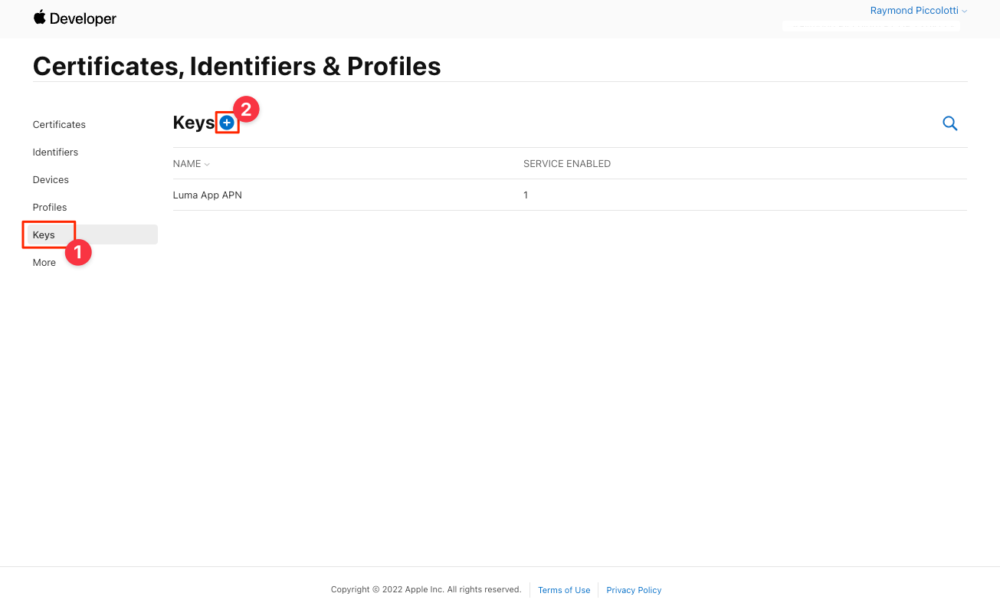

# Mensagens por push do Adobe Journey Optimizer

Saiba como criar mensagens de push para aplicativos móveis com o SDK do Platform Mobile e o Adobe Journey Optimizer.

O Journey Optimizer permite criar suas jornadas e enviar mensagens para públicos-alvo direcionados. Antes de enviar notificações por push com o Journey Optimizer, é necessário garantir que as configurações e integrações adequadas estejam em vigor. Para entender o fluxo de dados das Notificações por push no Adobe Journey Optimizer, consulte [a documentação](https://experienceleague.adobe.com/docs/journey-optimizer/using/configuration/configuration-message/push-config/push-gs.html).

>[!NOTE]
>
>Esta lição é opcional e se aplica somente aos usuários do Adobe Journey Optimizer que procuram enviar mensagens de push.


## Pré-requisitos

* Aplicativo criado e executado com êxito com SDKs instalados e configurados.
* Acesso ao Adobe Journey Optimizer e permissões suficientes, conforme descrito [here](https://experienceleague.adobe.com/docs/journey-optimizer/using/configuration/configuration-message/push-config/push-configuration.html?lang=en). Além disso, você precisa de permissões suficientes para os seguintes recursos do Adobe Journey Optimizer.
   * Crie uma superfície do aplicativo.
   * Criar uma jornada
   * Criar uma mensagem.
   * Criar predefinições de mensagem.
* Conta de desenvolvedor do Apple paga com acesso suficiente para criar certificados, identificadores e chaves.
* Dispositivo iOS físico para teste.

## Objetivos de aprendizagem

Nesta lição, você:

* Registrar a ID do aplicativo com o serviço de notificação por push (APN) da Apple.
* Crie um **[!UICONTROL Superfície do aplicativo]** em AJO.
* Atualize seu **[!UICONTROL schema]** para incluir campos de mensagens de push.
* Instalar e configurar o **[!UICONTROL Adobe Journey Optimizer]** extensão da tag.
* Atualize seu aplicativo para incluir a extensão de tag AJO.
* Validar configuração no Assurance.
* Envie uma mensagem de teste.


## Registrar ID do aplicativo com APN

As etapas a seguir não são específicas do Adobe Experience Cloud e foram projetadas para orientá-lo pela configuração do APN.

### Crie um `.p8` chave privada

1. No portal do desenvolvedor do Apple, navegue até **[!UICONTROL Teclas]**.
1. Selecione o ícone + para criar uma chave.
   

1. Forneça uma **[!UICONTROL Nome da chave]**.
1. Selecione o **[!UICONTROL APN]** caixa de seleção.
1. Selecionar **[!UICONTROL Continuar]**.
   
1. Revise a configuração e selecione **[!UICONTROL Registrar]**.
1. Baixe o `.p8` chave privada. Ele é usado na configuração da superfície do aplicativo.
1. Anote o **[!UICONTROL Key ID]**. Ele é usado na configuração da superfície do aplicativo.

Documentação adicional pode ser [encontrado aqui](https://help.apple.com/developer-account/#/devcdfbb56a3).

### Recuperar a ID da equipe de desenvolvedores do Apple

1. No portal do desenvolvedor do Apple, navegue até **[!UICONTROL Associação]**.
1. Seu **[!UICONTROL ID do grupo]** O está listado junto com suas outras informações de associação. Ele é usado na configuração da superfície do aplicativo.

## Adicionar suas credenciais de push do aplicativo na Coleta de dados

1. No [Interface da Coleta de dados](https://experience.adobe.com/data-collection/), selecione a guia Superfícies do aplicativo no painel esquerdo.
1. Selecionar **[!UICONTROL Criar superfícies do aplicativo]** para criar uma configuração.
   
1. Insira um **[!UICONTROL Nome]** para a configuração, por exemplo `Luma App Tutorial`  .
1. Em Configuração do aplicativo móvel, selecione **[!UICONTROL Apple iOS]**.
1. Insira a ID do pacote do aplicativo móvel no campo ID do aplicativo (iOS Bundle ID) . Se você estiver acompanhando junto com o aplicativo Luma, o valor é `com.adobe.luma.tutorial`.
1. Ative o **[!UICONTROL Credenciais de push]** para adicionar suas credenciais.
1. Arraste e solte a `.p8` **Chave de autenticação de notificação por push do Apple** arquivo.
1. Forneça a ID da chave, uma string de 10 caracteres atribuída durante a criação do `p8` chave de autenticação. Ela pode ser encontrada na guia Keys em **Certificados, identificadores e perfis** página.
1. Forneça a ID da equipe. Este é um valor de string que pode ser encontrado sob a variável **Associação** guia .
1. Selecione **[!UICONTROL Salvar]**.
   

## Instalar a extensão de tags do Adobe Journey Optimizer

1. Navegar para [!UICONTROL Tags] > [!UICONTROL Extensões] > [!UICONTROL Catálogo]e encontre a **[!UICONTROL Adobe Journey Optimizer]** extensão.
1. Instale a extensão .
   
1. Selecionar `CJM Push Tracking Experience Event Dataset` o conjunto de dados do Adobe Experience Platform.
   
1. Selecionar **[!UICONTROL Salvar na biblioteca e criar]**.

>[!NOTE]
>Se você não vir &quot;Conjunto de dados de eventos de experiência de rastreamento de push do CJM&quot; como uma opção, entre em contato com o atendimento ao cliente.

## Implementar a Adobe Journey Optimizer no aplicativo

Conforme discutido nas lições anteriores, a instalação de uma extensão de tag móvel fornece apenas a configuração. Em seguida, você deve instalar e registrar o SDK de mensagens. Se essas etapas não estiverem claras, revise a [Instalar SDKs](install-sdks.md) seção.

>[!NOTE]
>
>Se você concluiu o [Instalar SDKs](install-sdks.md) , o SDK já está instalado e você pode ir para a etapa 7.

1. Abra seu `Podfile` e adicione a seguinte linha e salve o arquivo.

   `pod 'AEPMessaging', '~>1'`
1. Abra o terminal e navegue até a pasta que contém o `Podfile`.
1. Instalar o SDK executando o comando `pod install`.
   
1. Abra o XCode e navegue até `AppDelegate.swift`.
1. Adicione o seguinte à lista de importações.

   `import AEPMessaging`
1. Adicionar `Messaging.self` à matriz de extensões que você está registrando.
1. Adicione a seguinte função ao arquivo .

   ```swift
   func application(_: UIApplication, didRegisterForRemoteNotificationsWithDeviceToken deviceToken: Data) {
       MobileCore.setPushIdentifier(deviceToken)
   }
   ```

   Essa função recupera o token do dispositivo exclusivo para o dispositivo no qual o aplicativo está instalado e envia para o Adobe/Apple para entrega de mensagens de push.

## Validar enviando uma mensagem de push de teste

1. Revise o [instruções de configuração](assurance.md) seção.
1. Instale o aplicativo em seu dispositivo físico.
1. Inicie o aplicativo usando o URL gerado pelo Assurance.
1. Envie o aplicativo para o segundo plano.
1. Na interface de usuário de controle, selecione **[!UICONTROL Configurar]**.
   
1. Selecione o **[!UICONTROL +]** botão ao lado de **[!UICONTROL Depuração por push]**.
1. Selecione **[!UICONTROL Salvar]**.
   
1. Selecionar **[!UICONTROL Depuração por push]** no painel de navegação esquerdo.
1. Selecione seu dispositivo no **[!UICONTROL Lista de clientes]**.
1. Confirme se não está recebendo nenhum erro.
   
1. Role para baixo e selecione **[!UICONTROL Enviar notificação por push de teste]**.
1. Confirme que você não recebeu e recebeu erros e que recebeu a mensagem em seu dispositivo.
   

Próximo: **[Conclusão e próximas etapas](conclusion.md)**

>[!NOTE]
>
>Obrigado por investir seu tempo em aprender sobre o Adobe Experience Platform Mobile SDK. Em caso de dúvidas, desejo compartilhar comentários gerais ou ter sugestões sobre conteúdo futuro, compartilhe-as sobre isso [Posto de discussão da comunidade do Experience League](https://experienceleaguecommunities.adobe.com/t5/adobe-experience-platform-launch/tutorial-discussion-implement-adobe-experience-cloud-in-mobile/td-p/443796)