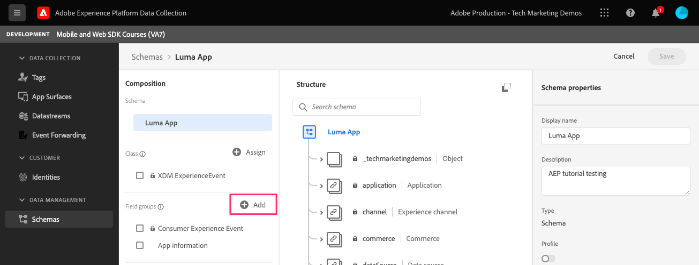

# Dados de ciclo de vida

Saiba como coletar dados de ciclo de vida em um aplicativo móvel.

A extensão Adobe Experience Platform Mobile SDK Lifecycle habilita os dados do ciclo de vida da coleta no aplicativo móvel. A extensão Rede de borda do Adobe Experience Platform envia esses dados de ciclo de vida para a Rede de borda da plataforma, onde são encaminhados para outros aplicativos e serviços de acordo com a configuração do conjunto de dados. Saiba mais sobre o [Extensão do Lifecycle](https://aep-sdks.gitbook.io/docs/foundation-extensions/lifecycle-for-edge-network) na documentação do produto.


## Pré-requisitos

* Aplicativo criado e executado com êxito com SDKs instalados e configurados.
* SDK de controle importado.

   ```swift
   import AEPAssurance
   ```

* Registrada a extensão Assurance conforme descrito no [lição anterior](install-sdks.md).

## Objetivos de aprendizagem

Nesta lição, você:

* Adicione o grupo de campos do ciclo de vida ao esquema .
* Ative medições de ciclo de vida precisas iniciando/pausando corretamente à medida que o aplicativo se move entre o primeiro e o segundo plano.
* Envie dados do aplicativo para a Rede de borda da plataforma.
* Validar no Controle.

## Adicionar grupo de campos de ciclo de vida ao esquema

O grupo de campos Evento de experiência do consumidor que você adicionou ao [lição anterior](create-schema.md) O já contém os campos de ciclo de vida, para que você possa ignorar esta etapa. Se você não usar o grupo de campos Evento de experiência do consumidor em seu próprio aplicativo, poderá adicionar os campos de ciclo de vida fazendo o seguinte:

1. Navegue até a interface do schema conforme descrito na [lição anterior](create-schema.md).
1. Abra o schema &quot;Luma App&quot; e selecione **[!UICONTROL Adicionar]**.
   
1. Na barra de pesquisa, digite &quot;ciclo de vida&quot;.
1. Marque a caixa de seleção ao lado de **[!UICONTROL Detalhes do ciclo de vida do AEP Mobile]**.
1. Selecionar **[!UICONTROL Adicionar grupos de campos]**.
   
1. Selecione **[!UICONTROL Salvar]**.
   


## Alterações de implementação

Agora você pode atualizar `AppDelegate.swift` para registrar os eventos do ciclo de vida:

1. Quando iniciado, se o aplicativo estiver retomando de um estado em segundo plano, a iOS poderá chamar sua função `applicationWillEnterForeground:` método delegado. Add `lifecycleStart:`

   ```swift
   MobileCore.lifecycleStart(additionalContextData: nil)
   ```

1. Quando o aplicativo entrar em segundo plano, pause a coleta de dados do ciclo de vida no `applicationDidEnterBackground:` método delegado.

   ```swift
   MobileCore.lifecyclePause()
   ```

>[!NOTE]
>
>Para o iOS 13 e posterior, revise a [documentação](https://aep-sdks.gitbook.io/docs/foundation-extensions/mobile-core/lifecycle#register-lifecycle-with-mobile-core-and-add-appropriate-start-pause-calls) para um código ligeiramente diferente.

## Validar com Controle de Controle

1. Revise o [instruções de configuração](assurance.md) e conecte seu simulador ou dispositivo ao Controle.
1. Inicie o aplicativo.
1. Envie o aplicativo para o segundo plano. Verificar `LifecyclePause`.
1. Traga o aplicativo para o primeiro plano. Verificar `LifecycleResume`.
   


## Encaminhar dados para a rede de borda da plataforma

O exercício anterior envia os eventos em primeiro e segundo plano para o SDK móvel. Para enviar esses eventos para a Platform Edge Network, siga as etapas listadas [here](https://aep-sdks.gitbook.io/docs/foundation-extensions/lifecycle-for-edge-network#configure-a-rule-to-forward-lifecycle-metrics-to-platform). Depois que os eventos forem enviados para a Rede de borda da plataforma, eles serão encaminhados para outros aplicativos e serviços de acordo com a configuração do conjunto de dados.

Depois de adicionar a regra para enviar os eventos de ciclo de vida para a Rede de borda da plataforma, você deve ver `Application Close (Background)` e `Application Launch (Foreground)` eventos contendo dados XDM no Assurance.


Próximo: **[Rastrear eventos](events.md)**

>[!NOTE]
>
>Obrigado por investir seu tempo em aprender sobre o Adobe Experience Platform Mobile SDK. Em caso de dúvidas, desejo compartilhar comentários gerais ou ter sugestões sobre conteúdo futuro, compartilhe-as sobre isso [Posto de discussão da comunidade do Experience League](https://experienceleaguecommunities.adobe.com/t5/adobe-experience-platform-launch/tutorial-discussion-implement-adobe-experience-cloud-in-mobile/td-p/443796)