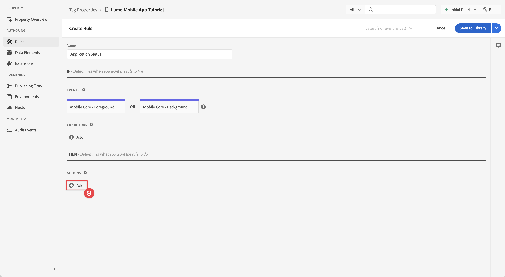

# Coletar dados do ciclo de vida

Saiba como coletar dados do ciclo de vida em um aplicativo móvel.

A extensão Adobe Experience Platform Mobile SDK Lifecycle permite a coleta de dados do ciclo de vida do aplicativo móvel. A extensão do Adobe Experience Platform Edge Network envia esses dados do ciclo de vida para a Platform Edge Network, onde são encaminhados para outros aplicativos e serviços de acordo com a configuração do fluxo de dados. Saiba mais sobre a [extensão do Lifecycle](https://developer.adobe.com/client-sdks/documentation/lifecycle-for-edge-network/) na documentação do produto.


## Pré-requisitos

* O aplicativo com SDKs instalados e configurados foi criado e executado com sucesso. Como parte desta lição, você já iniciou o monitoramento do ciclo de vida. Consulte [Instalar SDKs - Atualizar AppDelegate](install-sdks.md#update-appdelegate) para analisar.
* Registrada a extensão do Assurance conforme descrito na [lição anterior](install-sdks.md).

## Objetivos de aprendizagem

Nesta lição, você vai:

<!--
* Add lifecycle field group to the schema.
* -->
* Ative métricas de ciclo de vida precisas iniciando/pausando corretamente à medida que o aplicativo se move entre o primeiro e o segundo plano.
* Envie dados do aplicativo para a Platform Edge Network.
* Validar no Assurance.

<!--
## Add lifecycle field group to schema

The Consumer Experience Event field group you added in the [previous lesson](create-schema.md) already contains the lifecycle fields, so you can skip this step. If you don't use Consumer Experience Event field group in your own app, you can add the lifecycle fields by doing the following:

1. Navigate to the schema interface as described in the [previous lesson](create-schema.md).
1. Open the **Luma Mobile App Event Schema** schema and select **[!UICONTROL Add]** next to Field groups.
    {zoomable="yes"}
1. In the search bar, enter "lifecycle".
1. Select the checkbox next to **[!UICONTROL AEP Mobile Lifecycle Details]**.
1. Select **[!UICONTROL Add field groups]**.
    {zoomable="yes"}
1. Select **[!UICONTROL Save]**.
    {zoomable="yes"}
-->

## Alterações de implementação

Agora, você pode atualizar seu projeto para registrar os eventos de ciclo de vida.

>[!BEGINTABS]

>[!TAB iOS]

1. Navegue até **[!DNL Luma]** > **[!DNL Luma]** > **[!UICONTROL SceneDelegate]** no navegador de projetos Xcode.

1. Quando iniciado, se o aplicativo estiver retomando a partir de um estado em segundo plano, a iOS pode chamar o método delegado `sceneWillEnterForeground:` e esse método é onde você deseja acionar um evento de início de ciclo de vida. Adicionar este código a `func sceneWillEnterForeground(_ scene: UIScene)`:

   ```swift
   // When in foreground start lifecycle data collection
   MobileCore.lifecycleStart(additionalContextData: nil)
   ```

1. Quando o aplicativo entra em segundo plano, você deseja pausar a coleta de dados do ciclo de vida do método delegado `sceneDidEnterBackground:` do aplicativo. Adicionar este código a `func sceneDidEnterBackground(_ scene: UIScene)`:

   ```swift
   // When in background pause lifecycle data collection
   MobileCore.lifecyclePause()
   ```

>[!TAB Android]

1. Navegue até **[!UICONTROL app]** > **[!UICONTROL kotlin+java]** > **[!UICONTROL com.adobe.luma.tutorial.android]** > **[!UICONTROL LumaApplication]** no navegador do Android Studio.

1. Quando iniciado, se o aplicativo estiver retomando a partir de um estado em segundo plano, o Android poderá chamar sua substituição `fun onActivityResumed function` e esta função é onde você deseja acionar um evento de início de ciclo de vida. Adicionar este código a `override fun onActivityResumed(activity: Activity)`:

   ```kotlin
   // When in foreground start lifecycle data collection
   MobileCore.lifecycleStart(null)
   ```

1. Quando o aplicativo entra em segundo plano, você deseja pausar a coleção de dados do ciclo de vida da função `override fun onActivityPaused` do aplicativo. Adicionar este código a `override fun onActivityPaused(activity: Activity)`:

   ```kotlin
   // When in background pause lifecycle data collection
   MobileCore.lifecyclePause()
   ```

>[!ENDTABS]


## Validar com o Assurance

1. Revise a seção [instruções de instalação](assurance.md#connecting-to-a-session) para conectar seu simulador ou dispositivo ao Assurance.
1. Envie o aplicativo para o plano de fundo. Verifique eventos **[!UICONTROL LifecyclePause]** na interface do usuário do Assurance.
1. Coloque o aplicativo em primeiro plano. Verifique se há eventos **[!UICONTROL LifecycleResume]** na interface do usuário do Assurance.
   {zoomable="yes"}


## Encaminhar dados para o Platform Edge Network

O exercício anterior despacha os eventos em primeiro e segundo plano para o Adobe Experience Platform Mobile SDK. Para encaminhar esses eventos ao Platform Edge Network:

1. Selecione **[!UICONTROL Regras]** na propriedade Tags.
   {zoomable="yes"}
1. Selecione **[!UICONTROL Build inicial]** como a biblioteca a ser usada.
1. Selecione **[!UICONTROL Criar Nova Regra]**.
   {zoomable="yes"}
1. Na tela **[!UICONTROL Criar Regra]**, digite `Application Status` para **[!UICONTROL Nome]**.
1. Selecione  **[!UICONTROL Adicionar]** abaixo de **[!UICONTROL EVENTOS]**.
   {zoomable="yes"}
1. Na etapa **[!UICONTROL Configuração de Evento]**:
   1. Selecione **[!UICONTROL Mobile Core]** como a **[!UICONTROL Extensão]**.
   1. Selecione **[!UICONTROL Primeiro Plano]** como o **[!UICONTROL Tipo de Evento]**.
   1. Selecione **[!UICONTROL Manter alterações]**.
      {zoomable="yes"}
1. De volta à tela **[!UICONTROL Criar regra]**, selecione  **[!UICONTROL Adicionar]** ao lado de **[!UICONTROL Núcleo do dispositivo móvel - Primeiro plano]**.
   {zoomable="yes"}
1. Na etapa **[!UICONTROL Configuração de Evento]**:
   1. Selecione **[!UICONTROL Mobile Core]** como a **[!UICONTROL Extensão]**.
   1. Selecione **[!UICONTROL Plano de Fundo]** como o **[!UICONTROL Tipo de Evento]**.
   1. Selecione **[!UICONTROL Manter alterações]**.
      {zoomable="yes"}
1. De volta à tela **[!UICONTROL Criar regra]**, selecione  **[!UICONTROL Adicionar]** abaixo de **[!UICONTROL AÇÕES]**.

   {zoomable="yes"}

1. Na etapa **[!UICONTROL Configuração de ação]**:
   1. Selecione **[!UICONTROL Adobe Experience Edge Network]** como a **[!UICONTROL Extensão]**.
   1. Selecione **[!UICONTROL Encaminhar evento para Edge Network]** como o **[!UICONTROL Tipo de Ação]**.
   1. Selecione **[!UICONTROL Manter alterações]**.
      {zoomable="yes"}
1. Selecione **[!UICONTROL Salvar na biblioteca]**.
   {zoomable="yes"}
1. Selecione **[!UICONTROL Build]** para recompilar a biblioteca.
   {zoomable="yes"}

Depois de criar a propriedade com êxito, os eventos são enviados para o Platform Edge Network e são encaminhados para outros aplicativos e serviços de acordo com a configuração da sequência de dados.

Você deve ver **[!UICONTROL eventos de Fechamento de Aplicativo (Plano de Fundo)]** e **[!UICONTROL Inicialização de Aplicativo (Primeiro Plano)]** contendo dados XDM no Assurance.

{zoomable="yes"}

>[!SUCCESS]
>
>Agora você configurou o aplicativo para enviar eventos de estado do aplicativo (primeiro plano, segundo plano) para a Adobe Experience Platform Edge Network e todos os serviços definidos na sequência de dados.
>
> Obrigado por investir seu tempo aprendendo sobre o Adobe Experience Platform Mobile SDK. Se tiver dúvidas, quiser compartilhar comentários gerais ou tiver sugestões sobre conteúdo futuro, compartilhe-os nesta [postagem de discussão da Comunidade Experience League](https://experienceleaguecommunities.adobe.com/t5/adobe-experience-platform-data/tutorial-discussion-implement-adobe-experience-cloud-in-mobile/td-p/443796)

Próximo: **[Rastrear dados do evento](events.md)**
