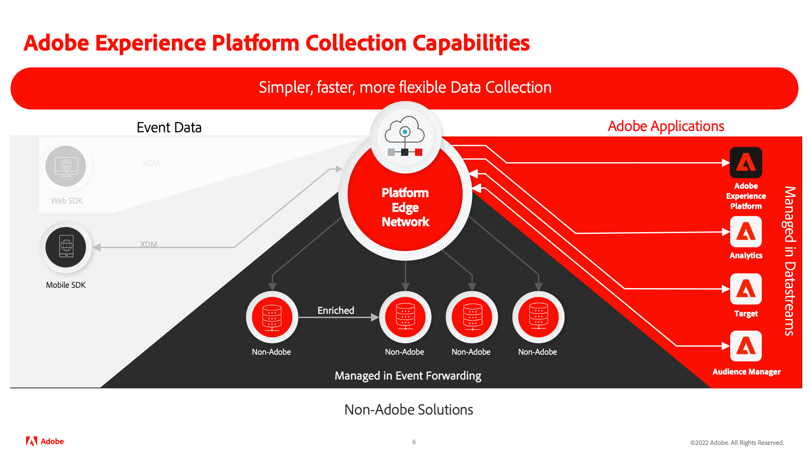

# Tutorial Implementar a Adobe Experience Cloud em aplicativos para dispositivos móveis

Saiba como implementar aplicativos da Adobe Experience Cloud em seu aplicativo para dispositivos móveis usando o SDK móvel da Adobe Experience Platform.

O Experience Platform Mobile SDK é um SDK do lado do cliente que permite que os clientes do Adobe Experience Cloud interajam com aplicativos Adobe e serviços de terceiros por meio da Rede de borda Adobe Experience Platform. Consulte a [Documentação do SDK do Adobe Experience Platform Mobile](https://aep-sdks.gitbook.io/docs/) para obter informações mais detalhadas.

Este tutorial o orienta pela implementação do SDK do Platform Mobile em um aplicativo de varejo de amostra chamado Luma. O [Aplicativo Luma](https://github.com/Adobe-Marketing-Cloud/Luma-iOS-Mobile-App) O tem uma funcionalidade que permite criar uma implementação realista. Após concluir este tutorial, você deve estar pronto para começar a implementar todas as suas soluções de marketing por meio do SDK do Platform Mobile em seus próprios aplicativos móveis.

As lições são projetadas para iOS e escritas em Swift, mas muitos dos conceitos também se aplicam ao Android™.

Após concluir este tutorial, você poderá:

* Crie um schema usando grupos de campos padrão e personalizados.
* Configurar um armazenamento de dados.
* Configure uma propriedade de tag móvel.
* Configure um conjunto de dados do Experience Platform (opcional).
* Instale e implemente extensões de tags em um aplicativo.
* Adicione os seguintes aplicativos/extensões do Adobe Experience Cloud:
   * [Adobe Experience Platform Edge (XDM)](events.md)
   * [Coleta de dados do ciclo de vida](lifecycle-data.md)
   * [Adobe Analytics via XDM](analytics.md)
   * [Consentimento](consent.md)
   * [Identidade](identity.md)
   * [Perfil](profile.md)
   * [Adobe Experience Platform](platform.md)
   * [Mensagens por push com Journey Optimizer](journey-optimizer-push.md)
* Transmitir corretamente os parâmetros de Experience Cloud para um [webview](web-views.md).
* Validar a implementação usando [Adobe Experience Platform Assurance](assurance.md).

>[!NOTE]
>
>Um tutorial de várias soluções semelhante está disponível para [Web SDK](../tutorial-web-sdk/overview.md).

## Pré-requisitos

Nessas lições, presume-se que você tenha uma Adobe ID e as permissões necessárias para concluir os exercícios. Caso contrário, entre em contato com o administrador do Adobe para solicitar acesso.

* Na Coleta de dados, você deve ter:
   * **[!UICONTROL Plataformas]**—item de permissão **[!UICONTROL Celular]**
   * **[!UICONTROL Direitos de propriedade]**—itens de permissão para **[!UICONTROL Desenvolver]**, **[!UICONTROL Aprovar]**, **[!UICONTROL Publicar]**, **[!UICONTROL Gerenciar extensões]** e **[!UICONTROL Gerenciar ambientes]**.
   * **[!UICONTROL Direitos da empresa]**—itens de permissão para **[!UICONTROL Gerenciar propriedades]** e, se concluir a lição opcional de mensagens por push, **[!UICONTROL Gerenciar configurações do aplicativo]**

      Para obter mais informações sobre permissões de tag, consulte [Permissões do usuário para tags](https://experienceleague.adobe.com/docs/experience-platform/tags/admin/user-permissions.html?lang=pt-BR){target=&quot;_blank&quot;} na documentação do produto.
* No Experience Platform, você deve ter:
   * **[!UICONTROL Modelagem de dados]**—itens de permissão para gerenciar e visualizar esquemas.
   * **[!UICONTROL Identity Management]**—itens de permissão para gerenciar e exibir namespaces de identidade.
   * **[!UICONTROL Coleta de dados]**—itens de permissão para gerenciar e visualizar conjuntos de dados.

   * Se você for o cliente de um aplicativo baseado em plataforma como o Real-Time CDP, Journey Optimizer ou Customer Journey Analytics, também deverá ter:
      * **[!UICONTROL Gerenciamento de dados]**—itens de permissão para gerenciar e exibir conjuntos de dados para concluir o _exercícios opcionais da plataforma_ (requer uma licença para um aplicativo baseado em plataforma ).
      * Um desenvolvimento **sandbox** que você pode usar para este tutorial.
* Para o Adobe Analytics, você deve saber qual **conjuntos de relatórios** você pode usar para concluir este tutorial.

Todos os clientes do Experience Cloud devem ter acesso aos recursos necessários para implantar o Mobile SDK.

Além disso, presume-se que você esteja familiarizado com [!DNL Swift]. Não é necessário ser um especialista para concluir as lições, mas você extrairá mais delas se ler e entender o código confortavelmente.

## Baixe o aplicativo Luma

Duas versões do aplicativo de amostra estão disponíveis para download.

1. [Empty](https://github.com/Adobe-Marketing-Cloud/Luma-iOS-Mobile-App){target=&quot;_blank&quot;} - versão sem nenhum código de Experience Cloud para concluir os exercícios práticos neste tutorial
1. [Implementado totalmente](https://github.com/Adobe-Marketing-Cloud/Luma-iOS-Mobile-App){target=&quot;_blank&quot;} - versão com implementação de Experience Cloud completa para referência.

Vamos começar!

Próximo: **[Criar um esquema XDM](create-schema.md)**

>[!NOTE]
>
>Obrigado por investir seu tempo em aprender sobre o Adobe Experience Platform Mobile SDK. Em caso de dúvidas, desejo compartilhar comentários gerais ou ter sugestões sobre conteúdo futuro, compartilhe-as sobre isso [Posto de discussão da comunidade do Experience League](https://experienceleaguecommunities.adobe.com/t5/adobe-experience-platform-launch/tutorial-discussion-implement-adobe-experience-cloud-in-mobile/td-p/443796)