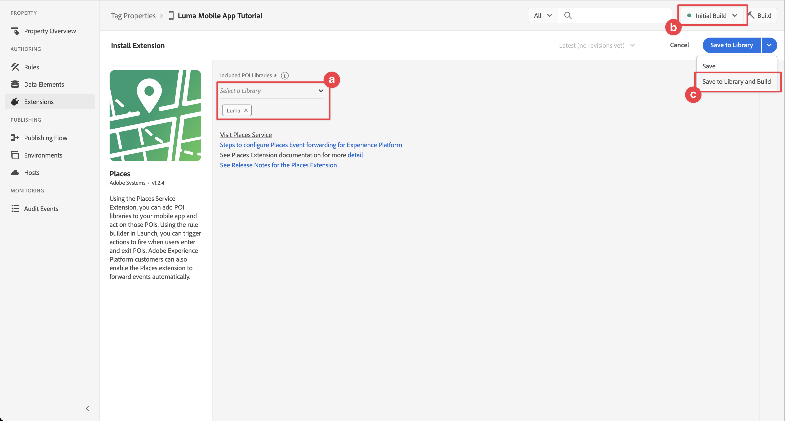
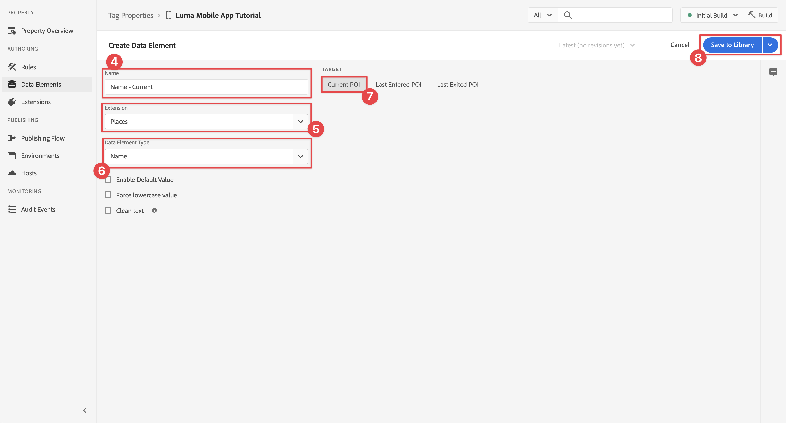

# Usar locais

Saiba como usar o serviço de geolocalização do Places em seu aplicativo.

O Serviço de locais de coleta de dados da Adobe Experience Platform é um serviço de geolocalização que permite que aplicativos móveis com percepção de localização compreendam o contexto de localização. O serviço está usando interfaces avançadas e fáceis de usar do SDK acompanhadas por um banco de dados flexível de pontos de interesse (POIs).

## Pré-requisitos

* Todas as dependências de pacote estão em vigor no projeto Xcode.
* Extensões registradas no AppDelegate.
* MobileCore configurado para usar appId de desenvolvimento.
* SDKs importados.
* O aplicativo foi criado e executado com sucesso com as alterações acima.

## Objetivos de aprendizagem

Nesta lição, você

* Entenda como definir pontos de interesse no serviço Places.
* Atualize a propriedade da tag com a extensão Places.
* Atualize seu esquema para capturar eventos de localização geográfica.
* Validar configuração no Assurance.
* Atualize seu aplicativo para registrar a extensão Places.
* Implemente o rastreamento de localização geográfica do serviço Places em seu aplicativo.


## Configurar

Para que o serviço Places funcione no aplicativo e no SDK móvel, é necessário fazer algumas configurações.

### Definir locais

Você define alguns pontos de interesse no serviço Places.

1. Na interface da Coleção de Dados, selecione **[!UICONTROL Places]**.
1. Selecione .
1. No menu de contexto, selecione **[!UICONTROL Gerenciar Bibliotecas]**.
   {zoomable="yes"}
1. Na caixa de diálogo **[!UICONTROL Gerenciar Bibliotecas]**, selecione **[!UICONTROL Novo]**.
1. Na caixa de diálogo **[!UICONTROL Criar Biblioteca]**, digite um **[!UICONTROL Nome]**, por exemplo `Luma`.
1. Selecione **[!UICONTROL Confirmar]**.
   {zoomable="yes"}
1. Para fechar a caixa de diálogo **[!UICONTROL Gerenciar Bibliotecas]**, selecione **[!UICONTROL Fechar]**.
1. De volta ao **[!UICONTROL Gerenciamento de POI]**, selecione **[!UICONTROL Importar POIs]**.
1. Selecione **[!UICONTROL Iniciar]** na caixa de diálogo **[!UICONTROL Importar Locais]**.
1. Selecione **[!DNL Luma]** na lista de bibliotecas,
1. Selecione **[!UICONTROL Próximo]**.
   {zoomable="yes"}
1. Baixe o [arquivo ZIP de POIs Luma](assets/luma_pois.csv.zip) e extraia-o para um local no seu computador.
1. Na caixa de diálogo **[!UICONTROL Importar Locais]**, arraste e solte o arquivo `luma_pois.csv` extraído em **[!UICONTROL Escolher Arquivo CSV - Arraste e solte seu Arquivo]**. Você deve ver o **[!UICONTROL Sucesso de Validação]** - **[!UICONTROL Arquivo CSV validado com êxito]**.
1. Selecione **[!UICONTROL Iniciar Importação]**. Você deve ver **[!UICONTROL Sucesso]** - **[!UICONTROL Novos POIs adicionados com êxito]**.
1. Selecione **[!UICONTROL Concluído]**.
1. Em **[!UICONTROL Gerenciamento de POI]**, você deve ver que seis novas lojas Luma são adicionadas à lista. Você pode alternar entre a lista  e a exibição de mapa .
   {zoomable="yes"}.


### Instalar a extensão Places

1. Navegue até **[!UICONTROL Tags]**, localize sua propriedade de tag móvel e abra a propriedade.
1. Selecione **[!UICONTROL Extensões]**.
1. Selecione **[!UICONTROL Catálogo]**.
1. Procure a extensão **[!UICONTROL Places]**.
1. Instale a extensão.

   

1. Na caixa de diálogo **[!UICONTROL Instalar Extensão]**:
   1. Selecione **[!DNL Luma]** na lista **[!UICONTROL Selecionar uma Biblioteca]**.
   1. Verifique se você escolheu sua biblioteca de trabalho, por exemplo **[!UICONTROL Compilação Inicial]**.
   1. Selecione **[!UICONTROL Salvar na Biblioteca e Criar]** em **[!UICONTROL Salvar na Biblioteca]**.
      {zoomable="yes"}.

1. Sua biblioteca foi recriada.


### Verifique seu esquema

Verifique se o esquema, conforme definido em [Criar esquema](create-schema.md), incorpora os grupos de campos e classes necessários para coletar dados de POI e geolocalização.

1. Navegue até a interface Coleção de dados e selecione **[!UICONTROL Esquemas]** no painel esquerdo.
1. Selecione **[!UICONTROL Procurar]** na barra superior.
1. Selecione seu esquema para abri-lo.
1. No editor de esquema, selecione **[!UICONTROL Evento de experiência do consumidor]**.
1. Você vê um objeto **[!UICONTROL placeContext]** com objeto e campos para capturar dados de interação e geolocalização de POI.
   {zoomable="yes"}.


### Atualizar a propriedade da tag

A extensão Places para tags fornece funcionalidade para monitorar eventos de geolocalização e permite acionar ações com base nesses eventos. Você pode usar essa funcionalidade para minimizar a codificação da API que deve ser implementada no aplicativo.

**Elementos de dados**

Primeiro, você cria vários elementos de dados.

1. Vá para a propriedade da tag na interface da Coleção de dados.
1. Selecione **[!UICONTROL Elementos de dados]** no painel esquerdo.
1. Selecione **[!UICONTROL Adicionar Elemento de Dados]**.
1. Na tela **[!UICONTROL Criar Elemento de Dados]**, digite um nome, por exemplo `Name - Entered`.
1. Selecione **[!UICONTROL Locais]** na lista **[!UICONTROL Extensão]**.
1. Selecione **[!UICONTROL Nome]** na lista **[!UICONTROL Tipo de Elemento de Dados]**.
1. Selecione o **[!UICONTROL POI atual]** abaixo do **[!UICONTROL TARGET]**.
1. Selecione **[!UICONTROL Salvar na biblioteca]**.
   {zoomable="yes"}

1. Repita as etapas 4 a 8 usando as informações da tabela abaixo para criar elementos de dados adicionais.

   | Nome | Extensão | Tipo de elemento de dados | TARGET |
   |---|---|---|---|
   | `Name - Exited` | Places | Nome | Último POI de saída |
   | `Category - Current` | Places | Categoria | POI atual |
   | `Category - Exited` | Places | Categoria | Último POI de saída |
   | `City - Current` | Places | Cidade | POI atual |
   | `City - Exited` | Places | Cidade | Último POI de saída |

   Você deve ter a seguinte lista de Elementos de dados.

   {zoomable="yes"}

**Regras**

Em seguida, você definirá regras para trabalhar com esses elementos de dados.

1. Na propriedade da marca, selecione **[!UICONTROL Regras]** no painel esquerdo.
1. Selecione **[!UICONTROL Adicionar Regra]**.
1. Na tela **[!UICONTROL Criar Regra]**, digite um nome para a regra, por exemplo `POI - Entry`.
1. Selecione  abaixo de **[!UICONTROL EVENTS]**.
   1. Selecione **[!UICONTROL Places]** da lista **[!UICONTROL Extension]** e selecione **[!UICONTROL Enter POI]** da lista **[!UICONTROL Event Type]**.
   1. Selecione **[!UICONTROL Manter alterações]**.
      .
1. Selecione  abaixo de **[!UICONTROL AÇÕES]**.
   1. Selecione **[!UICONTROL Mobile Core]** na lista **[!UICONTROL Extension]**, selecione **[!UICONTROL Attach Data]** no **[!UICONTROL Action Type]** da lista. Esta ação anexa dados de carga.
   1. Na **[!UICONTROL Carga JSON]**, cole a seguinte carga:

      ```json
      {
          "xdm": {
              "eventType": "location.entry",
              "placeContext": {
                  "geo": {
                      "city": "{%%City - Current%%}"
                  },
                  "POIinteraction": {
                      "poiDetail": {
                          "name": "{%%Name - Current%%}",
                          "category": "{%%Category - Current%%}"
                      },
                      "poiEntries": {
                          "value": 1
                      }
                  }
              }
          }
      }
      ```

      Você também pode inserir `{%% ... %%}` valores de espaço reservado do elemento de dados no JSON selecionando os . Uma caixa de diálogo pop-up permite que você escolha qualquer elemento de dados criado.

   1. Selecione **[!UICONTROL Manter alterações]**.
      {zoomable="yes"}

1. Selecione  ao lado da ação **[!UICONTROL Mobile Core - Anexar dados]**.
   1. Selecione **[!UICONTROL Adobe Experience Platform Edge Network]** na lista **[!UICONTROL Extension]** e selecione **[!UICONTROL Encaminhar evento para o Edge Network]**. Essa ação garante que o evento e os dados de payload adicionais sejam encaminhados para o Platform Edge Network.
   1. Selecione **[!UICONTROL Manter alterações]**.

1. Para salvar a regra, selecione **[!UICONTROL Salvar na biblioteca]**.

   {zoomable="yes"}

Vamos criar outra regra

1. Na tela **[!UICONTROL Criar Regra]**, digite um nome para a regra, por exemplo `POI - Exit`.
1. Selecione  abaixo de **[!UICONTROL EVENTS]**.
   1. Selecione **[!UICONTROL Places]** da lista **[!UICONTROL Extension]** e selecione **[!UICONTROL Exit POI]** da lista **[!UICONTROL Event Type]**.
   1. Selecione **[!UICONTROL Manter alterações]**.
1. Selecione  abaixo de **[!UICONTROL AÇÕES]**.
   1. Selecione **[!UICONTROL Mobile Core]** da lista **[!UICONTROL Extension]**, selecione **[!UICONTROL Attach Data]** da lista **[!UICONTROL Action Type]**.
   1. Na **[!UICONTROL Carga JSON]**, cole a seguinte carga:

      ```json
      {
          "xdm": {
              "eventType": "location.exit",
              "placeContext": {
                  "geo": {
                      "city": "{%%City - Exited%%}"
                  },
                  "POIinteraction": {
                      "poiExits": {
                          "value": 1
                      },
                      "poiDetail": {
                          "name": "{%%Name - Exited%%}",
                          "category": "{%%Category - Exited%%}"
                      }
                  }
              }
          }
      }
      ```

   1. Selecione **[!UICONTROL Manter alterações]**.

1. Selecione  ao lado da ação **[!UICONTROL Mobile Core - Anexar dados]**.
   1. Selecione **[!UICONTROL Adobe Experience Platform Edge Network]** na lista **[!UICONTROL Extension]** e selecione **[!UICONTROL Encaminhar evento para o Edge Network]**.
   1. Selecione **[!UICONTROL Manter alterações]**.

1. Para salvar a regra, selecione **[!UICONTROL Salvar na biblioteca]**.

   {zoomable="yes"}


Para garantir que todas as alterações em sua tag sejam publicadas

1. Selecione **[!UICONTROL Build inicial]** como a biblioteca a ser compilada.
1. Selecione **[!UICONTROL Build]**.
   {zoomable="yes"}


## Validar configuração no Assurance

Para validar a configuração no Assurance:

1. Vá para a interface do Assurance.
1. Se ainda não estiver disponível no painel à esquerda, selecione **[!UICONTROL Configurar]** no painel à esquerda e selecione  ao lado de **[!UICONTROL Eventos]** e **[!UICONTROL Mapear e simular]** abaixo de **[!UICONTROL PLACES SERVICE]**.
1. Selecione **[!UICONTROL Salvar]**.
1. Selecione **[!UICONTROL Mapear e simular]** no painel esquerdo.
1. Mova o mapa para um local de um de seus POIs.
1. Selecione  para simular POIs de carga. Seu POI é identificado usando um círculo e um pino.
1. Selecione seu POI.
1. No pop-up, selecione  **[!UICONTROL Simular evento de entrada]**.

   {zoomable="yes"}

1. Selecione **[!UICONTROL Eventos]** no painel esquerdo e você deverá ver os eventos que simulou.

   {zoomable="yes"}


## Implementar o Places no aplicativo

Conforme discutido nas lições anteriores, a instalação de uma extensão de tag móvel fornece apenas a configuração. Em seguida, você deve instalar e registrar o Places SDK. Se essas etapas não estiverem claras, reveja a seção [Instalar SDKs](install-sdks.md).

>[!NOTE]
>
>Se você concluiu a seção [Instalar SDKs](install-sdks.md), o Places SDK já está instalado e você pode ignorar essa etapa.
>

>[!IMPORTANT]
>
>Configurar o Mapas SDK para Android no seu aplicativo requer que você configure a cobrança como seus custos incorridos com o uso. É possível limitar os custos usando a ID exclusiva do aplicativo e uma chave SHA-1. Para obter mais detalhes, consulte [Mapear SDK para Android](https://developers.google.com/maps/documentation/android-sdk/overview). Se você não quiser configurar o faturamento ou incorrer custos, ignore esta lição.

>[!BEGINTABS]

>[!TAB iOS]

1. No Xcode, verifique se [AEP Places](https://github.com/adobe/aepsdk-places-ios) foi adicionado à lista de pacotes nas dependências de pacotes. Consulte [Gerenciador de pacotes do Swift](install-sdks.md#swift-package-manager).
1. Navegue até **[!DNL Luma]** > **[!DNL Luma]** > **[!DNL AppDelegate]** no navegador de projetos Xcode.
1. Certifique-se de que `AEPPlaces` faça parte da sua lista de importações.

   ```swift
   import AEPPlaces
   ```

1. Verifique se `Places.self` faz parte da matriz de extensões que você está registrando.

   ```swift
   let extensions = [
       AEPIdentity.Identity.self,
       Lifecycle.self,
       Signal.self,
       Edge.self,
       AEPEdgeIdentity.Identity.self,
       Consent.self,
       UserProfile.self,
       Places.self,
       Messaging.self,
       Optimize.self,
       Assurance.self
   ]
   ```

1. Navegue até **[!DNL Luma]** > **[!DNL Luma]** > **[!DNL Utils]** > **[!UICONTROL MobileSDK]** no navegador do Projeto Xcode e localize a função `func processRegionEvent(regionEvent: PlacesRegionEvent, forRegion region: CLRegion) async`. Adicione o seguinte código:

   ```swift
   // Process geolocation event
   Places.processRegionEvent(regionEvent, forRegion: region)
   ```

   Esta API [`Places.processRegionEvent`](https://developer.adobe.com/client-sdks/documentation/places/api-reference/#processregionevent) comunica as informações de geolocalização ao serviço Places.

1. Navegue até **[!DNL Luma]** > **[!DNL Luma]** > **[!DNL Views]** > **[!DNL Location]** > **[!DNL GeofenceSheet]** no navegador de projetos do Xcode.

   1. Para o botão Entrada, informe o seguinte código:

      ```swift
      // Simulate geofence entry event
      Task {
          await MobileSDK.shared.processRegionEvent(regionEvent: .entry, forRegion: region)
      }
      ```

   1. Para o botão Sair, insira o seguinte código:

      ```swift
      // Simulate geofence exit event
      Task {
          await MobileSDK.shared.processRegionEvent(regionEvent: .exit, forRegion: region)
      }
      ```

>[!TAB Android]

1. No Android Studio, verifique se [aepsdk-places-android](https://github.com/adobe/aepsdk-places-android) faz parte das dependências no **[!UICONTROL build.gradle.kts (Módulo :app)]** no **[!UICONTROL Android]**  **[!UICONTROL Gradle Scripts]**. Consulte [Gradle](install-sdks.md#gradle).
1. Navegue até **[!UICONTROL Android]**  > **[!DNL app]** > **[!DNL kotlin+java]** > **[!UICONTROL com.adobe.luma.tutorial.android]** > **[!UICONTROL LumaApplication]** no navegador de projetos do Android Studio.
1. Certifique-se de que `com.adobe.marketing.mobile.Messaging` faça parte da sua lista de importações.

   `import import com.adobe.marketing.mobile.Places`

1. Verifique se `Places.EXTENSION` faz parte da matriz de extensões que você está registrando.

   ```kotlin
   val extensions = listOf(
       Identity.EXTENSION,
       Lifecycle.EXTENSION,
       Signal.EXTENSION,
       Edge.EXTENSION,
       Consent.EXTENSION,
       UserProfile.EXTENSION,
       Places.EXTENSION,
       Messaging.EXTENSION,
       Optimize.EXTENSION,
       Assurance.EXTENSION
   )
   ```

1. Navegue até **[!UICONTROL Android]**  > **[!DNL app]** > **[!DNL kotlin+java]** > **[!UICONTROL com.adobe.luma.tutorial.android]** > **[!UICONTROL models]** > **[!UICONTROL MobileSDK]** no navegador de projetos do Android Studio. Localize a função `suspend fun processGeofence(geofence: Geofence?, transitionType: Int)`. Adicione o seguinte código:

   ```kotlin
   // Process geolocation event
   Places.processGeofence(geofence, transitionType)
   ```

   Esta API [`Places.processRegionEvent`](https://developer.adobe.com/client-sdks/documentation/places/api-reference/#processregionevent) comunica as informações de geolocalização ao serviço Places.


1. Navegue até **[!UICONTROL Android]**  > **[!DNL app]** > **[!DNL kotlin+java]** > **[!UICONTROL com.adobe.luma.tutorial.android]** > **[!UICONTROL visualizações]** > **[!UICONTROL LocationView.k]** no navegador de projetos do Android Studio.

   1. Para o botão Entrada, informe o seguinte código:

      ```kotlin
      // Simulate geofence entry event
      coroutineScope.launch {
          MobileSDK.shared.processGeofence(
             region,
             Geofence.GEOFENCE_TRANSITION_ENTER
          )
      }
      ```

   1. Para o botão Sair, insira o seguinte código:

      ```kotlin
      // Simulate geofence entry event
      coroutineScope.launch {
          MobileSDK.shared.processGeofence(
              region,
              Geofence.GEOFENCE_TRANSITION_EXIT
          )
      }
      ```

>[!ENDTABS]

## Validar usando seu aplicativo

Para validar os recursos de geolocalização no seu aplicativo:

>[!BEGINTABS]

>[!TAB iOS]

1. Abra o aplicativo em um dispositivo ou no simulador.

1. Vá para a guia **[!UICONTROL Local]**.

1. Mova (arraste) o mapa para garantir que o círculo central azul esteja acima de um de seus POIs, por exemplo, Londres.

1. Toque  até que você veja a categoria e o nome que aparecem no rótulo no local vermelho com o pino.

1. Toque no rótulo do POI, que abre a folha **[!UICONTROL POI próximo]**.

   

1. Pressione os botões **[!UICONTROL Entrada]** ou **[!UICONTROL Saída]** para simular eventos de entrada e saída de geofence do aplicativo.

   

1. Você deve ver os eventos na interface do Assurance. Tanto em Eventos quanto em Eventos de serviço de locais.

>[!TAB Android]

1. Vá para a guia **[!UICONTROL Local]**.

1. Selecione **[!UICONTROL Usar e/ou Simular Geofences]**.

1. Toque em algum lugar dentro do círculo vermelho exibido.

   


1. Pressione os botões **[!UICONTROL Entrada]** ou **[!UICONTROL Saída]** para simular eventos de entrada e saída de geofence do aplicativo.

   

1. Você deve ver os eventos na interface do Assurance.


>[!ENDTABS]


## Próximas etapas

Agora você deve ter todas as ferramentas para começar a adicionar mais funcionalidade à funcionalidade de geolocalização no aplicativo. Depois de encaminhar os eventos para a Edge Network e configurar o aplicativo para o [Experience Platform](platform.md), você deverá ver os eventos de experiência que aparecem para o perfil usado no aplicativo.

Na seção Journey Optimizer deste tutorial, você vê que os eventos de experiência podem ser usados para acionar jornadas (consulte [notificação por push](journey-optimizer-inapp.md) e [mensagens no aplicativo](journey-optimizer-push.md) com o Journey Optimizer). Por exemplo, o exemplo usual de enviar ao usuário do aplicativo uma notificação por push com alguma promoção de produto quando esse usuário entra na cerca geográfica de uma loja física.

Essa implementação da funcionalidade de geolocalização para seu aplicativo está minimizando o código. O serviço Places, os elementos de dados e as regras definidos na propriedade de tag fornecem a maioria das funcionalidades. Como alternativa, você pode implementar a mesma funcionalidade diretamente no aplicativo usando a API [`Edge.sendEvent`](https://developer.adobe.com/client-sdks/documentation/edge-network/api-reference/#sendevent) (consulte [Eventos](events.md) para obter mais informações) com uma carga XDM contendo um objeto `placeContext` populado.

>[!SUCCESS]
>
>Agora você habilitou o aplicativo para serviços de geolocalização usando a extensão Places no Experience Platform Mobile SDK.
>
>Obrigado por investir seu tempo aprendendo sobre o Adobe Experience Platform Mobile SDK. Se tiver dúvidas, quiser compartilhar comentários gerais ou tiver sugestões sobre conteúdo futuro, compartilhe-os nesta [postagem de discussão da Comunidade Experience League](https://experienceleaguecommunities.adobe.com/t5/adobe-experience-platform-data/tutorial-discussion-implement-adobe-experience-cloud-in-mobile/td-p/443796).

Próximo: **[Mapear dados para o Adobe Analytics](analytics.md)**
