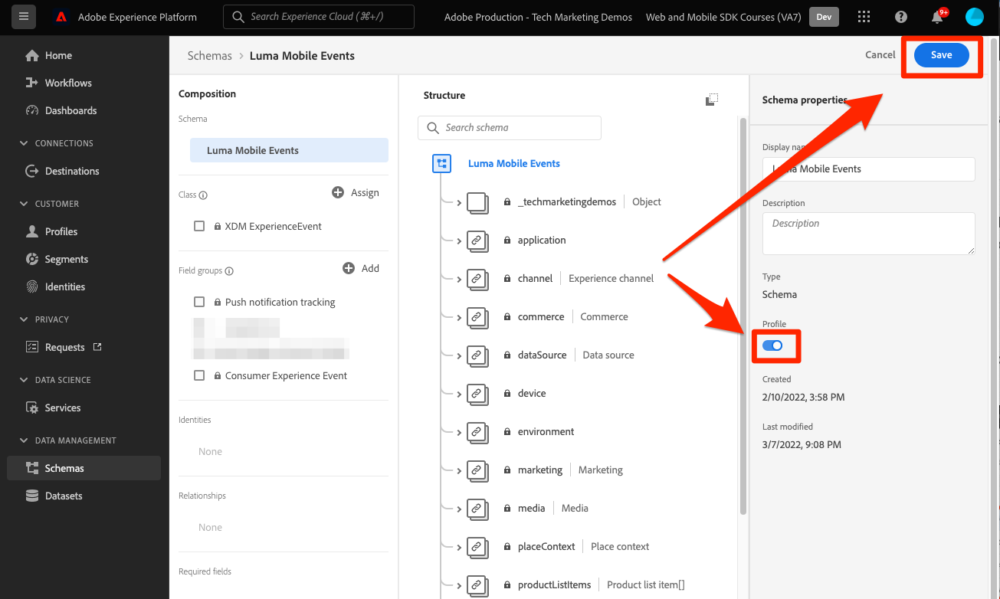

# Enviar dados para o Adobe Experience Platform

Saiba como enviar dados para o Adobe Experience Platform.

Esta lição opcional é relevante para todos os clientes do Real-time Customer Data Platform (CDP em tempo real), Journey Optimizer e Customer Journey Analytics. O Experience Platform, a base dos produtos de Experience Cloud, é um sistema aberto que transforma todos os seus dados — Adobe e não Adobe — em perfis robustos do cliente que são atualizados em tempo real e usa insights orientados por IA para ajudá-lo a fornecer as experiências certas em cada canal.

O [evento](events.md), [ciclo](lifecycle-data.md)e [identidade](identity.md) os dados coletados e enviados para a Rede de borda da plataforma em lições anteriores são encaminhados para os serviços configurados no conjunto de dados, incluindo o Adobe Experience Platform.

## Pré-requisitos

Sua organização deve ser provisionada e as permissões concedidas ao Adobe Experience Platform.

Se você não tiver acesso, poderá [ignorar esta lição](install-sdks.md).

## Objetivos de aprendizagem

Nesta lição, você:

* Crie um conjunto de dados do Experience Platform.
* Validar dados no conjunto de dados.
* Ative o esquema e o conjunto de dados para o Perfil do cliente em tempo real.
* Valide os dados no Perfil do cliente em tempo real.
* Valide os dados no gráfico de identidade.

## Criar um conjunto de dados

Todos os dados assimilados com êxito no Adobe Experience Platform são mantidos no lago de dados como conjuntos de dados. Um conjunto de dados é uma construção de armazenamento e gerenciamento para uma coleção de dados, normalmente uma tabela, que contém um esquema (colunas) e campos (linhas). Os conjuntos de dados também contêm metadados que descrevem vários aspectos dos dados armazenados. Consulte a [documentação](https://experienceleague.adobe.com/docs/experience-platform/catalog/datasets/overview.html?lang=pt-BR) para obter informações.

1. Navegue até a interface do Experience Platform selecionando-a no menu 3x3 na parte superior direita.
   

1. Selecionar **[!UICONTROL Conjuntos de dados]** no menu de navegação esquerdo.

1. **[!UICONTROL Criar conjunto de dados]**.
   

1. Selecionar **[!UICONTROL Criar conjunto de dados a partir do esquema]**.
   

1. Procure seu esquema e selecione .

1. Selecione **[!UICONTROL Próximo]**.
   

1. Forneça uma **[!UICONTROL Nome]**, **[!UICONTROL Descrição]** e selecione **[!UICONTROL Concluir]**.
   

## Atualizar o datastream

Depois de criar seu conjunto de dados, certifique-se de [atualizar seu conjunto de dados](create-datastream.md) para adicionar o Adobe Experience Platform. Essa atualização garante os fluxos de dados para a Platform.

## Validar dados no conjunto de dados

Agora que você criou um conjunto de dados e atualizou seu conjunto de dados para enviar dados para o Experience Platform, todos os dados XDM enviados para a Platform Edge Network são encaminhados para a Platform e chegam ao conjunto de dados.

Abra o aplicativo e navegue até as telas onde você está rastreando eventos. Também é possível acionar medições de ciclo de vida.

Abra o conjunto de dados na interface da plataforma. Você deve ver os dados que chegam em lotes para o conjunto de dados

Também é possível ver registros e campos de exemplo usando a variável **[!UICONTROL Visualizar conjunto de dados]** recurso:

Uma ferramenta mais robusta para validar dados é a [serviço de query](https://experienceleague.adobe.com/docs/platform-learn/tutorials/queries/explore-data.html?lang=pt-BR).

## Ativar o perfil do cliente em tempo real

Experience Platform para Perfil do cliente em tempo real permite criar uma visualização holística de cada cliente individual que combina dados de vários canais, online, offline, CRM e dados de terceiros. O Perfil permite consolidar seus diferentes dados do cliente em uma visualização unificada que oferece uma conta acionável com carimbo de data e hora de cada interação com o cliente.

### Ativar o esquema

1. Abra o esquema
1. Habilitar **[!UICONTROL Perfil]**
1. Selecionar **[!UICONTROL Os dados para esse schema conterão uma identidade primária no campo identityMap .]** no modal
1. **[!UICONTROL Salvar]** o schema

   

### Ativar o conjunto de dados

1. Abrir seu conjunto de dados
1. Habilitar **[!UICONTROL Perfil]**

   

### Validar dados no Perfil

Abra o aplicativo e navegue até as telas onde você está rastreando eventos. Faça logon no aplicativo Luma e faça uma compra.

Use o Assurance para localizar uma das identidades transmitidas no identityMap (Email, lumaCrmId ou ECID):

>[!TIP]
>
>   O valor da variável `lumaCrmId` é `112ca06ed53d3db37e4cea49cc45b71e`

Na interface da plataforma, navegue até **[!UICONTROL Perfis]** > **[!UICONTROL Procurar]**, procure o valor de identidade que acabou de capturar e abra o perfil:

No **[!UICONTROL Detalhe]** você pode ver informações básicas sobre o usuário, incluindo o **[!UICONTROL ** identidades vinculadas **]**:

No **[!UICONTROL Eventos]**, você pode ver os eventos coletados da implementação do aplicativo móvel para este usuário:

Na tela de detalhes do perfil, clique no link para exibir o gráfico de identidade ou navegue até **[!UICONTROL Identidades]** > **[!UICONTROL Gráfico de identidade]** e pesquise o valor da identidade. Esta visualização mostra todas as identidades vinculadas em um perfil e sua origem. Este é um exemplo de um gráfico de identidade construído com dados coletados ao concluir este tutorial do SDK móvel (fonte de dados 2) e o [Tutorial do SDK da Web](https://experienceleague.adobe.com/docs/platform-learn/implement-web-sdk/overview.html?lang=pt-BR) (Fonte de Dados 1):

Há muito mais que os profissionais de marketing e as análises podem fazer com dados capturados no Experience Platform, incluindo analisá-los no Customer Journey Analytics e criar segmentos no Real-time Customer Data Platform. Você está indo para um bom começo!

Próximo: **[Mensagens por push com Journey Optimizer](journey-optimizer-push.md)**

>[!NOTE]
>
>Obrigado por investir seu tempo em aprender sobre o Adobe Experience Platform Mobile SDK. Em caso de dúvidas, desejo compartilhar comentários gerais ou ter sugestões sobre conteúdo futuro, compartilhe-as sobre isso [Posto de discussão da comunidade do Experience League](https://experienceleaguecommunities.adobe.com/t5/adobe-experience-platform-launch/tutorial-discussion-implement-adobe-experience-cloud-in-mobile/td-p/443796)
