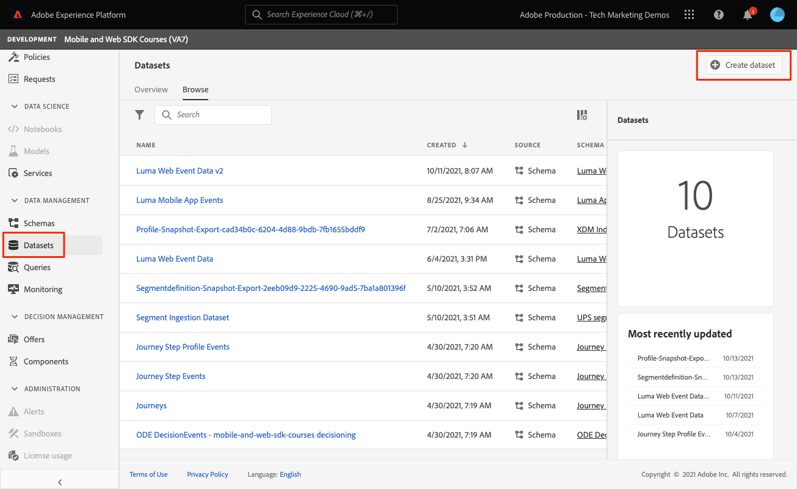

# Enviar dados para o Adobe Experience Platform

Saiba como enviar dados para o Adobe Experience Platform.

Esta lição opcional é relevante para todos os clientes do Real-time Customer Data Platform (Real-Time CDP), Journey Optimizer e Customer Journey Analytics. O Experience Platform, a base dos produtos Experience Cloud, é um sistema aberto que transforma todos os seus dados, Adobe e não Adobe, em perfis robustos de clientes que são atualizados em tempo real e usam insights orientados por IA para ajudar você a fornecer as experiências certas em cada canal.

A variável [evento](events.md), [ciclo de vida](lifecycle-data.md), e [identidade](identity.md) Os dados coletados e enviados para a Platform Edge Network em lições anteriores são encaminhados para os serviços configurados na sua sequência de dados, incluindo o Adobe Experience Platform.

## Pré-requisitos

Sua organização deve ser provisionada e as permissões devem ser concedidas para o Adobe Experience Platform.

Se você não tiver acesso, poderá [ignorar esta lição](install-sdks.md).

## Objetivos de aprendizagem

Nesta lição, você vai:

* Crie um conjunto de dados de Experience Platform.
* Validar dados no conjunto de dados.
* Ative seu esquema e conjunto de dados para o Perfil de cliente em tempo real.
* Validar dados no Perfil do cliente em tempo real.
* Validar dados no gráfico de identidade.

## Criar um conjunto de dados

Todos os dados assimilados com sucesso na Adobe Experience Platform são mantidos no data lake como conjuntos de dados. Um conjunto de dados é uma construção de armazenamento e gerenciamento para uma coleção de dados, normalmente uma tabela, que contém um esquema (colunas) e campos (linhas). Os conjuntos de dados também contêm metadados que descrevem vários aspectos dos dados armazenados. Consulte a [documentação](https://experienceleague.adobe.com/docs/experience-platform/catalog/datasets/overview.html?lang=pt-BR) para obter informações.

1. Navegue até a interface do Experience Platform, selecionando-a no menu 3x3 no canto superior direito.
   

1. Selecionar **[!UICONTROL Conjuntos de dados]** no menu de navegação esquerdo.

1. **[!UICONTROL Criar conjunto de dados]**.
   

1. Selecione **[!UICONTROL Criar conjunto de dados a partir do esquema]**.
   

1. Procure pelo esquema e selecione.

1. Selecione **[!UICONTROL Próximo]**.
   

1. Forneça um **[!UICONTROL Nome]**, **[!UICONTROL Descrição]** e selecione **[!UICONTROL Concluir]**.
   

## Atualizar a sequência de dados

Depois de criar seu conjunto de dados, verifique se [atualizar o fluxo de dados](create-datastream.md) para adicionar o Adobe Experience Platform. Essa atualização garante que os dados fluam para a Platform.

## Validar dados no conjunto de dados

Agora que você criou um conjunto de dados e atualizou seu fluxo de dados para enviar dados para o Experience Platform, todos os dados XDM enviados para a Rede de borda da Platform são encaminhados para a Platform e chegam ao conjunto de dados.

Abra o aplicativo e navegue até as telas onde você está rastreando eventos. Você também pode acionar medições de ciclo de vida.

Abra o conjunto de dados na interface da Platform. Você deve ver os dados que chegam em lotes ao conjunto de dados

Também é possível ver registros e campos de exemplo usando o **[!UICONTROL Visualizar conjunto de dados]** recurso:

Uma ferramenta mais robusta para validar dados é a [serviço de consulta](https://experienceleague.adobe.com/docs/platform-learn/tutorials/queries/explore-data.html?lang=pt-BR).

## Ativar o Perfil do cliente em tempo real

O Perfil do cliente em tempo real do Experience Platform permite criar uma visualização integral de cada cliente individual que combina dados de vários canais, incluindo dados online, offline, de CRM e de terceiros. O Perfil permite consolidar dados diferentes do cliente em uma visualização unificada, oferecendo uma conta acionável com carimbo de data e hora de cada interação com o cliente.

### Ativar o esquema

1. Abra seu esquema
1. Ativar **[!UICONTROL Perfil]**
1. Selecionar **[!UICONTROL Os dados deste esquema conterão uma identidade principal no campo identityMap.]** no modal
1. **[!UICONTROL Salvar]** o schema

   

### Ativar o conjunto de dados

1. Abra seu conjunto de dados
1. Ativar **[!UICONTROL Perfil]**

   

### Validar dados no perfil

Abra o aplicativo e navegue até as telas onde você está rastreando eventos. Faça logon no aplicativo Luma e faça uma compra.

Use o Assurance para localizar uma das identidades transmitidas no identityMap (Email, lumaCrmId ou ECID):

>[!TIP]
>
>   O valor de `lumaCrmId` é `112ca06ed53d3db37e4cea49cc45b71e`

Na interface da Platform, navegue até **[!UICONTROL Perfis]** > **[!UICONTROL Procurar]**, procure o valor de identidade que você acabou de capturar e abra o perfil:

No **[!UICONTROL Detalhe]** tela, você pode ver informações básicas sobre o usuário, incluindo a **[!UICONTROL ** identidades vinculadas **]**:

No **[!UICONTROL Eventos]**, você pode ver os eventos coletados da implementação do aplicativo móvel para este usuário:

Na tela de detalhes do perfil, clique no link para exibir o gráfico de identidade ou navegue até **[!UICONTROL Identidades]** > **[!UICONTROL Gráfico de identidade]** e procure o valor de identidade. Esta visualização mostra todas as identidades que estão vinculadas em um perfil e suas origens. Este é um exemplo de um gráfico de identidade construído com dados coletados ao concluir este tutorial do SDK móvel (Fonte de dados 2) e o [Tutorial do SDK da Web](https://experienceleague.adobe.com/docs/platform-learn/implement-web-sdk/overview.html?lang=pt-BR) (Fonte de dados 1):

Os profissionais de marketing e análise podem fazer muito mais com dados capturados no Experience Platform, inclusive analisá-los no Customer Journey Analytics e criar segmentos no Real-time Customer Data Platform. Você está indo para um bom começo!

Próximo: **[Mensagens por push com o Journey Optimizer](journey-optimizer-push.md)**

>[!NOTE]
>
>Obrigado por investir seu tempo aprendendo sobre o Adobe Experience Platform Mobile SDK. Se você tiver dúvidas, quiser compartilhar feedback geral ou tiver sugestões sobre conteúdo futuro, compartilhe-as nesta [Publicação de discussão da comunidade do Experience League](https://experienceleaguecommunities.adobe.com/t5/adobe-experience-platform-launch/tutorial-discussion-implement-adobe-experience-cloud-in-mobile/td-p/443796)
