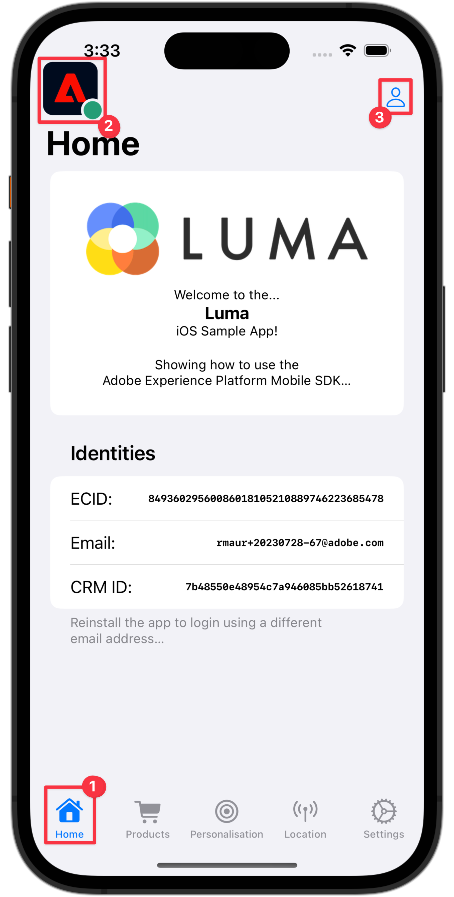

# Coletar dados de perfil

Saiba como coletar dados de perfil em um aplicativo móvel.

Você pode usar a extensão Profile para armazenar atributos sobre seu usuário no cliente. Essas informações podem ser usadas posteriormente para direcionar e personalizar mensagens em cenários online ou offline, sem precisar se conectar a um servidor para obter o desempenho ideal. A extensão Perfil gerencia o CSOP (Perfil de operação do lado do cliente), fornece uma maneira de reagir a APIs, atualiza atributos de perfil do usuário e compartilha os atributos de perfil do usuário com o restante do sistema como um evento gerado.

Os dados do Perfil são usados por outras extensões para executar ações relacionadas ao perfil. Um exemplo é a extensão Mecanismo de regras que consome os dados do perfil e executa as regras com base nos dados do perfil. Saiba mais sobre a [extensão de perfil](https://developer.adobe.com/client-sdks/documentation/profile/) na documentação

>[!IMPORTANT]
>
>A funcionalidade de perfil descrita nesta lição é separada da funcionalidade de perfil do cliente em tempo real nos aplicativos da Adobe Experience Platform e da plataforma.


## Pré-requisitos

* O aplicativo com SDKs instalados e configurados foi criado e executado com sucesso.

## Objetivos de aprendizagem

Nesta lição, você vai:

* Definir ou atualizar atributos do usuário.
* Recuperar atributos do usuário.


## Definir e atualizar atributos do usuário

Seria útil para direcionamento e/ou personalização no aplicativo saber rapidamente se um usuário fez uma compra no passado ou recentemente. Vamos configurar isso no aplicativo Luma.

1. Navegue até **[!DNL Luma]** > **[!DNL Luma]** > **[!DNL Utils]** > **[!DNL MobileSDK]** no navegador do Projeto Xcode e localize a função `func updateUserAttribute(attributeName: String, attributeValue: String)`. Adicione o seguinte código:

   ```swift
   // Create a profile map, add attributes to the map and update profile using the map
   var profileMap = [String: Any]()
   profileMap[attributeName] = attributeValue
   UserProfile.updateUserAttributes(attributeDict: profileMap)
   ```

   Este código:

   1. Configura um dicionário vazio chamado `profileMap`.

   1. Adiciona um elemento ao dicionário usando `attributeName` (por exemplo `isPaidUser`) e `attributeValue` (por exemplo `yes`).

   1. Usa o dicionário `profileMap` como valor para o parâmetro `attributeDict` da chamada de API [`UserProfile.updateUserAttributes`](https://developer.adobe.com/client-sdks/documentation/profile/api-reference/#updateuserattributes).

1. Navegue até **[!DNL Luma]** > **[!DNL Luma]** > **[!DNL Views]** > **[!DNL Products]** > **[!DNL ProductView]** no navegador do Projeto Xcode e localize a chamada para `updateUserAttributes` (dentro do código das Compras  botão). Adicione o seguinte código:

   ```swift
   // Update attributes
   MobileSDK.shared.updateUserAttribute(attributeName: "isPaidUser", attributeValue: "yes")
   ```


## Obter atributos do usuário

Depois de atualizar o atributo de um usuário, ele fica disponível para outros SDKs Adobe, mas você também pode recuperar atributos explicitamente, para permitir que seu aplicativo se comporte da maneira que você quiser.

1. Navegue até **[!DNL Luma]** > **[!DNL Luma]** > **[!DNL Views]** > **[!DNL General]** > **[!DNL HomeView]** no navegador do Projeto Xcode e localize o modificador `.onAppear`. Adicione o seguinte código:

   ```swift
   // Get attributes
   UserProfile.getUserAttributes(attributeNames: ["isPaidUser"]) { attributes, error in
       if attributes?.count ?? 0 > 0 {
           if attributes?["isPaidUser"] as? String == "yes" {
               showBadgeForUser = true
           }
           else {
               showBadgeForUser = false
           }
       }
   }
   ```

   Este código:

   1. Chama a API [`UserProfile.getUserAttributes`](https://developer.adobe.com/client-sdks/documentation/profile/api-reference/#getuserattributes) com o nome de atributo `isPaidUser` como elemento único na matriz `attributeNames`.
   1. Em seguida, verifica o valor do atributo `isPaidUser` e, quando `yes`, coloca um selo na variável Ícone  na barra de ferramentas, na parte superior direita.

A documentação adicional pode ser encontrada [aqui](https://developer.adobe.com/client-sdks/documentation/profile/api-reference/#getuserattributes).

## Validar com garantia

1. Revise a seção [instruções de configuração](assurance.md#connecting-to-a-session) para conectar seu simulador ou dispositivo ao Assurance.
1. Execute o aplicativo para fazer logon e interagir com um produto.

   1. Mova o ícone do Assurance para a esquerda.
   1. Selecione **[!UICONTROL Página inicial]** na barra de guias.
   1. Para abrir a planilha de Logon, selecione o Botão .

      

   1. Para inserir um email e uma ID do cliente aleatórios, selecione Botão  .
   1. Selecione **[!UICONTROL Logon]**.

      

   1. Selecione **[!DNL Products]** na barra de guias.
   1. Selecione um produto.
   1. Selecionar .
   1. Selecionar .
   1. Selecionar .

      

   1. Voltar à tela **[!UICONTROL Residencial]**. Você verá que uma medalha foi adicionada .

      


1. Na interface do usuário do Assurance, você deve ver eventos de **[!UICONTROL UserProfileUpdate]** e **[!UICONTROL getUserAttributes]** com o valor `profileMap` atualizado.
   

>[!SUCCESS]
>
>Agora você configurou o aplicativo para atualizar atributos de perfis no Edge Network e (quando configurado) com o Adobe Experience Platform.
>
>Obrigado por investir seu tempo aprendendo sobre o Adobe Experience Platform Mobile SDK. Se você tiver dúvidas, quiser compartilhar comentários gerais ou tiver sugestões sobre conteúdo futuro, compartilhe-os nesta [postagem de Discussão da Comunidade Experience League](https://experienceleaguecommunities.adobe.com/t5/adobe-experience-platform-data/tutorial-discussion-implement-adobe-experience-cloud-in-mobile/td-p/443796?profile.language=pt).

Próximo: **[Usar Locais](places.md)**
