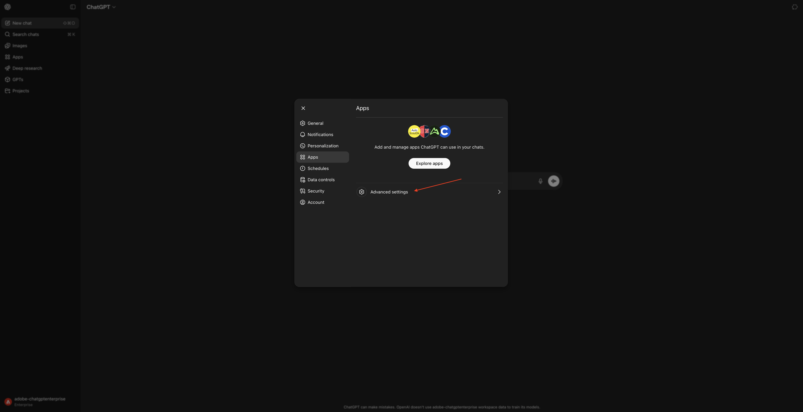
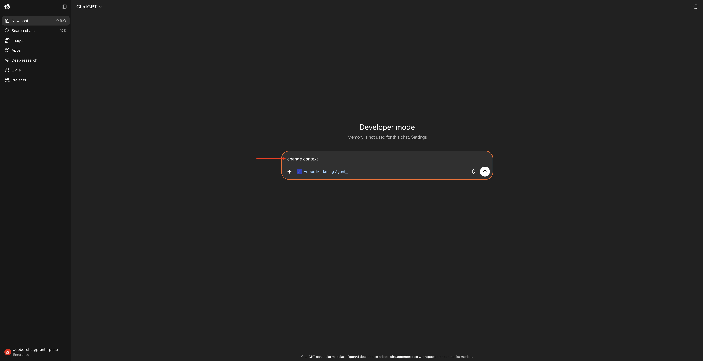
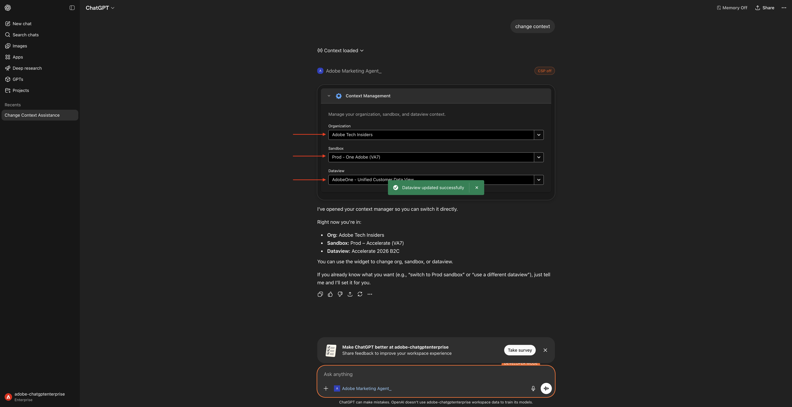
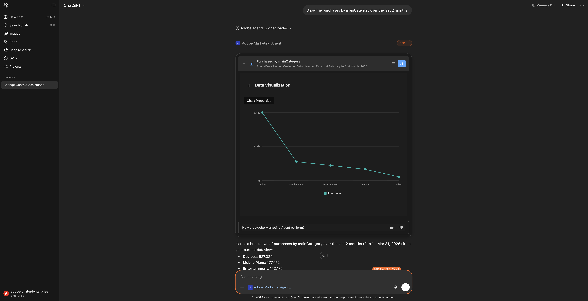
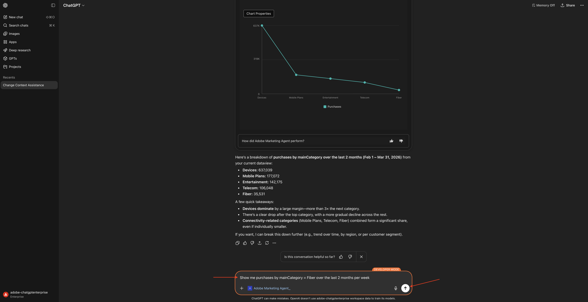
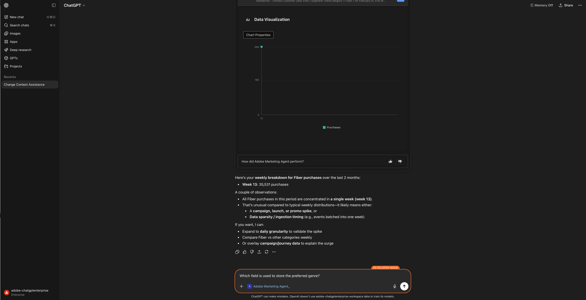
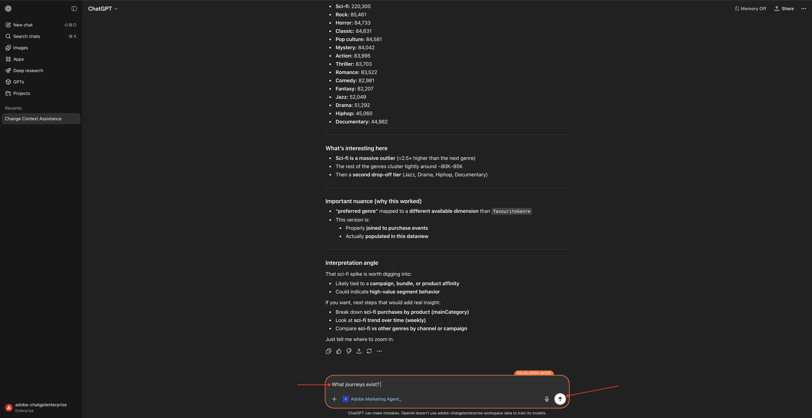
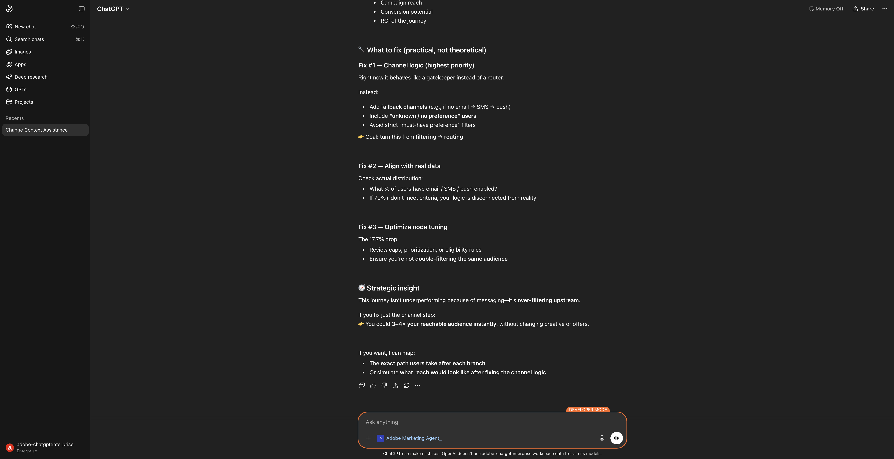

# 1.1.2 Adobe Marketing Agent para ChatGPT Enterprise

## Vídeo

Neste vídeo, você receberá uma explicação e uma demonstração de todas as etapas envolvidas neste exercício.

>[!VIDEO](https://video.tv.adobe.com/v/3478410?quality=12&learn=on)

## 1.1.2.1 Criar aplicativo personalizado no ChatGPT Enterprise para Adobe Marketing Agent

>[!NOTE]
>
>O uso do Adobe Marketing Agent no ChatGPT requer o seguinte:
>- uma versão paga do ChatGPT Enterprise da OpenAI
>- usar o cliente Web ChatGPT Enterprise

Vá para [https://chatgpt.com/](https://chatgpt.com/){target="_blank"} e faça logon usando os detalhes de sua conta. Depois de fazer logon, você deverá ver isso. Clique no seu nome de usuário.


Selecione **Configurações**.


Vá para **Aplicativos** e selecione **Configurações avançadas**.



Ative o **Modo de desenvolvedor** e clique em **Voltar**.


Clique em **Criar aplicativo**.


Preencha os campos desta forma:

- **Nome**: `Adobe Marketing Agent`
- **URL do Servidor MCP**: pergunte ao seu representante da Adobe
- **Autenticação**: `OAuth`

Marque a caixa de seleção **Entendo e desejo continuar**.

Clique em **Criar**.


O ChatGPT agora tentará se conectar à sua conta da Adobe. Selecione **Permitir acesso** e você terá que fazer logon com sua conta da Adobe.


Depois de fazer logon, você deve ver que seu Adobe Marketing Agent agora está conectado com êxito.


## 1.1.2.2 Definir contexto no Adobe Marketing Agent

Feche esta janela.


Você deverá ver isso. Clique no ícone **+**, vá para **Mais** e selecione **Adobe Marketing Agent**.


Antes de interagir mais com o Adobe Marketing Agent por meio do ChatGPT, o contexto precisa ser definido.

Para este exercício, o contexto precisa ser definido para usar:

- **Organização IMS**: `--aepImsOrgName--`.

- **Sandbox**: **Prod - One Adobe**

A configuração de sandbox ajuda a identificar qual sandbox o ChatGPT deve observar ao fazer perguntas.

- **Dataview**: **AdobeOne - Visualização unificada de dados do cliente**

A configuração Exibição de dados ajuda a identificar a exibição de dados que o ChatGPT deve considerar ao fazer perguntas.

Insira o seguinte **Prompt** e clique no botão **enviar**.

```
change context
```



Você deverá ver uma janela semelhante, mostrando a seleção atual de Organização, Sandbox e Visualização de dados. Altere esses campos para a Organização, Sandbox e Visualização de dados corretas com base nas informações acima.



Seu contexto agora está definido corretamente, portanto, você pode começar a enviar prompts específicos em seguida.

## 1.1.2.3 Comece com as tendências gerais de compra para ancorar o contexto e ampliar a fibra

**Propósito**

Obtenha pulsos de alto nível conforme a demanda da categoria — móvel, telefone fixo, Internet, TV, fibra — especificamente pelos últimos 60 dias. Isso define linhas de base para sazonalidade, efeitos promocionais e variação regional após a implantação em Nova York.

Insira o seguinte **Prompt** e clique no botão **enviar**.

```
Show me purchases by mainCategory over the last 2 months.
```


Você deverá ver isso:



Insira o seguinte **Prompt** e clique no botão **enviar**.

```
Show me purchases by mainCategory = Fiber over the last 2 months per week
```



Você verá isso, que detalha tendências específicas de fibra.


## 1.1.2.4 Correlacionar pedidos com preferências de conteúdo

**Propósito**

Teste a hipótese de que uma preferência por um gênero específico (por exemplo, ficção científica, esportes, drama) prevê o comportamento de atualização da banda larga, especialmente para necessidades de alta largura de banda.

Primeiro, você precisa descobrir qual campo é usado para armazenar a preferência de gênero.

Insira o seguinte **Prompt** e clique no botão **enviar**.

```
Which field is used to store the preferred genre?
```



Você verá isto, que mostra que o campo usado para o gênero é **`--aepTenantId--.individualCharacteristics.telco.mediaPreferences.favouriteGenre`**.


Com essas informações, você pode começar a detalhar os dados de compra.

Insira o seguinte **Prompt** e clique no botão **enviar**.

```
Show me purchases by favouriteGenre for the last 2 months
```


Você deverá ver isso.


## 1.1.2.5 Identificar Jornadas de Fibra Existentes

**Propósito**

Descubra quais jornadas ativas ou concluídas recentemente incluem &quot;Fibre&quot; no título, por exemplo, &quot;Fibre Upgrade NYC - Set&quot;, &quot;Fibre Trial - Streaming Bundle&quot;.

Insira o seguinte **Prompt** e clique no botão **enviar**.

```
What journeys exist? 
```



Você deverá ver isso.


Insira o seguinte **Prompt** e clique no botão **enviar**.

```
Which of these journeys has 'Fiber' in its name?
```


Você deverá ver isso.


Insira o seguinte **Prompt** e clique no botão **enviar**.

```
show me the details of the journey 'CitiSignal - Fiber Max Launch Promotion'
```


Você deverá ver isso.


## 1.1.2.6 Validar o desempenho da jornada através da análise de fallout

**Propósito**

Você deseja entender o fallout de desempenho da jornada para saber se há nós ou condições na jornada que estão enfrentando uma grande porcentagem de perfis que estão sendo descartados. Isso é útil para entender se são necessários ajustes adicionais na jornada.

Insira o seguinte **Prompt** e clique no botão **enviar**.

```
Create a fall-out report on the "CitiSignal - Fiber Max Launch Promotion" journey
```


Você deverá ver isso.


Role para baixo um pouco. Agora você pode revisar a tabela inspecionando cada nó e seus respectivos números de entrada, números de fallout e taxa de fallout.


Role para baixo um pouco mais para ver observações e recomendações.



Você concluiu este laboratório.

## Próximas etapas

Ir para [Adobe Marketing Agent for Microsoft 365 Copilot](./ex3.md){target="_blank"}

Voltar para [Agent Orchestrator](./agentorchestrator.md){target="_blank"}

[Voltar para Todos os Módulos](./../../../overview.md){target="_blank"}
