# 1.1.3 Adobe Marketing Agent for Microsoft 365 Copilot

## Pré-requisitos

Para seguir as etapas neste laboratório conforme documentado abaixo, o seguinte acesso é necessário:

- Acesso ao Real-Time CDP, Journey Optimizer e Customer Journey Analytics
- Acesso ao Assistente de IA no Adobe Experience Cloud
- Acesso ao AEP Agent Orchestrator
- Acesso ao Microsoft 365 Copilot

## Vídeo

Neste vídeo, você receberá uma explicação e uma demonstração de todas as etapas envolvidas neste exercício.

>[!VIDEO](https://video.tv.adobe.com/v/3479158?quality=12&learn=on)

## 1.1.3.1 Adicionar o Adobe Marketing Agent ao Microsoft 365 Teams &amp; Copilot

Abra o Microsoft Teams e faça logon usando os detalhes da sua conta. Depois de fazer logon, você deverá ver isso.

Clique em **Aplicativos**.

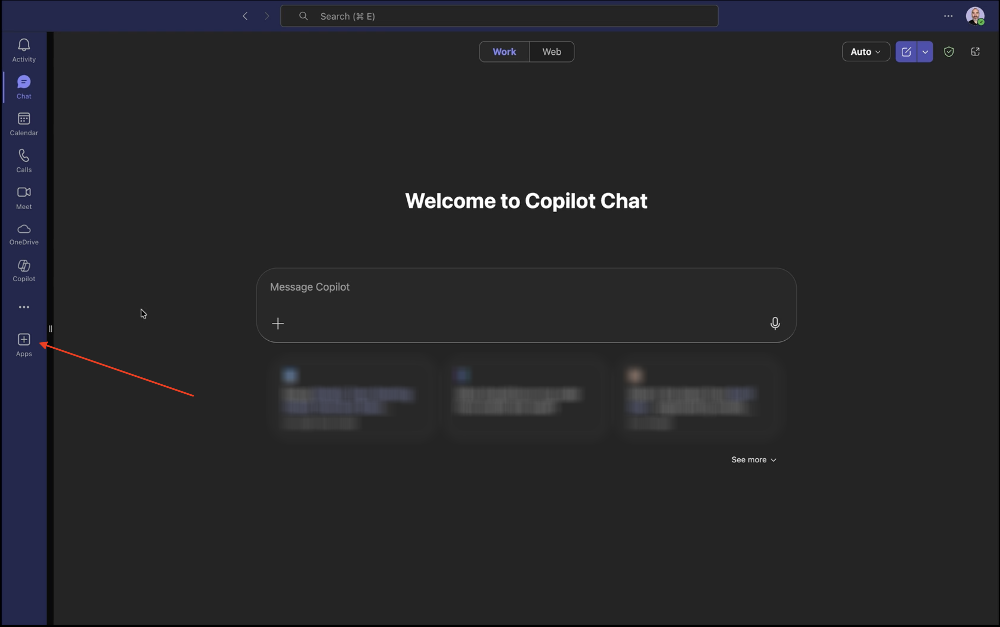

Selecione **Gerenciar seus aplicativos**.


Selecione **Carregar um aplicativo**.

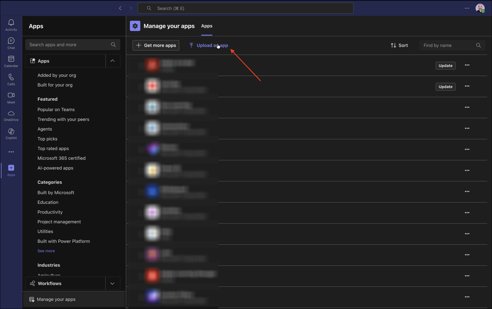

Selecione **Carregar um aplicativo personalizado**.


Selecione o arquivo de manifesto fornecido a você pelo seu instrutor e clique em **Abrir**.


Clique em **Adicionar**.


Clique em **Abrir com Copilot**.


O Adobe Marketing Agent foi carregado com êxito.


Digite o prompt `login` e clique no botão **enviar**.


Clique em **Fazer logon no Adobe Marketing Agent**.

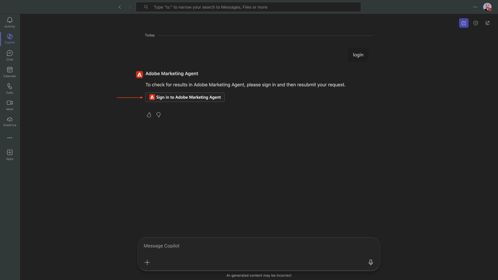

Uma nova janela será aberta, solicitando que você faça logon usando as credenciais da sua conta da Adobe.


Você verá um código semelhante sendo gerado. Clique em **Copiar** para copiar o código.

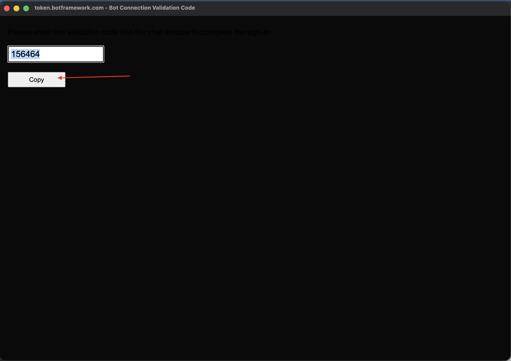

Cole o código na janela do Adobe Marketing Agent no Copilot e clique no botão **enviar**.


Você verá algo semelhante a isso. Agora você está conectado com êxito ao Adobe Marketing Agent no Microsoft 365 Copilot.


## 1.1.3.2 Definir contexto no Adobe Marketing Agent

Antes de interagir mais com o Adobe Marketing Agent por meio do Copilot, o contexto precisa ser definido.

Para este exercício, o contexto precisa ser definido para usar:

- **Sandbox**: **Prod - One Adobe (VA7)**

  A configuração de sandbox ajuda a identificar qual assistente de IA de sandbox deve observar ao fazer perguntas.

- **Dataview**: **AdobeOne - Visualização unificada de dados do cliente**

  A configuração da visualização de dados ajuda a identificar qual assistente da IA de visualização de dados deve considerar ao fazer perguntas.

Primeiro, altere a sandbox para a sandbox correta e clique em **Atualizar exibições de dados**.


Em seguida, selecione a exibição de dados correta e clique em **Atualizar**.


Você deverá ver isso. O contexto agora está definido corretamente para que você possa começar a enviar prompts específicos em seguida.

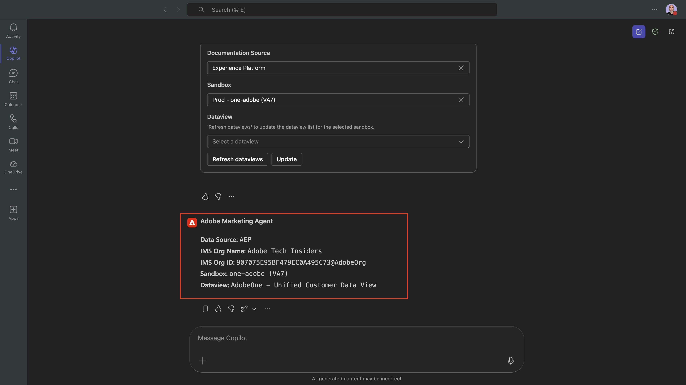

## 1.1.3.3 Comece com as tendências gerais de compra para ancorar o contexto e ampliar a fibra

**Propósito**

Obtenha pulsos de alto nível conforme a demanda da categoria — móvel, telefone fixo, Internet, TV, fibra — especificamente pelos últimos 60 dias. Isso define linhas de base para sazonalidade, efeitos promocionais e variação regional após a implantação em Nova York.

Insira o seguinte **Prompt** e clique no botão **enviar**.

```
Show me purchases by mainCategory over the last 2 months.
```


Você deverá ver isso:


Insira o seguinte **Prompt** e clique no botão **enviar**.

```
Show me purchases by mainCategory = Fiber over the last 2 months broken down by week
```


Você verá isso, que detalha tendências específicas de fibra.

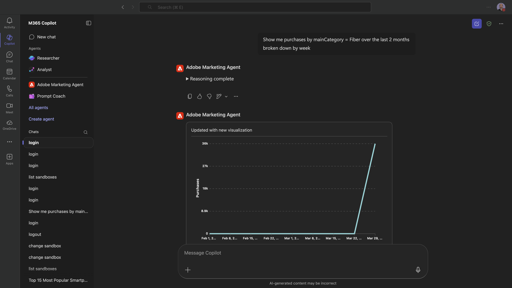

## 1.1.3.4 Correlacionar pedidos com preferências de conteúdo

**Propósito**

Teste a hipótese de que uma preferência por um gênero específico (por exemplo, ficção científica, esportes, drama) prevê o comportamento de atualização da banda larga, especialmente para necessidades de alta largura de banda.

Primeiro, você precisa descobrir qual campo é usado para armazenar a preferência de gênero.

Insira o seguinte **Prompt** e clique no botão **enviar**.

```
Which field is used to store the preferred genre
```

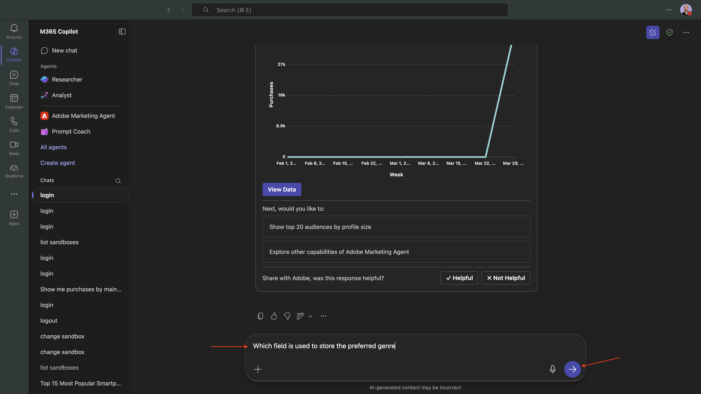

Você verá isto, que mostra que o campo usado para o gênero é **`--aepTenantId--.individualCharacteristics.telco.mediaPreferences.favouriteGenre`**.


Com essas informações, você pode começar a detalhar os dados de compra.

Insira o seguinte **Prompt** e clique no botão **enviar**.

```
Show me purchases by preferred genre for the last 2 months until today
```


Você deverá ver isso. Clique em **Exibir Dados**.

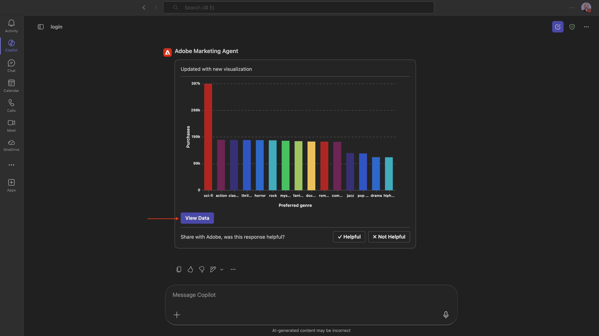

Você deverá ver isso.


## 1.1.3.5 Identificar Jornadas de Fibra Existentes

**Propósito**

Descubra quais jornadas ativas ou concluídas recentemente incluem &quot;Fibre&quot; no título, por exemplo, &quot;Fibre Upgrade NYC - Set&quot;, &quot;Fibre Trial - Streaming Bundle&quot;.

Insira o seguinte **Prompt** e clique no botão **enviar**.

```
What journeys exist? 
```

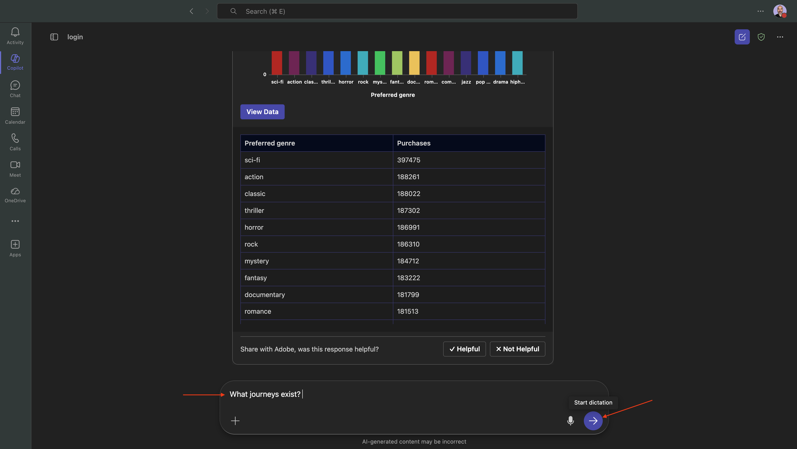

Você deverá ver uma lista de jornadas.

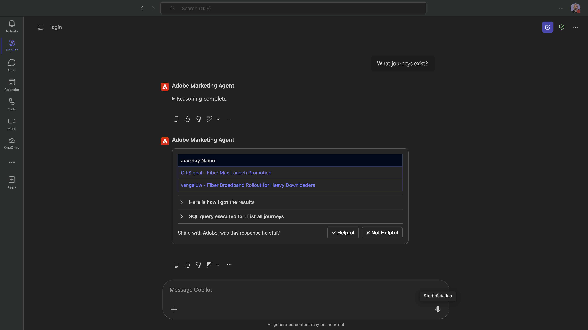

Insira o seguinte **Prompt** e clique no botão **enviar**.

```
Which of these journeys has 'Fiber' in its name?
```


Você deverá ver isso.

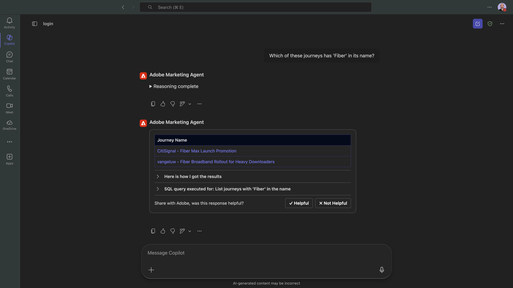

Insira o seguinte **Prompt** e clique no botão **enviar**.

```
Show me the details of the journey 'CitiSignal - Fiber Max Launch Promotion'
```


Você deverá ver isso.


## 1.1.3.6 Validar o desempenho da jornada através da análise de fallout

**Propósito**

Você deseja entender o fallout de desempenho da jornada para saber se há nós ou condições na jornada que estão enfrentando uma grande porcentagem de perfis que estão sendo descartados. Isso é útil para entender se são necessários ajustes adicionais na jornada.

Insira o seguinte **Prompt** e clique no botão **enviar**.

```
Create a fall-out report on the "CitiSignal - Fiber Max Launch Promotion" journey
```

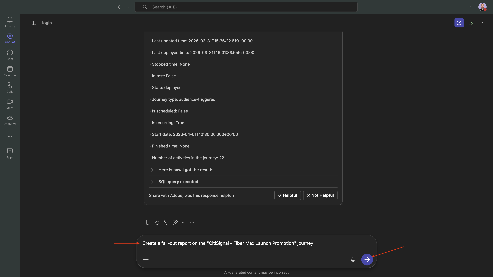

Você deverá ver isso.

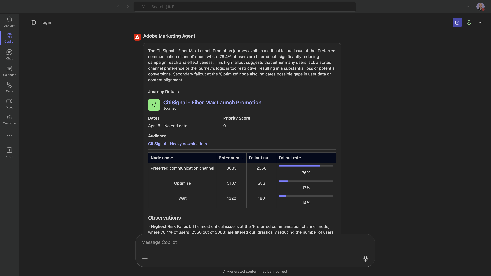

Role para baixo um pouco mais para ver observações e recomendações.

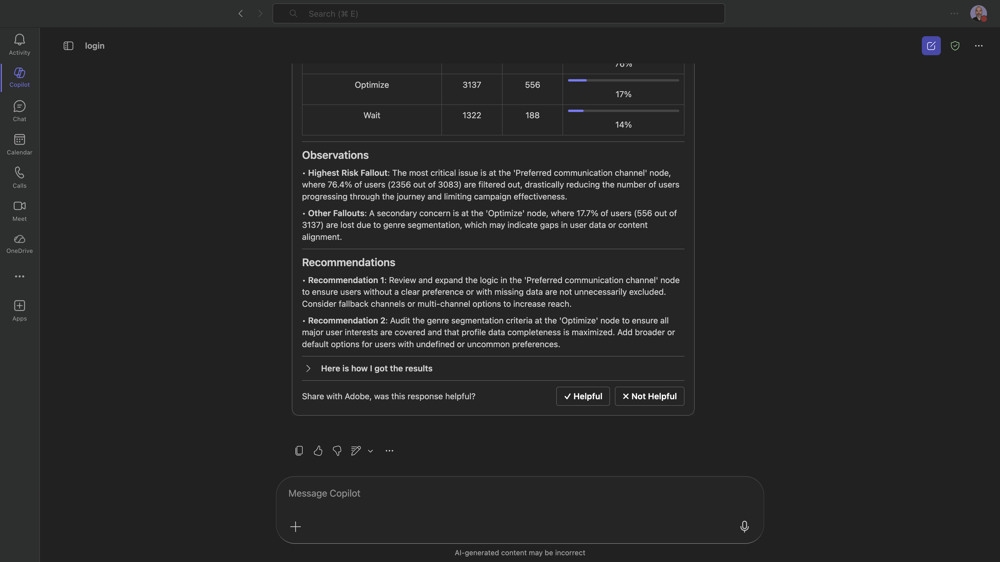

Você concluiu este laboratório.

## Próximas etapas

Ir para [Adobe Marketing Agent para Google Gemini Enterprise](./ex4.md){target="_blank"}

Voltar para [Agent Orchestrator](./agentorchestrator.md){target="_blank"}

[Voltar para Todos os Módulos](./../../../overview.md){target="_blank"}
