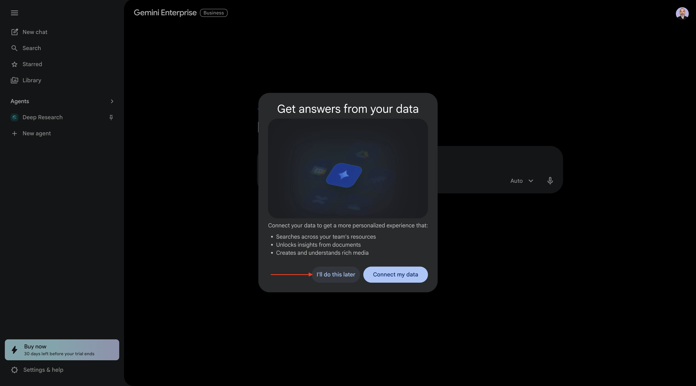
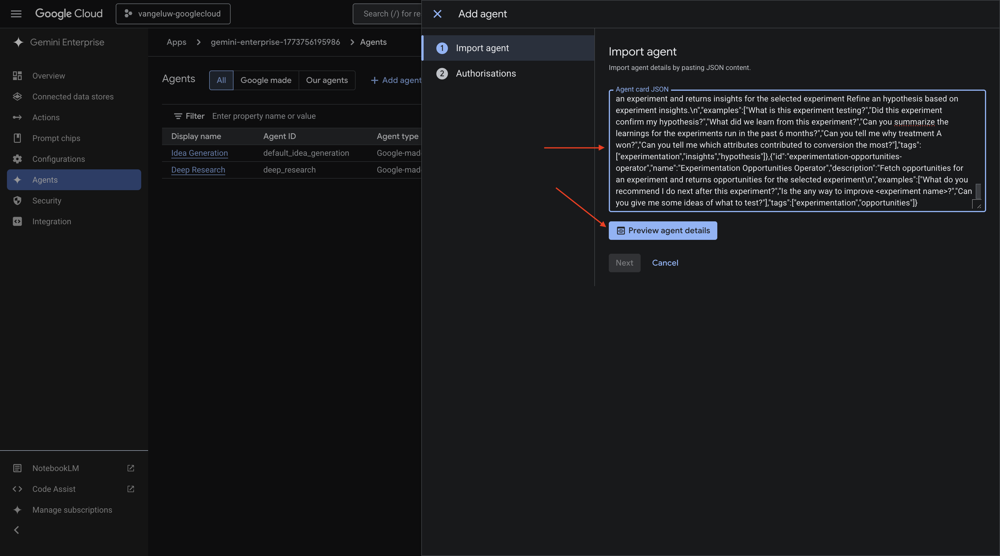
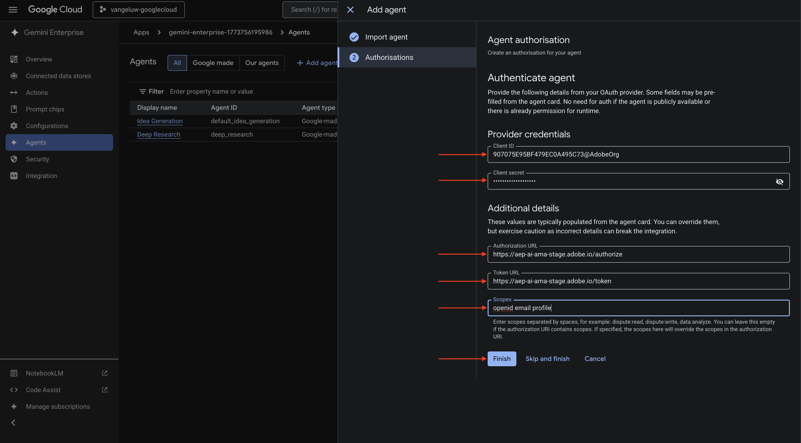
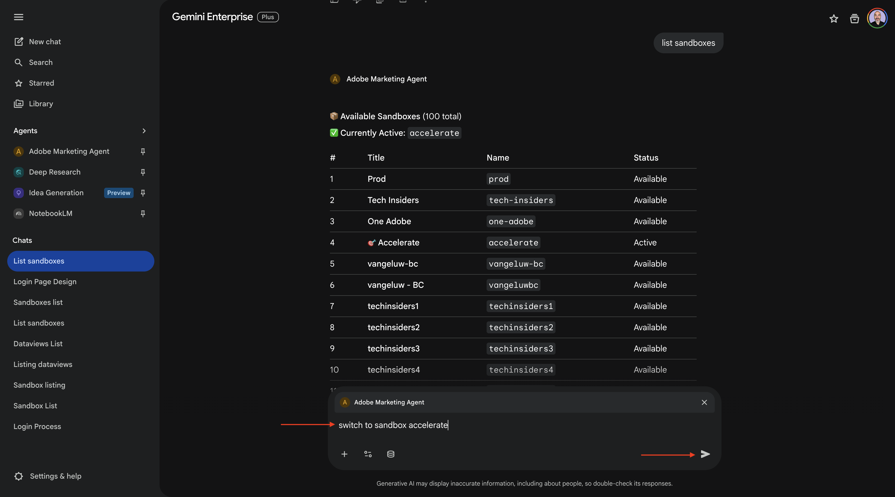
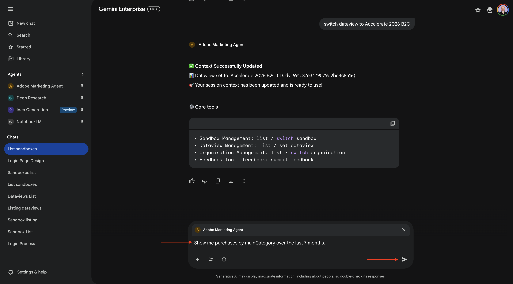
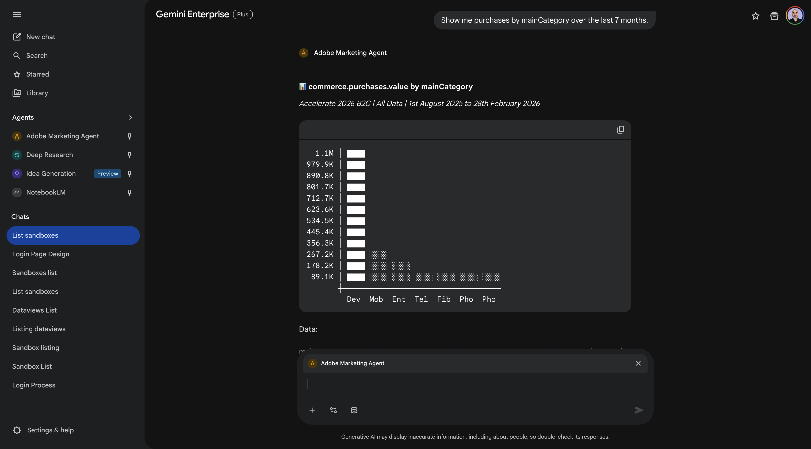
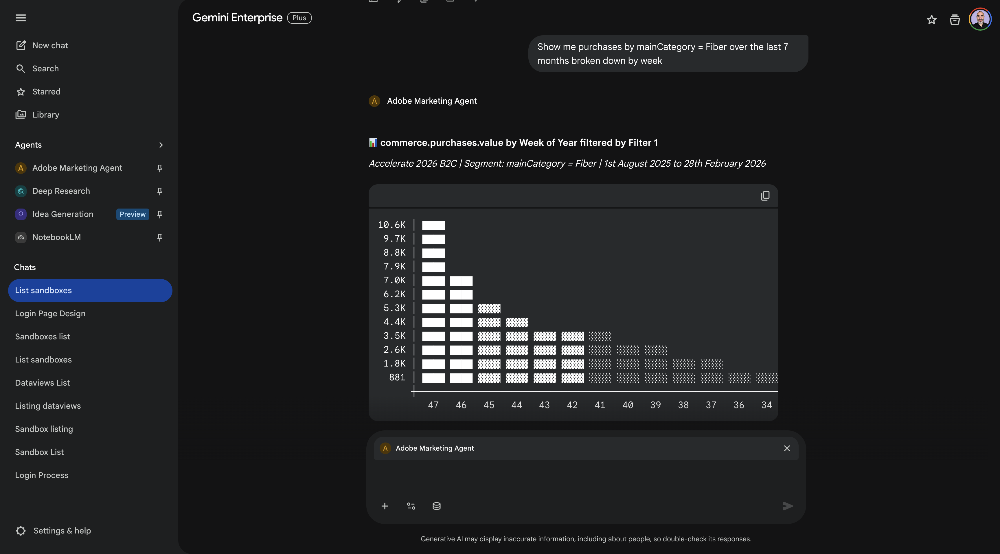
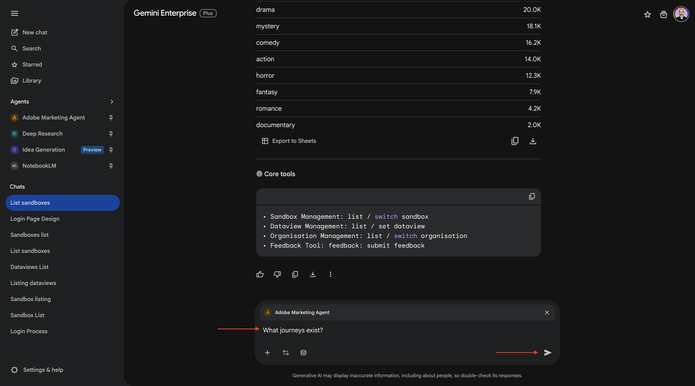

# 1.1.4 Adobe Marketing Agent para Google Gemini Enterprise

[!BADGE Beta]

+++Detalhes do Beta
Ao usar o Adobe Marketing Agent com o Google Gemini Enterprise Beta, você reconhece, por meio deste, que o Beta é fornecido &quot;no estado em que se encontra&quot; sem garantias de nenhum tipo. A Adobe não tem nenhuma obrigação de manter, corrigir, atualizar, alterar, modificar ou oferecer suporte à Beta. É recomendável ter cuidado e não depender de forma alguma do funcionamento ou desempenho correto desse Beta e/ou dos materiais que o acompanham. O Beta é considerado Informações confidenciais da Adobe.  Qualquer &quot;Feedback&quot; (informação sobre o Beta incluindo, mas não se limitando a, problemas ou defeitos encontrados durante o uso do Beta, sugestões, melhorias e recomendações) fornecido por Você ao Adobe é atribuído ao Adobe, incluindo todos os direitos, cargos e interesses no e no Feedback.

+++

## Pré-requisitos

Para seguir as etapas neste laboratório conforme documentado abaixo, o seguinte acesso é necessário:

- Acesso ao Real-Time CDP, Journey Optimizer e Customer Journey Analytics
- Acesso ao Assistente de IA no Adobe Experience Cloud
- Acesso ao AEP Agent Orchestrator
- Acesso ao Google Gemini Enterprise

## Vídeo

Neste vídeo, você receberá uma explicação e uma demonstração de todas as etapas envolvidas neste exercício.

>[!VIDEO](https://video.tv.adobe.com/v/3481322?quality=12&learn=on)

## 1.1.4.1 Acesso ao Google Gemini Enterprise

Ir para [https://cloud.google.com/gemini-enterprise](https://cloud.google.com/gemini-enterprise). Clique em **Iniciar avaliação gratuita por 30 dias**.


Digite o endereço de email da sua conta da Google e clique em **Continuar com o email**.


Forneça seu nome e sobrenome e clique em **Concordar e começar**.


Clique em **Farei isso mais tarde**.



Você deverá ver isso.


Ir para [https://cloud.google.com/gemini-enterprise](https://cloud.google.com/gemini-enterprise).

Você deveria ver algo assim. Talvez seja necessário criar primeiro a conta de faturamento e depois selecioná-la aqui.


Clique em **Iniciar avaliação gratuita por 30 dias**.


Clique em **Continuar e ativar a API**.


Clique em **Criar**.


Você deverá ver isso.


## 1.1.4.2 Crie seu agente personalizado usando A2A

Ir para [https://console.cloud.google.com/gemini-enterprise](https://console.cloud.google.com/gemini-enterprise). Clique em **Agentes**.


Clique em **+Adicionar agente**.


Selecione **Agente personalizado via A2A**.


Cole o **Agent Card JSON**.

>[!NOTE]
>
>Consulte seu representante da Adobe para obter as informações do **Cartão do agente JSON**.


Depois de colar o **Cartão do Agente JSON**, clique em **Visualizar detalhes do agente**.



Você deveria ver algo assim. Role para baixo e clique em **Próximo**.


Você deveria ver algo assim.


Preencha os campos da sua instância.

- **ID do cliente**:

```
--aepImsOrgId--
```

- **Segredo do Cliente**:

```
AdobeMarketingAgent
```

- **URL de autorização**:

```
https://XXX.adobe.io/authorize
```

- **URL do token**:

```
https://XXX.adobe.io/token
```

- **Escopos**:

```
openid email profile
```

Clique em **Concluir**.



Você deverá ver isso.


## 1.1.4.3 Login no Adobe Marketing Agent

Vá para **Visão geral** e clique em **Visualizar**.


Clique em **Introdução**


Vá para **Agentes**. Você deve ver o **Adobe Marketing Agent** lá.


Clique nos 3 pontos **...** e selecione **Fixar**.


Vá para **Novo chat** e insira o símbolo **@** no chat. Clique em **Adobe Marketing Agent**.


Digite o comando `login` e clique em **Enviar**.


Você deverá ver isso. Clique em **Autorizar**.


Clique em **Permitir acesso**, conclua o logon usando sua Adobe ID e selecione a instância `--aepImsOrgName--` quando solicitado.


Você deverá ver isso.


## 1.1.4.4 Definir contexto no Adobe Marketing Agent

Antes de interagir mais com o Adobe Marketing Agent por meio do Copilot, o contexto precisa ser definido.

Para este exercício, o contexto precisa ser definido para usar:

- **Sandbox**: **Prod - Acelerar (VA7)**

  A configuração de sandbox ajuda a identificar qual assistente de IA de sandbox deve observar ao fazer perguntas.

- **Dataview**: **Acelerar B2C 2026**

A configuração da visualização de dados ajuda a identificar qual assistente da IA de visualização de dados deve considerar ao fazer perguntas.

Para alterar a sandbox, digite o seguinte comando e clique no botão **enviar**.

```javascript
list sandboxes
```


Você verá algo semelhante a isso. Digite o comando `switch to sandbox accelerate` e clique no botão **Enviar**.



Você deverá ver isso. Para alterar a exibição de dados, digite o seguinte comando e clique no botão **enviar**.

```javascript
list dataviews
```


Você verá algo semelhante a isso. Digite o comando `switch dataview to Accelerate 2026 B2C` e clique no botão **Enviar**.


Você deverá ver isso. O contexto agora está definido corretamente para que você possa começar a enviar prompts específicos em seguida.


## 1.1.4.5 Comece com as tendências gerais de compra para ancorar o contexto e ampliar a fibra

**Propósito**

Obtenha pulsos de alto nível conforme a demanda da categoria — móvel, telefone fixo, Internet, TV, fibra — especificamente pelos últimos 60 dias. Isso define linhas de base para sazonalidade, efeitos promocionais e variação regional após a implantação em Nova York.

Insira o seguinte **Prompt** e clique no botão **enviar**.

```javascript
Show me purchases by mainCategory over the last 7 months.
```



Você deverá ver isso:



Insira o seguinte **Prompt** e clique no botão **enviar**.

```javascript
Show me purchases by mainCategory = Fiber over the last 7 months broken down by week
```


Você verá isso, que detalha tendências específicas de fibra.



## 1.1.4.6 Correlacionar pedidos com preferências de conteúdo

**Propósito**

Teste a hipótese de que uma preferência por um gênero específico (por exemplo, ficção científica, esportes, drama) prevê o comportamento de atualização da banda larga, especialmente para necessidades de alta largura de banda.

Primeiro, você precisa descobrir qual campo é usado para armazenar a preferência de gênero.

Insira o seguinte **Prompt** e clique no botão **enviar**.

```javascript
Which field is used to store the preferred genre
```


Você deverá ver isso, que mostra que o campo usado para o gênero é **_experienceplatform.individualCharacteristics.references.preferredGenre**.


Com essas informações, você pode começar a detalhar os dados de compra.

Insira o seguinte **Prompt** e clique no botão **enviar**.

```javascript
Show me ordersYTD by preferredGenre for the last 7 months
```


Você deverá ver isso.


## 1.1.4.7 Identificar Jornadas de Fibra Existentes

**Propósito**

Descubra quais jornadas ativas ou concluídas recentemente incluem &quot;Fibre&quot; no título, por exemplo, &quot;Fibre Upgrade NYC - Set&quot;, &quot;Fibre Trial - Streaming Bundle&quot;.

Insira o seguinte **Prompt** e clique no botão **enviar**.

```javascript
What journeys exist? 
```



Você deverá ver uma lista de jornadas.


Insira o seguinte **Prompt** e clique no botão **enviar**.

```javascript
Which of these journeys has 'Fiber' in its name?
```


Você deverá ver isso.


Insira o seguinte **Prompt** e clique no botão **enviar**.

```javascript
Show me the details of the journey 'CitiSignal - Fiber Max Launch Promotion'
```


Você deverá ver isso.


## 1.1.4.8 Validar o desempenho da jornada através da análise de fallout

**Propósito**

Você deseja entender o fallout de desempenho da jornada para saber se há nós ou condições na jornada que estão enfrentando uma grande porcentagem de perfis que estão sendo descartados. Isso é útil para entender se são necessários ajustes adicionais na jornada.

Insira o seguinte **Prompt** e clique no botão **enviar**.

```javascript
Create a fall-out report on the "CitiSignal - Fiber Max Launch Promotion" journey
```


Você deverá ver isso.


Você concluiu este laboratório.

## Próximas etapas

Ir para [1.1.5 Adobe Marketing Agent para Claude](./ex5.md){target="_blank"}

Voltar para [Agent Orchestrator](./agentorchestrator.md){target="_blank"}

[Voltar para Todos os Módulos](./../../../overview.md){target="_blank"}
