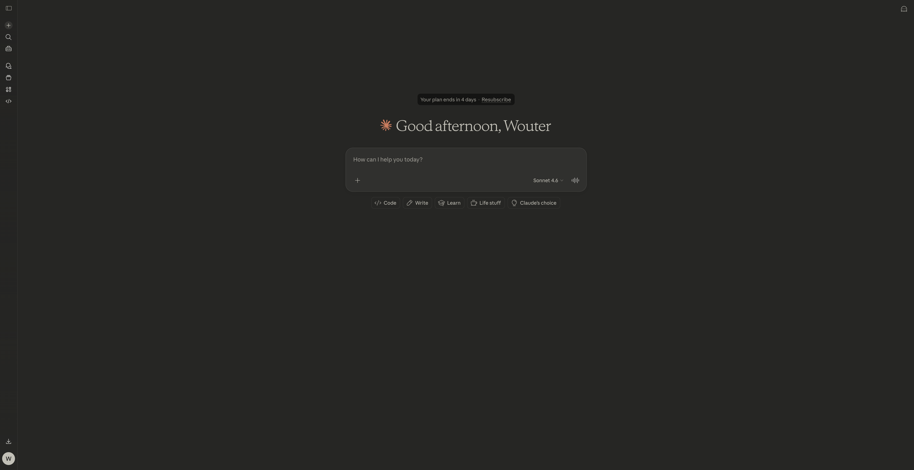
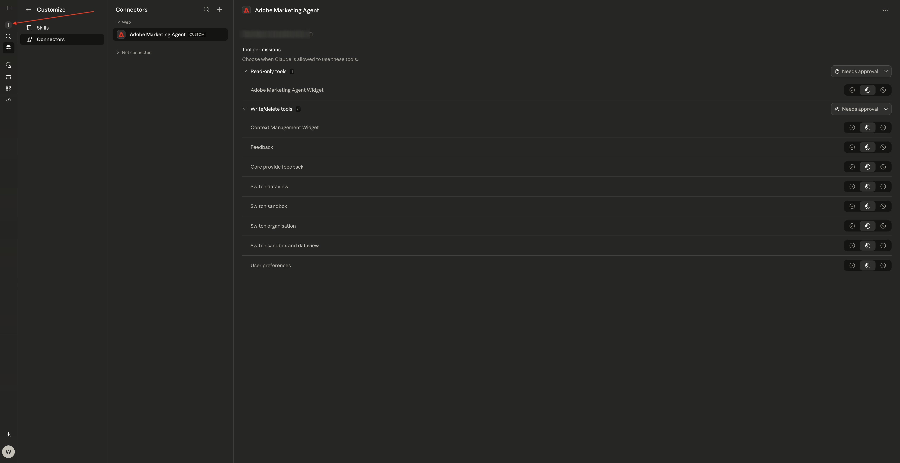
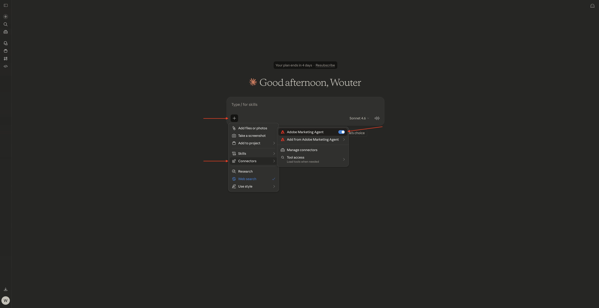
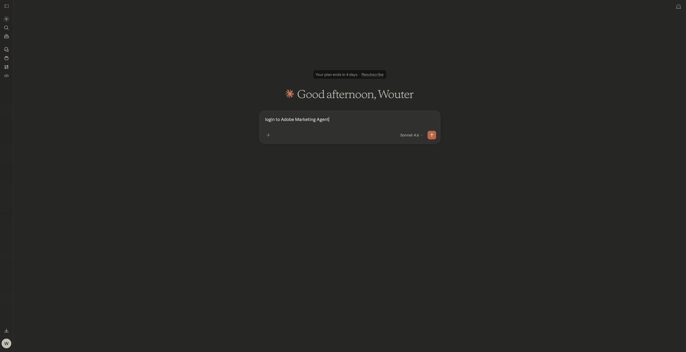
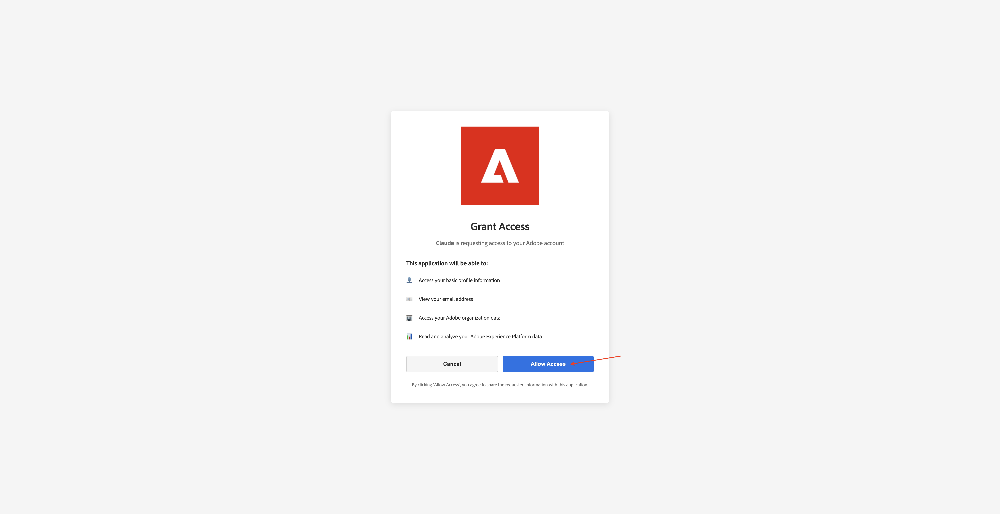
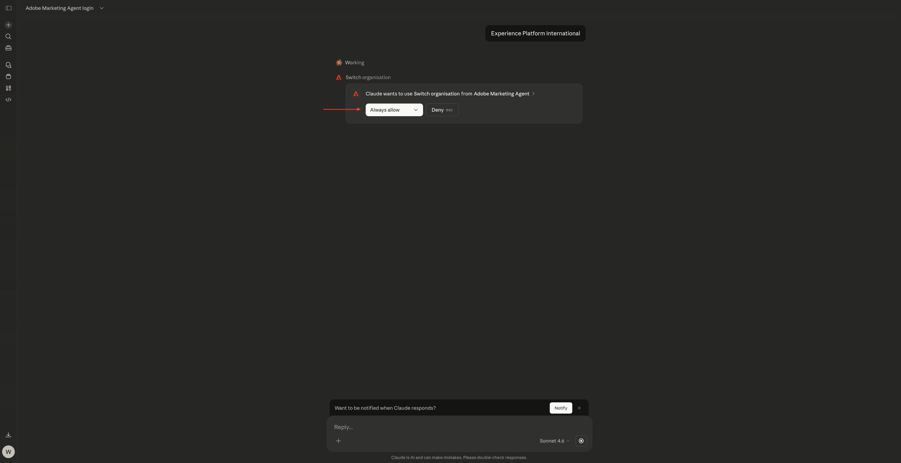

# 1.1.5 Adobe Marketing Agent para Claude

[!BADGE Beta]

+++Detalhes do Beta
Ao usar o Adobe Marketing Agent com Claude Beta, você reconhece que o Beta é fornecido &quot;no estado em que se encontra&quot; sem garantias de nenhum tipo. A Adobe não tem nenhuma obrigação de manter, corrigir, atualizar, alterar, modificar ou oferecer suporte à Beta. É recomendável ter cuidado e não depender de forma alguma do funcionamento ou desempenho correto desse Beta e/ou dos materiais que o acompanham. O Beta é considerado Informações confidenciais da Adobe.  Qualquer &quot;Feedback&quot; (informação sobre o Beta incluindo, mas não se limitando a, problemas ou defeitos encontrados durante o uso do Beta, sugestões, melhorias e recomendações) fornecido por Você ao Adobe é atribuído ao Adobe, incluindo todos os direitos, cargos e interesses no e no Feedback.

+++

## Pré-requisitos

Para seguir as etapas neste laboratório conforme documentado abaixo, o seguinte acesso é necessário:

- Acesso ao Real-Time CDP, Journey Optimizer e Customer Journey Analytics
- Acesso ao Assistente de IA no Adobe Experience Cloud
- Acesso ao AEP Agent Orchestrator
- Acesso a Claude

## Vídeo

Neste vídeo, você receberá uma explicação e uma demonstração de todas as etapas envolvidas neste exercício.

>[!VIDEO](https://video.tv.adobe.com/v/3482212?quality=12&learn=on)

Este laboratório está em desenvolvimento.

## 1.1.5.1 Criar aplicativo personalizado no Claude.ai para o CJA

>[!NOTE]
>
>O uso do Adobe Marketing Agent no Claude.ai exige o seguinte:
>- uma versão paga do Claude.ai

Vá para [https://claude.ai/](https://claude.ai/){target="_blank"} e faça logon usando os detalhes de sua conta. Depois de fazer logon, você deverá ver isso.



Clique para abrir sua conta e selecione **Configurações**.


Vá para **Connectors** e clique em **Ir para Personalizar**.


Clique em **+** e selecione **Adicionar conector personalizado**.


Preencha os campos desta forma:

- **Nome**: `Adobe Marketing Agent`
- **URL do Servidor MCP**: verifique com seu representante da Adobe

Clique em **Adicionar**.


Você deverá ver isso. Clique em **+** para iniciar um novo chat.



Clique no ícone **+**, vá para **Connectors** e verifique se o **Adobe Marketing Agent** está habilitado**.



## 1.1.5.2 Autenticar e definir contexto

Antes de interagir mais com o Adobe Marketing Agent por meio do Claude.ai, é necessário fazer logon e definir o contexto.

Digite o prompt a seguir e clique em **enviar**.

```
login to Adobe Marketing Agent
```



Selecione **Sempre permitir**.


Clique no link para fazer login no Adobe Marketing Agent**.


Clique em **Abrir link**.


Clique em **Permitir acesso**.



Depois de autenticar com êxito, você deve ver isso. Volte para Claude.


Digite o seguinte comando e clique em **enviar**.

```javascript
logged in
```


Agora você está conectado com êxito. A próxima etapa é definir o contexto. Digite o prompt a seguir e clique em **enviar**.


```javascript
change context
```


Selecione **Organização**. Você também pode repetir esse comando para alterar a sandbox e a visualização de dados posteriormente.


Insira o nome da sua instância e clique em **enviar**.


Selecione **Sempre permitir**.



Você deveria ver algo assim.


Se a sandbox ainda não estiver definida corretamente, você poderá usar o seguinte comando para alterar para a sandbox que precisa usar. Clique em **enviar**. Como alternativa, você pode usar o comando `change context` acima e selecionar **sandbox**

```javascript
change sandbox to --aepSandboxName--
```


Se a visualização de dados ainda não estiver definida corretamente, você poderá usar o seguinte comando para alterar para a sandbox que precisa usar (substitua XXX no comando abaixo pelo nome da visualização de dados). Clique em **enviar**. Como alternativa, você pode usar o comando `change context` acima e selecionar **exibição de dados**

```javascript
change dataview to XXX
```


Depois que a **Organização**, a **Sandbox** e a **Exibição de Dados** estiverem definidas corretamente, você estará pronto para começar a fazer perguntas à Adobe Marketing Agent.

## Próximas etapas

Voltar para [Agent Orchestrator](./agentorchestrator.md){target="_blank"}

[Voltar para Todos os Módulos](./../../../overview.md){target="_blank"}
