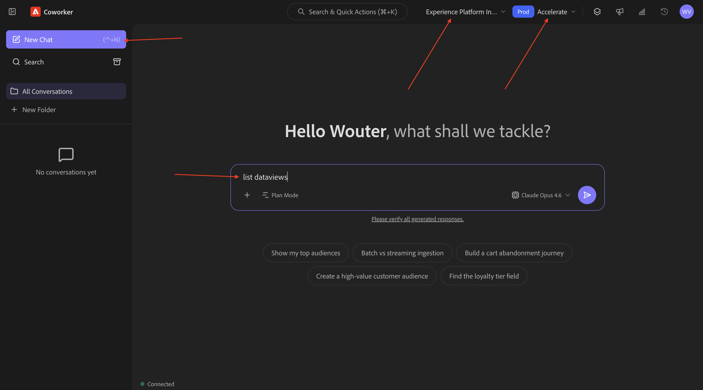
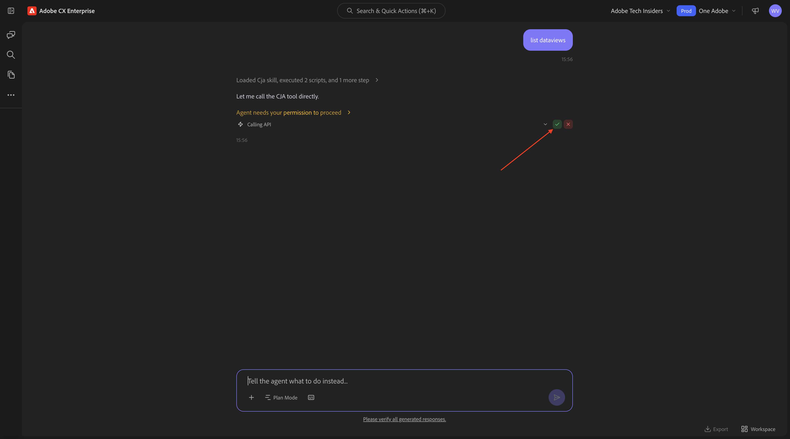
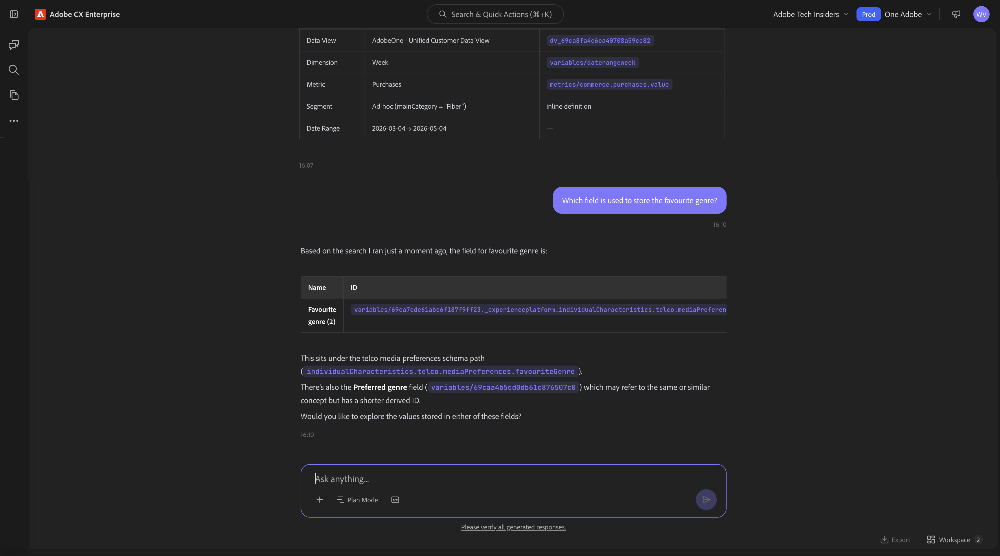
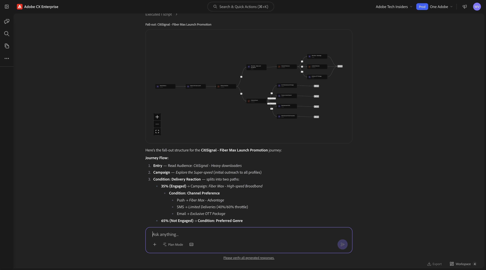
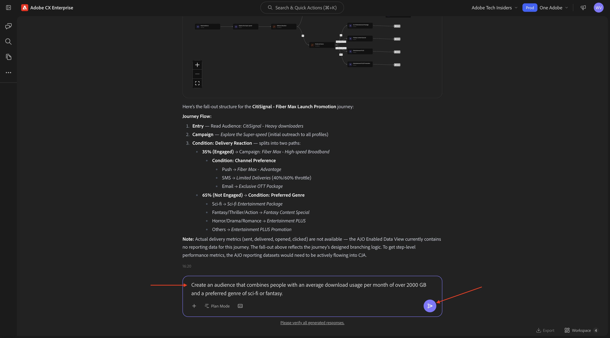
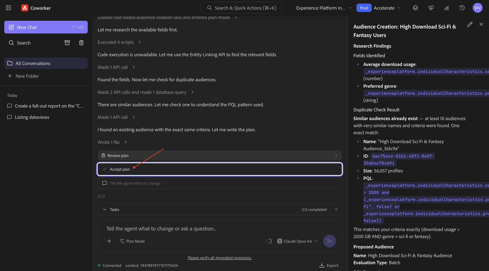
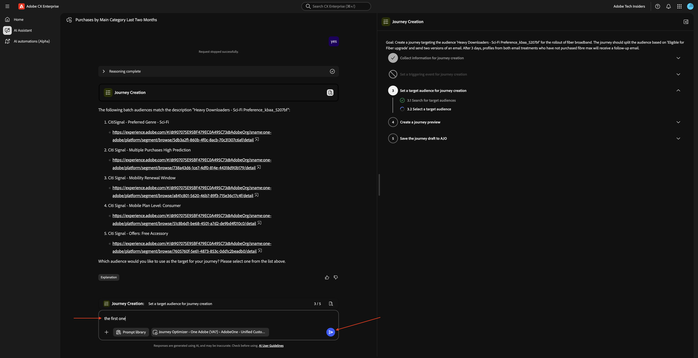
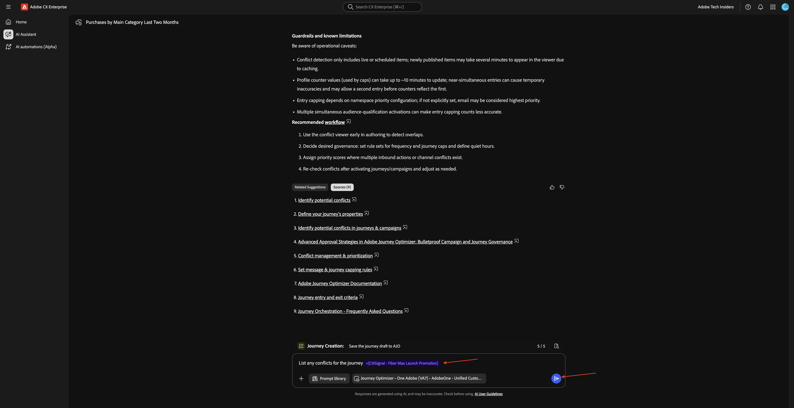
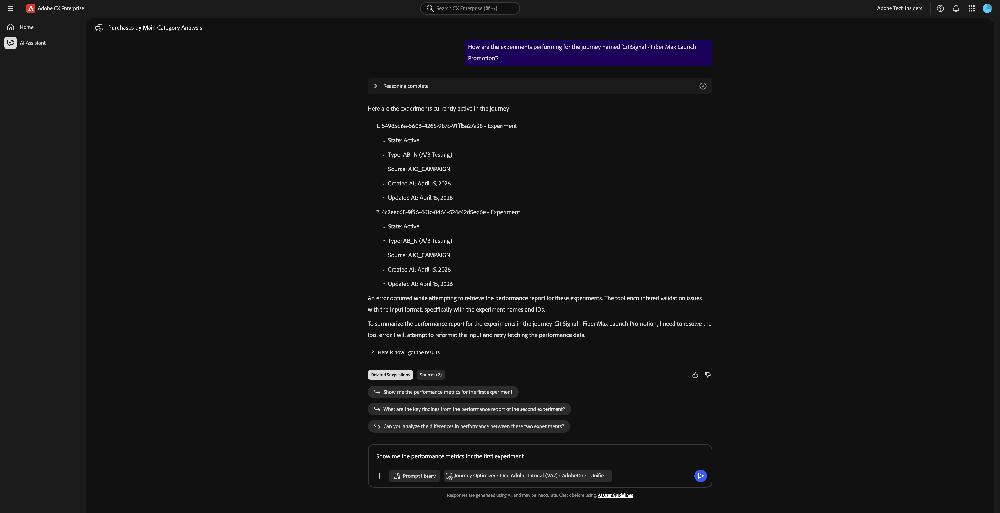

# 1.1.6 Cablagem de IA

## Pré-requisitos

Para seguir as etapas neste laboratório conforme documentado abaixo, o seguinte acesso é necessário:

- Acesso ao Real-Time CDP, Journey Optimizer e Customer Journey Analytics
- Acesso ao Assistente de IA no Adobe Experience Cloud
- Acesso ao AEP Agent Orchestrator
- O Node.js 18+ precisa ser instalado em seu sistema

## 1.1.6.1 Acessar o Agent Orchestrator

Ir para [https://ao.adobe.io/](https://ao.adobe.io/). Faça logon usando sua conta da Adobe. Depois de fazer logon, verifique se você selecionou a instância e a sandbox corretas alterando a seleção delas, conforme indicado abaixo.


## 1.1.6.2 Defina seu contexto

Digite o seguinte comando e clique em **Enviar**.

```
list dataviews
```



Você pode receber essa solicitação. Forneça as permissões necessárias.


Você pode receber essa solicitação. Forneça as permissões necessárias.



Você deverá ver isso. Digite o seguinte comando e clique em **Enviar**.

```
switch to dataview AdobeOne - Unified Customer Data View
```


Você deverá ver isso.


## 1.1.6.3 Comece com as tendências gerais de compra para ancorar o contexto e ampliar a fibra

**Propósito**

Obtenha pulsos de alto nível conforme a demanda da categoria — móvel, telefone fixo, Internet, TV, fibra — especificamente pelos últimos 60 dias. Isso define linhas de base para sazonalidade, efeitos promocionais e variação regional após a implantação em Nova York.

Insira o seguinte **Prompt** e clique no botão **enviar**.

```javascript
Show me purchases by mainCategory over the last 2 months.
```


Você deverá ver isso:


Insira o seguinte **Prompt** e clique no botão **enviar**.

```javascript
Show me purchases by mainCategory = Fiber over the last 2 months per week
```


Você verá isso, que detalha tendências específicas de fibra.


## 1.1.6.4 Correlacionar pedidos com preferências de conteúdo

**Propósito**

Teste a hipótese de que uma preferência por um gênero específico (por exemplo, ficção científica, esportes, drama) prevê o comportamento de atualização da banda larga, especialmente para necessidades de alta largura de banda.

Primeiro, você precisa descobrir qual campo é usado para armazenar a preferência de gênero.

Insira o seguinte **Prompt** e clique no botão **enviar**.

```javascript
Which field is used to store the favourite genre?
```


Você verá isto, que mostra que o campo usado para o gênero é **`--aepTenantId--.individualCharacteristics.telco.mediaPreferences.favouriteGenre`**.



Com essas informações, você pode começar a detalhar os dados de compra.

Insira o seguinte **Prompt** e clique no botão **enviar**.

```javascript
Show me purchases by favourite genre for the last 2 months
```


Você deverá ver isso.


## 1.1.6.5 Identificar Jornadas de Fibra Existentes

**Propósito**

Descubra quais jornadas ativas ou concluídas recentemente incluem &quot;Fibre&quot; no título, por exemplo, &quot;Fibre Upgrade NYC - Set&quot;, &quot;Fibre Trial - Streaming Bundle&quot;.

Insira o seguinte **Prompt** e clique no botão **enviar**.

```javascript
What journeys exist? 
```


Você deveria ver algo assim.


Insira o seguinte **Prompt** e clique no botão **enviar**.

```javascript
Which of these journeys has 'Fiber' in its name?
```


Você deverá ver isso. Clique no link em uma das jornadas.


Uma nova janela será aberta e você será direcionado para a visão geral de detalhes da jornada imediatamente.


## 1.1.6.6 Verifique qual público-alvo é usado

**Intenção**:

Entenda a definição inicial da jornada &quot;CitiSignal - Promoção de inicialização máxima de fibra&quot; — quais características impulsionaram o direcionamento (por exemplo, &quot;Preferência de gênero SciFi&quot;, &quot;4+ dispositivos&quot;, &quot;fluxo ≥ 300 GB/mês&quot;).

Insira o seguinte **Prompt** e clique no botão **enviar**.

```javascript
What was the initial audience in the journey named CitiSignal - Fiber Max Launch Promotion?
```


Você deverá ver isso.


## 1.1.6.7 Validar o desempenho da jornada através da análise de fallout

**Propósito**

Você deseja entender o fallout de desempenho da jornada para saber se há nós ou condições na jornada que estão enfrentando uma grande porcentagem de perfis que estão sendo descartados. Isso é útil para entender se são necessários ajustes adicionais na jornada.

Insira o seguinte **Prompt** e clique no botão **enviar**.

```javascript
Create a fall-out report on the "CitiSignal - Fiber Max Launch Promotion" journey
```


Você deverá ver isso.



## 1.1.6.8 Criar um novo público

**Propósito**

Com base nas descobertas e pesquisas acima, há uma correlação entre clientes que consomem muitos dados e que têm um gênero preferido de ficção científica ou fantasia. Agora você combinará esses atributos em um público-alvo.

Insira o seguinte **Prompt** e clique no botão **enviar**.

```javascript
Create an audience that combines people with an average download usage per month of over 2000 GB and a preferred genre of sci-fi or fantasy.
```



Se forem semelhantes, os públicos já existentes já estarão disponíveis, você deverá ver uma mensagem semelhante.


Revise o plano. Clique em **Aprovar plano**.



Seu público-alvo foi criado.


>[!NOTE]
>
>Ao criar um novo público-alvo, levará 24 horas até que ele esteja disponível para o Assistente de IA para uso adicional.

## 1.1.6.9 Encontre públicos-alvo existentes alinhados a alto uso e verifique se eles estão em uso

**Intenção**:

Localize qualquer público-alvo chamado de &quot;downloaders pesados&quot;, definido pelos limites mensais de uso de dados.

>[!NOTE]
>
>Na etapa anterior, você criou um novo público-alvo. Lembre-se de que levará 24 horas até que o público-alvo esteja disponível para o Assistente de IA para uso adicional. Em vez disso, você deve usar outro público já existente.

Insira o seguinte **Prompt** e clique no botão **enviar**.

```javascript
Is there an audience that has "heavy downloaders" in the title?
```


Você deverá ver isso. Agora você deseja ver todos os seus públicos-alvo e o quanto eles mudaram nos últimos dias.

Insira o seguinte **Prompt** e clique no botão **enviar**.

```javascript
List how much these audiences changed over the last few days.
```


Você deverá ver isso. Clique em **Mostrar mais**.


Você deverá ver isso. Clique em para fechar o painel direito.


Role para baixo um pouco para analisar as etapas executadas pelo Assistente de IA.


Já existem alguns públicos-alvo para &quot;downloads pesados&quot;. Vamos ver se elas já estão em uso.

Insira o seguinte **Prompt** e clique no botão **enviar**.

```javascript
Which of the above are used in a journey? 
```


Você verá algo semelhante a isso.


Agora você deve verificar se essa jornada está ativa. Insira o seguinte **Prompt** e clique no botão **enviar**.

```javascript
Are these journeys active? 
```


Você verá algo semelhante a isso. Nenhuma dessas jornadas está em execução no momento.


Para o próximo lançamento do Fiber Max, você deve criar uma nova jornada.

## 1.1.6.10 Criar nova Jornada para lançamento de máximo de fibra

**Intenção**:

Criar uma nova jornada direcionada ao público-alvo composto:

Preferência de SciFi para baixadores pesados.

Insira o seguinte **Prompt** e clique no botão **enviar**.

```javascript
Create a  journey towards the audience Heavy Downloaders - Sci-Fi Preference_kbaa_5207bf. The journey is for the rollout of fiber broadband. There will 2 versions of an email  based on  a split of the audience based on who is in the "Eligble for Fiber upgrade" audience.  After 3 days, profiles from both email treatments who have not purchased fibre max will be sent a follow up email. 
```


Você deverá ver isso. Insira `yes` e clique em gerar.


Você deverá ver isso. Insira `yes` e clique em gerar.


Você deverá ver isso. Digite `The first one` e clique em enviar.



Você deverá ver isso. Digite `yes` e clique em enviar.


Revise a resposta. Digite `yes` e clique em enviar.


Clique em **Revisão**.


Atualize o nome da jornada com seu LDAP para torná-lo exclusivo. Clique em **Salvar**.


Sua jornada foi criada no modo de rascunho.


## 1.1.6.11 Gerenciamento de Conflitos de Jornada

Insira o seguinte **Prompt** e clique no botão **enviar**.

```javascript
How can I manage journey conflicts?
```


Revise as informações.


Role para baixo e selecione as **Fontes** para descobrir que as informações são provenientes da Experience League.


Insira o seguinte **Prompt** e clique no botão **enviar**.

```javascript
List any conflicts for the journey +CitiSignal Fiber Max
```

Em seguida, selecione manualmente a jornada **CitiSignal - Fibre Max Launch Promotion** na lista.


Você deverá ver isso. Clique em **enviar**.



Revise as informações de conflito da jornada.


Role para baixo para encontrar mais detalhes sobre conflitos de jornada.


## 1.1.6.12 Experimentos

Insira o seguinte **Prompt** e clique no botão **enviar**.

```javascript
How are the experiments performing for the journey named 'CitiSignal - Fiber Max Launch Promotion'?
```


Você deverá ver isso:


Role para baixo e clique em uma das sugestões. Clique em **enviar**.

>[!NOTE]
>
>As sugestões são dinâmicas, portanto, você deve esperar ver sugestões diferentes sempre que uma resposta for gerada. Suas sugestões provavelmente serão diferentes das sugestões mostradas nesta captura de tela.



Você deverá ver uma resposta detalhada relacionada à sugestão que foi escolhida.


Você concluiu este laboratório.

## Próximas etapas

Voltar para [Agent Orchestrator](./agentorchestrator.md){target="_blank"}

[Voltar a todos os módulos](./../../../overview.md){target="_blank"}

