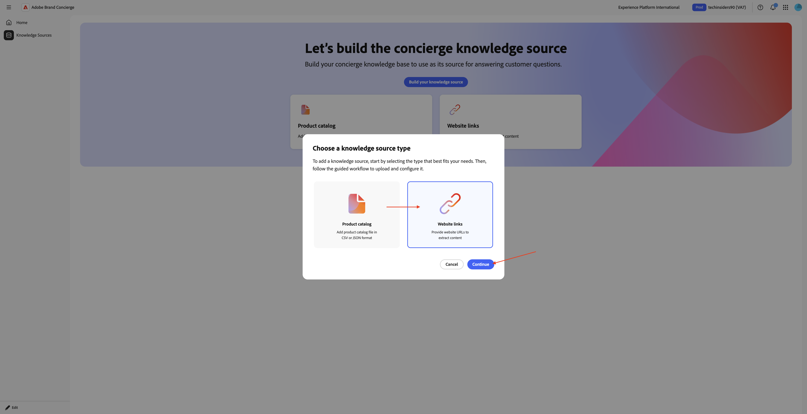

# 1.4.1 Introdução ao Brand Concierge

## Visão geral do Brand Concierge 1.4.1.1

Ao configurar o Brand Concierge, você usará dois elementos principais:

- **Agent Composer (Camada de Configuração)**

  Propósito: a plataforma de interface do usuário principal usada para criar e configurar experiências de IA de conversação.

  Principais responsabilidades:

   - Definir e gerenciar fontes de dados e bases de conhecimento
   - Definir a expressão da marca (tom, estilo, medidas de proteção)
   - Configurar o agente de reserva de reunião

- **Agent Orchestrator (Mecanismo de Execução)**

  Propósito: o mecanismo de raciocínio e orquestração que interpreta as solicitações do usuário e executa as ações apropriadas do agente.

  Principais responsabilidades:

   - Interpretar intenções de usuários em linguagem natural
   - Gerar e executar planos de raciocínio em várias etapas
   - Selecione e chame os operadores/ferramentas apropriados
   - Impor o contexto da marca, a conformidade e as medidas de proteção
   - Coordenar fluxos de trabalho de vários agentes
   - Agregar e compor respostas de várias fontes de dados

- **Tempo de Execução de Conversação do Brand Concierge (Camada de Serviço)**

  Finalidade: a camada de serviço de conversação voltada para o cliente que gerencia sessões de bate-papo, contexto e interações com o cliente.

  Componentes principais:

   - Agente da Web (cliente): interface de usuário de navegador ou bate-papo móvel integrada usando o Web SDK
   - Serviço de conversa (back-end): gerencia o estado da sessão e atua como gateway de orquestração

  Principais responsabilidades:

   - Gerenciar sessões de usuário e transcrições de conversa
   - Lidar com autenticação e perfis de usuário
   - Rotear mensagens entre o cliente e o Agent Orchestrator
   - Contexto de conversa persistente
   - Registra eventos comportamentais e operacionais no AEP para análise
   - Aplicar configurações específicas de superfície

## Configuração da instância do Brand Concierge 1.4.1.2

Para começar a criar sua própria instância do Brand Concierge, siga as etapas abaixo.

Ir para [https://experience.adobe.com/](https://experience.adobe.com/){target="_blank"}. Abra o **Brand Concierge**.


Você deverá ver isso. Clique no menu **seleção de sandbox**. Escolha a sandbox que foi atribuída a você. Essa sandbox deve ser chamada `techinsidersX` (substitua X pelo número atribuído).


Em seguida, preencha as seguintes variáveis:

- **Nome da empresa**: CitiSignal

- **nome da concierge**: `CitiSignal Sales Assistant`.

Digite o seguinte texto em **O que você deseja que a concierge faça?**.

```javascript
Brand Concierge should help customers find their best device, plan or entertainment deal. Brand Concierge should help users discover internet plans, entertainment deals,  and help find the best available packages. Brand Concierge should also answer questions about devices such as phones and watches.
```

- **Link do site**: forneça o link para o site que você está usando

Clique em **Continuar**.


Você deverá ver isso. Essas informações foram geradas usando IA com base na entrada fornecida na página anterior. Revise as informações e quando estiver satisfeito com elas, clique em **Gerar concierge**.


Você deverá ver isso. Clique em **+ Adicionar** ao lado de **consultoria de produto para consumidores**.


Você deverá ver isso. Preencha os campos a seguir usando o texto abaixo.

**O que o concierge deve saber sobre o produto ou público-alvo antes de fazer recomendações?**

```
CitiSignal is a telecommunications company that sells devices such as phones and watches and that sells internet services such as their lead product CitiSignal Fiber Max. On top of that, CitiSignal sells entertainment services that offer premium streaming services at a discounted price. CitiSignal is targeting these 3 personas primarily: Smart Home Families, Online Gamers and Remote Professionals.
```

**Há regras ou limitações comerciais que a equipe de concierge deve seguir ao fazer recomendações?**

```
Prioritize positioning the CitiSignal Fiber Max offering.
```

**Há palavras-chave ou frases específicas que a concierge deve seguir ou evitar?**

```
Competitor pricing, competitor products
```

Clique em **Salvar**.


Clique na **seta** para voltar à tela anterior.


Vá para **Knowledge Source** e clique em **Criar sua fonte de conhecimento**.


Selecione **Links do site** e clique em **Continuar**.



Você deverá ver isso. Digite `CitiSignal website` como nome para sua fonte de conhecimento.

Agora é necessário carregar um arquivo csv que contenha os links do seu site. Baixe o [site do CitiSignal vincula o arquivo CSV](./assets/citisignal-website-links.csv) à área de trabalho.

Clique em **Procurar Arquivos**.


Abra o arquivo **citisignal-website-links.csv** e atualize os links para apontar para o seu próprio site CitiSignal.


Selecione o arquivo **citisignal-website-links.csv** que você acabou de baixar e editar. Clique em **Abrir**.


Seu arquivo foi adicionado a esta fonte de conhecimento. Clique em **Adicionar**.


Você deverá ver isso. Clique em **Criar sua fonte de conhecimento**.


Selecione **Catálogo de produtos** e clique em **Continuar**.


Você deverá ver isso. Digite `CitiSignal Products` como nome para sua fonte de conhecimento. Clique em **Procurar Arquivos** e selecione **Procurar no dispositivo**.


Agora é necessário carregar um arquivo csv que contenha os links do seu site. Baixe o [catálogo de produtos CitiSignal](./assets/CitiSignal-catalog.json.zip) na área de trabalho e descompacte-o.


Selecione o arquivo **CitiSignal-catalog.json** e clique em **Abrir**.


Você deverá ver isso. Clique em **Adicionar**.


Você estará de volta aqui. O processamento levará de 10 a 20 minutos, portanto, você terá que voltar aqui posteriormente para verificar se o processamento foi bem-sucedido.


## Etapas de integração do AEP 1.4.1.3

O Brand Concierge usa o Adobe Experience Platform para armazenar dados de interação de conversas. A conexão entre o Brand Concierge e o Experience Platform requer que um fluxo de dados seja configurado e usado pelo Brand Concierge.

### Sequência de dados

Ir para [https://experience.adobe.com/](https://experience.adobe.com/){target="_blank"}. Abra o **Experience Platform**.


Verifique se você selecionou a sandbox correta, que deve ser chamada `techinsidersX`. No menu esquerdo, role para baixo e selecione **Datastreams**.


Clique em **Nova sequência de dados**.


Insira o **Nome da Sequência de Dados** `--aepUserLdap-- - Brand Concierge` e selecione o **Esquema de Mapeamento** `cja-brand-concierge-sb-XXX`.

Clique em **Salvar**.


A sequência de dados agora está configurada. Copie o nome e a ID da sequência de dados e anote-os em um arquivo de texto no computador.


### Gerenciamento de configuração de sequência de dados

A próxima etapa é habilitar a API de Gerenciamento de configuração do Brand Concierge para configurar o fluxo de dados que você acabou de criar. Isso é necessário para resolver problemas como ID de organização IMS e detalhes da sandbox durante o processamento de solicitações.

Vá para **Página Inicial** e selecione **Controles de administrador**.


Vá para **Gerenciamento de Configuração da Sequência de Dados** e clique em **Adicionar Configuração**.


Cole a **ID da sequência de dados** da sequência de dados criada anteriormente. Clique em **Salvar**.


Você deveria ver algo assim.


## Gerenciamento de configuração de estilo do 1.4.1.4

Vá para **Gerenciamento de Configuração de Estilo**. Clique em **Inicializar configuração de estilo**.


Insira o **Nome da Marca** `CitiSignal` e clique em **Inicializar configuração de estilo**.


Você deverá ver isso.


## Manifesto do Agent Orchestrator 1.4.1.5

Ir para **Atualizar Manifesto**. Você deverá ver isso. Revise as informações em cada campo e faça alterações, se necessário. Depois de fazer as alterações, clique em **Atualizar manifesto.


## 1.4.1.6 Concluir configuração da fonte de conhecimento

Ir para **Fontes de Conhecimento**. Após 10-20 minutos, o **Status** das duas fontes de conhecimento deve ser **Concluído**. Quando o status for **Sucesso** para ambas as fontes de conhecimento, clique em **Página inicial**.


Você deverá ver isso. Clique em **+ Conectar** no cartão **Links de site**.


Selecione o site **CitiSignal** de origem do conhecimento e clique em **Salvar**.


Você deverá ver isso. Clique em **+ Conectar** no cartão **Catálogo de produtos**.


Selecione a fonte de conhecimento **CitiSignal Products** e clique em **Salvar**.


Você deverá ver isso. Clique em **Visualizar** para começar a interagir com a Brand Concierge.


Agora você pode começar a fazer perguntas relacionadas às fontes de conhecimento fornecidas.


Digite a pergunta `what products do you sell?` e clique em **enviar**.


Você deverá receber uma resposta semelhante de volta.


A instância do Brand Concierge agora está pronta para ser implementada no site.

## Próximas etapas

Ir para [Implementar o Brand Concierge no seu site](./ex2.md){target="_blank"}

Voltar para [Brand Concierge](./brandconcierge.md){target="_blank"}

[Voltar para Todos os Módulos](./../../../overview.md){target="_blank"}
