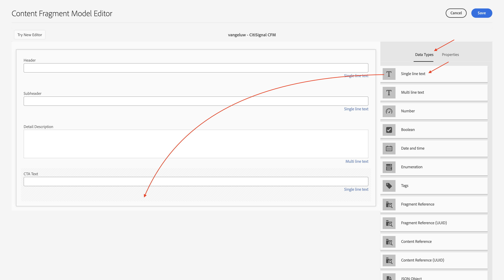
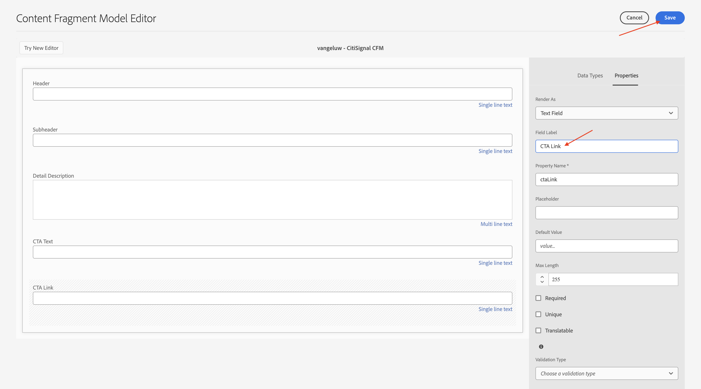
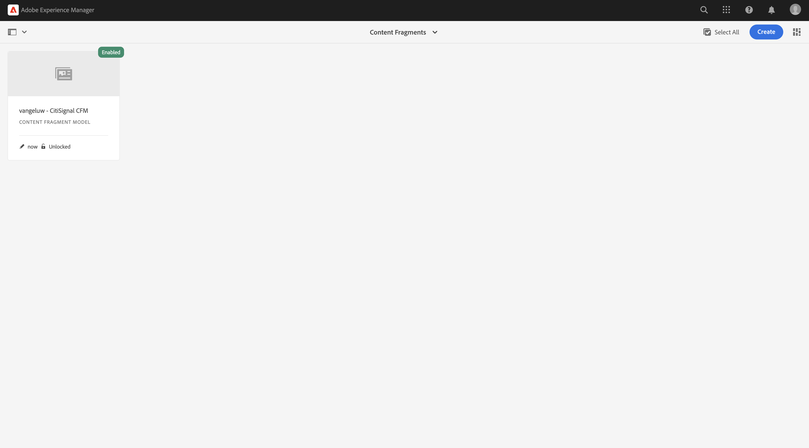
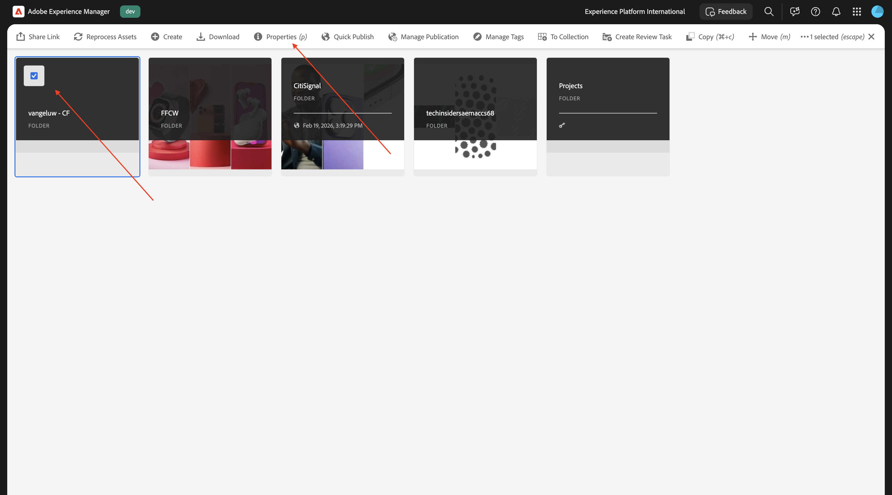
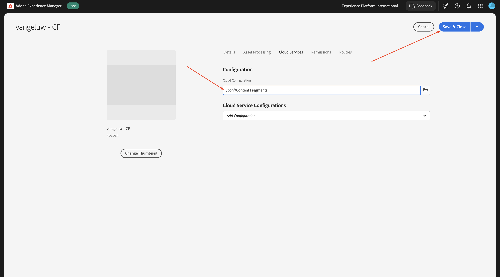
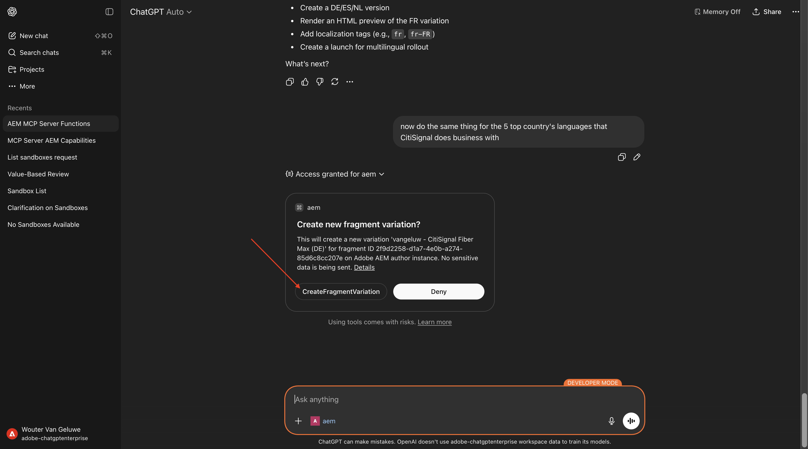
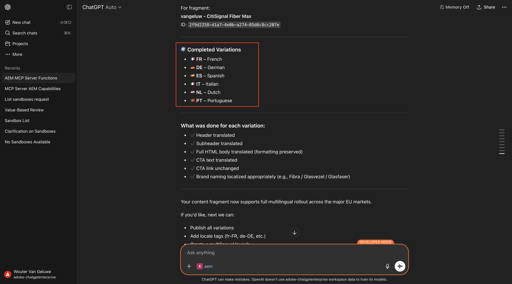

# 1.6.3 Dimensionar fragmentos de conteúdo com o servidor ChatGPT e MCP

>[!IMPORTANT]
>
>Para concluir este exercício, você precisa ter acesso a um ambiente de trabalho do AEM Sites e do Assets CS com EDS e os vários agentes do AEM precisam estar habilitados para a organização IMS que você está usando.
>
>Se você ainda não tiver esse ambiente, vá para o exercício [Adobe Experience Manager Cloud Service &amp; Edge Delivery Services](./../../../modules/asset-mgmt/module2.1/aemcs.md){target="_blank"}. Siga as instruções aqui e você terá acesso a esse ambiente.

>[!IMPORTANT]
>
>Se você configurou anteriormente um programa do AEM CS com um ambiente do AEM Sites e do Assets CS, pode ser que sua sandbox do AEM CS tenha hibernado. Considerando que a deshibernação de uma sandbox desse tipo leva de 10 a 15 minutos, seria uma boa ideia iniciar o processo de deshibernação agora para que você não precise aguardar mais tarde.

## 1.6.3.1 Criar modelo de fragmento de conteúdo

Volte para o ambiente de Autor do Adobe Experience Manager, para **Ferramentas** e vá para **Navegador de Configuração**.


Clique em **Criar**.


Use `Content Fragments` para os campos **Título** e **Nome**.

Verifique se as opções **Modelos de fragmento do conteúdo** e **Consultas GraphQL persistidas** estão habilitadas.

Clique em **Criar**.


Volte para o ambiente de autor do Adobe Experience Manager e vá para **Fragmentos de conteúdo**.


Vá para **Modelos de fragmentos do conteúdo**, selecione sua configuração **Fragmentos do conteúdo** e clique em **Criar**.


Use o nome `--aepUserLdap-- - CitiSignal CFM`. Clique em **Criar e abrir**.


Você deverá ver isso. Arraste e solte um campo **Texto de linha única** sobre a tela.


Altere o campo **Rótulo do campo** para `Header`.


Volte para **Tipos de Dados**. Arraste e solte um campo **Texto de linha única** sobre a tela.


Altere o campo **Rótulo do campo** para `Subheader`.


Volte para **Tipos de Dados**. Arraste e solte um campo **Texto de várias linhas** na tela.


Altere o campo **Rótulo do campo** para `Detail Description`.


Volte para **Tipos de Dados**. Arraste e solte um campo **Texto de linha única** sobre a tela.


Altere o campo **Rótulo do campo** para `CTA Text`.


Volte para **Tipos de Dados**. Arraste e solte um campo **Texto de linha única** sobre a tela.



Altere o campo **Rótulo do campo** para `CTA Link`. Clique em **Salvar**.



Você deverá ver isso.



Selecione o modelo de fragmento de conteúdo e clique em **Publicar**.


Clique em **Publicar**.


## 1.6.3.2 Criar fragmento de conteúdo

Volte para o ambiente de autor do Adobe Experience Manager e vá para **Fragmentos de conteúdo**.


Você deverá ver isso. Clique em **Criar** e selecione **Pasta**.


Digite o título: `--aepUserLdap-- - CF`. Clique em **Criar**.


Volte para o ambiente de Autor do Adobe Experience Manager e vá para **Assets**.


Vá para **Arquivos**.


Selecione a pasta que acabou de criar, que deve se chamar `--aepUserLdap-- - CF` e clique em **Propriedades**.



Vá para **Cloud Services** e clique no ícone **pasta**.


Selecione a configuração de nuvem criada anteriormente, que deve se chamar **Fragmentos de conteúdo**. Clique em **Selecionar**.


Você deverá ver isso. Clique em **Salvar e fechar**.



Volte para o ambiente de autor do Adobe Experience Manager e vá para **Fragmentos de conteúdo**.


Você deverá ver isso. Clique em **Criar** e selecione **Fragmento do conteúdo**.


Selecione o **Modelo de fragmento de conteúdo** criado anteriormente, que deve ser nomeado como `--aepUserLdap-- - CitiSignal CFM`. Use o nome `--aepUserLdap-- CitiSignal Fiber Max`.

Clique em **Criar e abrir**.


Você deverá ver isso.


Preencha os campos desta forma:

- **Cabeçalho**: `CitiSignal Fiber Max`
- **Subcabeçalho**: `Experience high speed internet now`
- **Descrição detalhada**:

```
Experience the future of connectivity with CitiSignal Fiber Max, the ultimate solution for high-speed internet. Designed for homes and businesses that demand performance, Fiber Max delivers blazing-fast fiber speeds, ensuring seamless streaming, ultra-responsive gaming, and crystal-clear video calls.

Key Features:

Unmatched Speed: Enjoy lightning-fast downloads and uploads powered by cutting-edge fiber technology.
Reliable Performance: Consistent connectivity for work, entertainment, and everything in between.
Future-Ready: Built to handle the growing demands of smart homes and digital lifestyles.
Unlimited Potential: No data caps, no throttling—just pure speed.
Why Choose CitiSignal Fiber Max? Stay ahead with internet that works as hard as you do. Whether you’re powering a remote office or streaming in 4K, Fiber Max ensures you never miss a beat.
```

**Texto do CTA**: `Upgrade now by signing your new contract!`
**Link do CTA**: `https://techinsiders68.adobedemosystem.com/`

Clique em **Publicar** e selecione **Agora**.


Clique em **Publicar**.


## 1.6.3.3 Configurar o servidor MCP no ChatGPT

>[!NOTE]
>
>O uso do Adobe Marketing Agent no ChatGPT requer o seguinte:
>- uma versão paga do ChatGPT Enterprise da OpenAI
>- usar o cliente Web ChatGPT Enterprise

Vá para [https://chatgpt.com/](https://chatgpt.com/){target="_blank"} e faça logon usando os detalhes de sua conta. Depois de fazer logon, você deverá ver isso. Clique no seu nome de usuário e selecione **Configurações**.


Vá para **Aplicativos** e selecione **Configurações avançadas**.


Ative o **Modo de desenvolvedor** e clique em **Voltar**.


Clique em **Criar aplicativo**.


Preencha os campos desta forma:

- **Nome**: `aem`
- **URL do Servidor MCP**: `https://mcp.adobeaemcloud.com/adobe/mcp/content`
- **Autenticação**: `OAuth`

Marque a caixa de seleção **Entendo e desejo continuar**.

Clique em **Criar**.


O ChatGPT agora tentará se conectar à sua conta da Adobe. Selecione **Permitir acesso** e você terá que fazer logon com sua conta da Adobe.

Depois de fazer logon, você deve ver que seu Adobe Marketing Agent agora está conectado com êxito.


## 1.6.3.4 Usar o servidor MCP do AEM no ChatGPT

Feche esta janela.


Você deverá ver isso. Clique no ícone **+**, vá para **Mais** e selecione **aem**.


Digite o prompt a seguir e clique em **Enviar**.

```
I just created a new custom mcp server named 'aem'. what can I do with that?
```


Você deveria ver algo assim. Digite o prompt a seguir e clique em **Enviar**.

```
use the author url https://author-pXXXXXX-eXXXXXXX.adobeaemcloud.com/ from now on
```


Você deveria ver algo assim. Digite o prompt a seguir e clique em **Enviar**.

```
find the content fragment --aepUserLdap-- - CitiSignal Fiber Max and make a variation called --aepUserLdap-- - CitiSignal Fiber Max (FR), then translate all fields into french
```


Clique em **CreateFragmentVariation**.


Clique em **UpdateFragment**.


Você deverá ver isso. A variação do fragmento foi criada com sucesso.


Agora você também pode ver sua nova variação na interface do usuário do AEM.


Em seguida, use o ChatGPT para traduzir o fragmento de conteúdo em mais variações. Digite o prompt a seguir e clique em **Enviar**.

```
now do the same thing for the 5 top country's languages that CitiSignal does business with
```


Confirme sua escolha de idioma.


Clique em **CreateFragmentVariation**.



Clique em **UpdateFragment**.


Repita esse processo para cada idioma selecionado. Depois de concluído, você verá algo assim.



Volte para a interface do usuário do AEM e atualize a tela. Agora você pode ver suas novas variações no fragmento de conteúdo.


## Próximas etapas

Voltar para [AEM e Agentes](./aemagents.md){target="_blank"}

[Voltar para Todos os Módulos](./../../../overview.md){target="_blank"}
