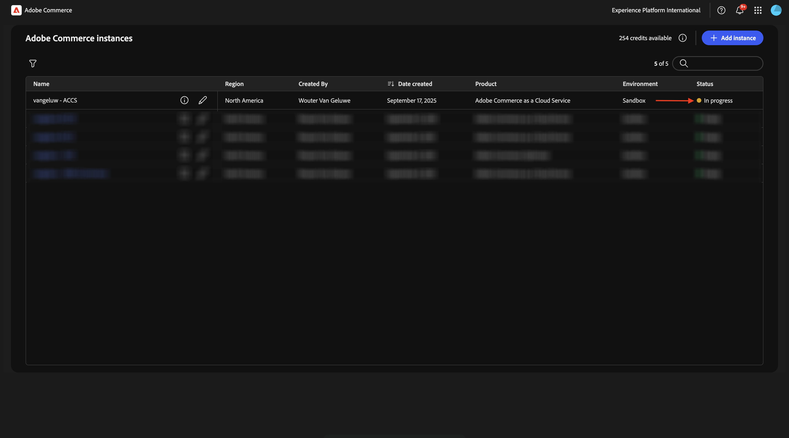
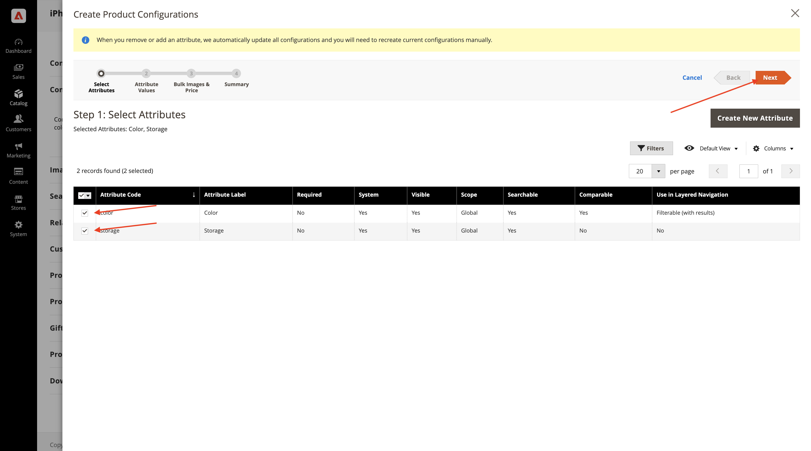

# 1.5.1 Introdução ao Adobe Commerce as a Cloud Service

Ir para [https://experience.adobe.com/](https://experience.adobe.com/){target="_blank"}. Verifique se você está no ambiente correto, que deve ser nomeado como `--aepImsOrgName--`. Clique em **Commerce**.

## 1.5.1.1 Crie sua instância ACCS

Você deverá ver isso. Clique em **+ Adicionar instância**.

Preencha os campos desta forma:

- **Nome da instância**: `--aepUserLdap-- - ACCS`
- **Ambiente**: `Sandbox`
- **Região**: `North America`

Clique em **Adicionar instância**.

Sua instância está sendo criada. Isso pode levar de 5 a 10 minutos.

Quando a instância estiver pronta, clique na instância para abri-la.

## 1.5.1.2 Configurar o armazenamento do CitiSignal

Você deverá ver isso. Clique em **Entrar com o Adobe ID** e faça logon.

Depois de fazer logon, você deverá ver esta página inicial. O primeiro passo é configurar a loja do CitiSignal no Commerce. Clique em **Lojas**.

Clique em **Todas as lojas**.

Clique em **Criar Site**.

Preencha os campos desta forma:

- **Nome**: `CitiSignal`
- **Código**: `citisignal`

Clique em **Salvar Site**.

Você deveria voltar aqui. Clique em **Criar armazenamento**.

Preencha os campos desta forma:

- **Site**: `CitiSignal`
- **Nome**: `CitiSignal`
- **Código**: `citisignal`
- **Categoria raiz**: `Default Category`

Clique em **Salvar armazenamento**.

Você deveria voltar aqui. Clique em **Criar Exibição de Loja**.

Preencha os campos desta forma:

- **Armazenamento**: `CitiSignal`
- **Nome**: `CitiSignal`
- **Código**: `citisignal`
- **Status**: `Enabled`

Clique em **Salvar Exibição da Loja**.

Você deverá ver essa mensagem. Clique em **OK**.

Você deveria voltar aqui. Clique no site **CitiSignal** para abri-lo.

Marque a caixa de seleção para definir este site como o site padrão.

Clique em **Salvar Site**.

Você deveria voltar aqui.

## 1.5.1.3 Configurar Categorias e Produtos

Vá para **Catálogo** e selecione **Categorias**.

Selecione **Categoria Padrão** e clique em **Adicionar Subcategoria**.

Insira o nome `Phones` e clique em **Salvar**.

Selecione **Categoria padrão** e clique novamente em **Adicionar subcategoria**.

Insira o nome `Watches` e clique em **Salvar**.

Em seguida, você deve criar duas categorias.

Em seguida, vá para **Catálogo** e selecione **Produtos**.

Você deverá ver isso. Clique em **Adicionar produto**.

Configure seu produto da seguinte maneira:

- **Nome do Produto**: `iPhone Air`
- **SKU**: `iPhone-Air`
- **Preço**: `999`
- **Quantidade**: `10000`
- **Categorias**: selecione `Phones`

Clique em **Salvar**.

Role para baixo até **Configurações** e clique em **Criar configurações**.

Você deverá ver isso. Clique em **Criar Novo Atributo**.

Defina o **Rótulo Padrão** como `Storage` e clique em **Adicionar Opção** em **Gerenciar Opções**.

Configure a primeira opção usando o nome `256GB` em todas as três colunas e clique novamente em **Adicionar Opção**.

Configure a segunda opção usando o nome `512GB` em todas as três colunas e clique novamente em **Adicionar Opção**.

Configure a terceira opção usando o nome `1TB` em todas as 3 colunas.

Role para baixo até **Propriedades da vitrine**. Defina as seguintes opções como **Sim**:

- **Usar na Pesquisa**
- **Permitir Marcas do HTML na Loja**
- **Visível nas Páginas do Catálogo na Loja**
- **Uso na Listagem de Produtos**

Role para cima e clique em **Salvar Atributo**.

Você deverá ver isso. Selecione ambos os atributos para **cor** e **armazenamento** e clique em **Avançar**.

Você deverá ver isso. Agora é necessário adicionar as opções de cor disponíveis. Para fazer isso, clique em **Criar novo valor**.

Insira o valor `Sky-Blue` e clique em **Criar novo valor**.

Insira o valor `Light-Gold` e clique em **Criar novo valor**.

Insira o valor `Cloud-White` e clique em **Criar novo valor**.

Insira o valor `Space-Black`. Clique em **Selecionar tudo**

Selecione todas as 3 opções em **Armazenamento** e clique em **Avançar**.

Mantenha as configurações padrão e clique em **Avançar**.

Você deverá ver isso. Clique em **Gerar Produtos**.

Defina a **Quantidade** de cada produto para `10000`. Clique em **Salvar**.

Role para baixo até **Produto em Sites** e marque a caixa de seleção **CitiSignal**.

Clique em **Salvar**.

Clique em **Confirmar**.

Você deverá ver isso. Clique em **Voltar**.

Agora você verá o produto **iPhone Air** e suas variações no Catálogo de Produtos.

Próxima etapa: [Conectar o ACCS à Loja AEM Sites CS/EDS](./ex2.md){target="_blank"}

Voltar para o [Adobe Commerce as a Cloud Service](./accs.md){target="_blank"}

[Voltar para Todos os Módulos](./../../../overview.md){target="_blank"}
