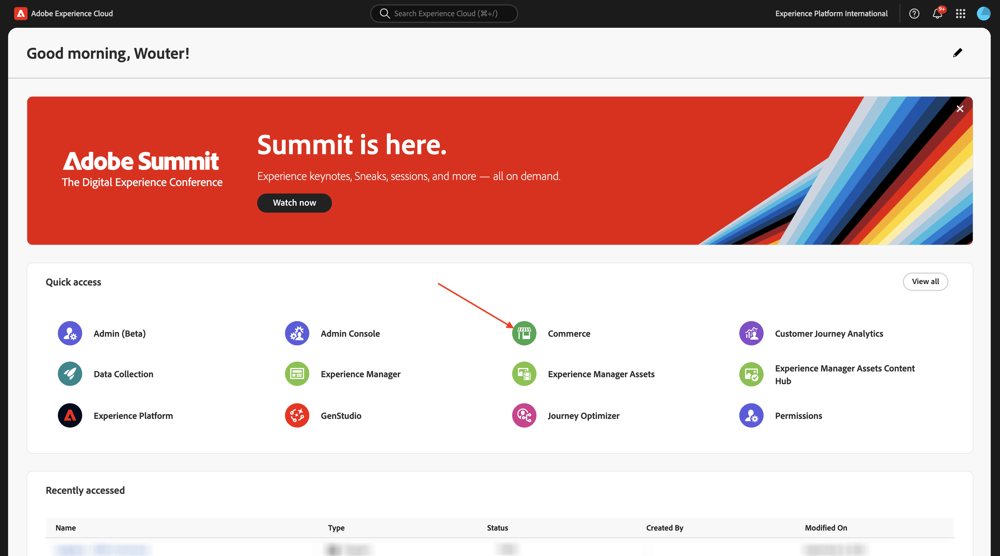
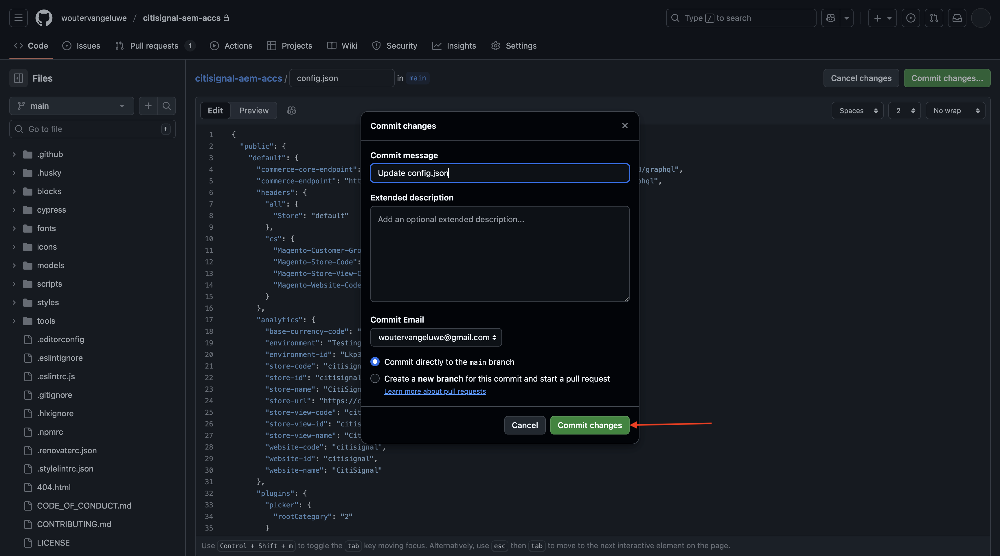

# 1.5.2 Conectar o ACCS à loja AEM Sites CS/EDS

>[!IMPORTANT]
>
>Para concluir este exercício, você precisa ter acesso a um AEM Sites e Assets CS com ambiente EDS em funcionamento.
>
>Se você ainda não tiver esse ambiente, vá para o exercício [Adobe Experience Manager Cloud Service &amp; Edge Delivery Services](./../../../modules/asset-mgmt/module2.1/aemcs.md){target="_blank"}. Siga as instruções aqui e você terá acesso a esse ambiente.

>[!IMPORTANT]
>
>Se você configurou anteriormente um programa do AEM CS com um ambiente do AEM Sites e do Assets CS, pode ser que sua sandbox do AEM CS tenha hibernado. Considerando que a deshibernação de uma sandbox desse tipo leva de 10 a 15 minutos, seria uma boa ideia iniciar o processo de deshibernação agora para que você não precise aguardar mais tarde.

Neste exercício, você vinculará a Loja AEM Sites CS/EDS ao back-end do ACCS. No momento, quando você abre a Loja AEM Sites CS/EDS e acessa a página da lista de produtos **Telefones**, não é possível visualizar nenhum produto.

No final deste exercício, você deverá ver os produtos configurados no exercício anterior exibidos na página da lista de produtos **Telefones** da sua Loja AEM Sites CS/EDS.

Ir para [https://experience.adobe.com/](https://experience.adobe.com/){target="_blank"}. Verifique se você está no ambiente correto, que deve ser nomeado como `--aepImsOrgName--`. Clique em **Commerce**.

Clique no ícone **info** ao lado da instância do ACCS, que deve ser nomeada `--aepUserLdap-- - ACCS`.

Você deverá ver isso. Copie o **ponto de extremidade do GraphQL**.

Ir para [https://da.live/app/adobe-commerce/storefront-tools/tools/config-generator/config-generator](https://da.live/app/adobe-commerce/storefront-tools/tools/config-generator/config-generator). Agora é necessário gerar um arquivo config.json que será usado para vincular a AEM Sites CS Storefront ao back-end do ACCS.

Na página **Config Generator**, cole a url **endpoint do GraphQL** que você copiou.

Clique em **Gerar**.

Copie a carga JSON gerada completa.

Acesse o repositório GitHub criado ao configurar o ambiente do AEM Sites CS/EDS. Esse repositório foi criado no exercício [1.1.2 Configure seu ambiente do AEM CS](./../../../modules/asset-mgmt/module2.1/ex3.md){target="_blank"} e deve ser nomeado como **citisignal-aem-accs**.

No diretório raiz, role para baixo e clique para abrir o arquivo **config.json**.

Clique no ícone **Edit**.

Remova todo o texto atual e substitua-o colando a carga JSON copiada na página **Gerador de Configuração**.

Clique em **Confirmar alterações...**.

Clique em **Confirmar alterações**.

O arquivo **config.json** foi atualizado. Você deve ver suas alterações no site dentro de alguns minutos. A maneira de verificar se as alterações foram selecionadas com êxito é acessar a página de produto **Telefones**. Agora você deve ver o **iPhone Air** na página.

Embora o produto agora seja exibido com êxito, ainda não há uma imagem disponível para o produto. Você configurará o link com o AEM Assets CS para imagens de produtos no próximo exercício.

Próxima etapa: [Conectar o ACCS ao AEM Assets CS](./ex3.md){target="_blank"}

Voltar para o [Adobe Commerce as a Cloud Service](./accs.md){target="_blank"}

[Voltar para Todos os Módulos](./../../../overview.md){target="_blank"}
