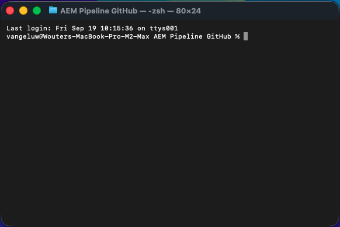
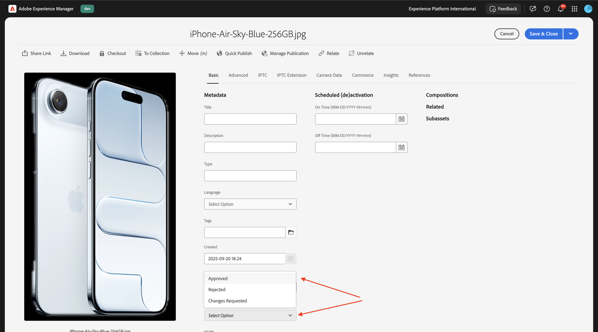

# 1.5.3 Conectar o ACCS ao AEM Assets CS

>[!IMPORTANT]
>
>Para concluir este exercício, você precisa ter acesso a um AEM Sites e Assets CS com ambiente EDS em funcionamento.
>
>Se você ainda não tiver esse ambiente, vá para o exercício [Adobe Experience Manager Cloud Service &amp; Edge Delivery Services](./../../../modules/asset-mgmt/module2.1/aemcs.md){target="_blank"}. Siga as instruções aqui e você terá acesso a esse ambiente.

>[!IMPORTANT]
>
>Se você configurou anteriormente um programa do AEM CS com um ambiente do AEM Sites e do Assets CS, pode ser que sua sandbox do AEM CS tenha hibernado. Considerando que a deshibernação de uma sandbox desse tipo leva de 10 a 15 minutos, seria uma boa ideia iniciar o processo de deshibernação agora para que você não precise aguardar mais tarde.

## 1.5.3.1 Atualizar Configuração De Pipeline

Ir para [https://my.cloudmanager.adobe.com](https://my.cloudmanager.adobe.com){target="_blank"}. A organização que você deve selecionar é `--aepImsOrgName--`.

Clique para abrir seu Programa Cloud Manager, que deve ser chamado de `--aepUserLdap-- - CitiSignal AEM+ACCS`.


Role para baixo e clique em **Acessar informações do repositório** na guia **Pipelines**.


Você deverá ver isso. Clique em **Gerar senha**.


Clique novamente em **Gerar senha**.


Você deverá ter uma senha disponível. Em seguida, clique no ícone **copiar** ao lado do campo **linha de comando Git**.


Crie um novo diretório em um local de escolha no seu computador e nomeie-o como **GitHub do AEM Pipeline**.


Clique com o botão direito do mouse na pasta e selecione **Novo Terminal na Pasta**.


Você deverá ver isso.



Cole a **linha de comando do Git** que você copiou anteriormente na janela Terminal.


É necessário inserir um nome de usuário. Copie o nome de usuário do Pipeline de programa do Cloud Manager **Acesse as informações do repositório** e clique em **inserir**.


Em seguida, você precisa digitar a senha. Copie a senha do Pipeline de programa do Cloud Manager **Acesse as informações do repositório** e clique em **inserir**.


Isso pode levar um minuto. Depois de concluído, você terá uma cópia local do repositório Git vinculada ao pipeline do programa.


Você verá um novo diretório no **GitHub do AEM Pipeline**. Abra esse diretório.


Selecione todos os arquivos nesse diretório e exclua todos eles.


Verifique se o diretório está vazio.


Ir para [https://github.com/ankumalh/assets-commerce](https://github.com/ankumalh/assets-commerce).

Em seguida, copie o arquivo **assets-commerce-main.zip** na área de trabalho e descompacte-o. Abra a pasta **assets-commerce-main**.


Copie todos os arquivos do diretório **assets-commerce-main** para o diretório vazio do diretório do Repositório de Pipelines do Programa.


Em seguida, abra o **Microsoft Visual Studio Code** e abra a pasta que contém o Repositório de Pipelines do seu Programa no **Microsoft Visual Studio Code**.


Vá para **Pesquisar** no menu esquerdo e procure por `<my-app>`. Você precisa substituir todas as ocorrências de `<my-app>` por `--aepUserLdap--citisignalaemaccs`.

Clique no ícone **substituir tudo**.


Clique em **Substituir**.


Os novos arquivos agora estão prontos para serem carregados de volta no repositório Git, que está vinculado ao Repositório de pipelines do programa. Para fazer isso, abra a pasta **AEM Pipeline GitHub** e clique com o botão direito do mouse na pasta que contém os novos arquivos. Selecione **Novo Terminal na Pasta**.


Você deverá ver isso. Cole o comando `git add .` e pressione **enter**.


Você deverá ver isso. Cole o comando `git commit -m "add assets integration"` e pressione **enter**.


Você deverá ver isso. Cole o comando `git push origin main` e pressione **enter**.


Você deverá ver isso. Suas alterações foram implantadas no repositório Git do pipeline do programa.


Volte para o Cloud Manager e clique em **Fechar**.


Depois de fazer alterações no repositório Git do Pipeline, é necessário executar o pipeline **Implantar no Desenvolvimento** novamente. Clique nos 3 pontos **...** e selecione **Executar**.


Clique em **Executar**. A execução de uma implantação de pipeline pode levar de 10 a 15 minutos. Antes de continuar, aguarde até que a implantação do pipeline seja concluída com êxito.


## 1.5.3.2 Habilitar a integração do AEM Assets no ACCS

Volte para a instância do ACCS. No menu esquerdo, vá para **Lojas** e selecione **Configuração**.


Role para baixo no menu até **ADOBE SERVICES** e abra a **Integração com o AEM Assets**. Você deverá ver isso.


Preencha as seguintes variáveis:

- **ID do Programa AEM Assets**: você pode obter a ID do Programa da URL do Autor do AEM CS. Neste exemplo, a ID do programa é `166717`.


- **ID de Ambiente do AEM Assets**: você pode obter a ID de Ambiente da URL do Autor do AEM CS. Neste exemplo, a ID de Ambiente é `1786231`.


- **ID do Cliente IMS do Seletor de Ativos**: definido como `1`
- **Sincronização habilitada**: definida como `Yes`
- **Proprietário da visualização**: definido como `AEM Assets`
- **Regra de correspondência de ativos**: `Match by product SKU`
- **Corresponder por nome de atributo SKU de produto**: `commerce:skus`

Clique em **Salvar configuração**.


## 1.5.3.3 Atualizar config.json

Acesse o repositório GitHub criado ao configurar o ambiente do AEM Sites CS/EDS. Esse repositório foi criado no exercício [1.1.2 Configure seu ambiente do AEM CS](./../../../modules/asset-mgmt/module2.1/ex3.md){target="_blank"} e deve ser nomeado como **citisignal-aem-accs**.

No diretório raiz, role para baixo e clique para abrir o arquivo **config.json**. Clique no ícone **editar** para fazer alterações no arquivo.


Adicione o trecho de código abaixo na linha 5 `"commerce-endpoint": "https://na1-sandbox.api.commerce.adobe.com/XXX/graphql",`:

```json
 "commerce-assets-enabled": "true",
```

Clique em **Confirmar alterações...**.


Clique em **Confirmar alterações**.


Sua alteração foi salva e será publicada em breve. Pode levar alguns minutos para que a alteração fique visível na loja.


## 1.5.3.4 Verificar campos do Commerce no AEM Assets CS

Faça logon no ambiente de Autor do AEM CS e vá para **Assets**.


Vá para **Arquivos**.


Abra a pasta **CitiSignal**.


Passe o mouse sobre qualquer ativo e clique no ícone **info**.


Agora você deve ver uma guia **Commerce** que contém dois novos atributos de metadados.


Seu ambiente do AEM Assets CS agora oferece suporte à integração com o Commerce. Agora você pode começar a carregar imagens de produtos.

## 1.5.3.4 Carregar Assets do produto e vincular aos produtos

[Baixe as imagens do produto aqui](./images/Product_Images.zip). Após o download, exporte os arquivos para sua área de trabalho.


Clique em **Criar** e selecione **Pasta**.


Insira o valor **Product_Images** para os campos **Title** e **Name**. Clique em **Criar**.


Clique em para abrir a pasta que acabou de criar.


Clique em **Criar** e selecione **Arquivos**.


Navegue até a pasta **Product_Images** na área de trabalho, selecione todos os arquivos e clique em **Abrir**.


Clique em **Carregar**.


As imagens serão disponibilizadas na pasta.


Clique na primeira imagem do produto para abri-la.


Defina o status da imagem do produto como **Aprovado**. A integração AEM Assets CS - ACCS funciona somente para imagens aprovadas.



Vá para a guia **Commerce** e clique em **Adicionar** em **SKUs do produto**.


Tire o SKU do produto do nome do arquivo de imagem, aumente o valor para 1 e selecione todas as opções na lista suspensa **uso**.


Você deveria ficar com isso. Clique em **Salvar e fechar**.


Repita essa ação de aprovação de um ativo e configuração da guia Commerce para cada imagem importada nessa pasta. Quando terminar, cada imagem deve ter **miniaturas verdes**, indicando que o ativo foi aprovado.


## 1.5.3.5 Verificar imagens do produto na vitrine do AEM Sites CS/EDS


Próxima etapa: [Resumo e benefícios](./summary.md){target="_blank"}

Voltar para o [Adobe Commerce as a Cloud Service](./accs.md){target="_blank"}

[Voltar para Todos os Módulos](./../../../overview.md){target="_blank"}
