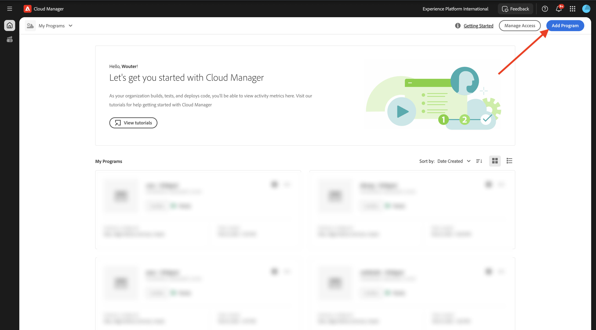
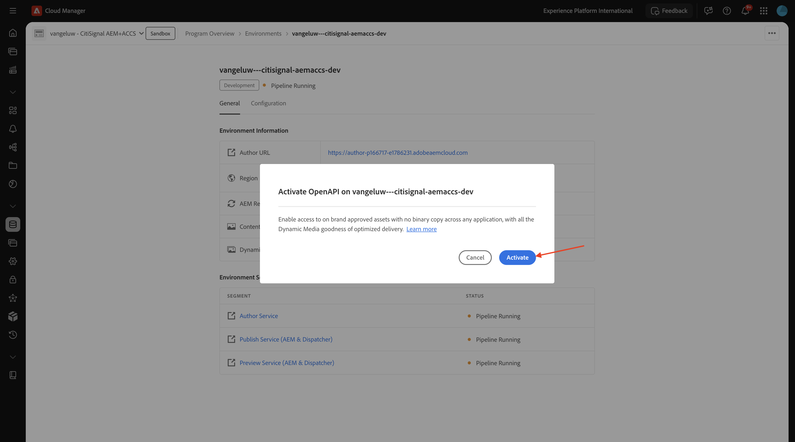

# 1.1.1 Criar seu programa do Cloud Manager

Ir para [https://my.cloudmanager.adobe.com](https://my.cloudmanager.adobe.com){target="_blank"}. A organização que você deve selecionar é `--aepImsOrgName--`. Então você verá algo assim. Clique em **Adicionar programa**.

Para o **Nome do Programa**, use `--aepUserLdap-- - CitiSignal AEM+ACCS`. Selecione a opção **Configurar uma sandbox**. Clique em **Continuar**.

Verifique se as seguintes opções estão selecionadas:

- Sites
- Formulários
- Ativos

Clique na seta de **Assets** para abrir a lista de opções.

Verifique se as seguintes opções estão selecionadas:

- Content Hub

Role para baixo na lista.

Verifique se as seguintes opções estão selecionadas:

- Edge Delivery Services
- Mídia dinâmica

Clique em **Criar**.

A criação do ambiente levará algum tempo, de 10 a 20 minutos.

Depois que os ambientes forem criados e estiverem prontos para uso, você receberá um email de confirmação, após o qual poderá voltar aqui.

Depois de receber sua confirmação por email, volte para [https://my.cloudmanager.adobe.com](https://my.cloudmanager.adobe.com){target="_blank"}. Você verá que o status do seu programa mudou para **Pronto**. Clique no programa para abri-lo.

Consulte a guia **Pipelines**. Clique nos 3 pontos **...** e em **Executar**.

Clique em **Executar**.

Em seguida, clique nos 3 pontos **...** na guia **Ambientes** e clique em **Exibir Detalhes**.

Você verá os detalhes do seu ambiente, incluindo a URL do seu ambiente **Author**, que você precisará no próximo exercício.

Dê uma olhada na linha **Content Hub** e selecione **Clique para ativar**.

Clique em **Ativar**.

A ativação do **Content Hub** foi iniciada agora. Isso pode levar 10 minutos ou mais.

Após aproximadamente 10 minutos, a ativação do **Content Hub** será concluída.
Em seguida, observe a linha **Dynamic Media** e selecione **Clique para ativar**.

Clique em **Ativar**.

A ativação da **Mídia dinâmica** foi iniciada agora. Isso pode levar 10 minutos ou mais.

Após cerca de 10 minutos, a ativação da **Mídia dinâmica** será feita.

Depois que a execução do pipeline for concluída, você poderá continuar com o próximo exercício.

Próxima Etapa: [Configurar o ambiente do AEM CS](./ex2.md){target="_blank"}

Voltar para o [Adobe Experience Manager Cloud Service &amp; Edge Delivery Services](./aemcs.md){target="_blank"}

[Voltar para Todos os Módulos](./../../../overview.md){target="_blank"}
