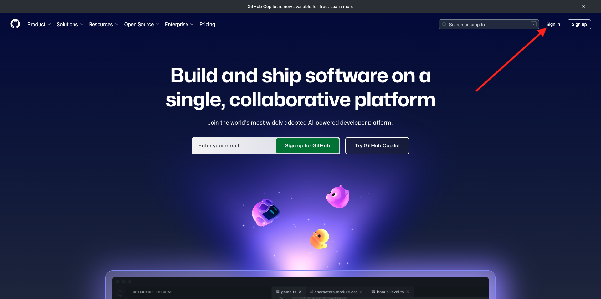
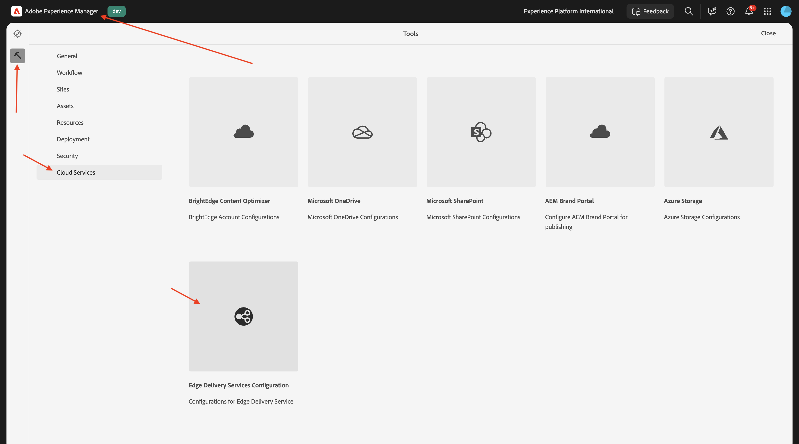
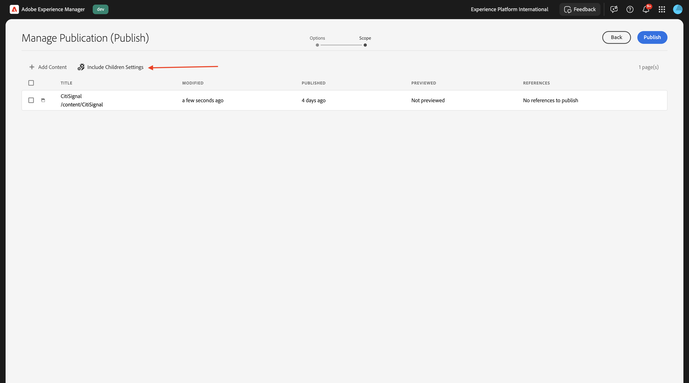

# 1.1.2 Configurar o ambiente do AEM CS

## 1.1.2.1 Configurar seu repositório GitHub

Ir para [https://github.com](https://github.com){target="_blank"}. Clique em **Fazer logon**.



Insira suas credenciais. Clique em **Fazer logon**.


Depois de fazer logon, você verá seu Painel do GitHub.


Ir para [https://github.com/adobe-rnd/aem-boilerplate-xcom](https://github.com/adobe-rnd/aem-boilerplate-xcom){target="_blank"}. Você verá isso. Clique em **Usar este modelo** e em **Criar um novo repositório**.


Para o **Nome do repositório**, use `citisignal-aem-accs`. Defina a visibilidade como **Particular**. Clique em **Criar repositório**.


Após alguns segundos, o repositório será criado.


Em seguida, vá para [https://github.com/apps/aem-code-sync](https://github.com/apps/aem-code-sync){target="_blank"}. Clique em **Instalar** ou **Configurar**.


Clique no botão **Continuar** ao lado da sua conta de usuário do GitHub.


Clique em **Configurar** ao lado da sua conta de usuário do GitHub.


Clique em **Selecionar apenas repositórios** e, em seguida, adicionar o repositório que você acabou de criar.


Role para baixo e clique em **Salvar**.


Você receberá essa confirmação.


## 1.1.2.2 Atualizar o arquivo fstab.yaml

No repositório do GitHub, clique em para abrir o arquivo `fstab.yaml`.


Clique no ícone **editar**.


Agora é necessário atualizar o valor do campo **url** na linha 3.


É necessário substituir o valor atual pelo URL do seu ambiente específico do AEM Sites CS em combinação com as configurações do seu repositório GitHub.

Este é o valor atual da URL: `https://author-p130360-e1272151.adobeaemcloud.com/bin/franklin.delivery/adobe-rnd/aem-boilerplate-xcom/main`.

Há 3 partes do URL que precisam ser atualizadas

`https://XXX/bin/franklin.delivery/YYY/ZZZ/main`

XXX deve ser substituído pelo URL do ambiente do AEM CS Author.

AAAA deve ser substituído pela conta de usuário do GitHub.

ZZZ deve ser substituído pelo nome do repositório GitHub usado no exercício anterior.

Você pode encontrar a URL do seu ambiente de autor do AEM CS acessando [https://my.cloudmanager.adobe.com](https://my.cloudmanager.adobe.com){target="_blank"}. Clique no **Programa** para abri-lo.


Em seguida, clique nos 3 pontos **...** na guia **Ambientes** e clique em **Exibir Detalhes**.


Você verá os detalhes do seu ambiente, incluindo a URL do seu ambiente **Autor**. Copie o URL.


XXX = `author-p166717-e1786231.adobeaemcloud.com`

Para o nome da conta de usuário do GitHub, você pode encontrá-lo facilmente no URL do seu navegador. Neste exemplo, o nome da conta de usuário é `woutervangeluwe`.

AAAA = `woutervangeluwe`


Para o nome do repositório GitHub, você também pode encontrá-lo na janela do navegador aberta no GitHub. Nesse caso, o nome do repositório é `citisignal`.

ZZ = `citisignal-aem-accs`


Esses 3 valores combinados levam a esta nova URL que precisa ser configurada no arquivo `fstab.yaml`.

`https://author-p166717-e1786231.adobeaemcloud.com/bin/franklin.delivery/woutervangeluwe/citisignal-aem-accs/main`

Você também deve verificar se essas linhas de código também são adicionadas ao arquivo:

```
folders:
  /products/: /products/default
```

>[!IMPORTANT]
>
>Você pode ver essas linhas de código nas linhas 6 e 7 na imagem abaixo. Caso essas linhas estejam ausentes, adicione-as manualmente.

Clique em **Confirmar alterações...**.


Clique em **Confirmar alterações**.


O arquivo `fstab.yaml` foi atualizado.

## 1.1.2.3 Carregar ativos e site do CitiSignal

Ir para [https://my.cloudmanager.adobe.com](https://my.cloudmanager.adobe.com){target="_blank"}. Clique no **Programa** para abri-lo.


Em seguida, clique no URL do ambiente do autor.


Clique em **Fazer logon com o Adobe**.


Em seguida, você verá seu ambiente de Autor.


Sua URL será assim: `https://author-p166717-e1786231.adobeaemcloud.com/ui#/aem/aem/start.html?appId=aemshell`

Agora é necessário acessar o ambiente **CRX Package Manager** do AEM. Para fazer isso, remova `ui#/aem/aem/start.html?appId=aemshell` da URL e substitua-a por `crx/packmgr`, o que significa que sua URL deve ficar semelhante a esta agora:
`https://author-p166717-e1786231.adobeaemcloud.com/crx/packmgr`.
Clique em **Enter** para carregar o ambiente do gerenciador de pacotes


Em seguida, clique em **Carregar pacote**.


Clique em **Procurar** para localizar o pacote a ser carregado.

O pacote a ser carregado é chamado de **citisignal-assets.zip** e pode ser baixado aqui: [https://one-adobe-tech-insiders.s3.us-west-2.amazonaws.com/one-adobe/citisignal_aem_accs.zip](https://one-adobe-tech-insiders.s3.us-west-2.amazonaws.com/one-adobe/citisignal_aem_accs.zip){target="_blank"}.


Selecione o pacote `citisignal_aem_accs.zip` e clique em **Abrir**.


Em seguida, clique em **OK**.


O pacote será carregado. Em seguida, clique em **Instalar** no pacote que acabou de carregar.


Clique em **Instalar**.


Após alguns minutos, o pacote será instalado.


Agora você pode fechar esta janela.

## 1.1.2.4 Publicar ativos do CitiSignal

Ir para [https://my.cloudmanager.adobe.com](https://my.cloudmanager.adobe.com){target="_blank"}. Clique no **Programa** para abri-lo.


Em seguida, clique no URL do ambiente do autor.


Clique em **Fazer logon com o Adobe**.


Em seguida, você verá seu ambiente de Autor. Clique em **Assets**.


Clique em **Arquivos**.


Clique para selecionar a pasta **CitiSignal** e clique em **Gerenciar Publicação**.


Clique em **Next**.


Clique em **Publicar**.


Seus ativos foram publicados.

## 1.1.2.5 Publicar site do CitiSignal

Clique no nome do produto **Adobe Experience Manager** no canto superior esquerdo da tela e clique na **seta** ao lado de **Assets**.


Em seguida, clique em **Sites**.


Você deverá ver seu site **CitiSignal**, que foi criado após a instalação do pacote antes.


Para vincular seu site ao repositório GitHub criado anteriormente, é necessário criar uma **Configuração do Edge Delivery Services**.

A primeira etapa para fazer isso é criar uma **Configuração na Nuvem**.

Para fazer isso, clique no nome do produto **Adobe Experience Manager** no canto superior esquerdo da tela, clique no ícone **ferramentas** e selecione **Geral**. Clique para abrir o **Navegador de Configuração**.


Você deverá ver isso. Clique em **Criar**


Defina os campos **Título** e **Nome** como `CitiSignal`. Habilite a caixa de seleção para **Configurações de Nuvem**.

Clique em **Criar**.


Você deveria ficar com isso.


Em seguida, é necessário atualizar alguns campos da **Configuração na nuvem** que você acabou de criar.

Para fazer isso, clique no nome do produto **Adobe Experience Manager** no canto superior esquerdo da tela, clique no ícone **ferramentas** e selecione **Cloud Services**. Clique para abrir a **Configuração do Edge Delivery Services**.



Selecione **CitiSignal**, clique em **Criar** e selecione **Configuração**.


Agora é necessário preencher os campos **Organização** e **Nome do site**. Para fazer isso, primeiro dê uma olhada no URL do seu repositório GitHub.


- **Organização**: use o nome de sua organização do GitHub, neste exemplo, é `woutervangeluwe`
- **Nome do Site**: use o nome do repositório GitHub, que deve ser `citisignal-aem-accs`.

Clique em **Salvar e fechar**.


Você deveria ficar com isso. Habilite a caixa de seleção na frente da recém-criada Configuração na Nuvem do Edge e clique em **Publicar**.


## 1.1.2.6 Atualizar o arquivo paths.json

No repositório do GitHub, clique em para abrir o arquivo `paths.json`.


Clique no ícone **editar**.


Agora é necessário atualizar a substituição do texto `aem-boilerplate-commerce` por `CitiSignal` nas linhas 3, 4, 5, 6, 7 e 10.

Clique em **Confirmar alterações**.


Clique em **Confirmar alterações**.


O arquivo `paths.json` foi atualizado.

## 1.1.2.7 Publicar site do CitiSignal

Clique no nome do produto **Adobe Experience Manager** no canto superior esquerdo da tela e selecione **Sites**.


Em seguida, clique na caixa de seleção na frente de **CitiSignal**. Em seguida, clique em **Gerenciar publicação**.


Clique em **Next**.


Clique em **Incluir configurações secundárias**.



Clique para marcar a caixa de seleção **Incluir filhos** e clique para desmarcar as outras caixas de seleção. Clique em **OK**.


Clique em **Publicar**.


Você será enviado de volta para cá. Clique em **CitiSignal**, marque a caixa de seleção na frente do **índice** e clique em **Editar**.


Seu site será aberto no **Editor Universal**.


Agora você pode acessar seu site indo até `main--citisignal-aem-accs--XXX.aem.page` e/ou `main--citisignal-aem-accs--XXX.aem.live`, depois de substituir XXX pela sua conta de usuário do GitHub, que neste exemplo é `woutervangeluwe`.

Neste exemplo, o URL completo torna-se isto:
`https://main--citisignal-aem-accs--woutervangeluwe.aem.page` e/ou `https://main--citisignal-aem-accs--woutervangeluwe.aem.live`.

Pode levar algum tempo até que todos os ativos sejam exibidos corretamente, pois precisam ser publicados primeiro.

Você verá isto:


## Desempenho da página de teste 1.1.2.8

Ir para [https://pagespeed.web.dev/](https://pagespeed.web.dev/){target="_blank"}. Insira sua URL e clique em **Analisar**.


Em seguida, você verá que seu site, em uma visualização para dispositivos móveis e desktop, obtém uma pontuação alta:

**Celular**:


**Área de Trabalho**:


Próxima etapa: [Desenvolver um bloco personalizado](./ex3.md){target="_blank"}

Voltar para o [Adobe Experience Manager Cloud Service &amp; Edge Delivery Services](./aemcs.md){target="_blank"}

[Voltar para Todos os Módulos](./../../../overview.md){target="_blank"}
