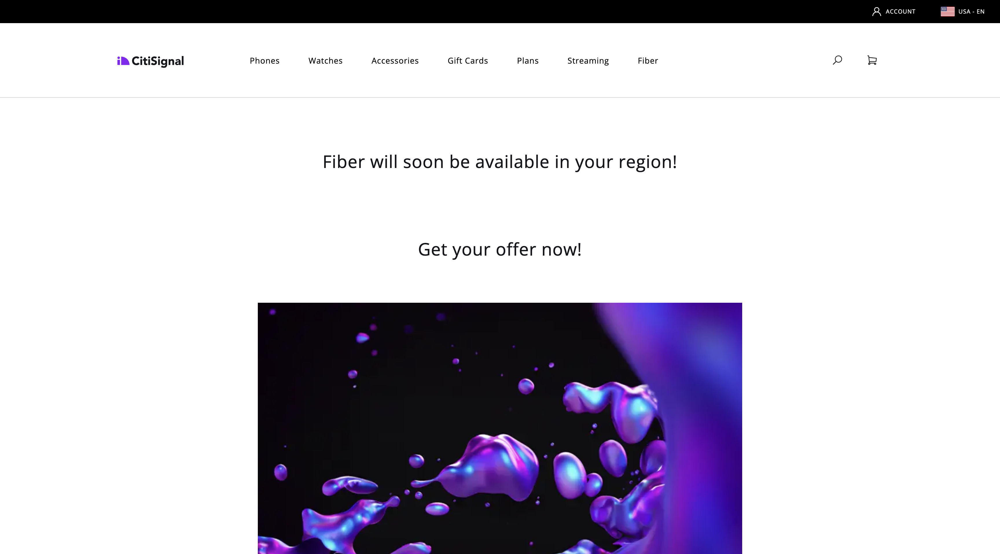

# 1.1.4 Bloco personalizado avançado

No exercício anterior, você configurou um bloco personalizado básico chamado **Oferta de fibra** que mostra campos como **Texto da oferta**, **Oferta de CTA** e **Imagem da oferta** no seu site.

Agora você pode continuar trabalhando neste bloco.

{zoomable="yes"}

## 1.1.4.1 Estilo do seu bloco

Agora que você tem um bloco de trabalho **fiberoffer**, é possível aplicar um estilo a ele.

Retorne ao Visual Studio Code e abra a pasta **blocos**. Agora você deve ver várias pastas que fazem referência a um bloco específico. Para tornar seu bloco **fiberoffer** mais avançado, agora é necessário criar uma pasta para seu bloco personalizado.

{zoomable="yes"}

Selecione a pasta **blocos** e clique no ícone **Criar nova pasta**.

{zoomable="yes"}

Nomeie sua pasta `fiberoffer` e clique em **inserir**.

{zoomable="yes"}

Selecione a nova pasta **fiberoffer** e clique no ícone **Criar novo arquivo**.

{zoomable="yes"}

Um novo arquivo foi criado. Insira o nome **fiberoffer.js** e pressione enter.

{zoomable="yes"}

Agora é possível implementar a decoração de blocos adicionando a seguinte JavaScript ao arquivo **fiberoffer.js**.

Salve o arquivo.

```js
export default function decorate(block) {
  const offerText = block.children[0];
  const offerCTA = block.children[1];
  const offerImage = block.children[2];

  offerText.id = 'offerText';
  offerText.className = 'offerText';
  offerCTA.id = 'offerCTA';
  offerCTA.className = 'offerCTA';
  offerImage.id = 'offerImage';
  offerImage.className = 'offerImage';
}
```

{zoomable="yes"}

Selecione a nova pasta **fiberoffer** e clique novamente no ícone **Criar novo arquivo**.

{zoomable="yes"}

Um novo arquivo foi criado. Insira o nome **fiberoffer.css** e pressione enter.

{zoomable="yes"}

Copie e cole o seguinte código CSS no arquivo recém-criado.

```js
.offerText, .offerCTA, .offerImage{
    color: #14161A;
    font-size: 30px;
    padding: 0 0 24px;
    display: flex;
    flex-direction: column;
    margin: 1rem 0;
    text-align: center;
}
```

Salve as alterações.

{zoomable="yes"}

Agora você fez várias alterações em seu projeto que precisam ser enviadas de volta ao repositório do GitHub. Para fazer isso, abra o **GitHub Desktop**.

Você deverá ver os 2 arquivos que acabou de editar em **Alterações**. Revise suas alterações.

Digite um nome para a sua PR, `js css`. Clique em **Confirmar para principal**.

{zoomable="yes"}

Você deverá ver isso. Clique em **Origem de push**.

{zoomable="yes"}

No navegador, vá para a conta GitHub e para o repositório criado para o CitiSignal. Você deverá ver algo assim, mostrando que suas alterações foram recebidas.

{zoomable="yes"}

Agora é possível exibir as alterações em seu site indo para `main--citisignal--XXX.aem.page/us/en/` e/ou `main--citisignal--XXX.aem.live/us/en/`, depois de substituir XXX pela sua conta de usuário do GitHub, que neste exemplo é `woutervangeluwe`.

Neste exemplo, o URL completo torna-se isto:
`https://main--citisignal--woutervangeluwe.aem.page/us/en/` e/ou `https://main--citisignal--woutervangeluwe.aem.live/us/en/`.

Você deverá ver isso, com o estilo aplicado à sua página.

{zoomable="yes"}

## 1.1.4.2 Adicionar lógica e carregar dados de um ponto de extremidade externo

Para este exercício, você fará uma configuração &quot;bruta&quot; do Web SDK do Adobe e solicitará a próxima melhor oferta do Adobe Journey Optimizer Offer Decisioning.

Para ser claro: isso não se destina a ser uma implementação de prática recomendada do Web SDK para AEM as a Cloud Service. No próximo exercício, você implementará a coleta de dados usando um plug-in específico desenvolvido para isso.

Este exercício tem o objetivo de mostrar alguns itens básicos no JavaScript, como carregar uma biblioteca JS externa, usar a biblioteca **alloy.js**, enviar uma solicitação e muito mais.

A biblioteca **alloy.js** é a biblioteca do Web SDK que torna possível enviar solicitações de um site para o Edge Network da Adobe e de lá para aplicativos como o Adobe Experience Platform, Adobe Analytics, Adobe Target e muito mais.

Adicione este código no código anterior que você adicionou para o estilo do bloco:

```javascript
var script1 = document.createElement('script');
  script1.text = "!function(n,o){o.forEach(function(o){n[o]||((n.__alloyNS=n.__alloyNS||[]).push(o),n[o]=function(){var u=arguments;return new Promise(function(i,l){n[o].q.push([i,l,u])})},n[o].q=[])})}(window,['alloy']);"
  document.head.appendChild(script1);

  var script2 = document.createElement('script');
  script2.async = true;
  script2.src = "https://cdn1.adoberesources.net/alloy/2.14.0/alloy.min.js";
  document.head.appendChild(script2);

  alloy("configure", {
    "edgeConfigId": "045c5ee9-468f-47d5-ae9b-a29788f5948f",
    "orgId": "907075E95BF479EC0A495C73@AdobeOrg",
    "defaultConsent": "in"
  });
```

Você deveria ficar com isso.

A primeira marca de script (script1) que você adicionou é uma função usada pelo Web SDK e que cria um objeto de janela chamado **liga**.

A segunda tag de script (script2) carregará de forma assíncrona a biblioteca alloy.js do CDN da Adobe.

O terceiro bloco de código configura basicamente o objeto de liga para enviar dados em direção a uma organização e sequência de dados específicas do Adobe IMS.

No módulo **Introdução**, você já configurou uma sequência de dados, chamada `--aepUserLdap-- - One Adobe Datastream`. O campo **edgeConfigId** no código acima faz referência à ID da sequência de dados configurada.

Você não precisa alterar o campo **edgeConfigId** neste momento. No próximo exercício, você poderá fazer isso usando o plug-in **MarTech**.

{zoomable="yes"}

Agora você deve ter isso.

{zoomable="yes"}

Em seguida, adicione este bloco abaixo do código anterior que você adicionou em.

```javascript
var ECID = "";

  alloy("getIdentity")
    .then(function (result) {
      // The command succeeded.
      console.log("ECID:", result.identity.ECID);
      ECID = result.identity.ECID;
      getOffer(ECID);

    })
    .catch(function (error) {
      // The command failed.
      // "error" will be an error object with additional information.
    });
```

Esse bloco de código é usado para recuperar o valor da Experience Cloud ID (ECID). A ECID é o identificador de dispositivo exclusivo do navegador.

Como você pode ver no código acima, depois que a ECID é recuperada, outra função é chamada. Esta função é chamada **getOffer()**, que você adicionará a seguir.

{zoomable="yes"}

Em seguida, adicione o código abaixo de

```javascript
async function getOffer(ECID) {
  var url = "https://edge.adobedc.net/ee/irl1/v1/interact?configId=045c5ee9-468f-47d5-ae9b-a29788f5948f";

  var timestamp = new Date().toISOString();

  var offerRequest = {
    "events": [
      {
        "xdm": {
          "eventType": "decisioning.propositionDisplay",
          "timestamp": timestamp,
          "_experienceplatform": {
            "identification": {
              "core": {
                "ecid": ECID
              }
            }
          },
          "identityMap": {
            "ECID": [
              {
                "id": ECID
              }
            ]
          }
        },
        "query": {
          "personalization": {
            "schemas": [
              "https://ns.adobe.com/personalization/default-content-item",
              "https://ns.adobe.com/personalization/html-content-item",
              "https://ns.adobe.com/personalization/json-content-item",
              "https://ns.adobe.com/personalization/redirect-item",
              "https://ns.adobe.com/personalization/ruleset-item",
              "https://ns.adobe.com/personalization/message/in-app",
              "https://ns.adobe.com/personalization/message/content-card",
              "https://ns.adobe.com/personalization/dom-action"
            ],
            "decisionScopes": [
              "eyJ4ZG06YWN0aXZpdHlJZCI6ImRwczpvZmZlci1hY3Rpdml0eToxYTI3ODk3NzAzYTY5NWZmIiwieGRtOnBsYWNlbWVudElkIjoiZHBzOm9mZmVyLXBsYWNlbWVudDoxYTI0ZGM2MWJmYjJlMjIwIn0=",
              "eyJ4ZG06YWN0aXZpdHlJZCI6ImRwczpvZmZlci1hY3Rpdml0eToxYTI3ODk3NzAzYTY5NWZmIiwieGRtOnBsYWNlbWVudElkIjoiZHBzOm9mZmVyLXBsYWNlbWVudDoxYTI0ZGM0MzQyZjJlMjFlIn0="
            ]
          }
        }
      }
    ]
  }

  try {
    const response = await fetch(url, {
      method: "POST",
      headers: {
        "Content-Type": "application/json"
      },
      body: JSON.stringify(offerRequest),
    });

    if (response.status === 200) {
      var body = await response.json();
      console.log("Offer Decisioning Response: ", body);

      const decisions = body["handle"];

      decisions.forEach(decision => {
        if (decision["type"] == "personalization:decisions") {
          console.log("Offer Decisioning decision detail: ", decision);
          const payloads = decision["payload"];

          if (payloads === undefined || payloads.length == 0) {
            //do nothing
          } else {
            payloads.forEach(payload => {
              if (payload["placement"]["name"] == "Web - Image") {
                console.log("Web-Image payload");
                const items = payload["items"];
                items.forEach(item => {
                  if (item["id"].includes("dps:fallback-offer")) {
                    console.log("Item details: ", item);
                    const deliveryURL = item["data"]["deliveryURL"];

                    document.querySelector("#offerImage").innerHTML = "";
                  } else if (item["id"].includes("dps:personalized-offer")) {
                    console.log("Item details: ", item);
                    const deliveryURL = item["data"]["deliveryURL"];
                    console.log("Web-Image Personalized Offer Content: ", deliveryURL)

                    document.querySelector("#offerImage").innerHTML = "";
                  }
                });
              } else if (payload["placement"]["name"] == "Web - JSON") {
                console.log("Web-JSON payload");
                const items = payload["items"];
                items.forEach(item => {
                  if (item["id"].includes("dps:fallback-offer")) {
                    const content = JSON.parse(item["data"]["content"]);

                    console.log("Web-JSON Fallback Content: ", content)

                    document.querySelector("#offerText").innerHTML = content.text;
                    document.querySelector("#offerCTA").innerHTML = content.cta;
                  } else if (item["id"].includes("dps:personalized-offer")) {
                    const content = JSON.parse(item["data"]["content"]);

                    console.log("Web-JSON Personalized Offer Content: " + content);

                    document.querySelector("#offerText").innerHTML = content.text;
                    document.querySelector("#offerCTA").innerHTML = content.cta;
                  }
                });
              }
            });
          }
          document.querySelector("#offerImage").style.display = "block";
          document.querySelector("#offerText").style.display = "block";
          document.querySelector("#offerCTA").style.display = "block";
        }
      });
    } else {
      console.warn("Offer Decisioning Response unsuccessful:", response.body);
    }
  } catch (error) {
    console.error("Error when getting Offer Decisioning Response:", error);
  }
}
```

É muito importante que esse bloco de código seja colado abaixo do colchete de fechamento, que pode ser visto na linha 42 deste exemplo. O código que você acabou de colar é uma função separada que precisa de seu próprio local neste arquivo e não pode ser aninhada na **função padrão** acima.

{zoomable="yes"}

O bloco de código que você acabou de colar simula uma solicitação que normalmente seria feita pela Web SDK/alloy.js. Neste exemplo, uma solicitação **fetch** será feita para **edge.adobedc.net**.

Na solicitação, 2 **Escopos de Decisão** são especificados, o que solicitará que a Adobe Journey Optimizer Offer Decisioning forneça uma decisão sobre qual oferta precisa ser vista por esta ECID.

Depois que a resposta for recebida, esse código analisará a resposta e filtrará itens como o URL da imagem que precisa ser exibida e também a resposta JSON que contém itens como o Texto da oferta e o CTA da oferta, depois disso, eles serão exibidos no site.

Lembre-se: essa abordagem é usada apenas para fins de ativação e não é a maneira recomendada de implementar a coleta de dados.

Salve as alterações. Em seguida, abra o **Github Desktop**, dê um nome à sua PR e clique em **Confirmar com principal**.

{zoomable="yes"}

Em seguida, clique em **Origem de push**.

{zoomable="yes"}

Agora é possível exibir as alterações em seu site indo para `main--citisignal--XXX.aem.page/us/en/` e/ou `main--citisignal--XXX.aem.live/us/en/`, depois de substituir XXX pela sua conta de usuário do GitHub, que neste exemplo é `woutervangeluwe`.

Neste exemplo, o URL completo torna-se isto:
`https://main--citisignal--woutervangeluwe.aem.page/us/en/` e/ou `https://main--citisignal--woutervangeluwe.aem.live/us/en/`.

Você deverá ver isso.

{zoomable="yes"}

Próxima etapa: [Plug-in MarTech para AEM Edge Delivery Services](./ex5.md){target="_blank"}

Voltar para o [Adobe Experience Manager Cloud Service &amp; Edge Delivery Services](./aemcs.md){target="_blank"}

[Voltar para Todos os Módulos](./../../../overview.md){target="_blank"}
