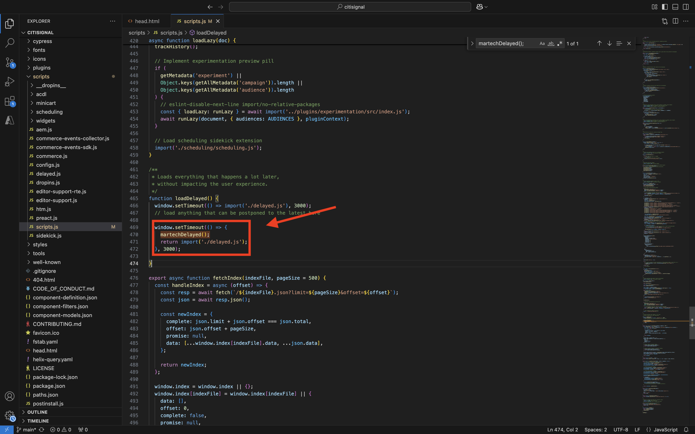

# 1.1.6 Plug-in AEM Edge Delivery Services MarTech

O plug-in AEM MarTech ajuda a configurar rapidamente uma pilha completa do MarTech para seu projeto do AEM.

>[!NOTE]
>
>Este plug-in está disponível atualmente para clientes em colaboração com a Engenharia da AEM por meio de projetos de coinovação. Você pode encontrar mais informações em [https://github.com/adobe-rnd/aem-martech](https://github.com/adobe-rnd/aem-martech).

## 1.1.6.1 Adicionar o plug-in ao repositório

Navegue até a pasta que você está usando para o seu **citisignal** repositório GitHub. Clique com o botão direito no nome da pasta e selecione **Novo Terminal na Pasta**.

{zoomable="yes"}

Você verá isso. Cole o seguinte comando e pressione **enter**.

```
git subtree add --squash --prefix plugins/martech https://github.com/adobe-rnd/aem-martech.git main
```

Você deverá ver isso.

{zoomable="yes"}

Navegue até a pasta que você está usando para o seu **citisignal** repositório GitHub, abra a pasta **plugins**. Agora você deve ver uma pasta chamada **martech**.

{zoomable="yes"}

## 1.1.6.2 head.html

No Visual Studio Code, abra o arquivo **head.html**. Copie o código abaixo e cole-o no arquivo **head.html**.

```javascript
<link rel="preload" as="script" crossorigin="anonymous" href="/plugins/martech/src/index.js"/>
<link rel="preload" as="script" crossorigin="anonymous" href="/plugins/martech/src/alloy.min.js"/>
<link rel="preconnect" href="https://edge.adobedc.net"/>
<!-- change to adobedc.demdex.net if you enable third party cookies -->
```

Salve as alterações.

{zoomable="yes"}

## 1.1.6.3 scripts.js

No Visual Studio Code, vá para a pasta **scripts** e abra o arquivo **scripts.js**. Copie o código abaixo e cole-o no arquivo **scripts.js**, nos scripts de importação existentes.

```javascript
import {
  initMartech,
  updateUserConsent,
  martechEager,
  martechLazy,
  martechDelayed,
} from '../plugins/martech/src/index.js';
```

Salve as alterações.

{zoomable="yes"}

No Visual Studio Code, no arquivo **scripts.js**, localize o seguinte código:

```javascript
const AUDIENCES = {
  mobile: () => window.innerWidth < 600,
  desktop: () => window.innerWidth >= 600,
  // define your custom audiences here as needed
};
```

Em **const AUDIENCES = {...};**, cole o código abaixo:

```javascript
  const isConsentGiven = true;
  const martechLoadedPromise = initMartech(
    // The WebSDK config
    // Documentation: https://experienceleague.adobe.com/pt-br/docs/experience-platform/web-sdk/commands/configure/overview#configure-js
    {
      datastreamId: "XXX",
      orgId: "XXX",
      defaultConsent: 'in',
      onBeforeEventSend: (payload) => {
        // set custom Target params 
        // see doc at https://experienceleague.adobe.com/pt-br/docs/platform-learn/migrate-target-to-websdk/send-parameters#parameter-mapping-summary
        payload.data.__adobe.target ||= {};

        // set custom Analytics params
        // see doc at https://experienceleague.adobe.com/pt-br/docs/analytics/implementation/aep-edge/data-var-mapping
        payload.data.__adobe.analytics ||= {};
      },

      // set custom datastream overrides
      // see doc at:
      // - https://experienceleague.adobe.com/pt-br/docs/experience-platform/web-sdk/commands/datastream-overrides
      // - https://experienceleague.adobe.com/pt-br/docs/experience-platform/datastreams/overrides
      edgeConfigOverrides: {
        // Override the datastream id
        // datastreamId: '...'

        // Override AEP event datasets
        // com_adobe_experience_platform: {
        //   datasets: {
        //     event: {
        //       datasetId: '...'
        //     }
        //   }
        // },

        // Override the Analytics report suites
        // com_adobe_analytics: {
        //   reportSuites: ['...']
        // },

        // Override the Target property token
        // com_adobe_target: {
        //   propertyToken: '...'
        // }
      },
    },
    // The library config
    {
      launchUrls: ["XXX"],
      personalization: !!getMetadata('target') && isConsentGiven,
    },
  );
```

{zoomable="yes"}

Há algumas variáveis que você precisa substituir no código acima, pelas suas próprias variáveis de ambiente:

- `datastreamId: "XXX"`
- `orgId: "XXX"`
- `launchUrls: ["XXX"]`

Você pode encontrar essas variáveis seguindo estas instruções:

### datastreamId

Vá para [https://platform.adobe.com/](https://platform.adobe.com/) e vá para **Datastreams** no menu esquerdo. Verifique se você está na sandbox correta, que deve ser `--aepSandboxName--`. Pesquise a sequência de dados criada na seção Introdução deste tutorial, que deve ser chamada `--aepUserLdap-- - One Adobe Datastream`. Clique no ícone **copiar** para copiar a **ID de Sequência de Dados** e colá-la no Visual Studio Code, no arquivo **scripts.js**, substituindo o valor de espaço reservado `XXX` ao lado de `datastreamId:`.

{zoomable="yes"}

### orgId

Vá para [https://platform.adobe.com/](https://platform.adobe.com/) e vá para **Queries** no menu esquerdo. Em **Credenciais**, você encontrará a **ID da Organização IMS** como **Nome de usuário**. Clique no ícone **copiar** para copiar a **ID da Organização IMS** e colá-la no Visual Studio Code, no arquivo **scripts.js**, substituindo o valor de espaço reservado `XXX` ao lado de `orgId:`.

{zoomable="yes"}

### launchUrls

Vá para [https://platform.adobe.com/](https://platform.adobe.com/) e vá para **Tags** no menu esquerdo. Pesquise sua propriedade usando o LDAP, que deveria ser `--aepUserLdap--`. Abra a propriedade da Web.

{zoomable="yes"}

No menu esquerdo, vá para **Ambientes** e clique no ícone **Instalar** do ambiente **Desenvolvimento**.

{zoomable="yes"}

Você encontrará a URL necessária, mas ela estará dentro de uma tag do HTML `<script></script>`. Você deve copiar apenas a parte que começa em `https` até `.min.js`.

{zoomable="yes"}

A URL tem esta aparência: `https://assets.adobedtm.com/b754ed1bed61/b9f7c7c484de/launch-5fcd90e5b482-development.min.js`. Certifique-se de que nenhum outro texto seja copiado, pois isso causaria erros. No Visual Studio Code, no arquivo **scripts.js**, substitua o valor de espaço reservado `XXX` na matriz `launchUrls:`.

Agora você tem as três variáveis necessárias. Agora, o arquivo `scripts.js` deve ter esta aparência:

{zoomable="yes"}

Em seguida, pesquise para localizar este bloco de código:

```javascript
const main = doc.querySelector('main');
  if (main) {
    decorateMain(main);
    document.body.classList.add('appear');
    await loadSection(main.querySelector('.section'), waitForFirstImage);	
  }
```

{zoomable="yes"}

Substituir por este bloco de código:

```javascript
const main = doc.querySelector('main');
  if (main) {
    decorateMain(main);
    document.body.classList.add('appear');
    await Promise.all([
      martechLoadedPromise.then(martechEager),
      loadSection(main.querySelector('.section'), waitForFirstImage)
    ]);
  }
```

{zoomable="yes"}

Em seguida, pesquise por e role até `async function loadLazy(doc) {`.

{zoomable="yes"}

Na linha `autolinkModals(doc);`, adicione esta linha de código:

```javascript
await martechLazy();
```

{zoomable="yes"}

Em seguida, pesquise e role até a linha `function loadDelayed() {`.

{zoomable="yes"}

Adicione este bloco de código à linha `// load anything that can be postponed to the latest here`.

```javascript
window.setTimeout(() => {
    martechDelayed();
    return import('./delayed.js');
  }, 3000);
```

{zoomable="yes"}

Em seguida, procure e vá para a linha que contém `window.adobeDataLayer.push`.

{zoomable="yes"}

Você verá o objeto `pageContext` sendo definido assim. Agora você precisa adicionar dois objetos em `pageContext`.

```javascript
	pageContext: {
      pageType,
      pageName: document.title,
      eventType: 'visibilityHidden',
      maxXOffset: 0,
      maxYOffset: 0,
      minXOffset: 0,
      minYOffset: 0,
    }
```

Este é o código que precisa ser adicionado:

```javascript
	,
    _experienceplatform: {
      identification:{
        core:{
          ecid: sessionStorage.getItem("com.adobe.reactor.dataElements.ECID")
        }
      }
    },
    web: {
      webPageDetails:{
        name: document.title,
        URL: window.location.href
      }
    }
```

**window.adobeDataLayer.push** agora deve ter esta aparência:

```javascript
  window.adobeDataLayer.push({
    pageContext: {
      pageType,
      pageName: document.title,
      eventType: 'visibilityHidden',
      maxXOffset: 0,
      maxYOffset: 0,
      minXOffset: 0,
      minYOffset: 0,
    },
    _experienceplatform: {
      identification:{
        core:{
          ecid: sessionStorage.getItem("com.adobe.reactor.dataElements.ECID")
        }
      }
    },
    web: {
      webPageDetails:{
        name: document.title,
        URL: window.location.href
      }
    }
  });
```

{zoomable="yes"}

Agora você fez todas as alterações necessárias no arquivo **scripts.js**.

Abra o cliente GitHub Desktop e confirme as alterações.

{zoomable="yes"}

Clique em **Origem de push** para enviar suas alterações para o repositório GitHub.

{zoomable="yes"}

## 1.1.6.4 Extensão ACDL na propriedade Tags

Para que o plug-in AEM Edge Delivery Services MarTech funcione corretamente, é necessário adicionar a extensão do para

Ir para [https://experience.adobe.com/#/data-collection/](https://experience.adobe.com/#/data-collection/). Procure e abra a propriedade Tags para Web, que é chamada `--aepUserLdap-- - One Adobe (DD/MM/YYYY)`.

{zoomable="yes"}

Ir para **Extensões**, para **Catálogo**. Clique na extensão **Camada de Dados de Clientes Adobe** e em **Instalar**.

{zoomable="yes"}

Você deverá ver isso. Não há necessidade de mudar nada neste momento. Clique em **Salvar na biblioteca**.

{zoomable="yes"}

Sua extensão é adicionada à propriedade Tags.

{zoomable="yes"}

Vá para o **Fluxo de Publicação** e abra a biblioteca **Principal**. Clique em **Adicionar todos os Recursos Alterados** e em **Salvar e Criar no Desenvolvimento**.

{zoomable="yes"}

Suas alterações foram implantadas.

## 1.1.6.5 Enviar dados para o Adobe Experience Platform Edge Network

Agora é possível exibir as alterações em seu site indo para `main--citisignal--XXX.aem.page/us/en` e/ou `main--citisignal--XXX.aem.live/us/en`, depois de substituir XXX pela sua conta de usuário do GitHub, que neste exemplo é `woutervangeluwe`.

Neste exemplo, o URL completo torna-se isto:
`https://main--citisignal--woutervangeluwe.aem.page/us/en` e/ou `https://main--citisignal--woutervangeluwe.aem.live/us/en`.

>[!NOTE]
>
>Considere abrir uma página da Web incógnita para garantir que você esteja iniciando a coleta de dados com um perfil novo e limpo. Isso é mais fácil para depuração e solução de problemas.

{zoomable="yes"}

No Chrome, abra as **Ferramentas do Desenvolvedor** em **Mais Ferramentas** > **Ferramentas do Desenvolvedor**.

{zoomable="yes"}

No modo de exibição **Console**, você verá várias linhas que começam com `[alloy]`. Observe as solicitações. Uma delas deve ter esta aparência e ter o corpo da solicitação conforme indicado na imagem.

`[alloy] Request 55a9ddbc-0521-4ba3-b527-3da2cb35328a: Sending request.`

Abra a carga e faça drill-down para o campo `events[0].xdm._experienceplatform.identification.core.ecid` e copie a ECID.

{zoomable="yes"}

## 1.1.6.6 Exibir perfil do cliente na Adobe Experience Platform

Faça logon no Adobe Experience Platform acessando esta URL: [https://experience.adobe.com/platform](https://experience.adobe.com/platform).

Depois de fazer logon, você chegará à página inicial do Adobe Experience Platform.

{zoomable="yes"}

Antes de continuar, você precisa selecionar uma **sandbox**. A sandbox a ser selecionada é chamada ``--aepSandboxName--``. Depois de selecionar a sandbox apropriada, você verá a alteração da tela e agora estará em sua sandbox dedicada.

{zoomable="yes"}

No menu esquerdo, vá para **Cliente** > **Perfis** > **Procurar**. Selecione o **Namespace de identidade** de **ECID** e depois a **ECID** que você copiou na etapa anterior. Clique em **Exibir**. Você deverá ver um perfil sendo exibido na lista. Clique para abri-lo.

{zoomable="yes"}

Você verá a visão geral do **Painel de perfis**, que mostra a ECID. Em seguida, vá para **Eventos**.

{zoomable="yes"}

Em **Eventos**, você verá vários Eventos de Experiência, incluindo um evento com eventType **web.webpagedetails.pageViews**. Clique em **Exibir JSON** para exibir todos os eventos coletados.

{zoomable="yes"}

Na exibição **JSON**, verifique o evento com eventType **web.webpagedetails.pageViews** para ver itens como o **Nome da Página** e a **URL da Página**.

{zoomable="yes"}

Você concluiu este exercício agora.

Próxima etapa: [Resumo e benefícios](./summary.md){target="_blank"}

Voltar para o [Adobe Experience Manager Cloud Service &amp; Edge Delivery Services](./aemcs.md){target="_blank"}

[Voltar para Todos os Módulos](./../../../overview.md){target="_blank"}
