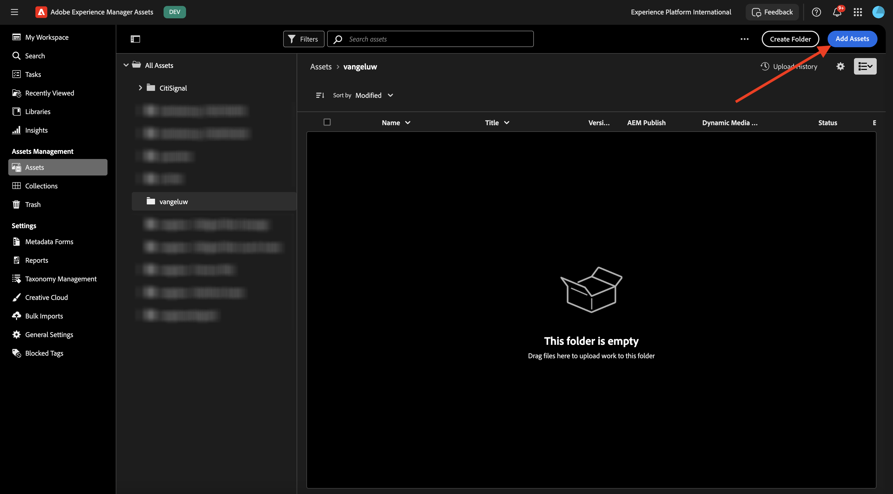

# 1.2.1 Introdução ao AEM Assets

Ir para [https://experience.adobe.com/](https://experience.adobe.com/){target="_blank"}. Verifique se você está no ambiente correto, que deve ser nomeado como `--aepImsOrgName--`.

Abra o **Adobe Experience Manager Assets**.

Selecione o ambiente do AEM Assets CS atribuído a você. Nesse caso, o ambiente a ser selecionado é `--aepUserLdap-- - CitiSignal dev author`.

Você deverá ver isso. Ir para **Assets**.

Você deve usar uma pasta chamada `--aepUserLdap-- - CitiSignal Fiber Campaign`. Se ainda não existir, clique em **Criar pasta**.

Insira o nome `--aepUserLdap--` para sua pasta e clique em **Criar**.

Abra a pasta recém-criada. Em um dos exercícios anteriores, você criou duas imagens chamadas `CitiSignal - Neon Rabbit - Get On Board Now!.png` e `CitiSignal - Neon Rabbit - Timetravel now!.png`. Agora é necessário carregar essas imagens nesta pasta se elas ainda não estiverem lá.

Caso não tenha mais esses arquivos, você pode baixá-los [aqui](./images/CitiSignal_Neon_Rabbit.zip){target="_blank"}.

Clique em **Adicionar Assets**.

Selecione as 2 imagens mencionadas acima. Clique em **Abrir**.

Clique em **Carregar**.

Clique em uma das imagens para selecioná-la.

Clique em **Detalhes**.

Agora você está vendo os metadados disponíveis do arquivo específico.

No menu direito, vá para **Representações**. Em seguida, você verá várias representações predefinidas da imagem selecionada com a capacidade de baixá-las.

No menu direito, clique no ícone **tesoura**. Você encontra várias ações de edição disponíveis para você, viabilizadas pelo Adobe Express. Clique em **Remover Plano de Fundo**.

Após alguns segundos, você verá algo semelhante a isso, com a capacidade de aplicar as alterações ou baixar o novo arquivo. Feche o pop-up.

Cortar **Imagem Cortada**.

É possível testar algumas variações de tamanhos de corte diferentes.

No menu direito, vá para **Tarefas**. Clique em **Atribuir tarefas**.

Defina o **Título da tarefa** como `Review image & approve`. Atribua a si mesmo. Clique em **Criar**.

Clique em **Exibir** na notificação.

Como alternativa, atualize a tela para ver as tarefas recém-criadas exibidas na lista **Tarefas relacionadas**. Clique no botão **Abrir** para exibir os detalhes da tarefa.

Você deveria ver algo assim. Clique em **Aprovar**.

Confirme clicando em **Aprovar**.

Seu ativo agora está aprovado no AEM Assets.

Próxima etapa: [Resumo e benefícios](./summary.md){target="_blank"}

Voltar para [Adobe Experience Manager Assets](./aemassets.md){target="_blank"}

[Voltar para Todos os Módulos](./../../../overview.md){target="_blank"}
