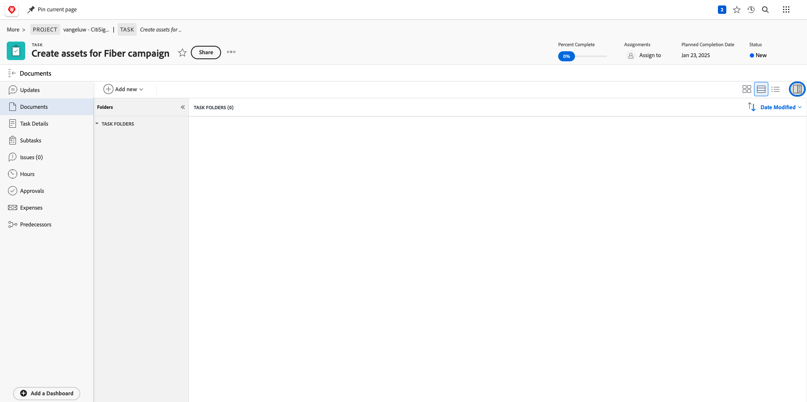
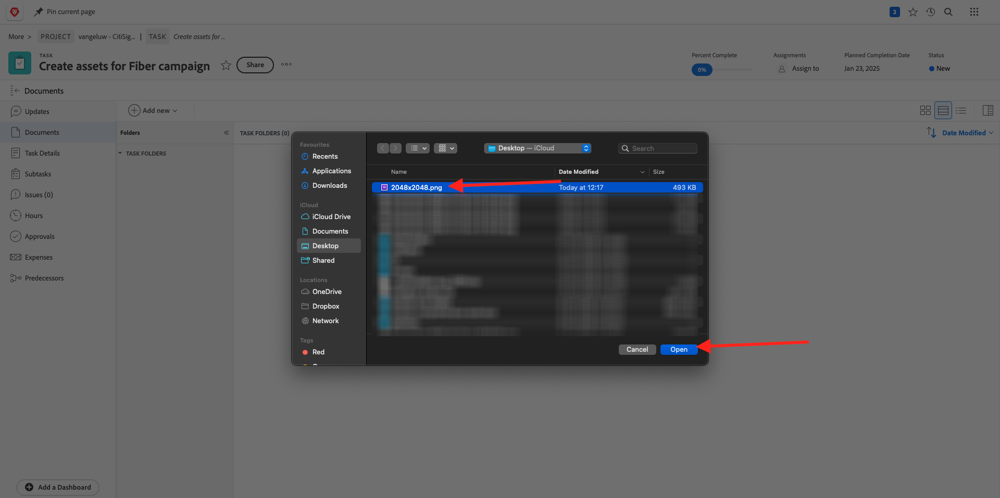
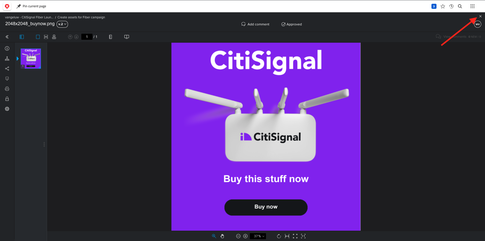
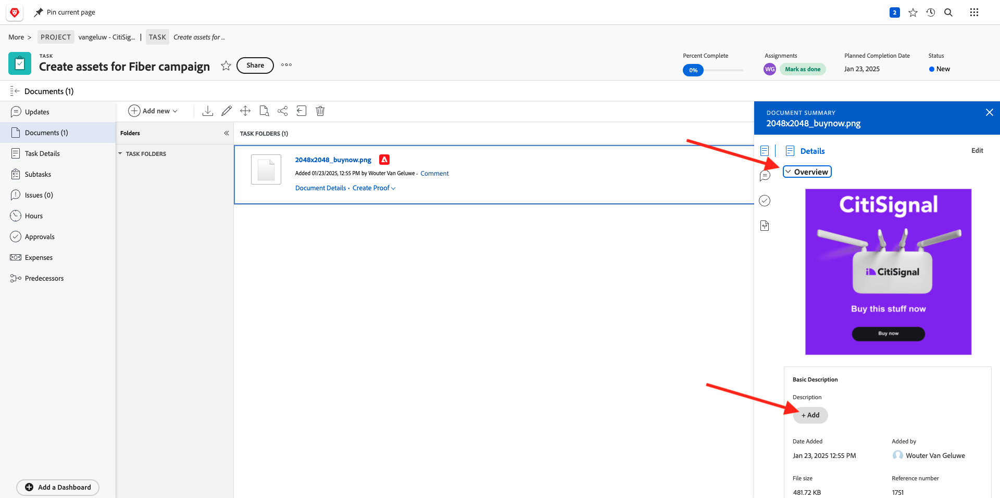

# 1.2.2 Prova com o Workfront

## 1.2.2.1 Criar um novo fluxo de aprovação

Ir para [https://experienceplatform.my.workfront.com/](https://experienceplatform.my.workfront.com/){target="_blank"}.

Clique no ícone de 9 pontos **hambúrguer** e selecione **Revisão**.

Vá para **Workflows**, clique em **+ Novo** e selecione **Novo modelo**.

Defina o **Nome do modelo** como `--aepUserLdap-- - Approval Workflow` e defina o **Proprietário do modelo** como você mesmo.

Role para baixo e, em **Estágios** > **Estágio 1**, adicione **Wouter Van Geluwe** com a **Função** de **Revisor e Aprovador**.

Clique em **Criar**.

O fluxo de trabalho básico de aprovação agora está pronto para ser usado.

## 1.2.2.2 Criar um novo projeto

Na página inicial do Workfront, clique em **Novo** na guia **Meus Projetos**. Selecione **Projeto Em Branco**.

Você deverá ver isso. Altere o nome para `--aepUserLdap-- - CitiSignal Fiber Launch`.

Seu projeto foi criado.

## 1.2.2.3 Criar uma nova tarefa

Digite este nome para sua tarefa: **Criar ativos para a campanha de Fibra**. Clique em **Criar tarefa**.

Você deverá ver isso.

## 1.2.2.4 Adicionar um novo Documento à Tarefa passar pelo fluxo de aprovação

Clique em **+ Adicionar novo** e selecione **Documento**.

Baixe [este arquivo](./images/2048x2048.png) na área de trabalho.

{width="50px" align="left"}

Selecione o arquivo **2048x2048.png** e clique em **Abrir**.

Você deveria ficar com isso. Clique em **Criar prova** e escolha **Prova avançada**.

Na janela **nova prova**, selecione o modelo de fluxo de trabalho criado anteriormente, que deve ser nomeado como `--aepuserLdap-- - Approval Workflow`. Clique em **Criar prova**.

Você estará de volta à sua tarefa. Clique no botão **Atribuir a** e selecione **Atribuir a mim**.

Clique em **Salvar**.

Clique em **Trabalhar nisto**.

Clique em **Abrir prova**

Agora você pode revisar a prova. Selecione **Adicionar comentário** para adicionar um comentário que exija que o documento seja alterado.

Insira seu comentário e clique em **Postar**. Clique em **Fechar**.

Em seguida, você precisa alterar sua função de **Revisor** para **Revisor e Aprovador**. Para fazer isso, volte para a sua Tarefa e clique em **Fluxo de trabalho de revisão**.

Altere sua função de **Revisor** para **Revisor e Aprovador**.

Volte para Tarefa e abra a prova novamente. Agora você vê um novo botão, **Tomar decisão**. Clique nele.

Selecione **Alterações necessárias** e clique em **tomar uma decisão**.

Você deveria voltar aqui. Agora é necessário carregar uma segunda imagem que considere os comentários fornecidos.

Baixe [este arquivo](./images/2048x2048_buynow.png) na área de trabalho.

{width="50px" align="left"}

Na exibição Tarefa, selecione o arquivo de imagem antigo que não foi aprovado. Em seguida, clique em **+ Adicionar novo**, selecione **Versão** e selecione **Documento**.

Selecione o arquivo **2048x2048_buynow.png** e clique em **Abrir**.

Você deveria ficar com isso. Clique em **Criar prova** e selecione novamente **Prova avançada**.

Você verá isso. O **modelo de fluxo de trabalho** agora está pré-selecionado, pois a Workfront presume que o fluxo de trabalho de aprovação anterior ainda é válido. Clique em **Criar prova**.

Selecione **Abrir Prova**.

Agora você pode ver duas versões do arquivo próximas uma da outra.

Clique em **Tomar decisão**, selecione **Aprovado** e clique novamente em **Tomar decisão**.

Feche a pré-visualização da prova.

Você voltará à exibição Tarefa, com um ativo aprovado. Esse ativo agora precisa ser compartilhado na AEM Assets.

Clique no ícone de **Seta de compartilhamento** e selecione sua integração com o AEM Assets, que deve se chamar `--aepUserLdap-- - Citi Signal AEM`.

Clique duas vezes na pasta criada anteriormente, que deve se chamar `--aepUserLdap-- - Workfront Assets`.

Clique em **Selecionar pasta**.

Após 1-2 minutos, seu documento será publicado no AEM Assets. Você verá um ícone do AEM ao lado do nome do documento.

Clique em **Abrir resumo**.

Vá para **Metadados**, você deve ver isto:

Vá para **Visão geral** e clique em **+ Adicionar** para adicionar uma descrição.

Insira sua descrição. As configurações de prova e documento foram concluídas.

## 1.2.2.5 Exibir o arquivo no AEM Assets

Vá para sua pasta no AEM Assets, chamada `--aepUserLdap-- - Workfront Assets`.

Clique nos 3 pontos abaixo da imagem e selecione **Detalhes**.

Em seguida, você verá o Formulário de metadados que criou anteriormente, com os valores que foram preenchidos automaticamente pela integração entre o Workfront e o AEM Assets.

Voltar para o [Gerenciamento de Fluxo de Trabalho com o Adobe Workfront](./workfront.md){target="_blank"}

[Voltar para Todos os Módulos](./../../../overview.md){target="_blank"}
