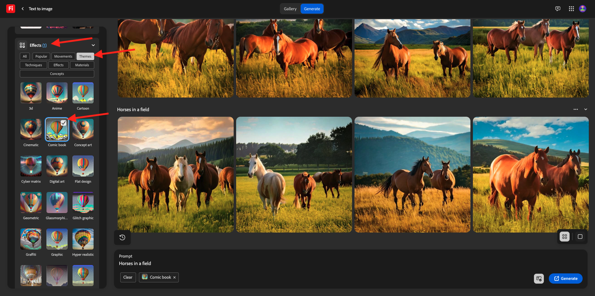

# 1.1.1 Introdução aos Serviços Firefly

Saiba como usar o Postman e o Adobe I/O para consultar APIs de serviços da Adobe Firefly.

## 1.1.1.1 Pré-requisitos

Antes de continuar com este exercício, você precisa ter concluído a configuração do [seu projeto do Adobe I/O](./../../../modules/getting-started/gettingstarted/ex6.md) e também precisa ter configurado um aplicativo para interagir com APIs, como o [Postman](./../../../modules/getting-started/gettingstarted/ex7.md) ou o [PostBuster](./../../../modules/getting-started/gettingstarted/ex8.md).

## 1.1.1.2 firefly.adobe.com

Ir para [https://firefly.adobe.com](https://firefly.adobe.com). Clique no ícone **perfil** e verifique se você está conectado à **Conta** correta, que deve ser `--aepImsOrgName--`. Se necessário, clique em **Alternar perfil** para alternar para essa conta.

{zoomable="yes"}

Digite o prompt `Horses in a field` e clique em **Gerar**.

{zoomable="yes"}

Você verá algo semelhante a isso.

{zoomable="yes"}

Em seguida, abra as **Ferramentas do Desenvolvedor** em seu navegador.

{zoomable="yes"}

Você deverá ver isso. Vá para a guia **Rede**.

{zoomable="yes"}

Insira o termo de pesquisa **generate** e clique em **Generate** novamente. Você deverá ver uma solicitação com o nome **generate-async**. Selecione e vá para **Carga**, onde você verá os detalhes da solicitação.

{zoomable="yes"}

A solicitação que você está vendo aqui é a enviada para o back-end do lado do servidor do Firefly Services. Ela contém vários parâmetros importantes:

- **prompt**: este é seu prompt, solicitando que tipo de imagem a Firefly deve gerar

- **seeds**: nesta solicitação, as seeds foram geradas aleatoriamente. Sempre que o Firefly gera uma imagem, por padrão, ele inicia o processo escolhendo um número aleatório chamado seed. Esse número aleatório contribui para o que torna cada imagem única, o que é ótimo quando você deseja gerar uma grande variedade de imagens. No entanto, pode haver momentos em que você deseje gerar imagens semelhantes entre si em várias solicitações. Por exemplo, quando o Firefly gera uma imagem que você deseja modificar usando outras opções do Firefly (como predefinições de estilo, imagens de referência etc.), use a semente dessa imagem em solicitações HTTP futuras para limitar a aleatoriedade de imagens futuras e aprimorar a imagem desejada.

{zoomable="yes"}

Dê uma olhada na interface do usuário novamente. Altere a **Taxa de proporção** para **Paisagem (4:3)**.

{zoomable="yes"}

Role para baixo até **Efeitos**, vá até **Temas** e selecione um efeito como **Quadrinhos**.

{zoomable="yes"}

Abra as **Ferramentas do Desenvolvedor** no seu navegador novamente. Em seguida, clique em **Gerar** e inspecione a solicitação de rede que está sendo enviada.

{zoomable="yes"}

Ao inspecionar os detalhes da solicitação de rede, você verá o seguinte:

- **prompt** não foi alterado em comparação com a solicitação anterior
- **seeds** não foram alterados em comparação à solicitação anterior
- **tamanho** alterado com base na alteração em **Taxa de proporção**.
- **estilos** foi adicionado e tem uma referência para o efeito **comic_book** selecionado

{zoomable="yes"}

Para o próximo exercício, você precisará usar um dos números **seed**. Anote um seed number de escolha.

No próximo exercício, você fará coisas semelhantes com os Serviços da Firefly, mas usando a API em vez da interface do usuário. Neste exemplo, o número de seed é **45781**.

## 1.1.1.3 Adobe I/O - access_token

Na coleção **Adobe IO - OAuth**, selecione a solicitação denominada **POST - Obter Token de Acesso** e selecione **Enviar**. A resposta deve conter um novo **accestoken**.

{zoomable="yes"}

## 1.1.1.4 API de serviços do Firefly, imagem de texto 2

Agora que você tem um access_token válido e atualizado, você está pronto para enviar sua primeira solicitação às APIs de serviços da Firefly.

Selecione a solicitação denominada **POST - Firefly - T2I V3** da coleção **FF - Firefly Services Tech Insiders**.

{zoomable="yes"}

Copie o URL da imagem da resposta e abra-o em seu navegador da Web para exibir a imagem.

{zoomable="yes"}

Você deve ver uma bela imagem representando `horses in a field`.

{zoomable="yes"}

No **Corpo** de sua solicitação **POST - Firefly - T2I V3**, adicione o seguinte no campo `"promptBiasingLocaleCode": "en-US"` e substitua a variável `XXX` por um dos números de propagação usados aleatoriamente pela interface do usuário dos Serviços Firefly. Neste exemplo, o número **seed** é `45781`.

```json
,
  "seeds": [
    XXX
  ]
```

Clique em **Enviar**. Você receberá uma resposta com uma nova imagem gerada pelos Serviços da Firefly. Abra a imagem para visualizá-la.

{zoomable="yes"}

Você deverá ver uma nova imagem com pequenas diferenças, com base na **seed** que foi usada.

{zoomable="yes"}

Em seguida, no **Corpo** da sua solicitação **POST - Firefly - T2I V3**, cole o objeto **estilos** abaixo no objeto **seeds**. Isso mudará o estilo da imagem gerada para **comic_book**.

```json
,
  "contentClass": "art",
  "styles": {
    "presets": [
      "comic_book"
    ],
    "strength": 50
  }
```

Você deveria ficar com isso. Clique em **Enviar**.

{zoomable="yes"}

Clique na URL da imagem para abri-la.

{zoomable="yes"}

Sua imagem mudou um pouco. Ao aplicar predefinições de estilo, a imagem de propagação não é mais aplicada da mesma forma que antes.

{zoomable="yes"}

Remova o código do objeto **seeds** do **Corpo** de sua solicitação. Clique em **Enviar** e clique na URL da imagem obtida da resposta.

```json
,
  "seeds": [
    XXX
  ]
```

{zoomable="yes"}

Sua imagem foi alterada novamente.

{zoomable="yes"}


## 1.1.1.5 API de serviços da Firefly, expansão de geração

Selecione a solicitação denominada **POST - Firefly - Gen Expand** da coleção **FF - Firefly Services Tech Insiders** e vá para o **Corpo** da solicitação.

- **tamanho**: insira a resolução desejada. O valor inserido aqui deve ser maior que o tamanho original da imagem e não pode ser maior que 4096.
- **image.source.url**: este campo requer um link para a imagem que precisa ser expandida. Neste exemplo, uma variável é usada para se referir à imagem gerada no exercício anterior.

- **alinhamento horizontal**: os valores aceitos são: `"center"`,`"left`, `"right"`.
- **alinhamento vertical**: os valores aceitos são: `"center"`,`"top`, `"bottom"`.

{zoomable="yes"}

Clique no URL da imagem que faz parte da resposta.

{zoomable="yes"}

A imagem gerada no exercício anterior foi expandida para a resolução de 3999x3999.

{zoomable="yes"}

Quando você altera o alinhamento da disposição, a saída também será um pouco diferente. Neste exemplo, o posicionamento foi alterado para **left, bottom**. Clique em **Enviar** e em para abrir a URL da imagem gerada.

{zoomable="yes"}

Você verá que a imagem original é usada em uma disposição diferente, o que influencia a imagem inteira.

{zoomable="yes"}

## Próximas etapas

Vá para [Otimizar seu processo do Firefly usando o Microsoft Azure e URLs pré-assinadas](./ex2.md){target="_blank"}

Retorne para [Visão geral dos Serviços da Adobe Firefly](./firefly-services.md){target="_blank"}

Voltar para [Todos os módulos](./../../../overview.md){target="_blank"}
