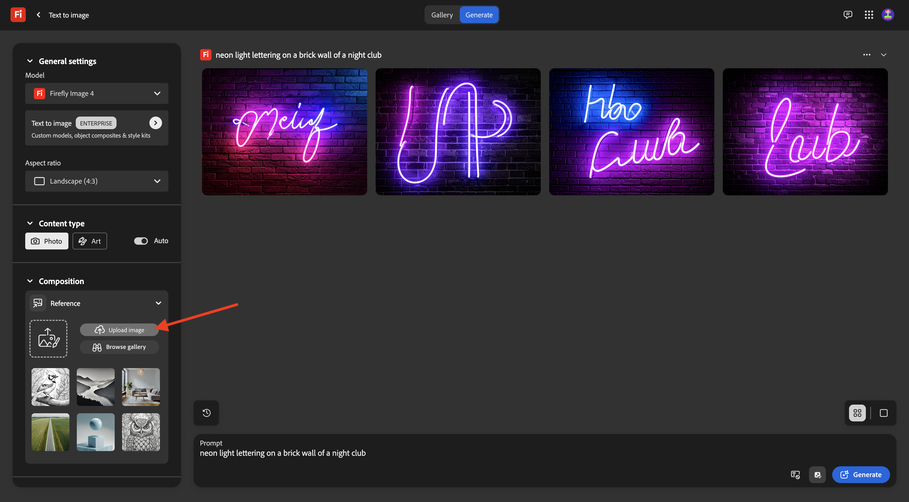
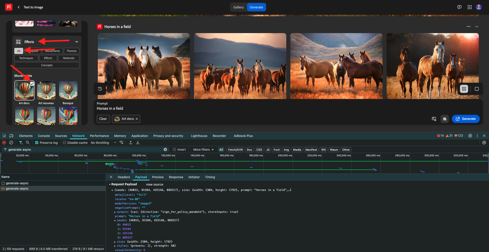
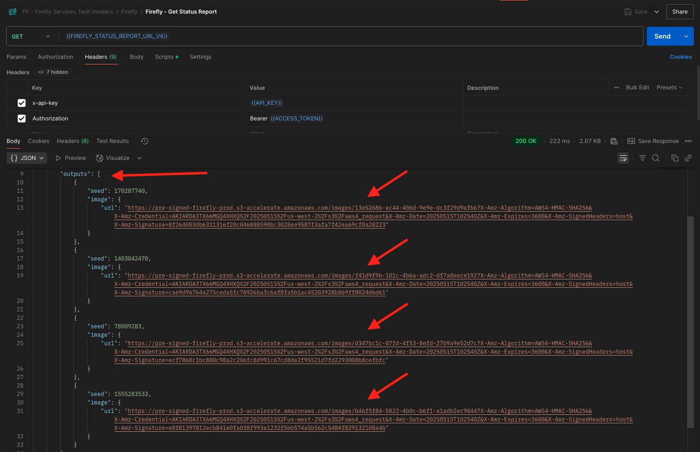

# 1.1.1 Introdução ao Firefly Services

Saiba como usar o Postman e o Adobe I/O para consultar APIs do Adobe Firefly Services.

## 1.1.1.1 Pré-requisitos

Antes de continuar com este exercício, você precisa ter concluído a configuração do [seu projeto do Adobe I/O](./../../../modules/getting-started/gettingstarted/ex6.md) e também precisa ter configurado um aplicativo para interagir com APIs, como o [Postman](./../../../modules/getting-started/gettingstarted/ex7.md) ou o [PostBuster](./../../../modules/getting-started/gettingstarted/ex8.md).

## Noções básicas da API 1.1.1.2

Há vários tipos de solicitações de API:

- **GET**: usado ao tentar recuperar informações de um ponto de extremidade de API, como obter um Relatório de Status
- **POST**: usado quando algo novo precisa ser feito, como fazer o Adobe Firefly Services gerar uma nova imagem
- **PUT**: é usado para atualizar completamente os dados existentes
- **PATCH**: usado para atualizar seletivamente dados existentes
- **DELETE**: usado para excluir dados

Ao trabalhar com APIs, você também notará códigos de resposta sendo retornados pelos vários pontos de acesso de API.

Há cinco categorias diferentes de respostas que você pode esperar:

- **1xx resposta informativa**: a solicitação foi recebida, continuando o processo
- **2xx bem-sucedida**: a solicitação foi recebida, compreendida e aceita com êxito
- **3xx redirecionamento**: outra ação precisa ser tomada para concluir a solicitação
- **4xx erro do cliente**: a solicitação contém sintaxe incorreta ou não pode ser atendida
- **5xx erro do servidor**: o servidor falhou ao atender uma solicitação aparentemente válida

Este é um exemplo de códigos de resposta comuns que você pode esperar:

- **200 OK**: bom, sua solicitação foi concluída com êxito
- **201 Criado**: bom, por exemplo, sua imagem foi criada
- **202 Aceito**: bom, sua solicitação foi aceita e será processada
- **401 Não autorizado**: isso não é bom, provavelmente seu token de acesso não é válido
- **403 Proibido**: isso não é bom, você provavelmente não tem as permissões necessárias para a ação que está tentando executar
- **404 Não encontrado**: isso não é bom, provavelmente a URL que você está tentando acessar não existe
- **429 Muitas solicitações**: isso não é bom, você provavelmente enviou muitas solicitações em um curto período. Tente novamente mais tarde.

## 1.1.1.3 Explorar firefly.adobe.com - estágio 1

Vamos começar a explorar o Adobe Firefly Services. Para exploração, você começará com um exemplo de geração de imagem CitiSignal. A equipe de design do CitiSignal gostaria de gerar uma versão neon da marca CitiSignal. Eles gostariam de usar o Adobe Firefly Services para fazer isso.

A primeira coisa que é necessária para conseguir isso é uma versão em preto e branco do nome da marca CitiSignal, algo que se parece com isto:


### 1.1.1.3.1 Criar sua imagem de referência de composição

Você pode usar [esta imagem de exemplo](./images/CitiSignal.jpg) ou criar seu próprio texto para experimentar. Siga as etapas abaixo no Adobe Illustrator para criar seu próprio arquivo de imagem. Se você optar por usar a imagem predefinida, ignore a seção abaixo e vá para a etapa **1.1.1.2.2 Gerar sua imagem** diretamente.

Abra o **Adobe Illustrator**. Clique em **Novo arquivo**.


Selecione **Web-Large 1920 x 1080px**. Clique em **Criar**.


Você deveria ficar com isso. Clique no ícone de texto **T**.


Você deveria ficar com isso.


Altere o tipo de fonte para uma fonte de escolha. Nesse caso, o tipo de fonte é **Adobe Clean Bold**.


Altere o tamanho da fonte para um tamanho à sua escolha, neste caso **250 pt**.


Você deveria ficar com isso.


Altere o texto como desejar, neste caso **CitiSignal**.


Centralizar o texto no arquivo.


Ir para **Arquivo > Exportar > Salvar para Web (Herdado)**


Você deveria ficar com isso. Clique em **Salvar**.


Dê um nome ao arquivo e salve-o na área de trabalho. Clique em **Salvar**.


### 1.1.1.3.2 Gerar sua imagem

Ir para [https://firefly.adobe.com](https://firefly.adobe.com). Clique no ícone **perfil** e verifique se você está conectado à **Conta** correta, que deve ser `--aepImsOrgName--`. Se necessário, clique em **Alternar perfil** para alternar para essa conta.


Digite o prompt `neon light lettering on a brick wall of a night club`. Clique em **Gerar**.


Você deveria ter algo parecido com isso. Estas imagens ainda não são úteis. Em **Composição**, clique em **Carregar imagem**.



Selecione a imagem criada anteriormente, neste caso **CitiSignal.jpg**. Clique em **Abrir** e em **Gerar**.


Você deveria ter algo parecido com isso. A aplicação da referência Composição ainda não é boa. Para alterar isso, altere o controle deslizante **Intensidade** para o valor máximo. Clique novamente em **Gerar**.


Agora há várias imagens que mostram uma versão neon do nome da marca CitiSignal, que você pode usar para iterar ainda mais.


Agora você aprendeu a usar o Firefly para resolver um problema de design em questão de minutos.

## 1.1.1.4 Explorar firefly.adobe.com - estágio 2

Ir para [https://firefly.adobe.com/generate/image](https://firefly.adobe.com/generate/image). Você deverá ver isso. Clique na lista suspensa **Modelo**. Você observará que há três versões disponíveis do Adobe Firefly Services:

- Imagem 3 do Firefly
- Imagem 4 do Firefly
- Firefly Image 4 Ultra


>[!NOTE]
>
>O Firefly Image 3 e o Image 4 estão disponíveis para todos que usam o Adobe Firefly Services, enquanto o Firefly Image 4 Ultra requer uma licença Firefly Pro.

Clique para selecionar **Firefly Image 3** para este exercício.


Digite o prompt `Horses in a field` e clique em **Gerar**.


Você verá algo semelhante a isso.


Em seguida, abra as **Ferramentas do Desenvolvedor** em seu navegador.


Você deverá ver isso. Vá para a guia **Rede**. Em seguida, clique novamente em **Gerar**.


Insira o termo de pesquisa **generate-async**. Você deverá ver uma solicitação com o nome **generate-async**. Selecione e vá para **Carga**, onde você verá os detalhes da solicitação.


A solicitação que você está vendo aqui é a enviada para o back-end do lado do servidor do Firefly Services. Ela contém vários parâmetros importantes:

- **prompt**: este é seu prompt, solicitando que tipo de imagem a Firefly deve gerar

- **seeds**: nesta solicitação, as seeds foram geradas aleatoriamente. Sempre que o Firefly gera uma imagem, por padrão, ele inicia o processo escolhendo um número aleatório chamado seed. Esse número aleatório contribui para o que torna cada imagem única, o que é ótimo quando você deseja gerar uma grande variedade de imagens. No entanto, pode haver momentos em que você deseje gerar imagens semelhantes entre si em várias solicitações. Por exemplo, quando o Firefly gera uma imagem que você deseja modificar usando outras opções do Firefly (como predefinições de estilo, imagens de referência etc.), use a semente dessa imagem em solicitações HTTP futuras para limitar a aleatoriedade de imagens futuras e aprimorar a imagem desejada.


Dê uma olhada na interface do usuário novamente. Altere a **Taxa de proporção** para **Widescreen (16:9)**.


Role para baixo até **Efeitos**, vá até **Temas** e selecione um efeito como **Art deco**.



Verifique se as **Ferramentas do Desenvolvedor** ainda estão abertas no navegador. Em seguida, clique em **Gerar** e inspecione a solicitação de rede que está sendo enviada.


Ao inspecionar os detalhes da solicitação de rede, você verá o seguinte:

- **prompt** não foi alterado em comparação com a solicitação anterior
- **seeds** foram alterados em comparação à solicitação anterior
- **tamanho** alterado com base na alteração em **Taxa de proporção**.
- **estilos** foi adicionado e tem uma referência ao efeito **art_deco** selecionado


Para o próximo exercício, você precisará usar um dos números **seed**. Anote um seed number de escolha.

>[!NOTE]
>
>Os números de seeds são números aleatórios escolhidos no momento do clique em **Gerar**. Se você quiser ter uma aparência consistente para a imagem gerada em várias solicitações **Generate**, é importante lembrar e especificar o **seed number** escolhido em solicitações futuras.

No próximo exercício, você fará coisas semelhantes com o Firefly Services, mas usando a API em vez da interface do usuário. Neste exemplo, o número de semente é **142194** para a primeira imagem, que tem dois cavalos olhando um para o outro com as cabeças viradas um para o outro.

## 1.1.1.5 Adobe I/O - access_token

Na coleção **Adobe IO - OAuth**, selecione a solicitação denominada **POST - Obter Token de Acesso** e selecione **Enviar**. A resposta deve conter um novo **accestoken**.


## 1.1.1.6 API Firefly Services, Texto, Imagem 2, Imagem 3

Agora que você tem um access_token válido e atualizado, você está pronto para enviar sua primeira solicitação às APIs do Firefly Services.

Selecione a solicitação denominada **POST - Firefly - T2I V3** da coleção **FF - Firefly Services Tech Insiders**. Vá para o **Corpo** e verifique o prompt. Clique em **Enviar**.

A solicitação que você está usando aqui é uma solicitação **síncrona**, que fornece a você uma resposta que contém a imagem solicitada em alguns segundos.

>[!NOTE]
>
>Com o lançamento da Firefly Image 4 e Image 4 Ultra, as solicitações síncronas serão descontinuadas em favor das solicitações assíncronas. Você encontrará exercícios sobre solicitações assíncronas mais adiante neste tutorial.


Copie (ou clique) o URL da imagem da resposta e abra-o em seu navegador da Web para exibir a imagem.


Você deve ver uma bela imagem representando `horses in a field`.


No **Corpo** de sua solicitação **POST - Firefly - T2I V3**, adicione o seguinte no campo `"promptBiasingLocaleCode": "en-US"` e substitua a variável `XXX` por um dos números de propagação usados aleatoriamente pela interface do usuário do Firefly Services. Neste exemplo, o número **seed** é `142194`.

```json
,
  "seeds": [
    XXX
  ]
```

Clique em **Enviar**. Você receberá uma resposta com uma nova imagem gerada pelo Firefly Services. Abra a imagem para visualizá-la.


Você deverá ver uma nova imagem com pequenas diferenças, com base na **seed** que foi usada. A semente `142194` tinha dois cavalos olhando um para o outro com a cabeça de frente.


Em seguida, no **Corpo** da sua solicitação **POST - Firefly - T2I V3**, cole o objeto **estilos** abaixo no objeto **seeds**. Isto mudará o estilo da imagem gerada para **art_deco**.

```json
,
  "contentClass": "art",
  "styles": {
    "presets": [
      "art_deco"
    ],
    "strength": 50
  }
```

Você deveria ficar com isso. Clique em **Enviar**.


Clique na URL da imagem para abri-la.


Sua imagem mudou um pouco. Ao aplicar predefinições de estilo, a imagem de propagação não é mais aplicada da mesma forma que antes. No geral, com a IA gerativa, é muito difícil garantir que a mesma combinação de parâmetros de entrada gere a mesma imagem.


Remova o código do objeto **seeds** do **Corpo** de sua solicitação. Clique em **Enviar** e clique na URL da imagem obtida da resposta.

```json
,
  "seeds": [
    XXX
  ]
```


Sua imagem foi alterada novamente.


## 1.1.1.7 API do Firefly Services, Expansão da Geração

Selecione a solicitação denominada **POST - Firefly - Gen Expand** da coleção **FF - Firefly Services Tech Insiders** e vá para o **Corpo** da solicitação.

- **tamanho**: insira a resolução desejada. O valor inserido aqui deve ser maior que o tamanho original da imagem e não pode ser maior que 3999.
- **image.source.url**: este campo requer um link para a imagem que precisa ser expandida. Neste exemplo, uma variável é usada para se referir à imagem gerada no exercício anterior.

- **alinhamento horizontal**: os valores aceitos são: `"center"`,`"left`, `"right"`.
- **alinhamento vertical**: os valores aceitos são: `"center"`,`"top`, `"bottom"`.


Clique no URL da imagem que faz parte da resposta.


A imagem gerada no exercício anterior foi expandida para a resolução de 3999x3999.


Quando você altera o alinhamento da disposição, a saída também será um pouco diferente. Neste exemplo, o posicionamento foi alterado para **left, bottom**. Clique em **Enviar** e em para abrir a URL da imagem gerada.


Você verá que a imagem original é usada em uma disposição diferente, o que influencia a imagem inteira.


## 1.1.1.8 API do Firefly Services, Texto 2, Imagem 4 e Imagem 4 Ultra

Com o recente lançamento do Firefly Image Model 4, várias melhorias foram disponibilizadas:

- O Firefly Image Model 4 oferece saída de resolução de 2K com definição e detalhes aprimorados.
- O Firefly Image Model 4 oferece melhorias significativas na renderização de texto, humanos, animais e arquitetura.
- O Firefly Image Model 4 mantém o compromisso da Adobe com IA gerativa compatível com IP e segura comercialmente.

O Firefly Image Model 4 oferece imagens excepcionais de pessoas, animais e cenas detalhadas, e você pode usar o Image Model 4 Ultra para gerar imagens com interações humanas hiper-realistas, elementos arquitetônicos e paisagens complexas&#x200B;

### 1.1.1.8.1 image4_standard

Selecione a solicitação denominada **POST - Firefly - T2I V4** da coleção **FF - Firefly Services Tech Insiders** e vá para os **Cabeçalhos** da solicitação.

Você observará que a URL da solicitação é diferente da **API do Firefly Services, Texto 2 Imagem, Imagem 3** solicitação, que era **https://firefly-api.adobe.io/v3/images/generate**. Esta URL aponta para **https://firefly-api.adobe.io/v3/images/generate-async**. A adição de **-async** à URL significa que você está usando o ponto de extremidade assíncrono.

Nas variáveis de **Cabeçalho**, você observará uma nova variável chamada **x-model-version**. Esse é um cabeçalho necessário ao interagir com o Firefly Image 4 e Image 4 Ultra. Para usar a Firefly Image 4 ou Image 4 Ultra ao gerar imagens, o valor do cabeçalho deve ser definido como `image4_standard` ou `image4_ultra`. Neste exemplo, você usará `image4_standard`.

Se você não definir a **x-model-version** como `image4_standard` ou `image4_ultra`, o padrão do Firefly Services será usar `image3` atualmente.


Vá para o **Corpo** da solicitação. Você deve ver que no corpo, 4 variações de imagens estão sendo solicitadas. O prompt permanece inalterado e ainda está solicitando a geração de **cavalos em um campo**. Clique em **Enviar**


Você receberá uma resposta imediata. Ao contrário da solicitação síncrona anterior usada, essa resposta não contém URLs de imagem de imagens geradas. Ele contém um URL do relatório de status do trabalho que você iniciou e contém outro URL que permite cancelar o trabalho em execução.


Para verificar o relatório de status do seu trabalho em execução, selecione a solicitação chamada **GET - Firefly - Obter relatório de status** da coleção **FF - Firefly Services Tech Insiders**. Clique para abri-lo e em **Enviar**.


Em seguida, você verá o relatório de status do trabalho de geração de imagem que acabou de iniciar. Verifique o campo **status**, pois ele pode estar definido como **em execução**, o que significa que o trabalho ainda não foi concluído. Neste exemplo, o status do trabalho está definido como **bem-sucedido**, o que significa que as imagens solicitadas foram geradas.


Role para baixo um pouco na resposta e você deve ver no total 4 variações de imagem retornadas pelo Adobe Firefly Services. Clique (ou copie) no URL de uma das imagens e abra-o no navegador.



Você deverá ver uma imagem hiperrealista de **cavalos em um campo**.


### 1.1.1.8.2 image4_ultra

Retorne à solicitação denominada **POST - Firefly - T2I V4** da coleção **FF - Firefly Services Tech Insiders** e vá para os **Cabeçalhos** da solicitação.

Altere a variável **x-model-version** para `image4_ultra`. Neste exemplo, você usará `image4_standard`.


Vá para o **Corpo** da solicitação. No corpo, altere o número de variações de imagem para 1, como no Firefly Image 4 Ultra, apenas 1 imagem pode ser gerada ao mesmo tempo. O prompt permanece inalterado e ainda está solicitando a geração de **cavalos em um campo**. Clique em **Enviar**


A resposta novamente contém um URL do relatório de status do trabalho iniciado e contém outro URL que permite cancelar o trabalho em execução.


Para verificar o relatório de status do seu trabalho em execução, selecione a solicitação chamada **GET - Firefly - Obter relatório de status** da coleção **FF - Firefly Services Tech Insiders**. Clique para abri-lo e em **Enviar**.


Em seguida, você verá o relatório de status do trabalho de geração de imagem que acabou de iniciar. Verifique o campo **status**, pois ele pode estar definido como **em execução**, o que significa que o trabalho ainda não foi concluído. Neste exemplo, o status do trabalho está definido como **bem-sucedido**, o que significa que as imagens solicitadas foram geradas.


Você deverá ver uma imagem hiperrealista de **cavalos em um campo**.


## Próximas etapas

Vá para [Otimizar seu processo do Firefly usando o Microsoft Azure e URLs pré-assinadas](./ex2.md){target="_blank"}

Voltar para [Visão geral do Adobe Firefly Services](./firefly-services.md){target="_blank"}

Voltar para [Todos os módulos](./../../../overview.md){target="_blank"}
