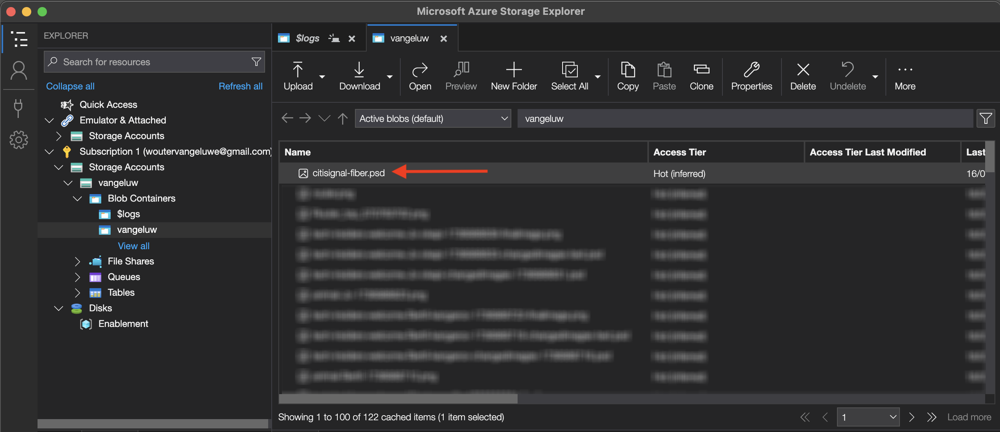
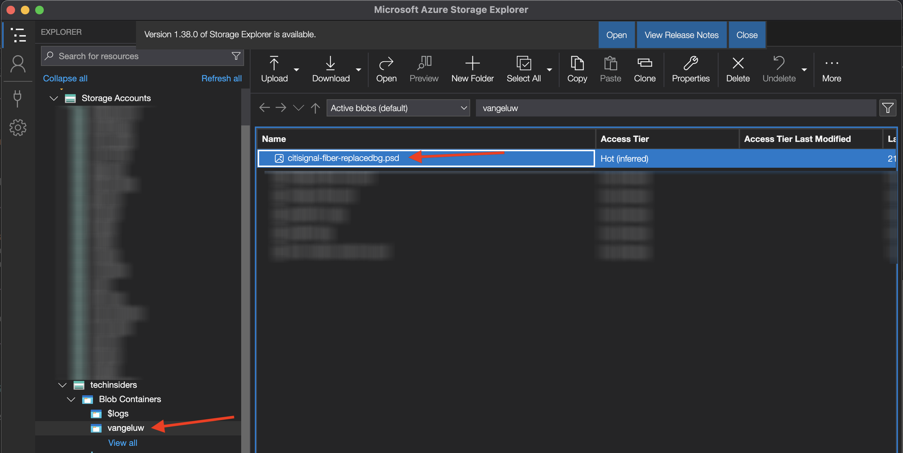

# 1.1.3 Trabalho com APIs do Photoshop

Saiba como trabalhar com as APIs do Photoshop e o Firefly Services.

## 1.1.3.1 Pré-requisitos

Antes de continuar com este exercício, você precisa ter concluído a configuração do [seu projeto do Adobe I/O](./../../../modules/getting-started/gettingstarted/ex6.md) e também precisa ter configurado um aplicativo para interagir com APIs, como o [Postman](./../../../modules/getting-started/gettingstarted/ex7.md) ou o [PostBuster](./../../../modules/getting-started/gettingstarted/ex8.md).

## 1.1.3.2 Adobe I/O - access_token

Na coleção **Adobe IO - OAuth**, selecione a solicitação denominada **POST - Obter Token de Acesso** e selecione **Enviar**. A resposta deve conter um novo **accestoken**.


## 1.1.3.3 Interagir programaticamente com um arquivo do PSD

Baixe o [citisignal-fiber.psd](./../../../assets/ff/citisignal-fiber.psd){target="_blank"} na área de trabalho.

Abra **citisignal-fiber.psd** no Photoshop.


No painel **Camadas**, o designer do arquivo deu um nome exclusivo a cada camada. Você pode ver as informações da camada abrindo o arquivo PSD no Photoshop, mas também pode fazer isso de forma programática.

Vamos enviar sua primeira solicitação de API para APIs do Photoshop.

### API do Photoshop - Hello World

Em seguida, vamos dizer olá para as APIs do Photoshop para testar se todas as permissões e o acesso estão definidos corretamente.

Na coleção **Photoshop**, abra a solicitação **Photoshop Hello (Test Auth.)**. Selecione **Enviar**.


Você deve receber a resposta **Bem-vindo à API do Photoshop!**.


Em seguida, para interagir programaticamente com o arquivo do PSD **citisignal-fiber.psd**, você precisa carregá-lo na sua conta de armazenamento. Você pode fazer isso manualmente — arrastando e soltando-o no contêiner usando o Azure Storage Explorer — mas dessa vez você deve fazer isso por meio da API.

### Fazer upload do PSD para o Azure

No Postman, abra a solicitação **Fazer upload do PSD para a conta de armazenamento do Azure**. No exercício anterior, você configurou essas variáveis de ambiente no Postman, que serão usadas agora:

- `AZURE_STORAGE_URL`
- `AZURE_STORAGE_CONTAINER`
- `AZURE_STORAGE_SAS_READ`
- `AZURE_STORAGE_SAS_WRITE`

Como você pode ver na solicitação **Fazer upload do PSD para a conta de armazenamento do Azure**, a URL está configurada para usar essas variáveis.


Em **Body**, selecione o arquivo **citisignal-fiber.psd**.


Sua tela deve ter esta aparência. Selecione **Enviar**.


Você deve obter essa resposta vazia do Azure, o que significa que seu arquivo está armazenado no contêiner na sua conta de Armazenamento do Azure.


Se você usar o Azure Storage Explorer para examinar seu arquivo, atualize sua pasta.



### API do Photoshop - Obter manifesto

Em seguida, é necessário obter o arquivo de manifesto do arquivo do PSD.

No Postman, abra a solicitação **Photoshop - Obter Manifesto do PSD**. Ir para **Corpo**.

O corpo deve ter esta aparência:

```json
  {
    "inputs": [
      {
        "storage": "external",
        "href": "{{AZURE_STORAGE_URL}}/{{AZURE_STORAGE_CONTAINER}}/citisignal-fiber.psd{{AZURE_STORAGE_SAS_READ}}"
      }
    ],
    "options": {
      "thumbnails": {
        "type": "image/jpeg"
      }
    }
  }
```

Selecione **Enviar**.

Na resposta, agora você vê um link. Como as operações no Photoshop às vezes podem levar algum tempo para serem concluídas, o Photoshop fornece um arquivo de status como resposta à maioria das solicitações recebidas. Para entender o que está acontecendo com sua solicitação, você precisa ler o arquivo de status.


Para ler o arquivo de status, abra a solicitação **Photoshop - Obter Status PS**. Você pode ver que esta solicitação está usando uma variável como URL, que é uma variável definida pela solicitação anterior enviada, **Photoshop - Obter Manifesto do PSD**. As variáveis estão definidas nos **Scripts** de cada solicitação. Selecione **Enviar**.


Sua tela deve ter esta aparência. Atualmente, o status está definido como **pendente**, o que significa que o processo ainda não foi concluído.


Selecione para enviar mais algumas vezes no **Photoshop - Obter Status PS**, até que o status seja alterado para **bem-sucedido**. Isso pode levar alguns minutos.

Quando a resposta estiver disponível, você poderá ver que o arquivo json contém informações sobre todas as camadas do arquivo PSD. Essas informações são úteis, pois é possível identificar o nome ou a ID da camada.


Como exemplo, pesquise pelo texto `2048x2048-cta`. Sua tela deve ter esta aparência:


### API do Photoshop - Substituição de SmartObject

Em seguida, é necessário alterar o plano de fundo do arquivo citisignal-fiber.psd usando a imagem gerada com o Firefly em um dos exercícios anteriores.

No Postman, abra a solicitação **Photoshop - Substituição de SmartObject** e vá para **Corpo**.

Sua tela deve ter esta aparência:

- primeiro, um arquivo de entrada é especificado: `citisignal-fiber.psd`
- segundo, a camada a ser alterada é especificada, com o novo arquivo de plano de fundo a ser usado
- terceiro, um arquivo de saída foi especificado: `citisignal-fiber-replacedbg.psd`

```json
  {
    "inputs": [
        {
            "storage": "azure",
            "href": "{{AZURE_STORAGE_URL}}/{{AZURE_STORAGE_CONTAINER}}/citisignal-fiber.psd{{AZURE_STORAGE_SAS_READ}}"
        }
    ],
    "options": {
        "layers": [
            {
                "name": "2048x2048-image",
                "input": {
                    "href": "{{FIREFLY_COMPLETED_ASSET_URL}}",
                    "storage": "external"
                }
            }
        ]
    },
    "outputs": [
        {
            "storage": "azure",
            "href": "{{AZURE_STORAGE_URL}}/{{AZURE_STORAGE_CONTAINER}}/citisignal-fiber-replacedbg.psd{{AZURE_STORAGE_SAS_WRITE}}",
            "type": "vnd.adobe.photoshop",
            "overwrite": true
        }
    ]
}
```

O arquivo de saída tem um nome diferente, porque você não deseja substituir o arquivo de entrada original.

Selecione **Enviar**.


Assim como antes, a resposta contém um link que aponta para o arquivo de status que acompanha o progresso.


Para ler o arquivo de status, abra a solicitação **Photoshop - Obter Status PS** e selecione **Enviar**. Se o status não estiver definido como **êxito** imediatamente, aguarde alguns segundos e selecione **Enviar** novamente.

Selecione o URL para baixar o arquivo de saída.


Abra o **citisignal-fiber-replacedbg.psd** depois de baixar o arquivo no computador. Você deve ver que a imagem do plano de fundo foi alterada para uma imagem semelhante, como abaixo:


Você também pode ver esse arquivo em seu contêiner usando o explorador do Armazenamento do Azure.



### API do Photoshop - Alterar texto

Em seguida, é necessário alterar o texto para a call to action usando as APIs.

No Postman, abra a solicitação **Photoshop - Alterar Texto** e vá para **Corpo**.

Sua tela deve ter esta aparência:

- primeiro, um arquivo de entrada é especificado: `citisignal-fiber-replacedbg.psd`, que é o arquivo que foi gerado na etapa anterior quando você alterou a imagem de fundo
- segundo, a camada a ser alterada é especificada, com o texto a ser alterado para
- terceiro, um arquivo de saída foi especificado: `citisignal-fiber-changed-text.psd`

```json
  {
  "inputs": [
    {
      "storage": "external",
      "href": "{{AZURE_STORAGE_URL}}/{{AZURE_STORAGE_CONTAINER}}/citisignal-fiber-replacedbg.psd{{AZURE_STORAGE_SAS_READ}}"
    }
  ],
  "options": {
    "layers": [
      {
        "name": "2048x2048-cta",
        "text": {
          "content": "Get Fiber now!"
        }
      }
    ]
  },
  "outputs": [
    {
      "storage": "azure",
      "href": "{{AZURE_STORAGE_URL}}/{{AZURE_STORAGE_CONTAINER}}/citisignal-fiber-changed-text.psd{{AZURE_STORAGE_SAS_WRITE}}",
      "type": "vnd.adobe.photoshop",
      "overwrite": true
    }
  ]
}
```

O arquivo de saída tem um nome diferente, porque você não deseja substituir o arquivo de entrada original.

Selecione **Enviar**.


Assim como antes, a resposta contém um link que aponta para o arquivo de status que acompanha o progresso.


Para ler o arquivo de status, abra a solicitação **Photoshop - Obter Status PS** e selecione **Enviar**. Se o status não estiver definido como **êxito** imediatamente, aguarde alguns segundos e selecione **Enviar** novamente.

Selecione o URL para baixar o arquivo de saída.


Abra **citisignal-fiber-changed-text.psd** depois de baixar o arquivo no computador. Você deve ver que o espaço reservado para o call to action foi substituído pelo texto **Obter fibra agora!**.


Você também pode ver esse arquivo em seu contêiner usando o explorador do Armazenamento do Azure.


## Próximas etapas

Ir para a [API de Modelos personalizados do Firefly](./ex4.md){target="_blank"}

Voltar para [Visão geral do Adobe Firefly Services](./firefly-services.md){target="_blank"}

Voltar para [Todos os Módulos](./../../../overview.md){target="_blank"}