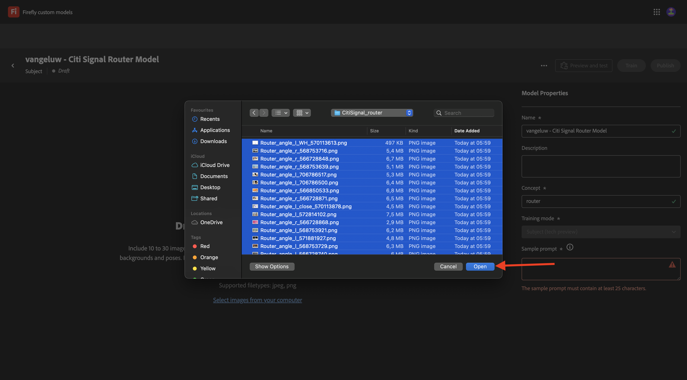
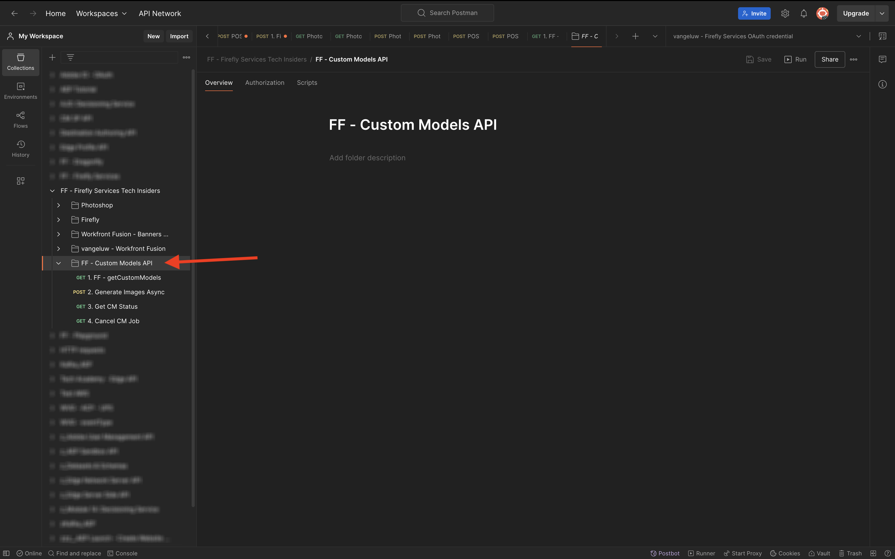

# 1.1.4 API de modelos personalizados do Firefly

## 1.1.4.1 Configurar o modelo personalizado

Ir para [https://firefly.adobe.com/](https://firefly.adobe.com/). Clique em **Modelos personalizados**.

{zoomable="yes"}

Você poderá ver esta mensagem. Se você fizer isso, clique em **Concordar** para continuar.

{zoomable="yes"}

Você deverá ver isso. Clique em **Treinar um modelo**.

{zoomable="yes"}

Configure os seguintes campos:

- **Nome**: use `--aepUserLdap-- - Citi Signal Router Model`
- **Modo de treinamento**: selecione **Assunto (visualização técnica)**
- **Conceito**: digite `router`
- **Salvar em**: abra a lista suspensa e clique em **+ Criar novo projeto**

{zoomable="yes"}

Dê um nome ao novo projeto: `--aepUserLdap-- - Custom Models`. Clique em **Criar**.

{zoomable="yes"}

Você deverá ver isso. Clique em **Criar**.

{zoomable="yes"}

Agora é necessário fornecer as imagens de referência para o Modelo personalizado ser treinado. Clique em **Selecionar imagens do computador**.

{zoomable="yes"}

Baixe as imagens de referência [aqui](https://tech-insiders.s3.us-west-2.amazonaws.com/CitiSignal_router.zip). Descompacte o arquivo de download, que fornecerá isso.

{zoomable="yes"}

Navegue até a pasta que contém os arquivos de imagem baixados. Selecione todas e clique em **Abrir**.

{zoomable="yes"}

Você verá que suas imagens estão sendo carregadas.

{zoomable="yes"}

Após alguns minutos, as imagens são carregadas corretamente. Você pode ver que algumas imagens têm um erro, isso ocorre porque a legenda da imagem não foi gerada ou não é longa o suficiente. Revise cada imagem com um erro e insira uma legenda que atenda aos requisitos e descreva a imagem.

{zoomable="yes"}

Depois que todas as imagens tiverem legendas que atendam aos requisitos, ainda será necessário fornecer um prompt de amostra. Digite qualquer prompt que use a palavra &#39;roteador&#39;. Depois de fazer isso, você pode começar a treinar seu modelo. Clique em **Treinamento**.

{zoomable="yes"}

Você verá isso. O treinamento do seu modelo pode levar de 20 a 30 minutos ou mais.

{zoomable="yes"}

Após 20-30min, seu modelo agora é treinado e pode ser publicado. Clique em **Publicar**.

{zoomable="yes"}

Clique novamente em **Publicar**.

{zoomable="yes"}

Feche o pop-up **Compartilhar modelo personalizado**.

{zoomable="yes"}

## 1.1.4.2 Usar seu modelo personalizado na interface do

Ir para [https://firefly.adobe.com/cme/train](https://firefly.adobe.com/cme/train). Clique no modelo personalizado para abri-lo.

{zoomable="yes"}

Clique em **Visualizar e testar**.

{zoomable="yes"}

Você verá o prompt de amostra inserido antes de ser executado.

{zoomable="yes"}

## 1.1.4.3 Ativar o Modelo personalizado para a API de modelos personalizados do Firefly Services

Depois que o modelo personalizado for treinado, ele também poderá ser usado por meio da API. No exercício 1.1.1, você já configurou o projeto do Adobe I/O para interação com os Serviços da Firefly por meio da API.

Ir para [https://firefly.adobe.com/cme/train](https://firefly.adobe.com/cme/train). Clique no modelo personalizado para abri-lo.

{zoomable="yes"}

Clique nos 3 pontos **...** e em **Compartilhar**.

{zoomable="yes"}

Para acessar um Modelo personalizado do Firefly, o Modelo personalizado precisa ser compartilhado com a **ID da conta técnica** do nosso Projeto do Adobe I/O.

Para recuperar sua **ID de Conta Técnica**, vá para [https://developer.adobe.com/console/projects](https://developer.adobe.com/console/projects). Clique para abrir seu projeto, que se chama `--aepUserLdap-- Firefly`.

{zoomable="yes"}

Clique em **Servidor a Servidor OAuth**.

{zoomable="yes"}

Clique para copiar sua **ID da Conta Técnica**.

{zoomable="yes"}

Cole sua **ID da Conta Técnica** e clique em **Convidar para editar**.

{zoomable="yes"}

A **ID da Conta Técnica** agora deve poder acessar o Modelo Personalizado.

{zoomable="yes"}

## 1.1.4.4 Interagir com a API de modelos personalizados dos serviços da Firefly

No Exercício 1.1.1 Introdução aos Serviços da Firefly, você baixou este arquivo: [postman-ff.zip](./../../../assets/postman/postman-ff.zip) no desktop local e importou essa coleção no Postman.

Abra o Postman e vá para a pasta **FF - API de Modelos Personalizados**.

{zoomable="yes"}

Abra a solicitação **1. FF - getCustomModels** e clique em **Enviar**.

{zoomable="yes"}

Você deve ver o Modelo personalizado criado antes, chamado `--aepUserLdap-- - Citi Signal Router Model`, como parte da resposta. O campo **assetId** é o identificador exclusivo do seu Modelo personalizado, que será referenciado na próxima solicitação.

{zoomable="yes"}

Abra a solicitação **2. Gerar Imagens Assíncronas**. Neste exemplo, você solicitará duas variações a serem geradas com base no seu Modelo personalizado. Você pode atualizar o prompt que, neste caso, é `a white router on a volcano in Africa`.

Clique em **Enviar**.

{zoomable="yes"}

A resposta contém um campo **jobId**. O trabalho para gerar essas 2 imagens agora está em execução e você pode verificar o status usando a próxima solicitação.

{zoomable="yes"}

Abra a solicitação **3. Obtenha o Status de CM** e clique em **Enviar**. Você deverá ver que o status está definido como em execução.

{zoomable="yes"}

Após alguns minutos, clique em **Enviar** novamente para a solicitação **3. Obter Status de CM**. Você deverá ver que o status mudou para **êxito** e deverá ver duas URLs de imagem como parte da saída. Clique em para abrir ambos os arquivos.

{zoomable="yes"}

Esta é a primeira imagem gerada neste exemplo.

{zoomable="yes"}

Esta é a segunda imagem que foi gerada neste exemplo.

{zoomable="yes"}

Você concluiu este exercício agora.

## Próximas etapas

Ir para [Resumo e benefícios](./summary.md){target="_blank"}

Volte para [Trabalhando com APIs Photoshop](./ex3.md){target="_blank"}

Retorne para [Visão geral dos Serviços da Adobe Firefly](./firefly-services.md){target="_blank"}
