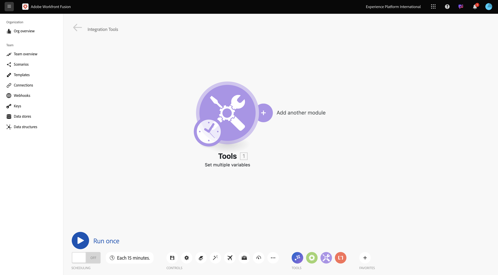
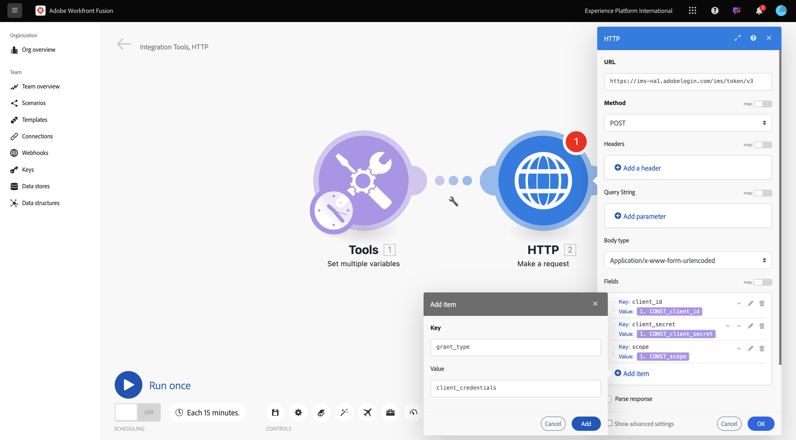
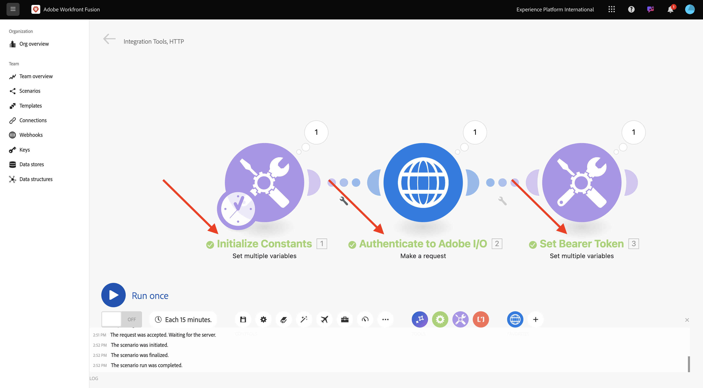

# 1.2.1 Introdução ao Workfront Fusion

Saiba como usar o Workfront Fusion e o Adobe I/O para consultar as APIs de serviços da Adobe Firefly.

## 1.2.1.1 Criar novo cenário

1. Ir para [https://experience.adobe.com/](https://experience.adobe.com/). Abra o **Workfront Fusion**.

   

1. Vá para **Cenários**.

   

1. Selecione **Criar novo cenário**.

   

1. Nomeie a pasta `--aepUserLdap--` e selecione **Salvar**.

   

1. Selecione sua pasta e, em seguida, selecione **Criar novo cenário**.

   

1. Um cenário vazio é exibido, selecione **ferramentas** e selecione **Definir várias variáveis**.

   

1. Mova o ícone **relógio** para a **Set multiple variables** recém-adicionada.

   

   Sua tela deve ter esta aparência.

   

1. Clique com o botão direito no ponto de interrogação e selecione **Excluir módulo**.

   

1. Em seguida, clique com o botão direito em **Definir várias variáveis** e selecione **Configurações**.

   

## 1.2.1.2 Configurar a autenticação do Adobe I/O

Agora, é necessário configurar as variáveis necessárias para autenticar no Adobe I/O. No exercício anterior, você criou um projeto do Adobe I/O. As variáveis desse projeto do Adobe I/O agora precisam ser definidas no Workfront Fusion.

As seguintes variáveis precisam ser definidas:

| Chave | Valor |
|:-------------:| :---------------:| 
| `CONST_client_id` | a ID do cliente do projeto do Adobe I/O |
| `CONST_client_secret` | Segredo do cliente do seu projeto do Adobe I/O |
| `CONST_scope` | o escopo do projeto do Adobe I/O |

1. Encontre essas variáveis acessando [https://developer.adobe.com/console/projects](https://developer.adobe.com/console/projects) e abrindo o projeto do Adobe I/O, chamado `--aepUserLdap-- Firefly`.

   

1. Em seu projeto, selecione **OAuth Serverto-Server** para ver os valores das chaves acima.

   

1. Usando as chaves e os valores acima, você pode configurar o objeto **Definir várias variáveis**. Selecione **Adicionar item**.

   

1. Insira o **nome da variável**: **CONST_client_id** e seu **valor da variável**, selecione **Adicionar**.

   

1. Selecione **Adicionar item**.

   

1. Insira o **nome da variável**: **CONST_client_secret** e seu **valor da variável**, selecione **Adicionar**.

   

1. Selecione **Adicionar item**.

   

1. Insira o **nome da variável**: **CONST_scope** e seu **valor da variável**, selecione **Adicionar**.

   

1. Selecione **OK**.

   

1. Passe o mouse sobre **Definir várias variáveis** e selecione o ícone grande **+** para adicionar outro módulo.

   

   Sua tela deve ter esta aparência.

   

1. Na barra de pesquisa, digite **http**. Selecione **HTTP** para abri-lo.

   

1. Selecione **Fazer uma solicitação**.

   

   | Chave | Valor |
   |:-------------:| :---------------:| 
   | `URL` | `https://ims-na1.adobelogin.com/ims/token/v3` |
   | `Method` | `POST` |
   | `Body Type` | `x-www-form-urlencoded` |

1. Selecione **Adicionar item**.

   

1. Adicione itens para cada um dos valores abaixo:

   | Chave | Valor |
   |:-------------:| :---------------:| 
   | `client_id` | sua variável predefinida para `CONST_client_id` |
   | `client_secret` | sua variável predefinida para `CONST_client_secret` |
   | `scope` | sua variável predefinida para `CONST_scope` |
   | `grant_type` | `client_credentials` |

1. Configuração para `client_id`:

   

1. Configuração para `client_secret`.

   

1. Configuração para `scope`.

   

1. Configuração para `grant_type`.

   

1. Role para baixo e marque a caixa para **Analisar resposta**. Selecione **OK**.

   

1. Sua tela deve ter esta aparência. Selecione **Executar uma vez**.

   

   Depois que o cenário for executado, sua tela deverá ter esta aparência:

   

1. Selecione o ícone de **ponto de interrogação** no objeto **Definir várias variáveis** para ver o que aconteceu quando esse objeto foi executado.

   

1. Selecione o ícone de **ponto de interrogação** no objeto **HTTP - Fazer uma solicitação** para ver o que aconteceu quando esse objeto foi executado. Na **SAÍDA**, consulte o **access_token** que está sendo retornado pela Adobe I/O.

   

1. Passe o mouse sobre **HTTP - Faça uma solicitação** e selecione o ícone **+** para adicionar outro módulo.

   

1. Na barra de pesquisa, procure por `tools`. Selecione **Ferramentas**.

   

1. Selecione **Definir várias variáveis**.

   

1. Selecione **Adicionar item**.

   

1. Definir **Nome da variável** como `bearer_token`. Selecione `access_token` como o **Valor da variável** dinâmica. Selecione **Adicionar**.

   

1. Sua tela deve ter esta aparência. Selecione **OK**.

   

1. Selecione **Executar uma vez** novamente.

   

1. Depois que o cenário for executado, selecione o ícone **ponto de interrogação** no último objeto **Definir várias variáveis**. Você deve ver que o access_token está sendo armazenado na variável `bearer_token`.

   

1. Em seguida, clique com o botão direito no primeiro objeto **Definir vários valores** e selecione **Renomear**.

   

1. Defina o nome como **Inicializar constantes**. Selecione **OK**.

   

1. Renomeie o segundo objeto para **Autenticar para o Adobe I/O**. Selecione **OK**.

   

1. Renomeie o terceiro objeto para **Definir Token de Portador**. Selecione **OK**.

   

   Sua tela deve ter esta aparência:

   

1. Em seguida, altere o nome do cenário para `--aepUSerLdap-- - Adobe I/O Authentication`.

   

1. Selecione **Salvar**.

   

## Próximas etapas

Ir para [Usar APIs do Adobe no Workfront Fusion](./ex2.md){target="_blank"}

Volte para [Automatização dos Serviços Adobe Firefly](./automation.md){target="_blank"}

Voltar para [Todos os Módulos](./../../../overview.md){target="_blank"}
