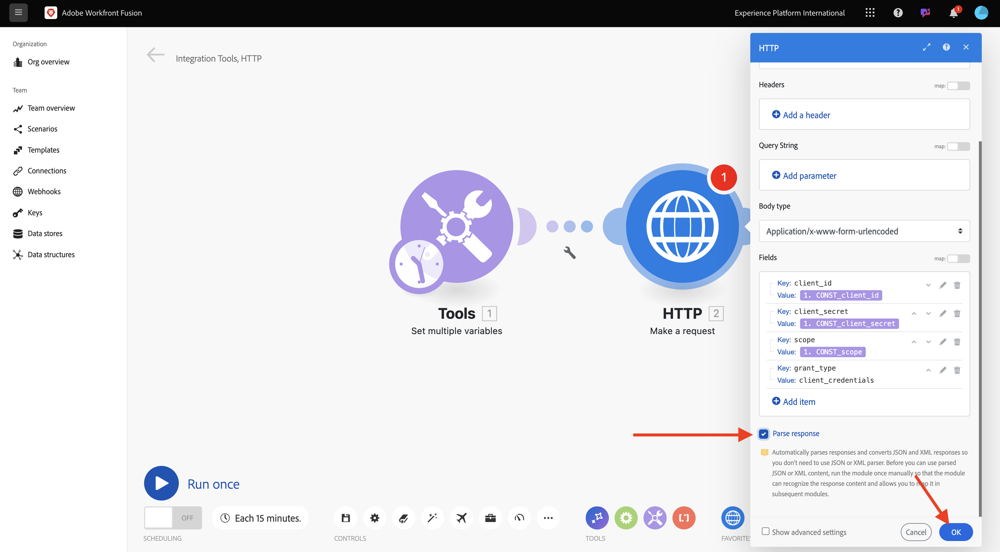

# 1.2.1 Introdução ao Workfront Fusion

Saiba como usar o Workfront Fusion e o Adobe I/O para consultar APIs do Adobe Firefly Services.

## 1.2.1.1 Criar novo cenário

Ir para [https://experience.adobe.com/](https://experience.adobe.com/){target="_blank"}. Abra o **Workfront Fusion**.

Vá para **Cenários**.

Clique no ícone **+** para criar uma nova pasta para o seu trabalho.

Nomeie a pasta `--aepUserLdap--` e selecione **Salvar**.

Selecione sua pasta e, em seguida, selecione **Criar novo cenário**.

Um cenário vazio é exibido, selecione **ferramentas** e selecione **Definir várias variáveis**.

Mova o ícone **relógio** para a **Set multiple variables** recém-adicionada.

Sua tela deve ter esta aparência.

Clique com o botão direito no ponto de interrogação e selecione **Excluir módulo**.

Em seguida, clique com o botão direito em **Definir várias variáveis** e selecione **Configurações**.

## 1.2.1.2 Configurar a autenticação do Adobe I/O

Agora, é necessário configurar as variáveis necessárias para autenticar no Adobe I/O. No exercício anterior, você criou um projeto do Adobe I/O. As variáveis desse projeto do Adobe I/O agora precisam ser definidas no Workfront Fusion.

As seguintes variáveis precisam ser definidas:

| Chave | Valor |
|:-------------:| :---------------:| 
| `CONST_client_id` | a ID do cliente do projeto do Adobe I/O |
| `CONST_client_secret` | Segredo do cliente do seu projeto do Adobe I/O |
| `CONST_scope` | o escopo do projeto do Adobe I/O |

Encontre essas variáveis acessando [https://developer.adobe.com/console/projects](https://developer.adobe.com/console/projects){target="_blank"} e abrindo o projeto do Adobe I/O, chamado `--aepUserLdap-- One Adobe tutorial`.

Em seu projeto, selecione **OAuth Serverto-Server** para ver os valores das chaves acima.

Usando as chaves e os valores acima, você pode configurar o objeto **Definir várias variáveis**. Selecione **Adicionar item**.

Insira o **Nome da variável**: **`CONST_client_id`** e seu **Valor da variável**, selecione **Adicionar**.

Selecione **Adicionar item**.

Insira o **Nome da variável**: **`CONST_client_secret`** e seu **Valor da variável**, selecione **Adicionar**.

Selecione **Adicionar item**.

Insira o **Nome da variável**: **`CONST_scope`** e seu **Valor da variável**, selecione **Adicionar**.

Selecione **OK**.

Passe o mouse sobre **Definir várias variáveis** e selecione o ícone grande **+** para adicionar outro módulo.

Sua tela deve ter esta aparência.

Na barra de pesquisa, digite **http**. Selecione **HTTP** para abri-lo.

Selecione **Fazer uma solicitação**.

| Chave | Valor |
|:-------------:| :---------------:| 
| `URL` | `https://ims-na1.adobelogin.com/ims/token/v3` |
| `Method` | `POST` |
| `Body Type` | `x-www-form-urlencoded` |

Selecione **Adicionar item**.

Adicione itens para cada um dos valores abaixo:

| Chave | Valor |
|:-------------:| :---------------:| 
| `client_id` | sua variável predefinida para `CONST_client_id` |
| `client_secret` | sua variável predefinida para `CONST_client_secret` |
| `scope` | sua variável predefinida para `CONST_scope` |
| `grant_type` | `client_credentials` |

Configuração para `client_id`:

Configuração para `client_secret`.

Configuração para `scope`.

Configuração para `grant_type`.

Role para baixo e marque a caixa para **Analisar resposta**. Selecione **OK**.

Sua tela deve ter esta aparência. Selecione **Executar uma vez**.

Depois que o cenário for executado, sua tela deverá ter esta aparência:

Selecione o ícone de **lupa** no objeto **Definir várias variáveis** para ver o que aconteceu quando esse objeto foi executado.

Selecione o ícone de **lupa** no objeto **HTTP - Faça uma solicitação** para ver o que aconteceu quando esse objeto foi executado. Na **SAÍDA**, consulte o **access_token** que está sendo retornado pela Adobe I/O.

Passe o mouse sobre **HTTP - Faça uma solicitação** e selecione o ícone **+** para adicionar outro módulo.

Na barra de pesquisa, procure por `tools`. Selecione **Ferramentas**.

Selecione **Definir várias variáveis**.

Selecione **Adicionar item**.

Definir **Nome da variável** como `bearer_token`. Selecione `access_token` como o **Valor da variável** dinâmica. Selecione **Adicionar**.

Sua tela deve ter esta aparência. Selecione **OK**.

Selecione **Executar uma vez** novamente.

Depois que o cenário for executado, selecione o ícone da **lupa** no último objeto **Definir várias variáveis**. Você deve ver que o access_token está sendo armazenado na variável `bearer_token`.

Em seguida, clique com o botão direito no primeiro objeto **Definir vários valores** e selecione **Renomear**.

Defina o nome como **Inicializar constantes**. Selecione **OK**.

Renomeie o segundo objeto para **Autenticar para o Adobe I/O**. Selecione **OK**.

Renomeie o terceiro objeto para **Definir Token de Portador**. Selecione **OK**.

Sua tela deve ter esta aparência:

Em seguida, altere o nome do cenário para `--aepUserLdap-- - Firefly + Photoshop`.

Selecione **Salvar**.

## Próximas etapas

Ir para [Automação usando Conectores](./ex4.md){target="_blank"}

Retorne ao [Creative Workflow Automation with Workfront Fusion](./automation.md){target="_blank"}

Voltar para [Todos os Módulos](./../../../overview.md){target="_blank"}
