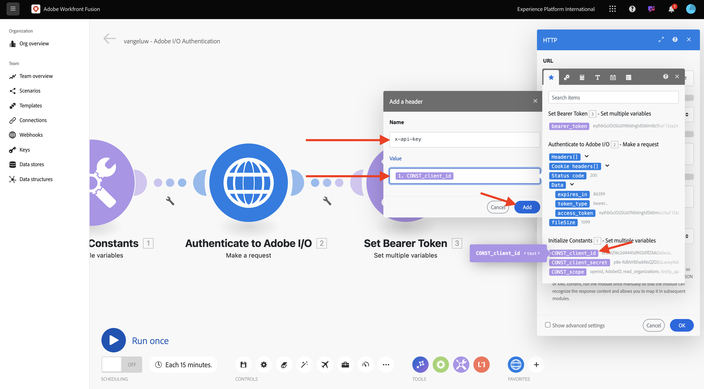
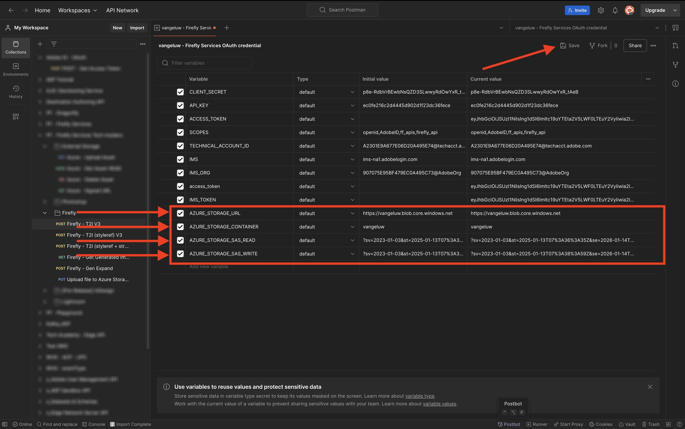
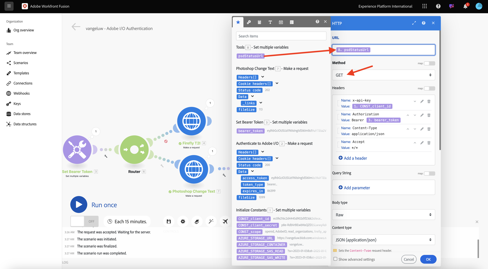
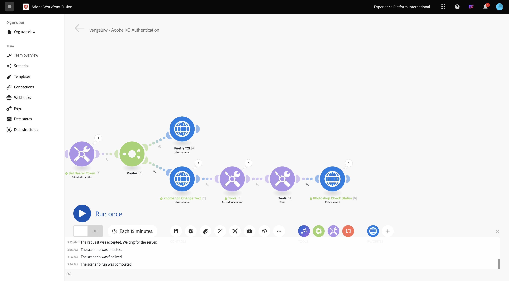
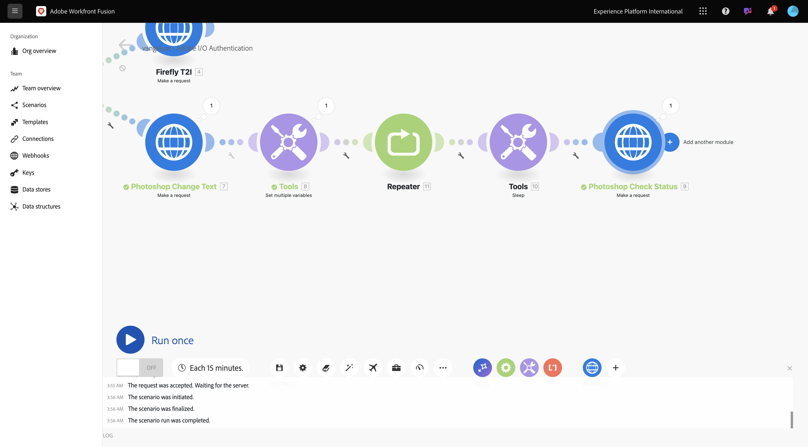
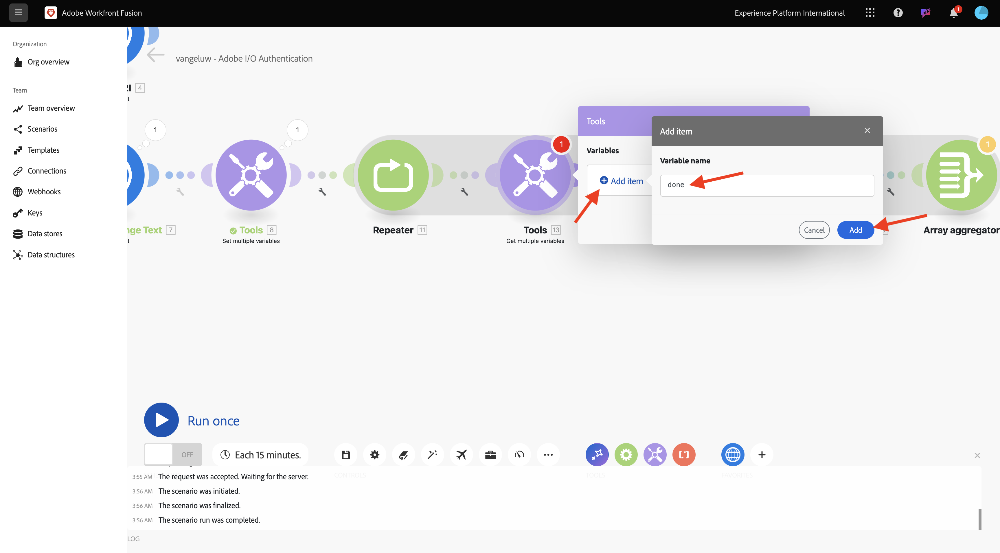
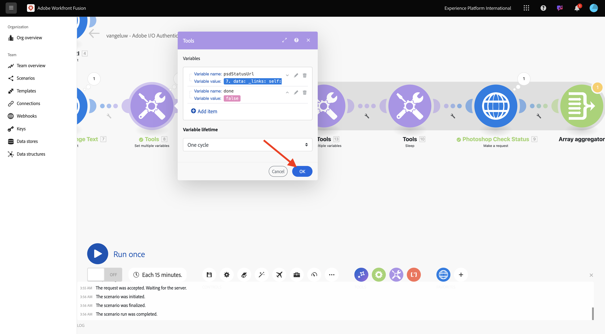

# 1.2.2 Uso de APIs do Adobe no Workfront Fusion

Saiba como usar APIs do Adobe no Workfront Fusion.

## 1.2.2.1 Usar a API Texto para Imagem do Firefly com o Workfront Fusion

Passe o mouse sobre o segundo nó **Definir várias variáveis** e selecione **+** para adicionar outro módulo.


Pesquise por **http** e selecione **HTTP**.


Selecione **Fazer uma solicitação**.


Selecione estas variáveis:

- **URL**: `https://firefly-api.adobe.io/v3/images/generate`
- **Método**: `POST`

Selecione **Adicionar um cabeçalho**.


Insira os seguintes cabeçalhos:

| Chave | Valor |
|:-------------:| :---------------:| 
| `x-api-key` | sua variável armazenada para `CONST_client_id` |
| `Authorization` | `Bearer ` + sua variável armazenada para `bearer_token` |
| `Content-Type` | `application/json` |
| `Accept` | `*/*` |

Insira os detalhes de `x-api-key`. Selecione **Adicionar**.



Selecione **Adicionar um cabeçalho**.


Insira os detalhes de `Authorization`. Selecione **Adicionar**.


Selecione **Adicionar um cabeçalho**. Insira os detalhes de `Content-Type`. Selecione **Adicionar**.


Selecione **Adicionar um cabeçalho**. Insira os detalhes de `Accept`. Selecione **Adicionar**.


Defina o **Tipo de corpo** como **Bruto**. Para **Tipo de conteúdo**, selecione **JSON (application/json)**.


Cole esta carga no campo **Solicitar conteúdo**.

```json
{
	"numVariations": 1,
	"size": {
		"width": 2048,
      "height": 2048
    },
    "prompt": "Horses in a field",
    "promptBiasingLocaleCode": "en-US"
}
```

Marque a caixa **Analisar resposta**. Selecione **OK**.


Selecione **Executar uma vez**.


Sua tela deve ter esta aparência.


Selecionar o **?Ícone** no quarto nó, HTTP, para ver a resposta. Você deve ver um arquivo de imagem na resposta.


Copie o URL da imagem e abra-o em uma janela do navegador. Sua tela deve ter esta aparência:


Clique com o botão direito em **HTTP** e renomeie para **Firefly T2I**.


Selecione **Salvar** para salvar suas alterações.


## 1.2.2.2 Usar a API do Photoshop com o Workfront Fusion

Selecione **** a chave entre os nós **Set Bearer Token** e **Firefly T2I**. Selecione **Adicionar um roteador**.


Clique com o botão **direito do mouse no objeto Firefly T2I** e selecione **Clonar**.


Arraste e solte o objeto clonado perto do **objeto Roteador** , ele se conecta automaticamente ao **Roteador**. Sua tela deve ter esta aparência:


Agora você tem uma cópia idêntica baseada na solicitação HTTP **Firefly T2I**. Algumas das configurações da solicitação HTTP **Firefly T2I** são semelhantes ao que você precisa para interagir com a **API Photoshop**, o que economiza tempo. Agora, você só precisa alterar as variáveis que não são as mesmas, como o URL da solicitação e a carga.

Altere a **URL** para `https://image.adobe.io/pie/psdService/text`.


Substituir **Solicitar conteúdo** pela carga abaixo:

```json
  {
    "inputs": [
      {
        "storage": "external",
        "href": "{{AZURE_STORAGE_URL}}/{{AZURE_STORAGE_CONTAINER}}/citisignal-fiber.psd{{AZURE_STORAGE_SAS_READ}}"
      }
    ],
    "options": {
      "layers": [
        {
          "name": "2048x2048-button-text",
          "text": {
            "content": "Click here"
          }
        },
        {
          "name": "2048x2048-cta",
          "text": {
            "content": "Buy this stuff"
          }
        }
      ]
    },
    "outputs": [
      {
        "storage": "azure",
        "href": "{{AZURE_STORAGE_URL}}/{{AZURE_STORAGE_CONTAINER}}/citisignal-fiber-changed-text.psd{{AZURE_STORAGE_SAS_WRITE}}",
        "type": "vnd.adobe.photoshop",
        "overwrite": true
      }
    ]
  }
```


Para que este **Solicitar conteúdo** funcione corretamente, algumas variáveis estão ausentes:

- `AZURE_STORAGE_URL`
- `AZURE_STORAGE_CONTAINER`
- `AZURE_STORAGE_SAS_READ`
- `AZURE_STORAGE_SAS_WRITE`

Volte para o primeiro nó, selecione **Inicializar constantes** e escolha **Adicionar item** para cada uma dessas variáveis.


| Chave | Exemplo de valor |
|:-------------:| :---------------:| 
| `AZURE_STORAGE_URL` | `https://vangeluw.blob.core.windows.net` |
| `AZURE_STORAGE_CONTAINER` | `vangeluw` |
| `AZURE_STORAGE_SAS_READ` | `?sv=2023-01-03&st=2025-01-13T07%3A36%3A35Z&se=2026-01-14T07%3A36%3A00Z&sr=c&sp=rl&sig=4r%2FcSJLlt%2BSt9HdFdN0VzWURxRK6UqhB8TEvbWkmAag%3D` |
| `AZURE_STORAGE_SAS_WRITE` | `?sv=2023-01-03&st=2025-01-13T17%3A21%3A09Z&se=2025-01-14T17%3A21%3A09Z&sr=c&sp=racwl&sig=FD4m0YyyqUj%2B5T8YyTFJDi55RiTDC9xKtLTgW0CShps%3D` |

Você pode encontrar suas variáveis voltando ao Postman e abrindo suas **Variáveis de ambiente**.



Copie esses valores no Workfront Fusion e adicione um novo item para cada uma dessas 4 variáveis.

Sua tela deve ter esta aparência. Selecione **OK**.


Em seguida, volte para a solicitação HTTP clonada para atualizar o **Conteúdo da solicitação**. Observe as variáveis pretas em **Solicitar conteúdo**, que são as variáveis copiadas do Postman. É necessário alterar para as variáveis recém-definidas no Workfront Fusion. Substitua cada variável uma por uma excluindo o texto em preto e substituindo-o pela variável correta.


Faça estas 3 alterações na seção **entradas**. Selecione **OK**.


Faça estas 3 alterações na seção **saídas**. Selecione **OK**.


Clique com o botão direito no nó clonado e selecione **Renomear**. Altere o nome para **Photoshop Change Text**.


Sua tela deve ter esta aparência:


Selecione **Executar uma vez**.


Selecione o ícone de **pesquisa** no nó **Texto de Alteração do Photoshop** para ver a resposta. Você deve ter uma resposta semelhante a esta, com um link para um arquivo de status.


Antes de continuar com as interações de API do Photoshop, desabilite a rota para o nó **Firefly T2I** para não enviar chamadas de API desnecessárias para esse ponto de extremidade de API. Selecione o ícone de **chave inglesa** e selecione **Desabilitar rota**.


Sua tela deve ter esta aparência:


Em seguida, adicione outro nó **Definir várias variáveis**.


Coloque-o depois do nó **Photoshop Change Text**.


Selecione o nó **Definir várias variáveis**, selecione **Adicionar item**. Selecione o valor da variável na resposta da solicitação anterior.

| Nome da variável | Valor da variável |
|:-------------:| :---------------:| 
| `psdStatusUrl` | `data > _links > self > href` |

Selecione **Adicionar**.


Selecione **OK**.


Clique com o botão direito do mouse no nó **Photoshop Change Text** e selecione **Clone**.


Arraste a solicitação HTTP clonada após o nó **Definir várias variáveis** que você acabou de criar.


Clique com o botão direito do mouse na solicitação HTTP clonada, selecione **Renomear** e altere o nome para **Status de verificação** Photoshop.


Selecione para abrir a solicitação HTTP. Altere o URL para que ele faça referência aos variável criados na etapa anterior e defina o **Método** para **GET**.



Remova o **Corpo** selecionando a opção vazia.


Selecione **OK**.


Selecione **Executar uma vez**.


Uma resposta que contém o campo **status**, com o status definido como **em execução** é exibida. O Photoshop leva alguns segundos para concluir o processo.


Agora que você sabe que a resposta precisa de um pouco mais de tempo para ser concluída, talvez seja uma boa ideia adicionar um cronômetro na frente dessa solicitação HTTP para que ela não seja executada imediatamente.

Selecione o nó **Ferramentas** e selecione **Suspender**.


Posicione o nó **Suspensão** entre **Definir várias variáveis** e **Verificar Status do Photoshop**. Defina o **Atraso** para **5** segundos. Selecione **OK**.


Sua tela deve ter esta aparência. O desafio com a configuração abaixo é que 5 segundos de espera podem ser suficientes, mas talvez não sejam suficientes. Na realidade, seria melhor ter uma solução mais inteligente, como um loop do...while que verifica o status a cada 5 segundos até que o status seja igual a **bem-sucedido**. Então, você pode implementar essa tática nas próximas etapas.



Selecione a **chave inglesa** entre **Definir várias variáveis** e **Suspender**. Selecione **Adicionar módulo**.


Pesquise por `flow` e selecione **Controle de Fluxo**.


Selecione **Repetidor**.


Definir **Repetições** a **20**. Selecione **OK**.


Em seguida, selecione **+** no **Photoshop Check Status** para adicionar outro módulo.



Pesquise por **flow** e selecione **Flow Control**.


Selecione **Agregador de Matriz**.


Definir **Módulo Source** como **Repetidor**. Selecione **OK**.


Sua tela deve ter esta aparência:


Selecione o ícone da **chave inglesa** e selecione **Adicionar um módulo**.


Pesquise por **ferramentas** e selecione **Ferramentas**.


Selecione **Obter várias variáveis**.


Selecione **+ Adicionar item** e defina o **Nome da variável** como `done`.



Selecione **OK**.


Selecione o nó **Definir várias variáveis** que você configurou anteriormente. Para inicializar a variável **concluído**, é necessário defini-la aqui como `false`. Selecione **+ Adicionar item**.


Use `done` para o **Nome da variável**

Para definir o status, é necessário um valor booleano. Para localizar o valor booleano, selecione **engrenagem** e depois `false`. Selecione **Adicionar**.


Selecione **OK**.



Próximo, selecione **o**&#x200B;ícone chave depois que as **variáveis Obter várias** nó configuradas.


Selecione **Configurar um filtro**. Agora, é necessário verificar o valor do variável **realizada**. Se esse valor for definido como **false**, a próxima parte do loop deverá ser executada. Se o valor estiver definido **como true**, significa que o processo já foi concluído com êxito, portanto, não há necessidade de continuar com a próxima parte do loop.


Para o rótulo, use **Concluído?**. Defina a **Condição** usando a variável já existente **concluída**, o operador deve ser definido como **Igual a** e o valor deve ser a variável booleana `false`. Selecione **OK**.


Em seguida, libere espaço entre os nós **Status de verificação do Photoshop** e **Agregador de matriz**. Em seguida, selecione o ícone **chave inglesa** e selecione **Adicionar um roteador**. Você está fazendo isso porque, após verificar o status do arquivo Photoshop, deve haver dois caminhos. Se o status for `succeeded`, a variável de **concluído** deverá ser definida como `true`. Se o status não for igual a `succeeded`, o loop deve continuar. O roteador permitirá verificar e definir isso.


Depois de adicionar o roteador, selecione o ícone de **chave inglesa** e selecione **Configurar um filtro**.


Para o rótulo, use **Concluído**. Defina a **Condição** usando a resposta do nó **Verificar Status do Photoshop** escolhendo o campo de resposta **dados.saídas[].status**. O operador deve ser definido como **Igual a** e o valor deve ser `succeeded`. Selecione **OK**.


Em seguida, selecione o nó vazio com o ponto de interrogação e procure **ferramentas**. Em seguida, selecione **Ferramentas**.


Selecione **Definir várias variáveis**.


Quando essa ramificação do roteador é usada, significa que o status da criação do arquivo Photoshop foi concluído com êxito. Isso significa que o loop do...while não precisa mais continuar verificando o status no Photoshop, então você deve definir a variável `done` como `true`.

Para o **nome da variável**, use `done`.

Para o **valor de variável**, você deve usar o valor booleano `true`. Selecione o ícone de **engrenagem** e selecione `true`. Selecione **Adicionar**.


Selecione **OK**.


Em seguida, clique com o botão direito do mouse no nó **Definir várias variáveis** que acabou de criar e selecione **Clonar**.


Arraste o nó clonado para que ele se conecte com o **agregador de matriz**. Em seguida, clique com o botão direito do mouse no nó e selecione **Renomear** e altere o nome para `Placeholder End`.


Remova a variável existente e selecione **+ Adicionar item**. Para o **Nome da variável**, use `placeholder`, para o **Valor da variável**, use `end`. Selecione **Adicionar** e **OK**.


Selecione **Salvar** para salvar seu cenário. Em seguida, selecione   **Executar uma vez**.


O cenário é executado e deve ser concluído com êxito. Observe que o loop do...while configurado funciona bem. Na execução abaixo, você pode ver que o **Repetidor** foi executado 20 vezes com base na bolha no nó **Ferramentas > Obter várias variáveis**. Depois desse nó, você configurou um filtro que verificou o status e, somente se o status não for igual a **bem-sucedido**, os próximos nós serão executados. Nesta execução, a parte após o filtro foi executada apenas uma vez, pois o status já era **bem-sucedido** na primeira execução.


Você pode verificar o status da criação do novo arquivo do Photoshop clicando na bolha da solicitação HTTP **Verificar status** do Photoshop e detalhando o campo **status**.


Agora você configurou a versão básica de um cenário repetível que automatiza várias etapas. No próximo exercício, você vai iterar nisso adicionando complexidade.

## Próximas etapas

Ir para [Automação de processos com o Workfront Fusion](./ex3.md){target="_blank"}

Retorne ao [Creative Workflow Automation with Workfront Fusion](./automation.md){target="_blank"}

Voltar para [Todos os Módulos](./../../../overview.md){target="_blank"}
