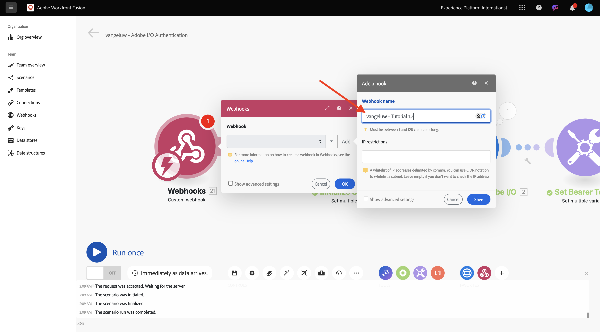
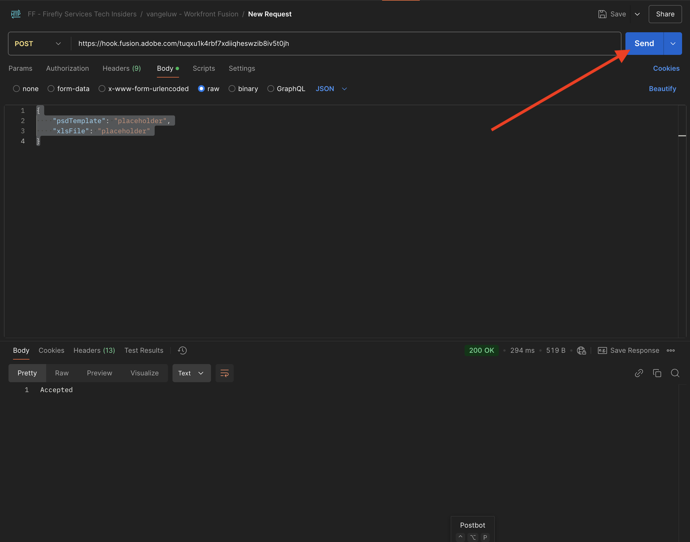

# 1.2.3 Automação de processos com o Workfront Fusion

Saiba como fazer automação de processos com o Workfront Fusion.

## 1.2.3.1 Iterando em vários valores

Seu cenário deve ficar assim:


Até agora, você alterou o texto em um arquivo Photoshop por um valor estático. Para dimensionar e automatizar os fluxos de trabalho de criação de conteúdo, é necessário iterar sobre uma lista de valores e inserir esses valores dinamicamente no arquivo do Photoshop. Nas próximas etapas, você adicionará um o que iterar sobre os valores no cenário existente.

Entre o nó **Roteador** e o nó **Photoshop Change Text**, selecione o ícone **chave inglesa** e selecione **Adicionar um módulo**.


Search e `flow` selecione **Controle** de Fluxo.


Selecione **Iterador**.


Sua tela deve ter esta aparência:


Embora seja possível ler arquivos de entrada como arquivos CSV, por enquanto, é necessário usar uma versão básica de um arquivo CSV definindo uma sequência de caracteres de texto e dividindo esse arquivo de texto.

Você pode encontrar a função **split** selecionando o ícone **T**, no qual você vê todas as funções disponíveis para manipular valores de texto. Selecione a função **split** e você deverá vê-la.


A função split espera uma matriz de valores antes do ponto e vírgula e espera especificar o separador após o ponto e vírgula. Para este teste, você deve usar uma matriz simples com 2 campos, **Comprar agora** e **Clique aqui**, e o separador a ser usado é **,**.

Insira isso no campo **Matriz** substituindo a função **dividida** atualmente vazia: `{{split("Buy now, Click here "; ",")}}`. Selecione **OK**.


Selecione **Photoshop Change Text** para adicionar algumas variáveis em vez de valores estáticos para os campos de entrada e saída.


Em **Solicitar conteúdo**, está o texto **Clique aqui**. Esse texto precisa ser substituído pelos valores provenientes da matriz.


Exclua o texto **Clique aqui** e substitua-o selecionando a variável **Valor** do nó **Iterador**. Isso garante que o texto do botão no documento do Photoshop seja atualizado dinamicamente.


Você também precisa atualizar o nome de arquivo usado para gravar o arquivo em sua Conta de Armazenamento do Azure. Se o nome do arquivo for estático, cada nova iteração simplesmente substituirá o arquivo anterior e, como tal, perde os arquivos personalizados. O nome de arquivo estático atual é **citisignal-fiber-changed-text.psd** e agora é necessário atualizá-lo.

Coloque o cursor atrás da palavra `text`.


Primeiro, adicione um hífen `-` e depois selecione o valor **Posição da Ordem do Pacote**. Isso garante que, para a primeira iteração, o Workfront Fusion adicione `-1` ao nome do arquivo, para a segunda iteração `-2` e assim por diante. Selecione **OK**.


Salvar seu cenário e selecione **Executar uma vez**.


Depois que o cenário for executado, volte para o Azure Storage Explorer e atualize a pasta. Você deverá ver os dois arquivos recém-criados.


Baixe e abra cada arquivo. Você deve incluir vários textos nos botões. Este é o arquivo `citisignal-fiber-changed-text-1.psd`.


Este é o arquivo `citisignal-fiber-changed-text-2.psd`.


## 1.2.3.2 Ativar seu cenário usando um webhook

Até agora, você executou seu cenário manualmente para teste. Agora vamos atualizar seu cenário com um webhook, para que ele possa ser ativado de um ambiente externo.

Selecione **+**, procure por **webhook** e selecione **Webhooks**.


Selecione **Webhook personalizado**.

Arraste e conecte o nó **Webhook personalizado** para que ele se conecte ao primeiro nó na tela, que é chamado **Inicializar Constantes**.


Selecione a nó **de webhook** personalizada. Em seguida, selecione **Adicionar**.


Defina **o nome** Webhook como `--aepUserLdap-- - Tutorial 1.2`.



Marque a caixa para **Obter cabeçalhos de solicitação**. Selecione **Salvar**.


O URL do webhook está disponível. Copie o URL.


Abra o Postman e adicione uma nova pasta à coleção **FF - Firefly Services Tech Insiders**.


Nomeie sua pasta `--aepUserLdap-- - Workfront Fusion`.


Na pasta que você acabou de criar, selecione os 3 pontos **...** e selecione **Adicionar solicitação**.


Defina o **tipo** de Método para **POST** e cole o URL do webhook na barra de endereços.


É necessário enviar um corpo personalizado, para que os elementos variáveis possam ser fornecidos de uma fonte externa para o cenário do Workfront Fusion.

Vá para **Corpo** e selecione **bruto**.


Cole o texto abaixo no corpo da solicitação. Selecione **Enviar**.

```json
{
	"psdTemplate": "placeholder",
	"xlsFile": "placeholder"
}
```


De volta ao Workfront Fusion, é exibida uma mensagem em seu webhook personalizado que diz: **Determinado com êxito**.


Selecione **Salvar** e selecione **Executar uma vez**. Seu cenário agora está ativo, mas não será executado até que você selecione **Enviar** novamente no Postman.


No Postman, selecione **Enviar** novamente.



Seu cenário é executado novamente e cria os 2 arquivos exatamente como antes.


Altere o nome da sua solicitação Postman para `POST - Send Request to Workfront Fusion Webhook`.


Agora é necessário começar a usar a variável **psdTemplate**. Em vez de codificar o local do arquivo de entrada no nó **Texto de Alteração do Photoshop**, você usará a variável de entrada da solicitação do Postman.

Abra o nó **Photoshop Change Text** e vá para **Solicitar conteúdo**. Selecione o nome de arquivo codificado **citisignal-fiber.psd** em **entradas** e exclua-o.


Selecione o variável **psdTemplate**. Selecione **OK** e salve seu cenário.


Selecione **EM** para ativar seu cenário. Seu cenário agora está em execução ininterrupta.


De volta ao Postman, digite o nome de arquivo `citisignal-fiber.psd` como o valor da variável **psdTemplate** e selecione **Enviar** novamente para executar o cenário novamente.


Ao especificar o modelo do PSD como uma variável fornecida por um sistema externo, você criou um cenário reutilizável.

Agora que você concluiu este exercício.

## Próximas etapas

Ir para Automação do [1.2.4 usando Conectores](./ex4.md){target="_blank"}

Retorne ao [Creative Workflow Automation with Workfront Fusion](./automation.md){target="_blank"}

Voltar para [Todos os Módulos](./../../../overview.md){target="_blank"}
