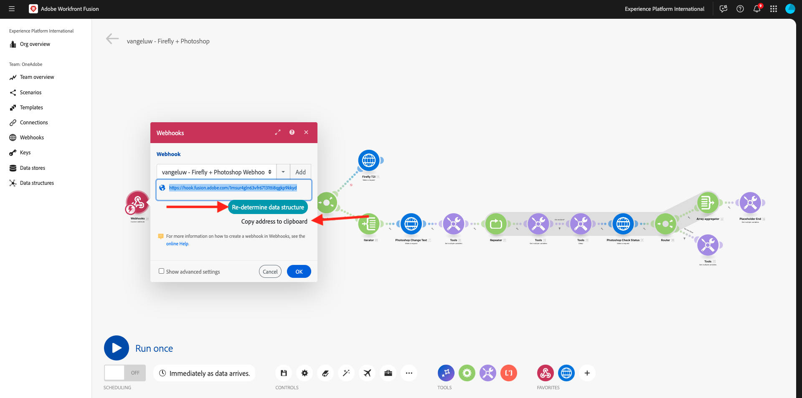
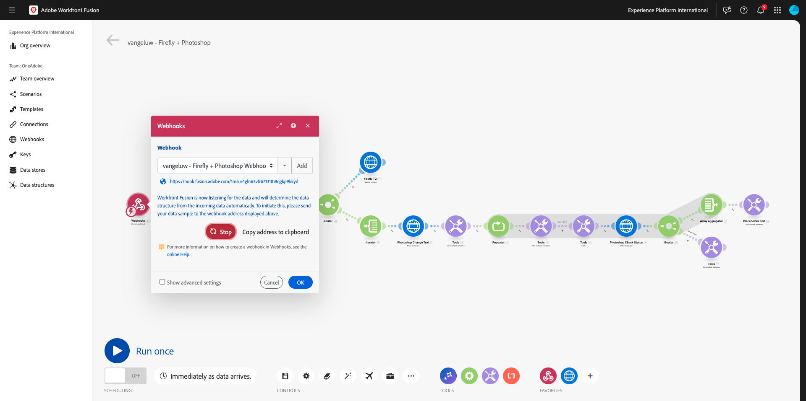
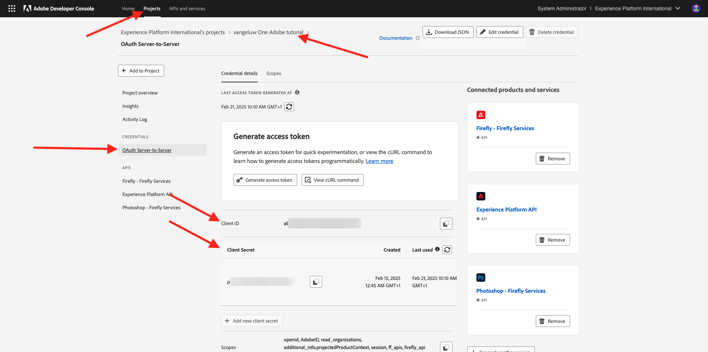
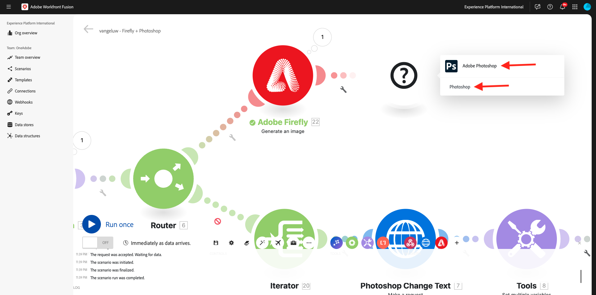
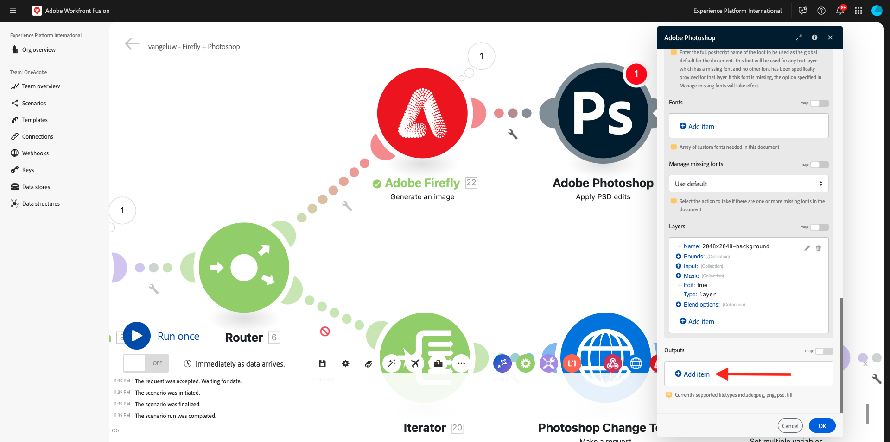
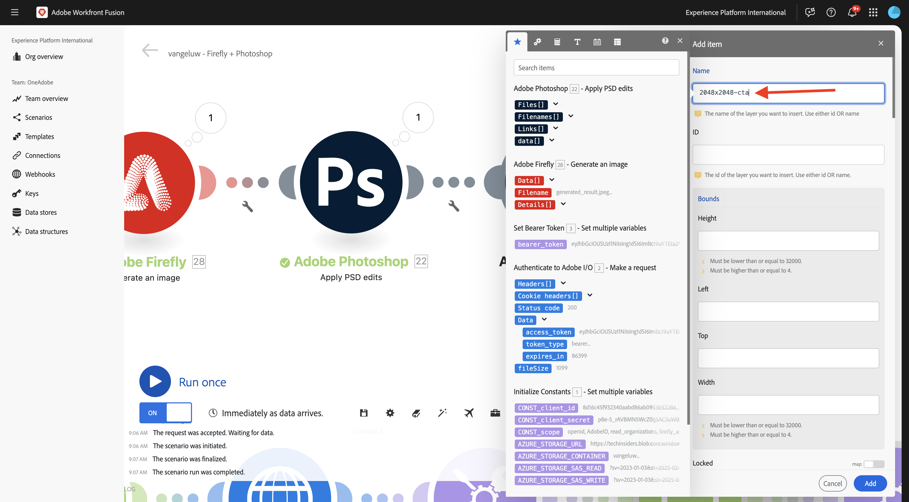
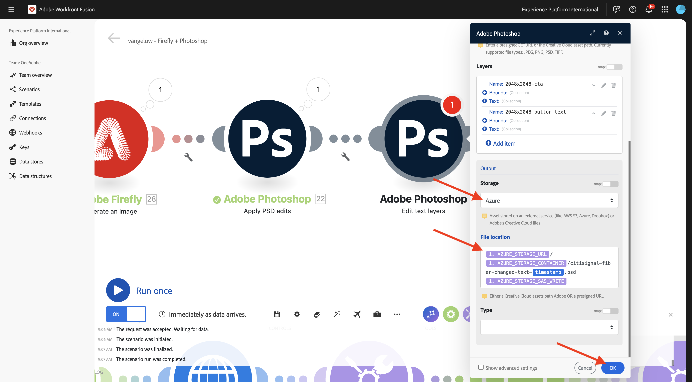
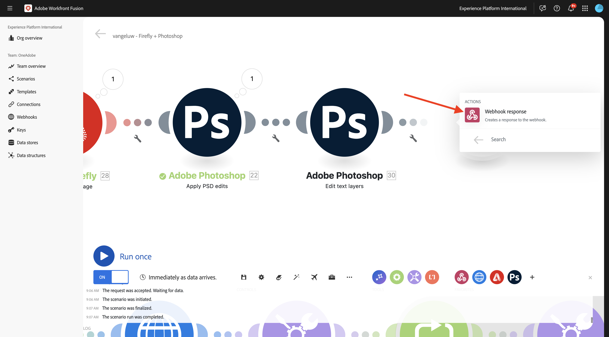

# 1.2.4 Automação usando conectores

Agora, você começará a usar os conectores prontos para uso no Workfront Fusion para Photoshop e conectará a solicitação de Firefly Text-2-Image e as solicitações do Photoshop em um cenário.

## 1.2.4.1 Duplique e prepare seu cenário

No menu esquerdo, vá para **Cenários** e selecione sua pasta `--aepUserLdap--`. Você deverá ver o cenário criado antes, chamado `--aepUserLdap-- - Adobe I/O Authentication`.


Clique na seta para abrir o menu suspenso e selecione **Clonar**.


Defina o **Nome** do cenário clonado como `--aepUserLdap-- - Firefly + Photoshop` e selecione a **Equipe de Destino** apropriada. Clique em **Adicionar** para adicionar um novo webhook.

>[!NOTE]
>
>Talvez você não veja a opção de selecionar uma **Equipe de Destino**. Essa opção só será exibida se você for um usuário em mais de 1 Equipe no Workfront Fusion. Se você não vir essa opção, ela significa apenas que você foi adicionado a uma Equipe, portanto, não é necessária nenhuma escolha.


Defina o **nome do Webhook** para `--aepUserLdap-- - Firefly + Photoshop Webhook`. Clique em **Salvar**.


Você deverá ver isso. Clique em **Salvar**.


Você deverá ver isso. Clique no módulo **Webhook**.


Clique em **Copiar endereço para a área de transferência** e em **Redeterminar estrutura de dados**.



Abra o Postman. Adicione uma nova solicitação na mesma pasta que você estava usando antes.


Verifique se as seguintes configurações foram aplicadas:

- Nome da solicitação: `POST - Send Request to Workfront Fusion Webhook Firefly + Photoshop`
- Tipo de solicitação: `POST`
- URL de solicitação: cole o URL copiado do webhook do Cenário do Workfront Fusion.

Vá para **Corpo** e defina o **Tipo de Corpo** como **bruto** - **JSON**. Cole a seguinte carga no **Corpo**.

```json
{
    "psdTemplate": "citisignal-fiber.psd",
    "xlsFile": "placeholder",
    "prompt":"misty meadows",
    "cta": "Buy this now!",
    "button": "Click here to buy!"
}
```

Essa nova carga garantirá que todas as informações da variável sejam fornecidas de fora do cenário, em vez de serem codificadas no cenário. Em um cenário empresarial, uma organização precisa que um cenário seja definido de forma reutilizável, o que significa que várias variáveis precisam ser fornecidas como variáveis de entrada, em vez de serem codificadas no cenário.

Você deveria ficar com isso. Clique em **Enviar**.


O webhook do Workfront Fusion ainda está aguardando entrada.



Depois de clicar em **Enviar**, a mensagem deverá mudar para **Determinado com êxito**. Clique em **OK**.


## 1.2.4.2 Atualizar o módulo Firefly T2I

Clique com o botão direito no módulo **Firefly T2I** e selecione **Excluir módulo**.


Clique no ícone **+**, insira o termo de pesquisa `firefly` e selecione **Adobe Firefly**.


Selecione **Gerar uma imagem**.


Arraste e solte o módulo **Adobe Firefly** para que ele se conecte ao módulo **Roteador**.


Clique no módulo **Adobe Firefly** para abri-lo e em **Adicionar** para criar uma nova conexão.


Preencha os seguintes campos:

- **Nome da conexão**: use `--aepUserLdap-- - Firefly connection`.
- **Ambiente**: usar **Produção**.
- **Tipo**: usar **Conta pessoal**.
- **ID do Cliente**: copie a **ID do Cliente** do seu projeto do Adobe I/O chamado `--aepUserLdap-- - One Adobe tutorial`.
- **Segredo do Cliente**: copie o **Segredo do Cliente** do seu projeto do Adobe I/O chamado `--aepUserLdap-- - One Adobe tutorial`.

Você pode encontrar a **ID do Cliente** e o **Segredo do Cliente** do seu projeto do Adobe I/O [aqui](https://developer.adobe.com/console/projects.){target="_blank"}.



Depois de preencher todos os campos, clique em **Continuar**. Sua conexão será validada automaticamente.


Em seguida, selecione a variável **prompt** que é fornecida para o cenário pelo **webhook personalizado** de entrada.


Em seguida, defina a **Versão do modelo** **prompt** como **imagem4 padrão**. Clique em **OK**.


Antes de continuar, é necessário desativar a rota antiga no cenário como para este exercício. Você usará somente a nova rota que está configurando no momento. Para fazer isso, clique no ícone **chave inglesa** entre o módulo **Roteador** e o módulo **Iterador** e selecione **Desabilitar rota**.


Clique em **Salvar** para salvar suas alterações e em **Executar uma vez** para testar sua configuração.


Vá para o Postman, verifique o prompt na sua solicitação e clique em **Enviar**.


Depois de clicar em enviar, volte para o Workfront Fusion e clique no ícone de bolha no módulo **Adobe Firefly** para verificar os detalhes.


Acesse **OUTPUT** para **Details** > **url** para localizar o URL da imagem gerada pelo **Adobe Firefly**.


Agora você deve ver uma imagem que representa o prompt enviado pela solicitação do Postman, neste caso **misty meadows**.


## 1.2.4.2 Alterar plano de fundo do arquivo PSD

Agora você atualizará seu cenário para torná-lo mais inteligente usando mais conectores prontos para uso. Você também conectará a saída do Firefly ao Photoshop, para que a imagem de fundo do arquivo PSD seja alterada dinamicamente usando a saída da ação Gerar imagem do Firefly.

Você deverá ver isso. Em seguida, passe o mouse sobre o módulo **Adobe Firefly** e clique no ícone **+**.


No menu de pesquisa, digite `Photoshop` e clique na ação **Adobe Photoshop**.



Selecione **Aplicar edições do PSD**.


Você deverá ver isso. Clique em **Adicionar** para adicionar uma nova conexão ao Adobe Photoshop.


Configure sua conexão da seguinte maneira:

- Tipo de conexão: selecione **Adobe Photoshop (Servidor para Servidor)**
- Nome da conexão: digite `--aepUserLdap-- - Adobe IO`
- ID do cliente: cole sua ID do cliente
- Segredo do cliente: cole seu Segredo do cliente

Clique em **Continuar**.


Para encontrar sua **ID do Cliente** e **Segredo do Cliente**, vá para [https://developer.adobe.com/console/home](https://developer.adobe.com/console/home){target="_blank"} e abra seu projeto do Adobe I/O, denominado `--aepUserLdap-- One Adobe tutorial`. Vá para **OAuth Server-to-Server** para encontrar a ID do Cliente e o Segredo do Cliente. Copie esses valores e cole-os na configuração de conexão no Workfront Fusion.


Depois de clicar em **Continuar**, uma janela pop-up será mostrada brevemente enquanto suas credenciais estiverem sendo verificadas. Depois de concluído, você deve ver isso.


Agora é necessário inserir o local do arquivo do PSD com o qual você deseja que o Fusion funcione. Para **Armazenamento**, selecione **Azure** e para **Local do arquivo**, digite `{{1.AZURE_STORAGE_URL}}/{{1.AZURE_STORAGE_CONTAINER}}/{{1.AZURE_STORAGE_SAS_READ}}`. Coloque o cursor próximo ao segundo `/`. Em seguida, verifique as variáveis disponíveis e role para baixo para localizar a variável **psdTemplate**. Clique na variável **psdTemplate** para selecioná-la.


Você deverá ver isso.


Role para baixo até ver **Camadas**. Clique em **Adicionar item**.


Você deverá ver isso. Agora é necessário inserir o nome da camada no modelo Photoshop PSD que é usada para o plano de fundo do arquivo.


No arquivo **citisignal-fiber.psd**, você encontrará a camada usada para o plano de fundo. Neste exemplo, essa camada é chamada de **2048x2048-background**.


Cole o nome **2048x2048-background** na caixa de diálogo do Workfront Fusion.


Role para baixo até ver **Entrada**. Agora é necessário definir o que precisa ser inserido na camada de plano de fundo. Nesse caso, você precisa selecionar a saída do módulo **Adobe Firefly**, que contém a imagem gerada dinamicamente.

Para **Armazenamento**, selecione **Externo**. Para **Local do arquivo**, será necessário copiar e colar a variável `{{XX.details[].url}}` da saída do módulo **Adobe Firefly**, mas será necessário substituir **XX** na variável pelo número de sequência do módulo **Adobe Firefly**, que neste exemplo é **22**.


Em seguida, role para baixo até ver **Editar**. Defina **Editar** como **Sim** e defina **Tipo** como **Camada**. Clique em **Adicionar**.


Você deverá ver isso. Em seguida, é necessário definir a saída da ação. Clique em **Adicionar item** em **saídas**.



Selecione o **Azure** para **Armazenamento**, cole este `{{1.AZURE_STORAGE_URL}}/{{1.AZURE_STORAGE_CONTAINER}}/citisignal-fiber-replacedbg.psd{{1.AZURE_STORAGE_SAS_WRITE}}` em **Local do Arquivo** e selecione **vnd.adobe.photoshop** em **Tipo**. Clique para habilitar **Mostrar configurações avançadas**.


Em **Configurações Avançadas**, selecione **Sim** para substituir arquivos com o mesmo nome.
Clique em **Adicionar**.


Você deveria ficar com isso. Clique em **OK**.


Clique em **Salvar** para salvar suas alterações e em **Executar uma vez** para testar sua configuração.


Vá para o Postman, verifique o prompt na sua solicitação e clique em **Enviar**.


Você deverá ver isso. Clique na bolha no módulo **Adobe Photoshop - Aplicar edições do PSD**.


Agora você pode ver que um novo arquivo do PSD foi gerado com sucesso e armazenado em sua Conta de Armazenamento do Microsoft Azure.


## 1.2.4.3 Alterar camadas de texto do arquivo PSD

Em seguida, passe o mouse sobre o módulo **Adobe Photoshop - Aplicar edições do PSD** e clique no ícone **+**.


Selecione **Adobe Photoshop**.


Selecione **Editar camadas de texto**.


Você deverá ver isso. Primeiro, selecione a conexão do Adobe Photoshop já configurada anteriormente, que deve ser chamada de `--aepUserLdap-- Adobe IO`.

Agora é necessário definir o local do **Arquivo de entrada**, que é a saída da etapa anterior e em **Camadas**, você precisará clicar em **+ Adicionar item** para cada camada para a qual o texto precisa ser alterado.


Para o **Arquivo de entrada**, selecione **Azure** para **Armazenamento do arquivo de entrada** e certifique-se de selecionar a saída da solicitação anterior, **Adobe Photoshop - Aplicar edições do PSD**, que você pode definir da seguinte maneira: ``{{XX.data[].`_links`.renditions[].href}}`` (substitua XX pelo número de sequência do módulo anterior Adobe Photoshop - Aplicar edições do PSD).

Em seguida, clique em **+Adicionar item** em **Camadas** para começar a adicionar as camadas de texto que precisam ser atualizadas.


Há duas alterações a serem feitas, o texto do CTA e o texto do botão no arquivo **citisignal-fiber.psd** precisam ser atualizados.

Para localizar os nomes das camadas, abra o arquivo **citisignal-fiber.psd**. No arquivo, você observará que a camada que contém a chamada à ação é chamada **2048x2048-cta**.


No arquivo **citisignal-fiber.psd**, você também observará que a camada que contém o call to action é chamada **2048x2048-button-text**.


Primeiro, é necessário configurar as alterações que devem ocorrer na camada **2048x2048-cta**. Insira o nome **2048x2048-cta** em **Nome** na caixa de diálogo.



Role para baixo até ver **Texto** > **Conteúdo**. Selecione a variável **cta** na carga do Webhook. Clique em **Adicionar**.


Você deverá ver isso. Clique em **+Adicionar item** em **Camadas** para começar a adicionar as camadas de texto que precisam ser atualizadas.


Digite o nome **2048x2048-button-text** em **Nome** na caixa de diálogo.


Role para baixo até ver **Texto** > **Conteúdo**. Selecione a variável **button** na carga do Webhook. Clique em **Adicionar**.


Você deverá ver isso.


Role para baixo até ver **Saída**. Para **Armazenamento**, selecione **Azure**. Para **Local do arquivo**, insira o local abaixo. Observe a adição da variável `{{timestamp}}` ao nome de arquivo, que é usada para garantir que cada arquivo gerado tenha um nome exclusivo. Além disso, defina o **Type** como **vnd.adobe.photoshop**.

`{{1.AZURE_STORAGE_URL}}/{{1.AZURE_STORAGE_CONTAINER}}/citisignal-fiber-changed-text-{{timestamp}}.psd{{1.AZURE_STORAGE_SAS_WRITE}}`



Defina **Type** como **vnd.adobe.photoshop**. Clique em **OK**.


Clique em **Salvar** para salvar as alterações.


## 1.2.4.4 resposta do Webhook

Depois de aplicar essas alterações ao arquivo do Photoshop, agora é necessário configurar uma **resposta do Webhook** que será enviada de volta para o aplicativo que tiver ativado esse cenário.

Passe o mouse sobre o módulo **Adobe Photoshop - Editar camadas de texto** e clique no ícone **+**.


Procure por `webhooks` e selecione **Webhook**.


Selecione **resposta do Webhook**.



Você deverá ver isso. Cole a carga abaixo no **Corpo**.

```json
{
    "newPsdTemplate": ""
}
```


Copie e cole a variável `{{XX.data[]._links.renditions[].href}}` e substitua **XX** pelo número de sequência do último módulo **Adobe Photoshop - Editar camadas de texto**, que neste caso é **30**.


Habilite a caixa de seleção para **Mostrar configurações avançadas** e clique em **Adicionar item**.


No campo **Chave**, digite `Content-Type`. No campo **Valor**, digite `application/json`. Clique em **Adicionar**.


Você deveria ficar com isso. Clique em **OK**.


Clique em **Alinhamento automático**.


Você deverá ver isso. Clique em **Salvar** para salvar suas alterações e em **Executar uma vez** para testar seu cenário.


Volte para o Postman e clique em **Enviar**. O prompt que está sendo usado aqui é **misty meadows**.


O cenário será ativado e, após algum tempo, uma resposta será mostrada no Postman contendo o URL do arquivo do PSD recém-criado.


Como lembrete: depois que o cenário for executado no Workfront Fusion, você poderá ver informações sobre cada módulo clicando na bolha acima de cada módulo.


Usando o Azure Storage Explorer, você pode encontrar e abrir o arquivo do PSD recém-criado clicando duas vezes nele no Azure Storage Explorer.


O arquivo deve ter esta aparência, com o plano de fundo substituído por um plano de fundo com **prados nebulosos**.


Se você executar o cenário novamente e enviar uma nova solicitação do Postman usando um prompt diferente, verá como o cenário se tornou fácil e reutilizável. Neste exemplo, o novo prompt sendo usado é **deserto ensolarado**.


E alguns minutos depois, um novo arquivo PSD foi gerado com um novo plano de fundo.


## Próximas etapas

Ir para [1.2.5 Frame.io e Workfront Fusion](./ex5.md){target="_blank"}

Retorne ao [Creative Workflow Automation with Workfront Fusion](./automation.md){target="_blank"}

Voltar para [Todos os Módulos](./../../../overview.md){target="_blank"}
