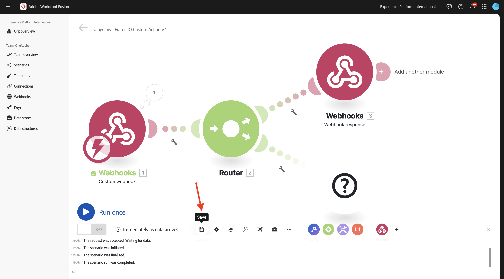
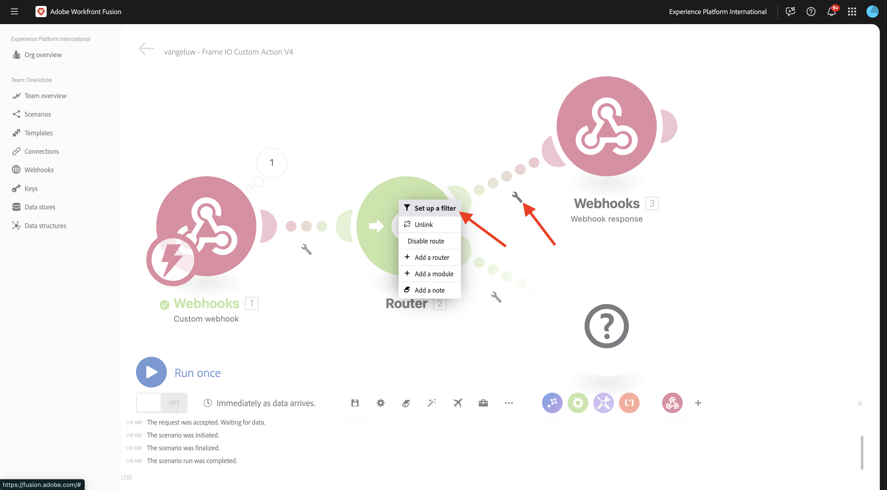
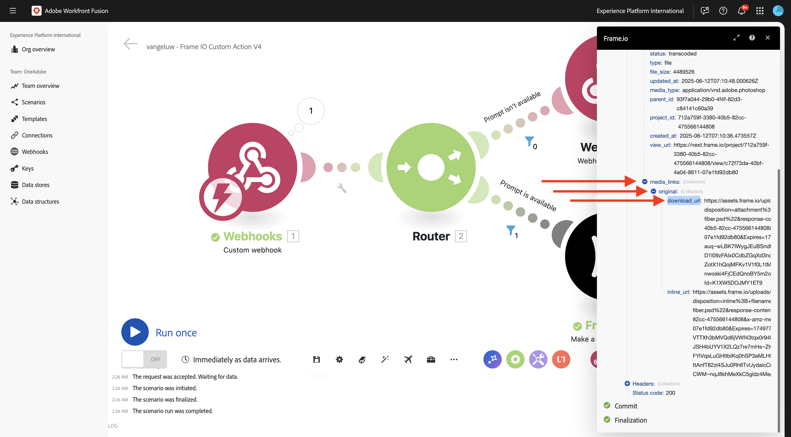
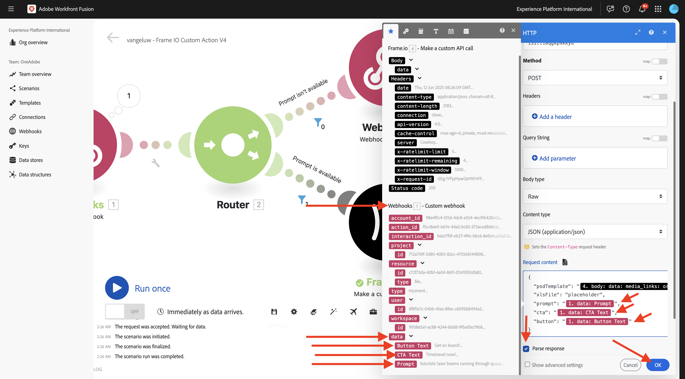
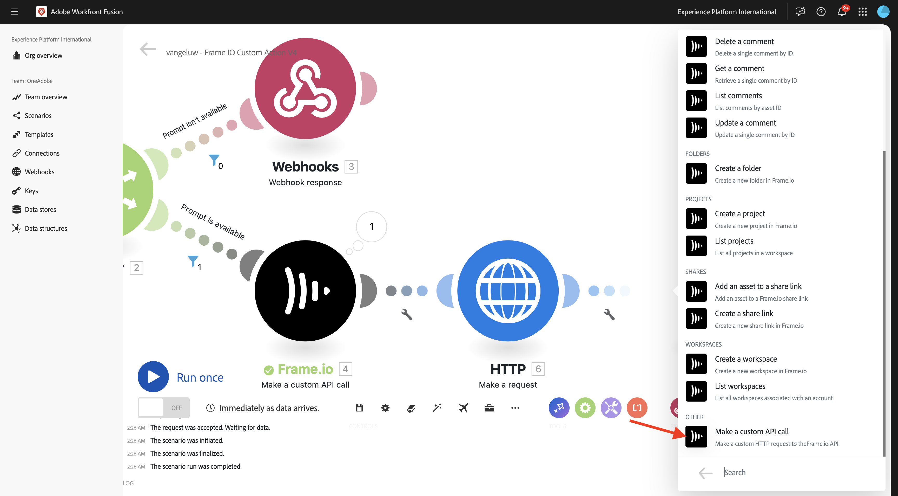
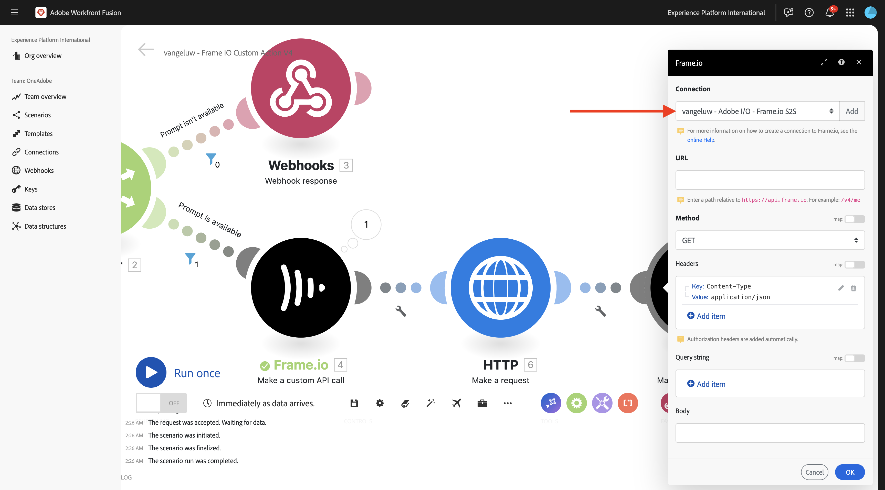

# 1.2.5 Frame.io e Workfront Fusion

No exercício anterior, você configurou o cenário `--aepUserLdap-- - Firefly + Photoshop` e configurou um webhook de entrada para acionar o cenário, além de uma resposta de webhook quando o cenário foi concluído com êxito. Em seguida, você usou o Postman para acionar esse cenário. O Postman é uma ótima ferramenta para testes, mas em um cenário comercial real, os usuários empresariais não usariam o Postman para acionar um cenário. Em vez disso, eles usariam outro aplicativo e esperariam que esse outro aplicativo ativasse um cenário no Workfront Fusion. Neste exercício, isso é exatamente o que você fará com o Frame.io.

>[!NOTE]
>
>Esse exercício foi criado para Frame.io V4. Alguns dos recursos abaixo usados no exercício estão atualmente em alfa e ainda não estão disponíveis para o público geral.

## 1.2.5.1 Pré-requisitos

Antes de continuar com este exercício, você precisa ter concluído a configuração do [seu projeto do Adobe I/O](./../../../modules/getting-started/gettingstarted/ex6.md), incluindo a adição da **API Frame.io** ao seu projeto do Adobe I/O, e também precisa ter configurado um aplicativo para interagir com APIs, como o [Postman](./../../../modules/getting-started/gettingstarted/ex7.md) ou o [PostBuster](./../../../modules/getting-started/gettingstarted/ex8.md).

## 1.2.5.2 Acessando Frame.io

Ir para [https://next.frame.io/](https://next.frame.io/){target="_blank"}.


Verifique em qual instância você está conectado clicando no ícone de instância. Escolha a instância à qual você recebeu acesso, que deve ser `--aepImsOrgName--`.

Clique em **+ Novo projeto** para criar seu próprio projeto no Frame.io.


Selecione o modelo **Em branco** e digite o nome `--aepUserLdap--` para o seu projeto. Clique em **Criar novo projeto**.


Você verá seu projeto no menu esquerdo. Clique no ícone **+** e selecione **Nova Pasta**.


Insira o nome `CitiSignal Fiber Campaign` e clique duas vezes na pasta para abri-la.


Clique em **Carregar**.


Em um dos exercícios anteriores, você baixou [citisignal-fiber.psd](./../../../assets/ff/citisignal-fiber.psd){target="_blank"}. Selecione esse arquivo e clique em **Abrir**.


O arquivo **citisignal-fiber.psd** estará disponível em sua pasta recém-criada.


## 1.2.5.3 Workfront Fusion e Frame.io

No exercício anterior, você criou o cenário `--aepUserLdap-- - Firefly + Photoshop`, que começou com um webhook personalizado e terminou com uma resposta de webhook. O uso dos webhooks foi testado usando o Postman, mas obviamente, o objetivo de tal cenário é ser chamado por um aplicativo externo. Como dito antes, o Frame.io será esse exercício, mas entre o Frame.io e o `--aepUserLdap-- - Firefly + Photoshop` é necessário outro cenário do Workfront Fusion. agora você configurará esse cenário.

Ir para [https://experience.adobe.com/](https://experience.adobe.com/){target="_blank"}. Abra o **Workfront Fusion**.


No menu esquerdo, vá para **Cenários** e selecione sua pasta `--aepUserLdap--`. Clique em **Criar um novo cenário**.


Use o nome `--aepUserLdap-- - Frame IO Custom Action V4`.


Clique no **objeto de ponto de interrogação** na tela. Digite o texto `webhook` na caixa de pesquisa e clique em **Webhooks**.


Clique em **Webhook personalizado**.


Clique em **Adicionar** para criar uma nova url de webhook.


Para o **nome do Webhook**, use `--aepUserLdap-- - Frame IO Custom Action Webhook`. Clique em **Salvar**.


Você deverá ver isso. Deixe essa tela aberta e intacta, pois você precisará dela em uma próxima etapa. Você terá que copiar a URL do webhook em uma próxima etapa, clicando em **Copiar endereço para a área de transferência**.


## API de Ações Personalizadas do Frame.io V4 1.2.5.4

Vá para o Postman e abra a solicitação **POST - Obter Token de Acesso** na coleção **Adobe IO - OAuth**. Verifique o campo **escopo** em **Params**. O campo **scope** deve incluir o scope `frame.s2s.all`. Se estiver ausente, adicione-o. Em seguida, clique em **Enviar** para solicitar um novo **access_token**.


Em seguida, abra a solicitação **GET - Listar Contas** na coleção **Frame.io V4 - Tech Insiders**. Clique em **Enviar**.


Você verá uma resposta semelhante que contém uma ou mais contas. Revise a resposta e localize o campo **id** para a Conta do Frame.io V4 que você está usando. Você pode encontrar o nome da Conta na interface do usuário do Frame.io V4:


Copie o valor do campo **id**.


No menu esquerdo, vá para **Ambientes** e selecione o ambiente que você está usando. Localize a variável **`FRAME_IO_ACCOUNT_ID`** e cole a **id** que você recebeu da solicitação anterior na coluna **Valor inicial** e na coluna **Valor atual**. Clique em **Salvar**.


No menu esquerdo, volte para **Coleções**. Abra a solicitação **GET - List Workspaces** na coleção **Frame.io V4 - Tech Insiders**. Clique em **Enviar**.


Você verá uma resposta semelhante que contém uma ou mais contas. Revise a resposta e localize o campo **id** para o Frame.io V4 Workspace que você está usando. Copie o valor do campo **id**.


No menu esquerdo, vá para **Ambientes** e selecione o ambiente que você está usando. Localize a variável **`FRAME_IO_WORKSPACE_ID`** e cole a **id** que você recebeu da solicitação anterior na coluna **Valor inicial** e na coluna **Valor atual**. Clique em **Salvar**.


No menu esquerdo, volte para **Coleções**. Abra a solicitação **POST - Criar ação personalizada** na coleção **Frame.io V4 - Tech Insiders**, na pasta **Ações personalizadas**.

Vá para o **Corpo** da solicitação. Altere o campo **name** para `--aepUserLdap--  - Frame.io Custom Action V4` e altere o campo **url** para o valor da URL do Webhook copiada do Workfront Fusion.

Clique em **Enviar**.


A ação personalizada do Frame.io V4 foi criada.


Volte para [https://next.frame.io/](https://next.frame.io/){target="_blank"} e vá para a pasta **Campanha de Fibra CitiSignal** criada no seu projeto `--aepUserLdap--`. Atualize a página.


Depois de atualizar a página, clique nos 3 pontos **...** no ativo **citisignal-fiber.psd** e abra o menu **Ações Personalizadas**. Você deverá ver a ação personalizada criada anteriormente aparecer no menu mostrado. Clique na ação personalizada `--aepUserLdap-- - Frame IO Custom Action Fusion V4`.


Você deverá ver um pop-up semelhante de **Ação personalizada**. Este pop-up é o resultado da comunicação entre o Frame.io e o Workfront Fusion.


Retorne a tela para o Workfront Fusion. Agora você deve ver **Determinado com êxito** aparecer no objeto Webhook personalizado. Clique em **OK**.


Clique em **Executar uma vez** para habilitar o modo de teste e testar a comunicação com Frame.io novamente.


Volte para Frame.io e clique na ação personalizada `--aepUserLdap-- - Frame IO Custom Action Fusion V4` novamente.


Retorne a tela para o Workfront Fusion. Agora você deve ver uma marca de seleção verde e uma bolha mostrando **1**. Clique na bolha para ver os detalhes.


A exibição detalhada da bolha mostra os dados recebidos do Frame.io. Você deve ver várias IDs. Por exemplo, o campo **resource.id** mostra a ID exclusiva no Frame.io do ativo **citisignal-fiber.psd**.


Agora que a comunicação foi estabelecida entre o Frame.io e o Workfront Fusion, você pode continuar a configuração.

## 1.2.5.5 Fornecendo uma resposta de formulário personalizado para Frame.io

Quando a ação personalizada é invocada no Frame.io, o Frame.io espera receber uma resposta do Workfront Fusion. Se você voltar para o cenário criado no exercício anterior, várias variáveis serão necessárias para atualizar o arquivo padrão do Photoshop PSD. Essas variáveis são definidas na carga útil usada:

```json
{
    "psdTemplate": "citisignal-fiber.psd",
    "xlsFile": "placeholder",
    "prompt":"misty meadows",
    "cta": "Buy this now!",
    "button": "Click here to buy!"
}
```

Portanto, para que o cenário `--aepUserLdap-- - Firefly + Photoshop` seja executado com êxito, campos como **prompt**, **cta**, **button** e **psdTemplate** são necessários.

Os primeiros 3 campos, **prompt**, **cta**, **button**, exigem entrada do usuário que precisa ser coletada no Frame.io quando o usuário invoca a ação personalizada. Portanto, a primeira coisa a ser feita no Workfront Fusion é verificar se essas variáveis estão disponíveis ou não. Caso contrário, o Workfront Fusion deverá responder ao Frame.io solicitando que essas variáveis sejam inseridas. A maneira de fazer isso é usando um formulário no Frame.io.

Volte para o Workfront Fusion e abra o cenário `--aepUserLdap-- - Frame IO Custom Action`. Passe o mouse sobre o objeto **Webhook personalizado** e clique no ícone **+** para adicionar outro módulo.


Pesquise por `Flow Control` e clique em **Controle de Fluxo**.


Clique para selecionar **roteador**.


Você deverá ver isso.


Clique no **?** objeto e clique para selecionar **Webhooks**.


Selecione **resposta do Webhook**.


Você deverá ver isso.


Copie o código JSON abaixo e cole-o no campo **Corpo**.


```json
{
  "title": "What do you want Firefly to generate?",
  "description": "Enter your Firefly prompt.",
  "fields": [
    {
      "type": "text",
      "label": "Prompt",
      "name": "Prompt",
      "value": ""
    },
    {
      "type": "text",
      "label": "CTA Text",
      "name": "CTA Text",
      "value": ""
    },
    {
      "type": "text",
      "label": "Button Text",
      "name": "Button Text",
      "value": ""
    }
  ]
}
```

Clique no ícone para limpar e embelezar o código JSON. Clique em **OK**.


Clique em **Salvar** para salvar as alterações.



Em seguida, é necessário configurar um filtro para garantir que esse caminho do cenário só seja executado quando nenhum prompt estiver disponível. Clique na **chave inglesa** e selecione **Configurar um filtro**.



Configure os seguintes campos:

- **Rótulo**: use `Prompt isn't available`.
- **Condição**: use `{{1.data.Prompt}}`.
- **Operadores Básicos**: selecione **Não existe**.

>[!NOTE]
>
>As variáveis no Workfront Fusion podem ser especificadas manualmente usando esta sintaxe: `{{1.data.Prompt}}`. O número na variável faz referência ao módulo no cenário. Neste exemplo, você pode ver que o primeiro módulo do cenário é chamado de **Webhooks** e tem um número de sequência de **1**. Isso significa que a variável `{{1.data.Prompt}}` acessará o campo **data.Prompt** do módulo com o número de sequência 1. Os números de sequência podem, às vezes, ser diferentes. Portanto, preste atenção ao copiar/colar essas variáveis e sempre verifique se o número de sequência usado é o correto.

Clique em **OK**.


Você deverá ver isso. Clique primeiro no ícone **Salvar** e depois clique em **Executar uma vez** para testar o cenário.


Você deverá ver isso.


Volte para Frame.io e clique na ação personalizada `--aepUserLdap-- - Frame IO Custom Action Fusion` no ativo **citisignal-fiber.psd** novamente.


Agora você deve ver um prompt dentro do Frame.io. Não preencha os campos ainda e não envie o formulário ainda. Esse prompt é exibido com base na resposta do Workfront Fusion que você acabou de configurar.


Volte para o Workfront Fusion e clique na bolha no módulo **resposta do Webhook**. Você verá que em **INPUT**, você verá o corpo que contém a carga JSON do formulário. Clique novamente em **Executar uma vez**.


Você deverá ver isso novamente.


Volte para Frame.io e preencha os campos conforme indicado.

- **Prompt**: feixes de laser futuristas em execução no espaço
- **CTA**: viaje no tempo agora!
- **Texto do Botão**: Comece a trabalhar!

Clique em **Enviar**.


Você deverá ver um pop-up no Frame.io que se parece com isso.


Volte para o Workfront Fusion e clique na bolha no módulo **Webhook personalizado**. Na Operação 1, em **OUTPUT**, você pode ver um novo objeto **dados** que contém campos como **Texto do Botão**, **Texto do CTA** e **Prompt**. Com essas variáveis de entrada de usuário disponíveis em seu cenário, você tem o suficiente para continuar sua configuração.


## 1.2.5.6 Recuperar local do arquivo do Frame.io

Como discutido anteriormente, campos como **prompt**, **cta**, **button** e **psdTemplate** são necessários para que este cenário funcione. Os primeiros 3 campos já estão disponíveis, mas o **psdTemplate** para usar ainda está ausente. O **psdTemplate** agora referenciará um local do Frame.io, pois o arquivo **citisignal-fiber.psd** está hospedado no Frame.io. Para recuperar o local desse arquivo, é necessário configurar e usar a conexão Frame.io no Workfront Fusion.

Volte para o Workfront Fusion e abra o cenário `--aepUserLdap-- - Frame IO Custom Action V4`. Passe o mouse sobre **?Módulo**, clique no ícone **+** para adicionar outro módulo e pesquisar por `frame`. Clique em **Frame.io**.


Clique em **Frame.io**.


Clique em **Fazer uma chamada de API personalizada**.


Para usar a conexão Frame.io, é necessário configurá-la primeiro. Clique em **Adicionar** para fazer isso.


Selecione o **Tipo de conexão** **Servidor IMS para Servidor** e insira o nome `--aepUserLdap-- - Adobe I/O - Frame.io S2S`.


Em seguida, você precisa inserir a **ID do Cliente** e o **Segredo do Cliente** do projeto do Adobe I/O que você configurou como parte do módulo **Introdução**. Você pode encontrar a **ID do Cliente** e o **Segredo do Cliente** do seu projeto do Adobe I/O [aqui](https://developer.adobe.com/console/projects.){target="_blank"}.


Volte para o seu cenário no Workfront Fusion. Cole os valores da **ID do Cliente** e do **Segredo do Cliente** no respectivo campo na janela de configuração da conexão. Clique em **Continuar**. Sua conexão será testada pelo Workfront Fusion.


Se a conexão tiver sido testada com êxito, ela aparecerá automaticamente em **Conexão**. Agora você tem uma conexão bem-sucedida e precisa concluir a configuração para obter todos os detalhes do ativo do Frame.io, incluindo o local do arquivo. Para fazer isso, você precisará usar a **ID do Recurso**.


O campo **ID do Recurso** é compartilhado pelo Frame.io para o Workfront Fusion como parte da comunicação inicial de **Webhook personalizado** e pode ser encontrado no campo **resource.id**.

Para a configuração do módulo **Frame.io - Fazer uma chamada de API personalizada**, use a URL: `/v4/accounts/{{1.account_id}}/files/{{1.resource.id}}`.

>[!NOTE]
>
>As variáveis no Workfront Fusion podem ser especificadas manualmente usando esta sintaxe: `{{1.account_id}}` e `{{1.resource.id}}`. O número na variável faz referência ao módulo no cenário. Neste exemplo, você pode ver que o primeiro módulo do cenário é chamado de **Webhooks** e tem um número de sequência de **1**. Isso significa que as variáveis `{{1.account_id}}` e `{{1.resource.id}}` acessarão esse campo do módulo com o número de sequência 1. Os números de sequência podem, às vezes, ser diferentes. Portanto, preste atenção ao copiar/colar essas variáveis e sempre verifique se o número de sequência usado é o correto.

Em seguida, clique em **+ Adicionar item** em **Cadeia de caracteres de consulta**.


Insira esses valores e clique em **Adicionar**.

| Chave | Valor |
|:-------------:| :---------------:| 
| `include` | `media_links.original` |


Agora você deve ter isso. Clique em **OK**.


Em seguida, é necessário configurar um filtro para garantir que esse caminho do cenário só seja executado quando nenhum prompt estiver disponível. Clique na **chave inglesa** e selecione **Configurar um filtro**.


Configure os seguintes campos:

- **Rótulo**: use `Prompt is available`.
- **Condição**: use `{{1.data.Prompt}}`.
- **Operadores Básicos**: selecione **Existe**.

>[!NOTE]
>
>As variáveis no Workfront Fusion podem ser especificadas manualmente usando esta sintaxe: `{{1.data.Prompt}}`. O número na variável faz referência ao módulo no cenário. Neste exemplo, você pode ver que o primeiro módulo do cenário é chamado de **Webhooks** e tem um número de sequência de **1**. Isso significa que a variável `{{1.data.Prompt}}` acessará o campo **data.Prompt** do módulo com o número de sequência 1. Os números de sequência podem, às vezes, ser diferentes. Portanto, preste atenção ao copiar/colar essas variáveis e sempre verifique se o número de sequência usado é o correto.

Clique em **OK**.


Você deve ver isso agora. Salve as alterações e clique em **Executar uma vez** para testar o cenário.


Volte para Frame.io e clique na ação personalizada `--aepUserLdap-- - Frame IO Custom Action Fusion V4` no ativo **citisignal-fiber.psd** novamente.


Agora você deve ver um prompt dentro do Frame.io. Não preencha os campos ainda e não envie o formulário ainda. Esse prompt é exibido com base na resposta do Workfront Fusion que você acabou de configurar.


Volte para o Workfront Fusion. Clique novamente em **Executar uma vez**.


Volte para Frame.io e preencha os campos conforme indicado. Clique em **Enviar**.

- **Prompt**: feixes de laser futuristas em execução no espaço
- **CTA**: viaje no tempo agora!
- **Texto do Botão**: Comece a trabalhar!


Volte para o Workfront Fusion e clique na bolha no módulo **Frame.io - Fazer uma chamada de API personalizada**.


Em **OUTPUT** > **Body** > **data**, agora você pode ver muitos metadados sobre o ativo específico **citisignal-fiber.psd**.


A informação específica necessária para este caso de uso é a url de local do arquivo **citisignal-fiber.psd**, que você pode encontrar rolando até o campo **media_links** > **Original** > **download_url**.



Agora você tem todas as informações (**prompt**, **cta**, **button** e **psdTemplate**) disponíveis necessárias para este caso de uso funcionar.

## 1.2.5.7 Invocar cenário do Workfront

No exercício anterior, você configurou o cenário `--aepUserLdap-- - Firefly + Photoshop`. Agora você precisa fazer uma pequena alteração nesse cenário.

Abra o cenário `--aepUserLdap-- - Firefly + Photoshop` em outra guia e clique no primeiro módulo **Adobe Photoshop - Aplicar edições do PSD**. Agora você deve ver que o arquivo de entrada está configurado para usar um local dinâmico no Microsoft Azure. Considerando que, para esse caso de uso, o arquivo de entrada não é mais armazenado no Microsoft Azure, mas usando o armazenamento Frame.io, é necessário alterar essas configurações.


Altere **Storage** para **External** e altere **File location** para usar somente a variável **psdTemplate** retirada do módulo de entrada **Custom webhook**. Clique em **OK** e em **Salvar** para salvar suas alterações.


Clique no módulo **Webhook personalizado** e clique em **Copiar endereço para a área de transferência**. Você precisa copiar o URL da maneira que precisará usá-lo no outro cenário.


Volte para o seu cenário `--aepUserLdap-- - Frame IO Custom Action V4`. Passe o mouse sobre o módulo **Frame.io - Fazer uma chamada de API personalizada** e clique no ícone **+**.


Digite `http` e clique em **HTTP**.


Selecione **Fazer uma solicitação**.


Cole a URL do webhook personalizado no campo **URL**. Defina o **Método** como **POST**.


Defina **Tipo de corpo** como **Raw** e **Tipo de conteúdo** como **JSON (application/json)**.
Cole a carga JSON abaixo no campo **Solicitar conteúdo** e habilite a caixa de seleção para **Analisar resposta**.

```json
{
    "psdTemplate": "citisignal-fiber.psd",
    "xlsFile": "placeholder",
    "prompt":"misty meadows",
    "cta": "Buy this now!",
    "button": "Click here to buy!"
}
```

Agora você tem uma carga estática configurada, mas ela precisa se tornar dinâmica usando as variáveis coletadas anteriormente.


Para o campo **psdTemplate**, substitua a variável estática **citisignal-fiber.psd** pela variável **`Body > data > media_links > original > download_url`**.


Para os campos **prompt**, **cta** e **button**, substitua as variáveis estáticas pelas variáveis dinâmicas que foram inseridas no cenário pela solicitação de webhook de entrada do Frame.io, que são os campos **data.Prompt**, **data.CTA Text** e **data.Button Text**.

Além disso, habilite a caixa de seleção para **Analisar resposta**.

Clique em **OK**.



Clique em **Salvar** para salvar as alterações.


## 1.2.5.8 Salvar novo ativo no Frame.io

Depois que o outro cenário do Workfront Fusion for chamado, o resultado será um novo modelo do Photoshop PSD disponível. Esse arquivo do PSD precisa ser armazenado novamente no Frame.io, que é a última etapa desse cenário.

Passe o mouse sobre o módulo **HTTP - Fazer uma solicitação** e clique no ícone **+**.


Selecione **Frame.io**.


Selecione **Fazer uma chamada de API personalizada**.



Sua conexão Frame.io será selecionada automaticamente.



Para a configuração do módulo **Frame.io - Fazer uma chamada de API personalizada**, use a URL: `/v4/accounts/{{1.account_id}}/folders/{{4.body.data.parent_id}}/files/remote_upload`.

>[!NOTE]
>
>Como dito antes, as variáveis no Workfront Fusion podem ser especificadas manualmente usando esta sintaxe: `{{1.account_id}}` e `{{4.body.data.parent_id}}`. O número na variável faz referência ao módulo no cenário.
>>Neste exemplo, você pode ver que o primeiro módulo do cenário é chamado de **Webhooks** e tem um número de sequência de **1**. Isso significa que a variável `{{1.account_id}}` acessará esse campo do módulo com o número de sequência 1.
>>Neste exemplo, você pode ver que o quarto módulo no cenário é chamado **Frame.io - Fazer uma chamada de API personalizada** e tem um número de sequência de **4**. Isso significa que a variável `{{4.body.data.parent_id}}` acessará esse campo do módulo com o número de sequência 4.
>>Se os números de sequência dos módulos forem diferentes, será necessário atualizar as variáveis no URL acima para serem vinculadas ao módulo correto.


Altere o campo **Método** para **POSTAR**.

Copie e cole o trecho JSON abaixo no campo **Corpo**.

```json
{
  "data": {
    "name": "citisignal-fiber-{{timestamp}}.psd",
    "source_url": "{{6.data.newPsdTemplate}}"
  }
}
```

>[!NOTE]
>
>As variáveis no Workfront Fusion podem ser especificadas manualmente usando esta sintaxe: `{{6.data.newPsdTemplate}}`. O número na variável faz referência ao módulo no cenário. Neste exemplo, você pode ver que o sexto módulo no cenário é chamado **HTTP - Fazer uma solicitação** e tem um número de sequência de **6**. Isso significa que a variável `{{6.data.newPsdTemplate}}` acessará o campo **data.newPsdTemplate** do módulo com o número de sequência 6.
>>Se os números de sequência do módulo forem diferentes, será necessário atualizar a variável no URL acima para ser vinculada ao módulo correto.

Clique em **OK**.


Clique em **Salvar** para salvar as alterações.


## 1.2.5.9 Teste seu caso de uso completo

Clique em **Executar uma vez** no seu cenário `--aepUserLdap-- - Frame IO Custom Action`.


Volte para Frame.io e clique na ação personalizada `--aepUserLdap-- - Frame IO Custom Action Fusion V4` no ativo **citisignal-fiber.psd** novamente.


Agora você deve ver um prompt dentro do Frame.io. Não preencha os campos ainda e não envie o formulário ainda. Esse prompt é exibido com base na resposta do Workfront Fusion que você acabou de configurar.


Volte para o Workfront Fusion. Clique em **Executar uma vez** no seu cenário `--aepUserLdap-- - Frame IO Custom Action V4`.


No Workfront Fusion, abra o cenário `--aepUserLdap-- - Firefly + Photoshop` e clique em **Executar uma vez** nesse cenário.


Volte para Frame.io e preencha os campos conforme indicado. Clique em **Enviar**.

- **Prompt**: feixes de laser futuristas em execução no espaço
- **CTA**: viaje no tempo agora!
- **Texto do Botão**: Comece a trabalhar!


Após 1 a 2 minutos, você deve ver um novo ativo que aparece automaticamente no Frame.io. Clique duas vezes no novo ativo para abri-lo.


Agora é possível ver claramente que todas as variáveis de entrada do usuário foram aplicadas automaticamente.


Você concluiu este exercício com êxito.

## Próximas etapas

Ir para [1.2.6 Frame.io para Fusion para AEM Assets](./ex6.md){target="_blank"}

Retorne ao [Creative Workflow Automation with Workfront Fusion](./automation.md){target="_blank"}

Voltar para [Todos os Módulos](./../../../overview.md){target="_blank"}

