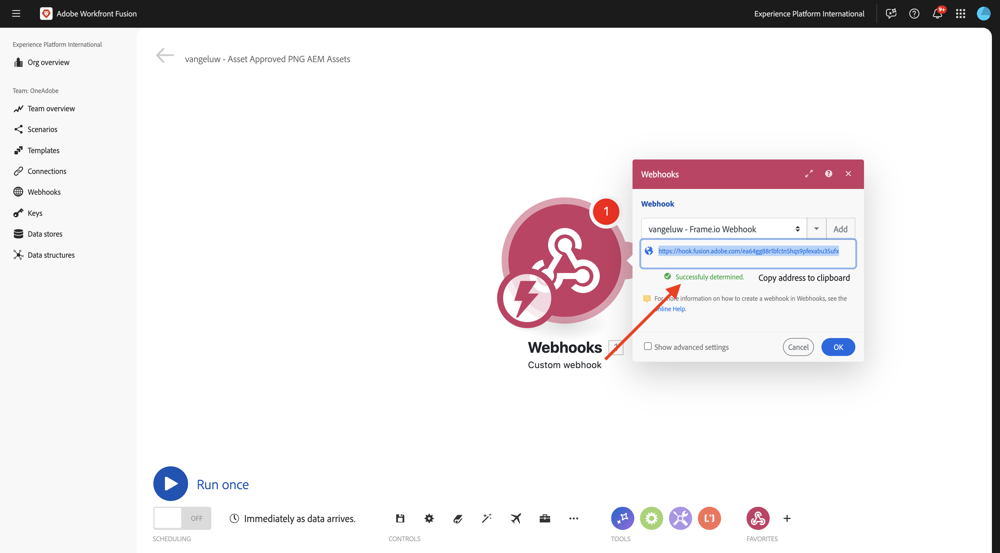
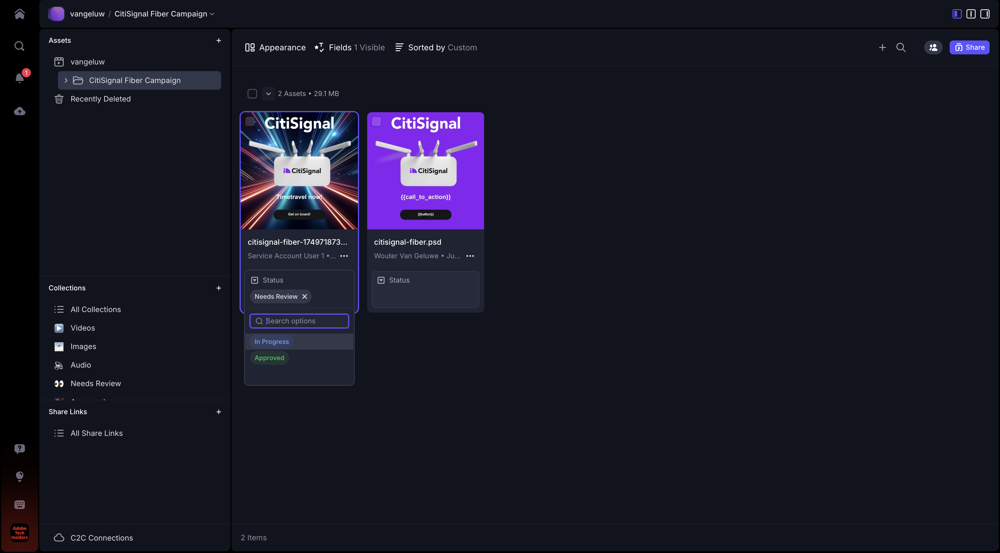
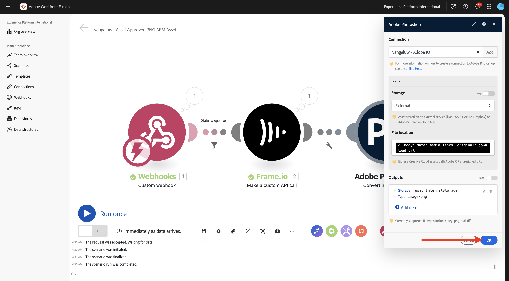
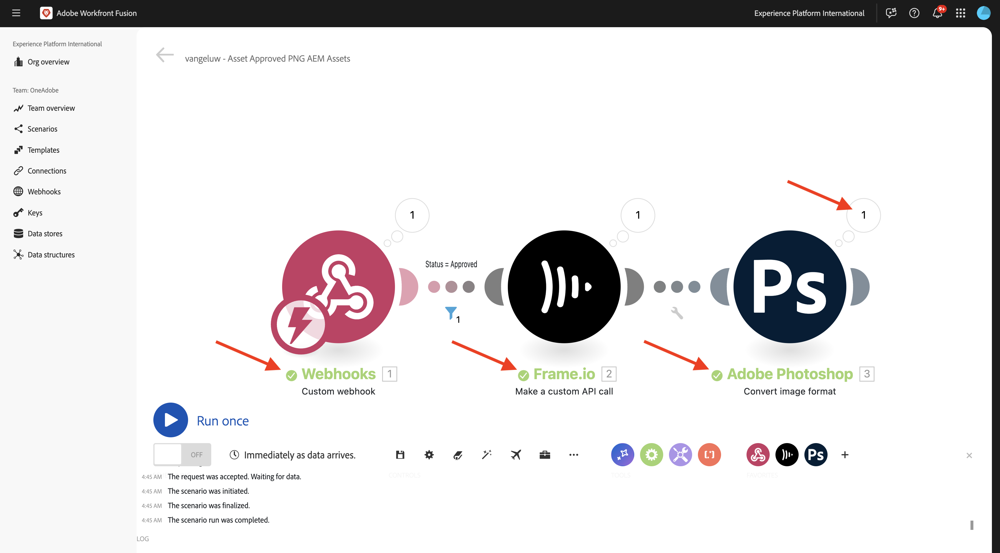
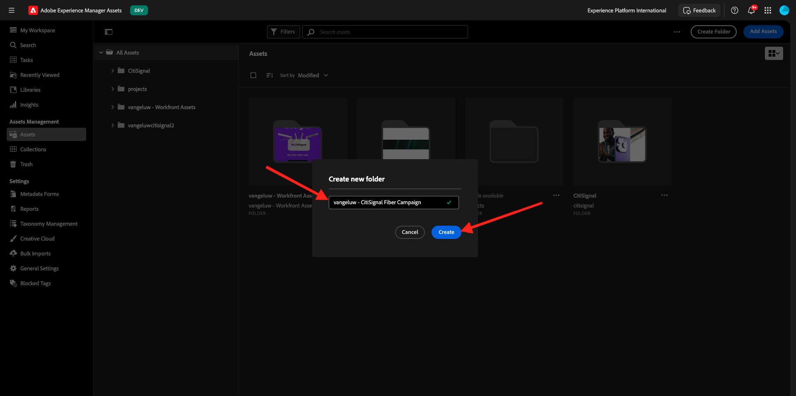
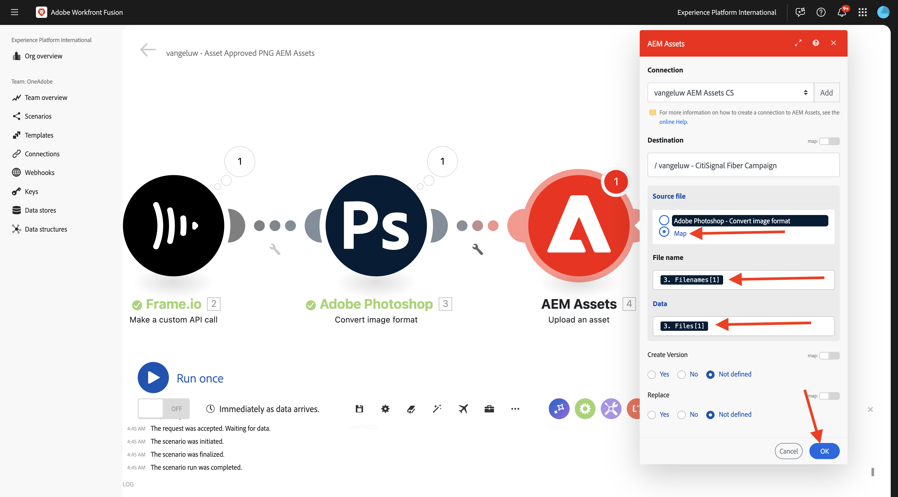
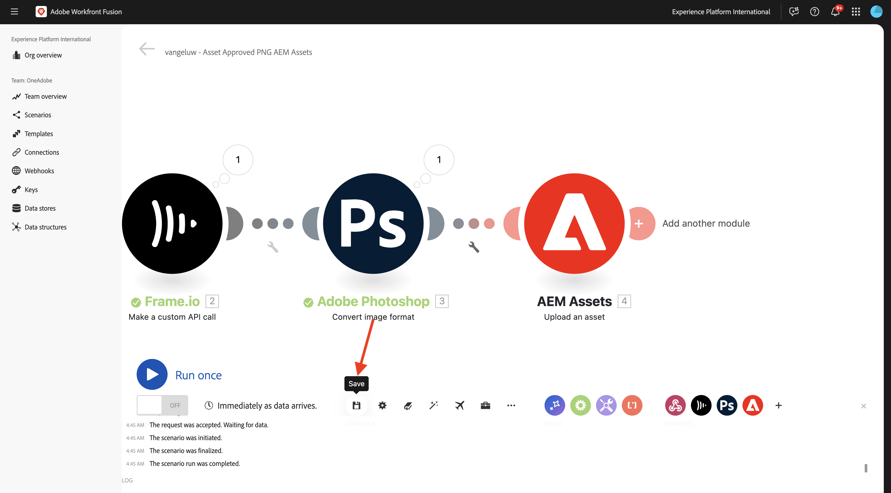

# 1.2.4 E/S de estrutura para Workfront Fusion para AEM Assets

>[!IMPORTANT]
>
>Para concluir este exercício, você precisa ter acesso a um ambiente de trabalho do AEM Assets CS Author. Se você seguir o exercício [Adobe Experience Manager Cloud Service &amp; Edge Delivery Services](./../../../modules/asset-mgmt/module2.1/aemcs.md){target="_blank"}, terá acesso a esse ambiente.

>[!IMPORTANT]
>
>Se você configurou anteriormente um programa do AEM Assets CS com um ambiente de autor, pode ser que sua sandbox do AEM CS tenha hibernado. Considerando que a deshibernação de uma sandbox desse tipo leva de 10 a 15 minutos, seria uma boa ideia iniciar o processo de deshibernação agora para que você não fique preso posteriormente.

No exercício anterior, você configurou um cenário que gera automaticamente variações de um arquivo do Adobe Photoshop PSD usando o Adobe Firefly, as APIs do Photoshop e o Workfront Fusion. A saída desse cenário era um novo arquivo PSD do Photoshop.

As equipes de negócios, no entanto, não precisam de um arquivo PSD, precisam de um arquivo PNG ou JPG. Neste exercício, você configurará uma nova automação que resultará na geração de um arquivo PNG quando o ativo no Frame I/O for aprovado e esse arquivo PNG for armazenado no AEM Assets automaticamente.

## 1.2.4.1 Criar um novo cenário

Ir para [https://experience.adobe.com/](https://experience.adobe.com/){target="_blank"}. Abra o **Workfront Fusion**.

No menu esquerdo, vá para **Cenários** e selecione sua pasta `--aepUserLdap--`. Clique em **Criar um novo cenário**.

Use o nome `--aepUserLdap-- - Asset Approved PNG AEM Assets`. Em seguida, clique no link **?Módulo**, insira o termo de pesquisa `webhook` e clique em **Webhooks**.

Clique em **Webhook personalizado**.

Clique em **Adicionar** para criar um novo webhook.

Use o nome `--aepUserLdap-- - Frame.io Webhook`. Clique em **Salvar**.

Você deverá ver isso. Clique em **Copiar endereço para a área de transferência**.

## 1.2.4.2 Configurar Webhook no Frame.io

Vá para o Postman e abra a solicitação **POST - Obter Token de Acesso** na coleção **Adobe IO - OAuth**. Em seguida, clique em **Enviar** para solicitar um novo **access_token**.

No menu esquerdo, volte para **Coleções**. Abra a solicitação **POST - Criar Webhook** na coleção **Frame.io V4 - Tech Insiders**, na pasta **Webhooks**.

Vá para o **Corpo** da solicitação. Altere o campo **name** para `--aepUserLdap--  - Fusion to AEM Assets` e altere o campo **url** para o valor da URL do Webhook copiada do Workfront Fusion.

Clique em **Enviar**.

A ação personalizada do Frame.io V4 foi criada.

Vá para [https://next.frame.io/project](https://next.frame.io/project){target="_blank"} e vá para o projeto criado antes, que deve ser nomeado como `--aepUserLdap--` e abra a pasta **Campanha de Fibra CitiSignal**. Agora você deve ver os ativos que foram criados no exercício anterior.

Clique no campo **Status** e altere o status para **Em andamento**.

Volte para o Workfront Fusion. Agora você deve ver que a conexão foi **Determinada com êxito**.

Clique em **Salvar** para salvar suas alterações e em **Executar uma vez** para fazer um teste rápido.

Volte para Frame.io, clique no campo **Em andamento** e altere o status para **Precisa de revisão**.

Volte para o Workfront Fusion e clique na bolha no módulo **Webhook personalizado**.

A exibição detalhada da bolha mostra os dados recebidos do Frame.io. Você deve ver várias IDs. Por exemplo, o campo **resource.id** mostra a ID exclusiva no Frame.io do ativo **citisignal-fiber.psd**.

## 1.2.4.3 Obter detalhes do ativo do Frame.io

Agora que a comunicação entre o Frame.io e o Workfront Fusion foi estabelecida por meio de um webhook personalizado, você deve obter mais detalhes sobre o ativo para o qual o rótulo de status foi atualizado. Para fazer isso, você usará novamente o conector Frame.io no Workfront Fusion, semelhante ao exercício anterior.

Passe o mouse sobre o objeto **Webhook personalizado** e clique no ícone **+** para adicionar outro módulo.

Insira o termo de pesquisa `frame`. Clique em **Frame.io**.

Clique em **Frame.io**.

Clique em **Fazer uma chamada de API personalizada**.

Verifique se a conexão está definida com a mesma conexão que você criou no exercício anterior, que deve ser nomeado como `--aepUserLdap-- - Adobe I/O - Frame.io S2S`.

Para a configuração do módulo **Frame.io - Fazer uma chamada de API personalizada**, use a URL: `/v4/accounts/{{1.account.id}}/files/{{1.resource.id}}`.

>[!NOTE]
>
>As variáveis no Workfront Fusion podem ser especificadas manualmente usando esta sintaxe: `{{1.account.id}}` e `{{1.resource.id}}`. O número na variável faz referência ao módulo no cenário. Neste exemplo, você pode ver que o primeiro módulo do cenário é chamado de **Webhooks** e tem um número de sequência de **1**. Isso significa que as variáveis `{{1.account.id}}` e `{{1.resource.id}}` acessarão esse campo do módulo com o número de sequência 1. Os números de sequência podem, às vezes, ser diferentes. Portanto, preste atenção ao copiar/colar essas variáveis e sempre verifique se o número de sequência usado é o correto.

Em seguida, clique em **+ Adicionar item** em **Cadeia de caracteres de consulta**.

Insira esses valores e clique em **Adicionar**.

| Chave | Valor |
|:-------------:| :---------------:| 
| `include` | `media_links.original` |

Agora você deve ter isso. Clique em **OK**.

Clique em **Salvar** para salvar suas alterações e em **Executar uma vez** para testar sua configuração.

Retorne ao Frame.io e altere o status para **Em Andamento**.

Volte para o Workfront Fusion e clique na bolha no módulo **Frame.io - Fazer uma chamada de API personalizada**. Você deverá ver uma visão geral semelhante.

Em seguida, você deve configurar um filtro para garantir que, somente para ativos com status **Aprovado**, um arquivo PNG seja renderizado. Para fazer isso, clique no ícone **Chave inglesa** entre os módulos **Webhook personalizado** e **Frame.io - Faça uma chamada de API personalizada** e selecione **Configurar um filtro**.

Configure os seguintes campos:

- **Rótulo**: use `Status = Approved`.
- **Condição**: `{{1.metadata.value[]}}`.
- **Operadores Básicos**: selecione **Igual a**.
- **Valor**: `Approved`.

Clique em **OK**.

Você deveria ficar com isso. Clique em **Salvar** para salvar as alterações.

## 1.2.4.4 Converter em PNG

Passe o mouse sobre o módulo **Frame.io - Faça uma chamada de API personalizada** e clique no ícone **+**.

Insira o termo de pesquisa `photoshop` e clique em **Adobe Photoshop**.

Clique em **Converter formato de imagem**.

Verifique se o campo **Conexão** está usando sua conexão criada anteriormente, chamada `--aepUserLdap-- - Adobe IO`.

Em **Entrada**, defina o campo **Armazenamento** como **Externo** e defina o **Local do Arquivo** para usar a variável **Original** retornada pelo módulo **Frame.io - Fazer uma chamada de API personalizada**.

Em seguida, clique em **Adicionar item** em **Saídas**.

Para a configuração **Saídas**, defina o campo **Armazenamento** como **Armazenamento interno da Fusão** e o **Tipo** como **imagem/png**. Clique em **Adicionar**.

Clique em **OK**.

Clique em **Salvar** para salvar suas alterações e em **Executar uma vez** para testar sua configuração.

Volte para Frame.io, clique no campo **Em andamento** e altere o status para **Aprovado**.

Volte para o Workfront Fusion. Agora você deve ver que todos os módulos em seu cenário foram executados com sucesso. Clique na bolha no módulo **Adobe Photoshop - Converter formato de imagem**.

Nos detalhes da execução do módulo **Adobe Photoshop - Converter formato de imagem**, você pode ver que um arquivo PNG foi gerado. A próxima etapa é armazenar esse arquivo no AEM Assets CS.

## 1.2.4.5 Armazenar PNG no AEM Assets CS

Passe o mouse sobre o módulo **Adobe Photoshop - Converter formato de imagem** e clique no ícone **+**.

Insira o termo de pesquisa `aem` e selecione **AEM Assets**.

Clique em **Carregar um ativo**.

Agora, é necessário configurar a conexão com o AEM Assets CS. Clique em **Adicionar**.

Use as seguintes configurações:

- **Tipo de Conexão**: **AEM Assets as a Cloud Service**.
- **Nome da Conexão**: `--aepUserLdap-- AEM Assets CS`.
- **URL da instância**: copie a URL da instância do seu ambiente de Autor do AEM Assets CS, que deve ter esta aparência: `https://author-pXXXXX-eXXXXXXX.adobeaemcloud.com`.
- **Acesse as opções de preenchimento de detalhes**: selecione **Fornecer JSON**.

Agora é necessário fornecer as **Credenciais da conta técnica no formato JSON**. Para fazer isso, há várias etapas a seguir usando o AEM Cloud Manager. Enquanto faz isso, mantenha essa tela aberta.

Ir para [https://my.cloudmanager.adobe.com](https://my.cloudmanager.adobe.com){target="_blank"}. A organização que você deve selecionar é `--aepImsOrgName--`. Então você verá algo assim. Clique para abrir seu programa, que deve ser nomeado como `--aepUserLdap-- - Citi Signal`.

Clique nos 3 pontos **...** e selecione **Developer Console**.

Clique em **Fazer logon com o Adobe**.

Vá para **Ferramentas** > **Integrações**.

Clique em **Criar nova conta técnica**.

Você deveria ver algo assim. Abra a conta técnica recém-criada. Clique nos 3 pontos **...** e selecione **Exibir**.

Você deve ver uma carga de token de conta técnica semelhante. Copie a carga JSON completa para a área de transferência.

Retorne ao Workfront Fusion e cole a carga JSON completa no campo **Credenciais da conta técnica no formato JSON**. Clique em **Continuar**.

Sua conexão será validada e, quando bem-sucedida, sua conexão será selecionada automaticamente no módulo AEM Assets. A próxima coisa a fazer é configurar uma pasta. Como parte do exercício, você deve criar uma nova pasta dedicada.

Para criar uma nova pasta dedicada, vá para [https://experience.adobe.com](https://experience.adobe.com/){target="_blank"}. Verifique se a instância correta do Experience Cloud está selecionada, que deve ser `--aepImsOrgName--`. Em seguida, clique em **Experience Manager Assets**.

Clique em **Selecionar** no ambiente do AEM Assets CS, que deve se chamar `--aepUserLdap-- - Citi Signal dev`.

Vá para **Ativos** e clique em **Criar Pasta**.

Insira o nome `--aepUserLdap-- - CitiSignal Fiber Campaign` e clique em **Criar**.

Sua pasta é então criada.

Volte para o Workfront Fusion, selecione **Clique aqui para escolher a pasta** e, em seguida, escolha a pasta `--aepUserLdap-- - CitiSignal Fiber Campaign`.

Verifique se o destino está definido como `--aepUserLdap-- - CitiSignal Fiber Campaign`. Em seguida, em **Arquivo Source**, selecione **Mapa**.

Em **Nome do arquivo**, escolha a variável `{{3.filenames[1]}}`.

Em **Dados**, escolha a variável `{{3.files[1]}}`.

>[!NOTE]
>
>As variáveis no Workfront Fusion podem ser especificadas manualmente usando esta sintaxe: `{{3.filenames[1]}}`. O número na variável faz referência ao módulo no cenário. Neste exemplo, você pode ver que o terceiro módulo do cenário é chamado **Adobe Photoshop - Converter formato de imagem** e tem um número de sequência de **3**. Isso significa que a variável `{{3.filenames[1]}}` acessará o campo **filenames[]** do módulo com o número de sequência 3. Os números de sequência podem, às vezes, ser diferentes. Portanto, preste atenção ao copiar/colar essas variáveis e sempre verifique se o número de sequência usado é o correto.

Clique em **OK**.

Clique em **Salvar** para salvar as alterações.

Em seguida, é necessário definir permissões específicas para a conta técnica que você acabou de criar. Quando a conta foi criada no **Developer Console** no **Cloud Manager**, ela recebeu direitos de acesso de **Leitura**, mas, para este caso de uso, são necessários direitos de acesso de **Gravação**. Você pode fazer isso acessando o ambiente de autor do AEM CS.

Ir para [https://my.cloudmanager.adobe.com](https://my.cloudmanager.adobe.com){target="_blank"}. A organização que você deve selecionar é `--aepImsOrgName--`. Clique para abrir seu programa, que deve ser nomeado como `--aepUserLdap-- - Citi Signal`. Então você verá algo assim. Clique no URL do autor.

Clique em **Fazer logon com o Adobe**.

Vá para **Configurações** > **Segurança** > **Usuários**.

Clique em para abrir a conta de usuário da Conta técnica.

Vá para **Grupos** e adicione este usuário da Conta Técnica ao grupo **Usuários-DAM**.

Clique em **Salvar e fechar**.

Volte para o Workfront Fusion. Clique em **Executar uma vez** para testar o cenário.

Retorne ao Frame.io e verifique se o status do seu ativo foi alterado novamente para **Aprovado**.

>[!NOTE]
>
>Talvez seja necessário alterá-lo primeiro para **Em andamento** ou **Requer revisão** e depois alterá-lo novamente para **Aprovado**.

O cenário do Workfront Fusion será ativado e deve ser concluído com êxito. Ao exibir as informações na bolha no módulo **AEM Assets**, você já pode ver que o arquivo PNG foi armazenado com êxito no AEM Assets CS.

Volte para o AEM Assets CS e abra a pasta `--aepUserLdap-- - Frame.io PNG`. Agora você deve ver o arquivo PNG gerado como parte do cenário do Workfront Fusion. Clique duas vezes no arquivo para abri-lo.

Agora você pode ver mais detalhes sobre os metadados do arquivo PNG gerado.

Você concluiu este exercício com êxito.

## Próximas etapas

Ir para [Resumo e Benefícios da Automação de Fluxo de Trabalho do Creative com o Workfront Fusion](./summary.md){target="_blank"}

Retorne ao [Creative Workflow Automation with Workfront Fusion](./automation.md){target="_blank"}

Voltar para [Todos os Módulos](./../../../overview.md){target="_blank"}
1.2.4