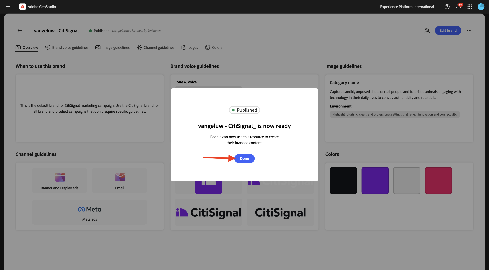

# 1.3.1 Configuração: marca

Uma marca distingue uma organização, produto, serviço ou conceito de outras. Alguns aspectos de uma marca são objetivos, como um logotipo, enquanto outros são subjetivos, como o tom de voz.

A GenStudio for Performance Marketing usa as informações da sua marca, faz parceria com elas para obter informações sobre produtos e personalidades e cria uma identidade de marca abrangente. Essa identidade de marca é usada para informar a criação de conteúdo na marca usando a tecnologia de IA gerativa da Adobe.

Para começar a criar sua própria marca, siga as etapas abaixo.

Ir para [https://experience.adobe.com/](https://experience.adobe.com/){target="_blank"}. Abra o **GenStudio**.


Você deverá ver isso.


A primeira coisa a fazer para usar o GenStudio for Performance Marketing é configurar sua marca. Clique no ícone **Marcas**.


Clique em **+ Adicionar marca**.


Digite o nome `--aepUserLdap-- - CitiSignal` da sua marca. Selecione **Adicionar manualmente** e clique em **Adicionar marca**.


## 1.3.1.1 Cores

Você deverá ver isso. Clique em **Cores**.


Clique em **+ Adicionar cor**.


Há 4 cores diferentes para adicionar:

- `#8821F4`
- `#14161A`
- `#EEEEEE`
- `#FF006C`

Digite o código hexadecimal da cor `#8821F4`. Clique em **Adicionar**.


Clique em **+ Adicionar cor**.


Digite o código hexadecimal da cor `#14161A`. Clique em **Adicionar**.


Clique em **+ Adicionar cor**.


Digite o código hexadecimal da cor `#EEEEEE `. Clique em **Adicionar**.


Clique em **+ Adicionar cor**.


Digite o código hexadecimal da cor `#FF006C `. Clique em **Adicionar**.


Agora você deve ter isso.


## Logotipos de 1.3.1.2

Baixe o arquivo [CitiSignal-GSPeM-assets.zip](../../../assets/gspem/CitiSignal-GSPeM-assets.zip) no desktop e descompacte-o.


Em seguida, vá para **Logotipos**. Clique em **+ Adicionar logotipo**.


Clique em **Procurar**.


Vá para a pasta **CitiSignal-GSPe-assets** > **logos** e selecione esses arquivos. Clique em **Abrir**.


Você deveria ficar com isso. Clique em **Adicionar logotipos**.


Você deveria ficar com isso.


## Diretrizes de voz da marca 1.3.1.3

Em seguida, vá para **Diretrizes de voz da marca**.


Para **Tom e Voz**, use este:

```
• Convey a sense of exploration and adventure
• Be authentic and conversational
• Evoke excitement and curiosity
• Speak honestly and straightforwardly
• Be approachable and relatable
• Use everyday language
```


Para **Valores de marca**, use este:

```
• Inspirational
• Sustainability
• Quality
• Durability
• Functionality
• Reliability
• Community-oriented
• Be inclusive and welcome diversity
• Encourage active lifestyles
• Promote discovery
```


Para **Diretrizes editoriais**, use esta opção:

```
• Keep sentences concise and impactful
• Use active voice
• Lists, bullets, and series should be consistent — either they all start with a noun, or they all start with a verb
• Use serial commas
```


Para **Restrições editoriais**, use esta opção:

```
• Avoid activity-specific jargon unless it’s widely adopted
• Avoid promoting the skill level or experience level of the user of our outdoor equipment
• Avoid technical language or jargon
```


## 1.3.1.4 diretrizes de imagem

Em seguida, vá para **Diretrizes de imagem**.


Definir **Tipo de Conteúdo** como **Art** e para **Descrição**, use esta:

```
Capture candid, unposed shots of real people and futuristic animals engaging with technology in their daily lives to convey authenticity and relatability.
```


Para **Composição**, use esta:

```
Focus on the experiences, speed and emotions of using technology, rather than just the products themselves.
```


Para **Ambiente**, use este:

```
Highlight futuristic, clean, and professional settings that reflect innovation and connectivity.
```


Para **Cor**, use este:

```
Use a palette inspired by technology, including sleek metallics, cool purple and blue, and neutral tones.
```


Para **Iluminação**, use este:

```
Utilize bright, natural lighting to create a welcoming and dynamic atmosphere.
```


Para **Humor**, use este:

```
Each image should evoke a feeling of speed, innovation and being part of the future.
```


Para **Restrições**, use este:

```
Avoid cluttered or busy backgrounds that detract from the main subject.
```


## Diretrizes do canal 1.3.1.4

Em seguida, vá para **Diretrizes do canal**.


Para **Email**, use os seguintes valores:

- **Geral**

```
• Use simple, short sentences
• Be clear and concise
• Invoke a sense of adventure and exploration
```

- **Linha de assunto**

```
• Limit to less than 8 words
• Provide specific details about what’s inside the email
• Use sentence case
• Do not use end punctuation
```

- **Pré-cabeçalho**

```
• Limit to less than 80 characters
• Provide specific details about what’s inside the email
• Use sentence case
• Use ending punctuation
```

- **Título**

```
• Limit to less than 12 words
• Generate excitement through compelling and exciting statements
• Use sentence case
```

- **Subtítulo**: deixe vazio por enquanto

- **Corpo**

```
• Limit to less than 120 words
• Use bullet points for lists containing more than 3 items
• Use between 0 to 4 headings within the body to separate main ideas
• Use sentence case
• Use ending punctuation
```

- **Call-to-action (CTA)**

```
• Limit to between 1 to 3 short words
• Limit to less than 20 characters
• Use an action-oriented verb as the first word and intended action the end-user should take
• Avoid ending punctuation
• Use title case
```


Para **Metadados**, use os seguintes valores:

- **Geral**

```
• Use simple, short sentences
• Be clear and concise
• Invoke a sense of adventure and exploration
• Make product names prominent
• Use community-building concepts and language
```

- **Título**

```
• Limit  to less than 8 words
• Limit to less than 27 characters
• Make it clear what action the reader should take
• Use sentence case
• Avoid ending punctuation
```

- **Corpo**

```
• Limit to less than 125 characters
• Use sentence case
• Use ending punctuation
```

- **No texto da imagem**: deixe vazio por enquanto


Para **Anúncios de banner e exibição**, use os seguintes valores:

- **Geral**

```
• Make readers feel inspired, interested, and sure of the next step
• Avoid word repetition
• Make product names prominent
```

- **Título**

```
• Clearly state the main benefit of the offer
• Use sentence case
• Use ending punctuation
• Limit to less than 60 characters
```

- **Subtítulo**: deixe vazio por enquanto

- **Corpo**

```
• Communicate the benefits of clicking into the offer
• Use sentence case
• Use ending punctuation
```

- **Call-to-action (CTA)**

```
• Limit to between 1 to 3 short words
• Limit to less than 20 characters
• Use an action-oriented verb as the first word
• Use title case
• Avoid ending punctuation
```


Para **LinkedIn**, use os seguintes valores:

- **Geral**: deixe vazio por enquanto

- **Título**: deixe vazio por enquanto

- **Descrição**: deixe vazio por enquanto

- **Texto introdutório**: deixe vazio por enquanto

- **No texto da imagem**: deixe vazio por enquanto


Finalmente, vá para **Visão geral**. Agora você pode ter uma visão geral de tudo o que configurou. Há uma última coisa a fazer. Clique em **+ Adicionar** em **Quando usar esta marca**.


Insira o texto abaixo e clique em **Salvar alterações**.

```
This is the default brand for CitiSignal marketing campaign. Use the CitiSignal brand for all brand and product campaigns that don't require specific guidelines.
```


Clique em **Publicar**.


Clique novamente em **Publicar**.


Sua marca foi publicada e agora ela pode ser usada para criar conteúdo de marca. Clique em **Concluído**.



## Próximas etapas

Ir para [Configuração: Personas, Produtos e Modelos](./ex2.md){target="_blank"}

Voltar para [GenStudio for Performance Marketing](./genstudio.md){target="_blank"}

Voltar para [Todos os Módulos](./../../../overview.md){target="_blank"}
