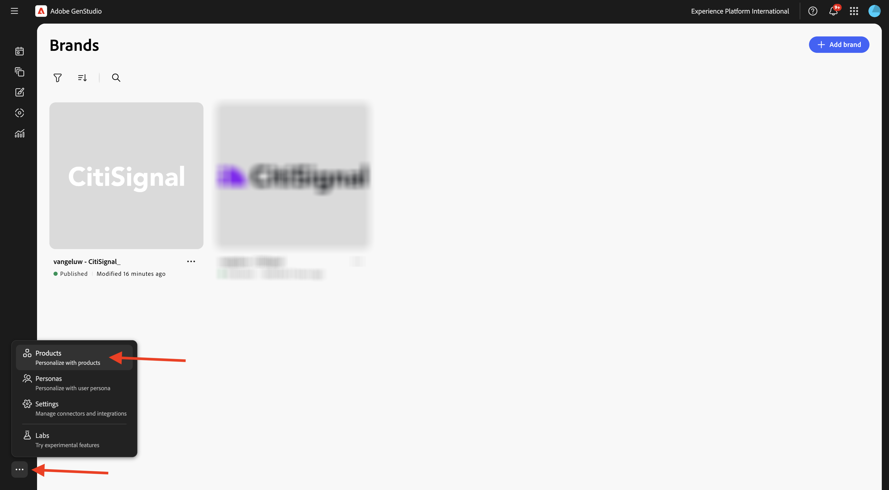
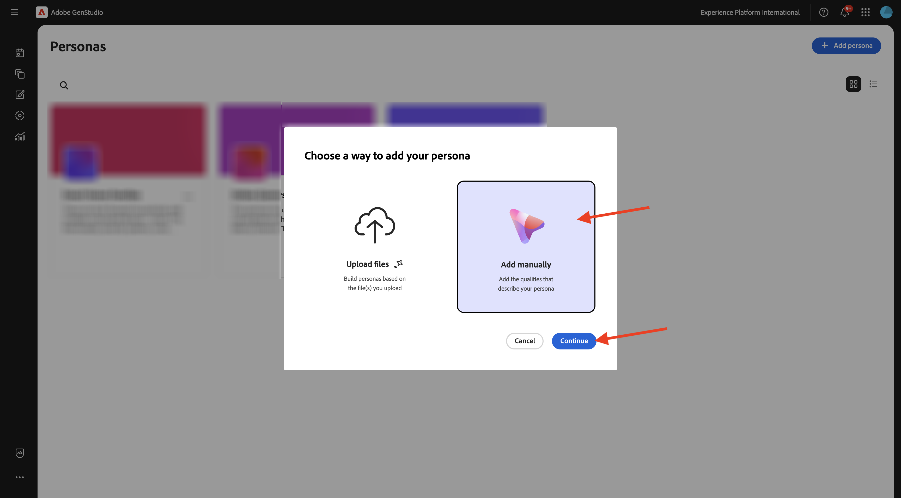
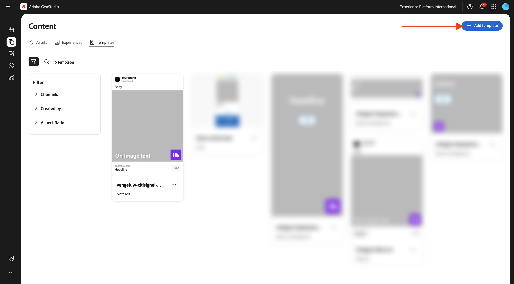
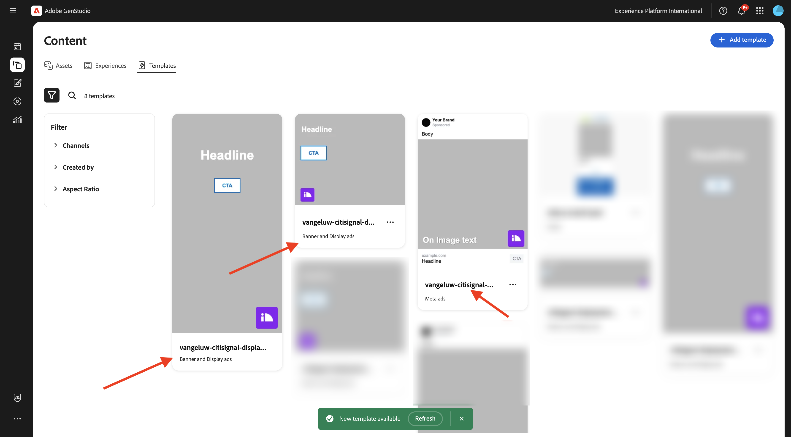
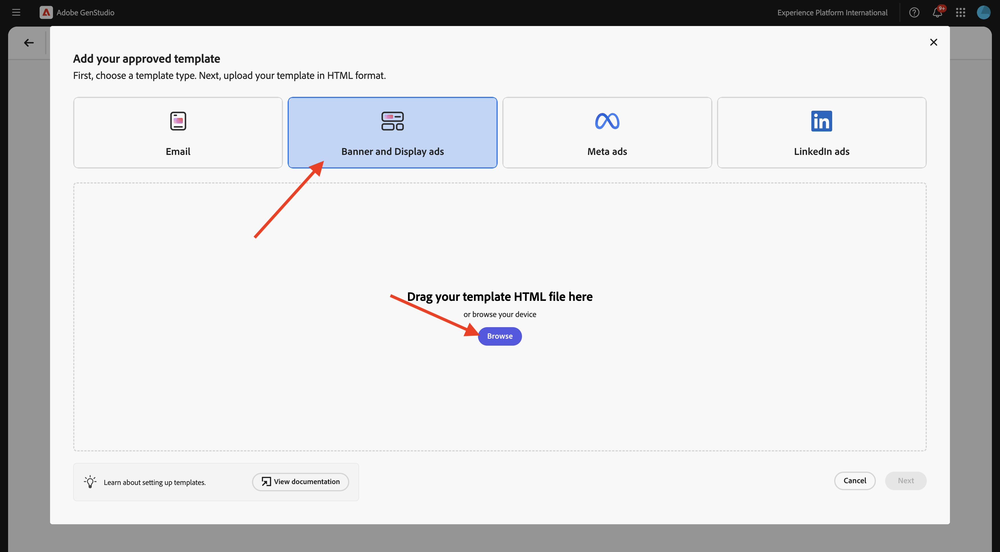

# 1.3.2 Configuração: personas, produtos e modelos

## 1.3.2.1 Produtos

Clique nos 3 pontos **...** e selecione **Produtos**.



Clique em **+ Adicionar produto**.


Selecione **Adicionar manualmente** e clique em **Continuar**.


Você deverá ver isso.


Para o nome do produto, use `--aepUserLdap-- - CitiSignal Mobile Flex Plan`.

Para o campo **Descrição**, use esta opção:

```
CitiSignal Mobile Flex is a next-gen 5G mobile plan that adapts to your lifestyle. Choose from Unlimited, Family Share, or Data Saver tiers, with optional add-ons like international roaming, hotspot tethering, and SmartFamily™ parental controls. All plans include priority access to CitiSignal’s 5G UltraWide network and seamless integration with CitiSignal Fiber for unified billing, shared data pools, and SmartSwitch™ connectivity. 
```

Para o campo **Proposta de valor**, use esta opção:

```
A mobile plan that flexes with your life—fast, fair, and fully connected to your world.
```

No campo **Preferências de mensagens**, use este:

```
Remote Professionals: “Work from anywhere with a mobile plan that’s as flexible as your schedule.”
Online Gamers: “Unlimited 5G. No throttling. Just pure performance—on the go.”
Smart Home Families: “One plan. One bill. One less thing to worry about.”
```

A configuração do produto agora deve ter esta aparência. Clique no ícone **voltar**.


Clique em **+ Adicionar produto**.


Selecione **Adicionar manualmente** e clique em **Continuar**.


Você deverá ver isso.


Para o nome do produto, use `--aepUserLdap-- - CitiSignal Fiber Max`.

Para o campo **Descrição**, use esta opção:

```
CitiSignal Fiber Max is our premium residential internet plan, engineered for households that demand uncompromising speed, stability, and coverage. With symmetrical speeds up to 2 Gbps, it’s ideal for remote professionals juggling Zoom calls and cloud apps, gamers chasing millisecond precision, and families running dozens of smart devices. The plan includes a Wi-Fi 6E router, optional mesh extenders for whole-home coverage, and proactive network monitoring. 
```

Para o campo **Proposta de valor**, use esta opção:

```
Power your work, play, and home with the fastest, most reliable fiber internet—built for the way you live today and tomorrow.
```

No campo **Preferências de mensagens**, use este:

```
Remote Professionals: “Stay connected, stay productive—no matter how many meetings or megabytes your day demands.”
Online Gamers: “Zero lag. Zero mercy. Dominate with 2 Gbps fiber and ultra-low ping.”
Smart Home Families: “Every room. Every device. Always on. Welcome to whole-home harmony.”
```

A configuração do produto agora deve ter esta aparência. Clique no ícone **voltar**.


Em seguida, você deverá ver os dois produtos configurados.


## 1.3.2.2 Personalidades

Clique nos 3 pontos **...** e selecione **Personas**.


Clique em **+ Adicionar persona**.


Selecione **Adicionar manualmente** e clique em **Continuar**.



Você deverá ver isso.


Para o nome de persona, use `--aepUserLdap-- - Smart Home Families`.

Para o campo **Descrição**, use esta opção:

```
These are tech-forward households with multiple connected devices—smart TVs, thermostats, security systems, voice assistants, and more. They value convenience, automation, and seamless connectivity across the home. They often have children and are concerned about online safety, parental controls, and whole-home coverage.
```

No campo **Preferências de mensagens**, use este:

```
Friendly, family-oriented tone
Visuals showing whole-home coverage and device compatibility
Messaging that highlights security, parental controls, and easy setup
Bundled offers (e.g., mesh Wi-Fi, smart home consultations)
How-to content or setup guides for non-tech-savvy users
```

Sua configuração pessoal agora deve ficar assim. Clique no ícone **voltar**.


Clique em **+ Adicionar persona**.


Selecione **Adicionar manualmente** e clique em **Continuar**.


Você deverá ver isso.


Para o nome de persona, use `--aepUserLdap-- - Online Gamers`.

Para o campo **Descrição**, use esta opção:

```
This persona includes competitive and casual gamers who demand ultra-fast, low-latency internet. They often stream gameplay, participate in multiplayer matches, and use voice chat platforms. They are highly sensitive to lag, jitter, and packet loss, and they’re vocal about their experiences online. Many are early adopters of new tech and value performance above all else.
```

No campo **Preferências de mensagens**, use este:

```
Bold, energetic tone with gaming lingo
Metrics like ping time, jitter, and upload/download speeds
Visuals showing latency improvements or side-by-side comparisons
Endorsements from gaming influencers or esports teams
Promotions tied to gaming platforms or bundles (e.g., free months of Xbox Game Pass)
```

Sua configuração pessoal agora deve ficar assim. Clique no ícone **voltar**.


Clique em **+ Adicionar persona**.


Selecione **Adicionar manualmente** e clique em **Continuar**.


Você deverá ver isso.


Para o nome de persona, use `--aepUserLdap-- - Remote Professionals`.

Para o campo **Descrição**, use esta opção:

```
These are knowledge workers, freelancers, consultants, and hybrid employees who rely on a stable, high-speed internet connection to maintain productivity from home. Their workdays are filled with video calls, cloud-based collaboration, and large file transfers. They often use multiple devices simultaneously and expect seamless performance across all of them. Many are tech-savvy and value proactive customer support and service transparency.
```

No campo **Preferências de mensagens**, use este:

```
Clear, professional tone with a focus on productivity and reliability
Testimonials or case studies from similar professionals
Visuals like speed comparison charts and uptime guarantees
Emphasis on 24/7 support and service-level agreements
Messaging that highlights “work-from-anywhere” flexibility
```

Sua configuração pessoal agora deve ficar assim. Clique no ícone **voltar**.


Em seguida, você deve ver as 3 personalidades que configurou.


## 1.3.2.3 Modelos

No exercício anterior, você baixou o arquivo [CitiSignal-GSPeM-assets.zip](../../../assets/gspem/CitiSignal-GSPeM-assets.zip) no desktop e o descompactou. Essa pasta contém quatro modelos de amostra que agora precisam ser importados para o GenStudio.


Vá para **Conteúdo** > **Modelos**. Clique em **+ Adicionar modelo**.


Selecione **Metadados** e clique em **Procurar**.


Na pasta que contém os arquivos **CitiSignal-GSPeM-assets** baixados, navegue até a pasta **modelos**. Selecione o arquivo **citisignal-meta-ad.html** e clique em **Abrir**.


Você deverá ver isso. Clique em **Next**.


Clique em **Next**.


Use para o campo **Nome do modelo**:
`--aepUserLdap---citisignal-meta-ad` e defina a taxa de proporção como **1:1**. Clique em **Publicar modelo**.


Seu modelo foi salvo e está disponível na biblioteca de modelos.


Clique em **+ Adicionar modelo**.



Selecione **Banner e anúncios de exibição** e clique em **Procurar**.


Na pasta que contém os arquivos **CitiSignal-GSPeM-assets** baixados, navegue até a pasta **modelos**. Selecione o arquivo **citisignal-displaytemplate-300x250.html** e clique em **Abrir**.


Você deverá ver isso. Clique em **Next**.


Clique em **Next**.


Use para o campo **Nome do modelo**:
`--aepUserLdap---citisignal-displaytemplate-300x250` e defina a **Largura do anúncio** e a **Altura do anúncio** como **300x250**. Clique em **Publicar modelo**.


Seu modelo foi salvo e está disponível na biblioteca de modelos.


Clique em **+ Adicionar modelo**.


Selecione **Banner e anúncios de exibição** e clique em **Procurar**.


Na pasta que contém os arquivos **CitiSignal-GSPeM-assets** baixados, navegue até a pasta **modelos**. Selecione o arquivo **citisignal-displaytemplate-300x600.html** e clique em **Abrir**.


Você deverá ver isso. Clique em **Next**.


Clique em **Next**.


Use para o campo **Nome do modelo**:
`--aepUserLdap---citisignal-displaytemplate-300x600` e defina a **Largura do anúncio** e a **Altura do anúncio** como **300x600**. Clique em **Publicar modelo**.


Seu modelo foi salvo e está disponível na biblioteca de modelos.



Clique em **+ Adicionar modelo**.


Selecione **Banner e anúncios de exibição** e clique em **Procurar**.



Na pasta que contém os arquivos **CitiSignal-GSPeM-assets** baixados, navegue até a pasta **modelos**. Selecione o arquivo **citisignal-displaytemplate-970x250.html** e clique em **Abrir**.


Você deverá ver isso. Clique em **Next**.


Clique em **Next**.


Use para o campo **Nome do modelo**:
`--aepUserLdap---citisignal-displaytemplate-970x250` e defina a **Largura do anúncio** e a **Altura do anúncio** como **970x250**. Clique em **Publicar modelo**.


Seu modelo foi salvo e está disponível na biblioteca de modelos.


Agora você configurou os modelos necessários para o próximo exercício.

## Próximas etapas

Ir para [Ativação da campanha para Meta](./ex3.md){target="_blank"}

Voltar para [GenStudio for Performance Marketing](./genstudio.md){target="_blank"}

Voltar para [Todos os Módulos](./../../../overview.md){target="_blank"}
