# 1.3.3 Ativação de campanha para o Meta

>[!IMPORTANT]
>
>Para concluir este exercício, você precisa ter acesso a um ambiente de trabalho do AEM Assets CS Author com o AEM Assets Content Hub habilitado.
>
>Há duas opções a serem consideradas:
>
>- Se você estiver participando do workshop de Ativação técnica da GenStudio para CSC, seus instrutores criaram um ambiente de autor do AEM Assets CS para você. Verifique com eles qual é o nome e como proceder.
>
>- Se você estiver seguindo o caminho completo do tutorial do One Adobe, vá para o exercício [Adobe Experience Manager Cloud Service &amp; Edge Delivery Services](./../../../modules/asset-mgmt/module2.1/aemcs.md){target="_blank"}. Siga as instruções aqui e você terá acesso a esse ambiente.

>[!IMPORTANT]
>
>Para executar todas as etapas deste exercício, é necessário ter acesso a um ambiente existente do Adobe Workfront e, nesse ambiente, criar um fluxo de trabalho de projeto e aprovação. Se você seguir o exercício [Gerenciamento de Fluxo de Trabalho com o Adobe Workfront](./../../../modules/workflow-planning/module1.2/workfront.md){target="_blank"}, terá a configuração necessária disponível.

>[!IMPORTANT]
>
>Se você tiver configurado anteriormente um programa do AEM Assets CS com um ambiente de Autor e AEM Assets, pode ser que sua sandbox do AEM CS tenha hibernado. Considerando que a deshibernação de uma sandbox desse tipo leva de 10 a 15 minutos, seria uma boa ideia iniciar o processo de deshibernação agora para que você não precise aguardar mais tarde.

## 1.3.3.1 Criar campanha

No **GenStudio for Performance Marketing**, vá para **Campanhas** no menu esquerdo. Clique em **+ Adicionar campanha**.


Você deve ver uma visão geral vazia da campanha.


Para o nome do campo, use `--aepUserLdap-- - CitiSignal Fiber Launch Campaign`.

Para o campo **Descrição**, use o texto abaixo.

```
The CitiSignal Fiber Launch campaign introduces CitiSignal’s flagship fiber internet service—CitiSignal Fiber Max—to key residential markets. This campaign is designed to build awareness, drive sign-ups, and establish CitiSignal as the go-to provider for ultra-fast, reliable, and future-ready internet. The campaign will highlight the product’s benefits for remote professionals, online gamers, and smart home families, using persona-driven messaging across digital and physical channels.
```

Para o campo **Objetivo**, use o texto abaixo.

```
Generate brand awareness in target regions
Drive early sign-ups and pre-orders for CitiSignal Fiber Max
Position CitiSignal as a premium, customer-first fiber internet provider
Educate consumers on the benefits of fiber over cable or DSL
```

Para o campo **Mensagens principais**, use o texto abaixo.

```
Supporting Points:
Symmetrical speeds up to 2 Gbps
Whole-home Wi-Fi 6E coverage
99.99% uptime guarantee
24/7 concierge support
No data caps or throttling
 Channels:
Digital Advertising: Google Display, YouTube pre-roll, Meta (Facebook/Instagram), TikTok (for gamers)
Email Marketing: Persona-segmented drip campaigns
Social Media: Organic and paid posts with testimonials, speed demos, and influencer partnerships
Out-of-Home (OOH): Billboards, transit ads in suburban commuter corridors
Local Events: Pop-up booths at tech expos, family festivals, and gaming tournaments
Direct Mail: Personalized flyers with QR codes for early sign-up discounts
 
Target Regions:
Primary Launch Markets:
Denver Metro Area, CO
Austin, TX
Raleigh-Durham, NC
Salt Lake City, UT
Demographic Focus:
Suburban neighborhoods with high remote work density
Areas with high smart home adoption
Zip codes with underserved or dissatisfied cable customers
```

Você deve ter isto:


Role para baixo para ver mais campos:


Para o campo **Início**, defina-o como a data de hoje.

Para o campo **End**, defina-o como uma data daqui a 1 mês.

Para o campo **Status**, defina-o como **Ativo**.

Para o campo **Canais**, defina-o como **Meta**, **Email**, **Mídia paga**, **Exibição**.

Para o campo **Regiões**, selecione uma região de escolha.

Para o campo Para o campo **Referências** > **Produtos**: escolha o produto `--aepUserLdap-- - CitiSignal Fiber Max`.

**Referências** > **Personas**: escolha as personalidades `--aepUserLdap-- - Remote Professionals`, `--aepUserLdap-- - Online Gamers`, `--aepUserLdap-- - Smart Home Families`

Você deverá ver isso:


Sua campanha está pronta. Clique na **seta** para voltar.


Você verá sua campanha na lista. Clique no ícone de exibição do calendário para alterar a exibição para o calendário da campanha.


Você deve ver um calendário de campanha que dá uma ideia mais visual de quais campanhas estão ativas em cada momento.

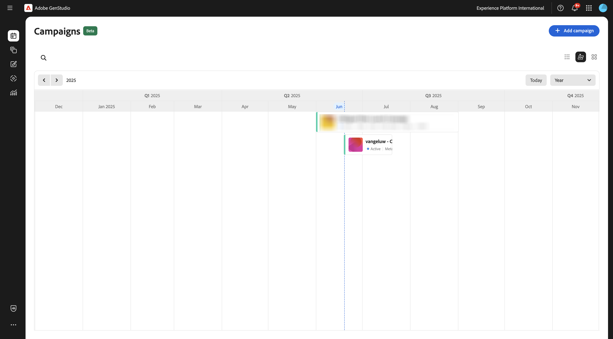

## 1.3.3.2 Conexão de instalação com o Meta

>[!IMPORTANT]
>
>Para configurar sua conexão com o Meta, você precisa ter uma conta de usuário do Meta disponível e essa conta de usuário precisa ser adicionada a uma conta do Meta Business.

Para configurar a conexão com o Meta, clique nos 3 pontos **...** e selecione **Configurações**.


Clique em **Conectar** para **Meta Ads**.


Faça logon usando sua conta da Meta. Clique em **Continuar**.

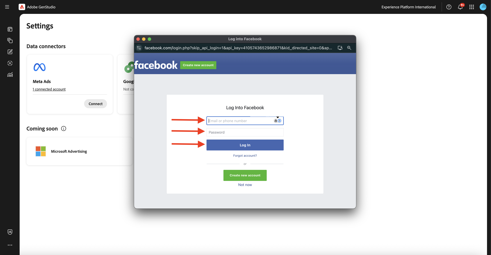

Se sua conta estiver vinculada a uma Conta comercial do Meta, você poderá selecionar o portfólio comercial que foi configurado no Meta.


Depois que a conexão for estabelecida, clique na linha que diz **X conta(s) conectada(s)**.


Você deverá ver os detalhes da Conta comercial do Meta que está conectada ao GenStudio for Performance Marketing.


## 1.3.3.3 Criar novo ativo

Ir para [https://firefly.adobe.com/](https://firefly.adobe.com/){target="_blank"}. Digite o prompt `a neon rabbit running very fast through space` e clique em **Gerar**.


Você verá várias imagens sendo geradas. Escolha a imagem de que você mais gosta, clique no ícone **Compartilhar** na imagem e selecione **Abrir no Adobe Express**.


Em seguida, você verá a imagem que acabou de gerar ficar disponível no Adobe Express para edição. Agora é necessário adicionar o logotipo CitiSignal na imagem. Para fazer isso, vá para **Marcas**.


Em seguida, você deverá ver o modelo de marca CitiSignal criado no GenStudio for Performance Marketing exibido no Adobe Express. Clique para selecionar o modelo de marca que deve ser nomeado como `--aepUserLdap-- - CitiSignal`.


Vá para **Logotipos** e clique no logotipo **branco** do Citisignal para soltá-lo na imagem.


Posicione o logotipo do CitiSignal na parte superior da imagem, não muito longe do meio.


Em seguida, clique em **Compartilhar**.


Selecione **AEM Assets**.


Clique em **Selecionar pasta**. Altere o nome do ativo para `--aepUserLdap-- - neon rabbit`.


Selecione o repositório do AEM Assets CS, que deve se chamar `--aepUserLdap-- - CitiSignal` e selecione a pasta `--aepUserLdap-- - CitiSignal Fiber Campaign`. Clique em **Selecionar**.

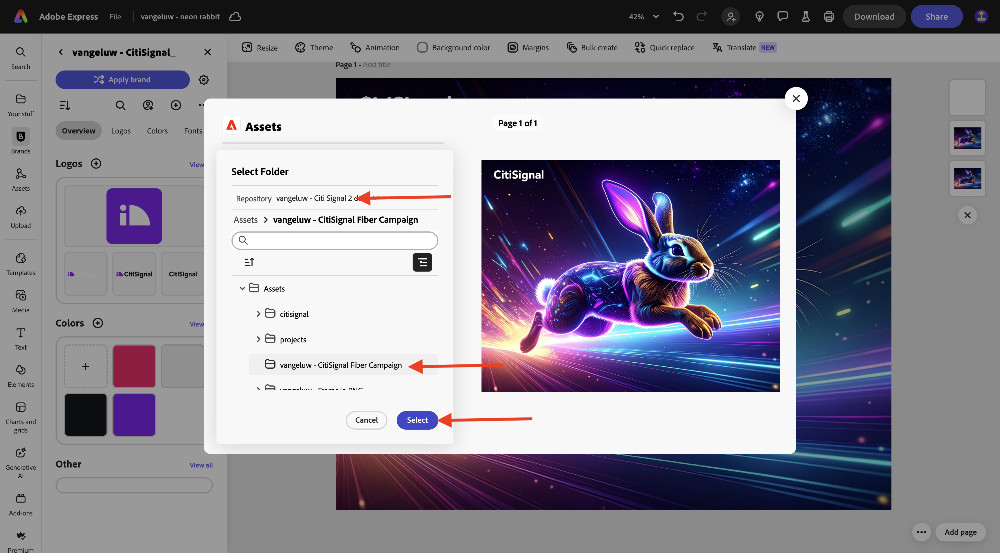

Você deverá ver isso. Clique em **Carregar 1 ativo**. Sua imagem será carregada no AEM Assets CS.


Ir para [https://experience.adobe.com/](https://experience.adobe.com/){target="_blank"}. Abra o **Experience Manager Assets**.


Selecione o ambiente do AEM Assets CS, que deve se chamar `--aepUserLdap-- - CitiSignal dev`.


Vá para **Assets** e clique duas vezes na pasta `--aepUserLdap-- - CitiSignal Fiber Campaign`.

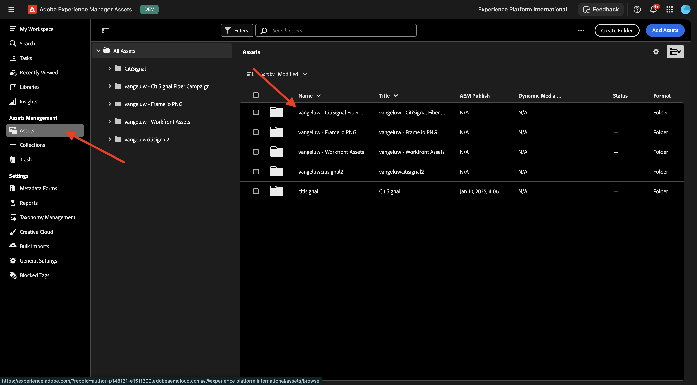

Você verá algo semelhante a isso. Clique duas vezes na imagem `--aepUserLdap-- - neon rabbit`.

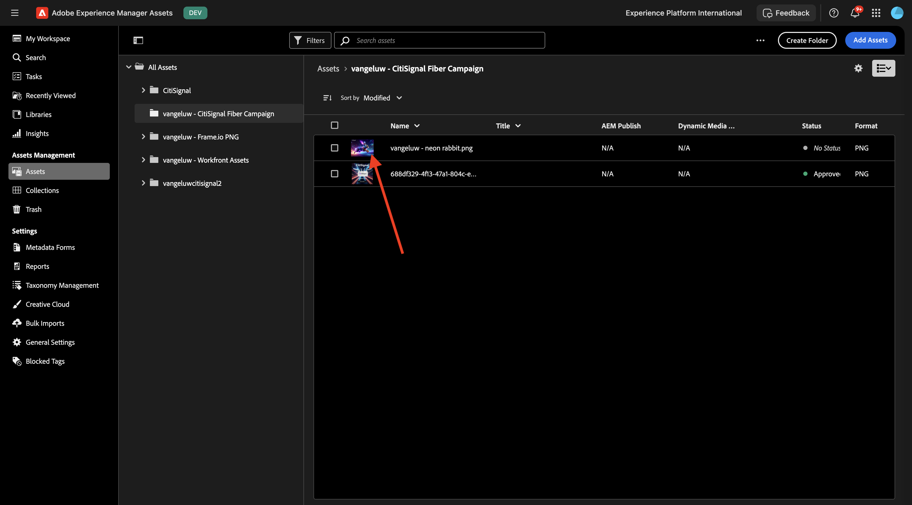

A imagem `--aepUserLdap-- - neon rabbit` será exibida. Altere o **Status** para **Aprovado** e clique em **Salvar**

>[!IMPORTANT]
>
>Se o status de uma imagem não estiver definido como **Aprovado**, ela não estará visível no GenStudio for Performance Marketing. Somente ativos aprovados podem ser acessados na GenStudio for Performance Marketing.


Volte para o GenStudio for Performance Marketing. No menu esquerdo, vá para **Assets** e selecione seu repositório do AEM Assets CS, que deve ser nomeado como `--aepUserLdap-- - CitiSignal`. Em seguida, você verá que a imagem que acabou de criar e aprovar ficará disponível dentro do GenStudio for Performance Marketing.

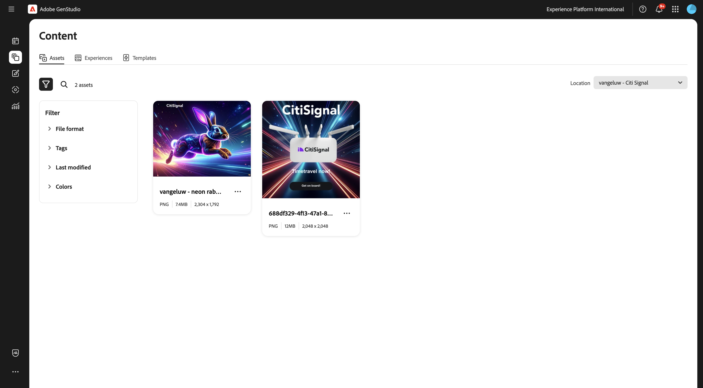

## 1.3.3.4 Criar e aprovar anúncio do Meta

No menu esquerdo, vá para **Criar**. Selecione **Meta**.


Selecione o modelo de **anúncio de Meta** que você importou antes, denominado `--aepUserLdap---citisignal-meta-ad`. Clique em **Usar**.

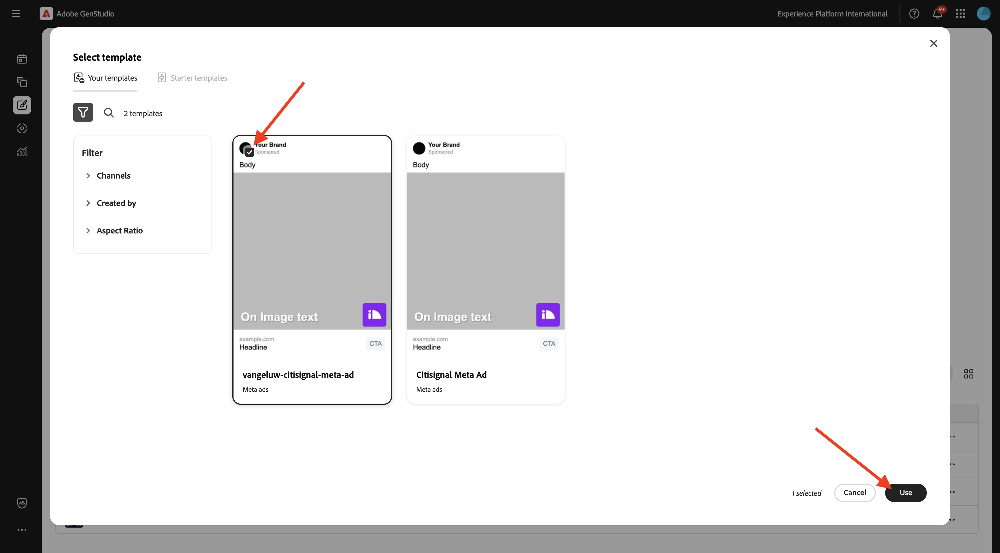

Você deverá ver isso. Altere o nome do seu anúncio para `--aepUserLdap-- - Meta Ad Fiber Max`.

Em **Parâmetros**, selecione as seguintes opções:

- **Marca**: `--aepUserLdap-- - CitiSignal`
- **Idioma**: `English (US)`
- **Pessoa**: `--aepUserLdap-- - Smart Home Families`
- **Produto**: `--aepUserLdap-- - CitiSignal Fiber Max`

Clique em **Selecionar do conteúdo**.


Selecione o ativo `--aepUserLdap-- - neon rabbit.png`. Clique em **Usar**.


Digite o prompt `focus on lightning fast internet for big families` e clique em **Gerar**.


Você deveria ver algo assim. Seus anúncios estão prontos para serem revisados e aprovados. Para fazer isso, clique em **Solicitar aprovação**, que se conectará ao Adobe Workfront.


Selecione seu projeto do Adobe Workfront, que deve ser nomeado como `--aepUserLdap-- - CitiSignal Fiber Launch`. Insira seu próprio endereço de email em **Convidar pessoas** e verifique se sua função está definida como **Aprovador**.


Como alternativa, você também pode usar um fluxo de trabalho de aprovação existente no Adobe Workfront. Para fazer isso, clique em **Usar modelo** e selecione o modelo `--aepuserLdap-- - Approval Workflow`. Clique em **Enviar**.


Clique em **Exibir comentários no Workfront**. Você será enviado agora para a Interface do Usuário do Adobe Workfront Proof.


Na interface do Adobe Workfront Proof, clique em **Tomar decisão**.


Selecione **Aprovado** e clique em **Tomar decisão**.


Clique em **Publicar**.

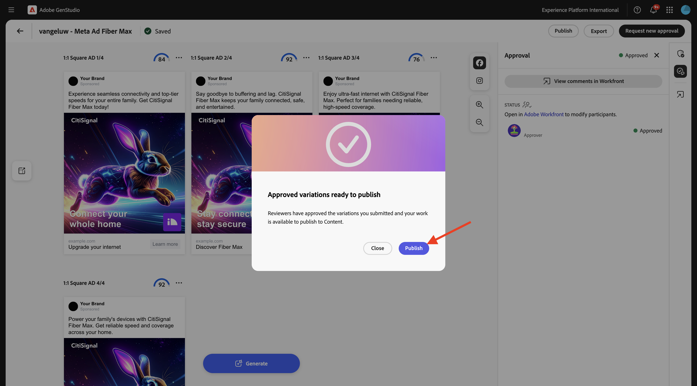

Selecione sua Campanha `--aepUserLdap-- - CitiSignal Fiber Launch Campaign` e clique em **Publicar**.


Clique em **Abrir no Conteúdo**.


Os 4 anúncios do Meta agora estão disponíveis em **Conteúdo** > **Experiências**.


## 1.3.3.5 Publicar anúncio no Meta

Selecione um dos anúncios e clique em **Ativar**.


Escolha um **Call to action** fora da lista e insira um exemplo de URL. Clique em **Next**.


Selecione a conta do Meta, a página vinculada do Facebook, a Campanha do Meta e o Conjunto de anúncios do Meta.

Dê um nome à sua adição, use `--aepUserLdap-- Fiber Max Ad`.

Clique em **Next**.


Clique em **Publicar**.

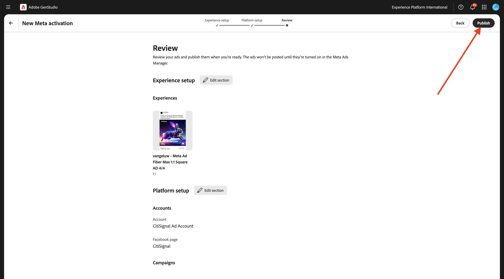

Clique em **OK**.


O status do seu anúncio está agora definido como **Publicação**, o que pode levar alguns minutos.


Após alguns minutos, o status do anúncio será alterado para **Publicado**. Isso significa que o anúncio foi enviado do GenStudio for Performance Marketing para o Meta. Isso não significa que o anúncio já esteja publicado no Meta! Ainda há várias etapas a serem seguidas na Conta comercial do Meta para selecionar o anúncio e publicá-lo para que ele possa ser visualizado pelos usuários nas várias plataformas do Meta.

Clique em **Exibir detalhes**.

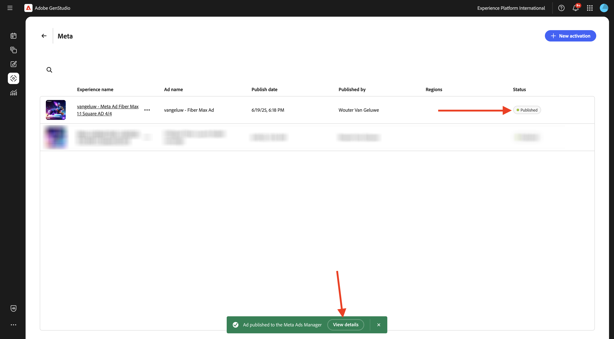

Clique em **Abrir**, que o levará à sua Conta Comercial da Meta.

>[!IMPORTANT]
>
>Se você não tiver acesso à Conta comercial do Meta conectada ao seu ambiente, não será possível visualizar este anúncio no Meta.

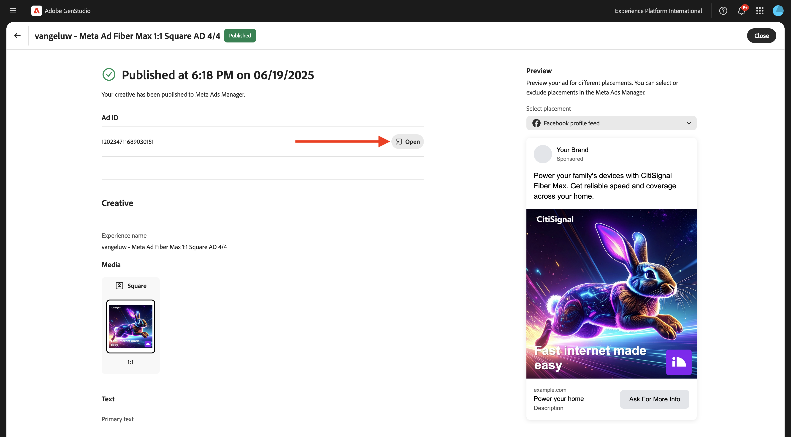

Esta é uma visão geral do anúncio que você acabou de criar, mas agora está no Meta.


Você concluiu este exercício agora.

## Próximas etapas

Ir para [Resumo e benefícios](./summary.md){target="_blank"}

Voltar para [GenStudio for Performance Marketing](./genstudio.md){target="_blank"}

Voltar para [Todos os Módulos](./../../../overview.md){target="_blank"}
