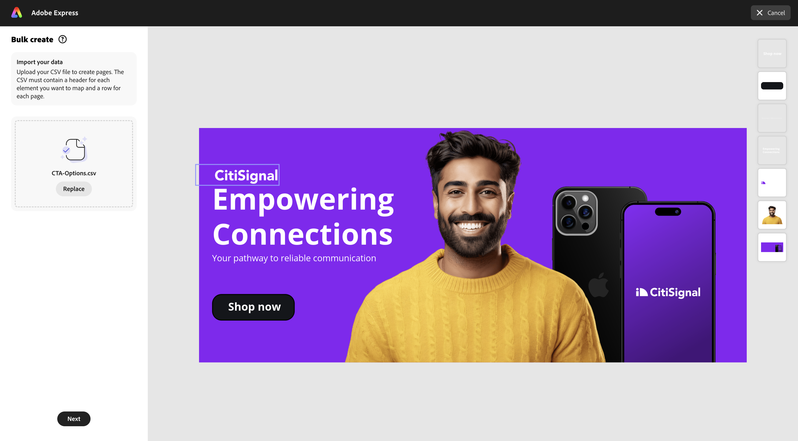
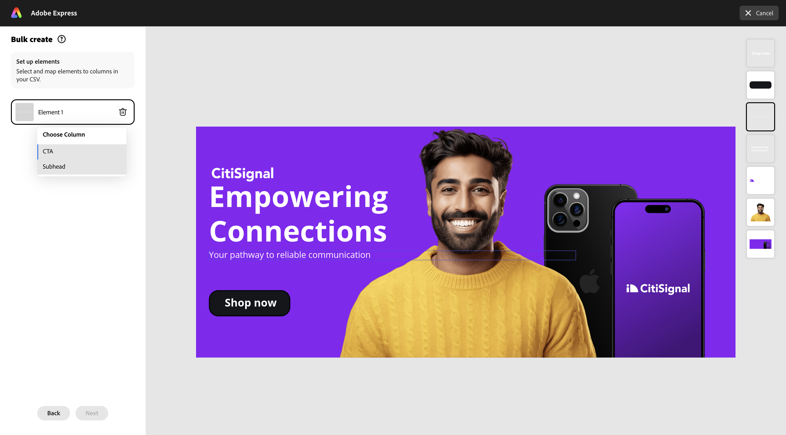
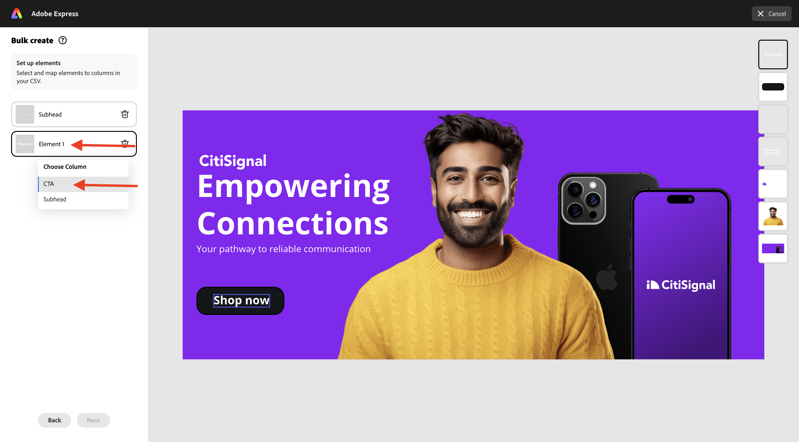

# 1.3.3 Criação de Assets em massa no Adobe Express

Antes de iniciar este exercício, baixe os ativos necessários do [https://tech-insiders.s3.us-west-2.amazonaws.com/one-adobe/Adobe_Express.zip](https://tech-insiders.s3.us-west-2.amazonaws.com/one-adobe/Adobe_Express.zip){target="_blank"} e descompacte-os na área de trabalho.

## 1.3.3.1 Criar seu ativo básico

Ir para [https://new.express.adobe.com/](https://new.express.adobe.com/){target="_blank"}. Clique no ícone **+** para criar uma nova **imagem**.

Selecione **Foto** e escolha **Carregar mídia**.

Navegue até a área de trabalho e acesse a pasta **Adobe_Express** que contém os ativos baixados anteriormente. Selecione o arquivo **banner.png** e clique em **Abrir**.

Você deverá ver isso. Selecione **Editar imagem**.

Em seguida, vá para **Mídia** e selecione **Carregar imagem**. Navegue até a área de trabalho e acesse a pasta **Adobe_Express** que contém os ativos baixados anteriormente. Selecione o arquivo **man.png** e clique em **Abrir**.

Você deverá ver isso.

Em seguida, adicione o logotipo **CitiSignal**. Vá para **Marcas** e selecione o logotipo branco do CitiSignal. Clique nos 3 pontos **...** e selecione **Colocar**.

Ajuste a localização da imagem do logotipo do CitiSignal para refletir a mesma posição na imagem abaixo.

Vá para **Texto** e clique em **Adicionar seu texto**.

Na nova caixa de texto, adicione o texto `Empowering Connections`. Arraste a caixa de texto para um local semelhante, como mostrado na imagem abaixo. Em seguida, vá para **Marcas**, para **Fontes**. Clique nos 3 pontos **...** na 3ª fonte e clique em **Aplicar**.

Em seguida, altere a cor da fonte para **branco**.

Vá para **Texto** novamente e clique em **Adicionar seu texto**.

Na nova caixa de texto, insira o texto `Your pathway to reliable communication`. Ajuste o local da caixa de texto a ser exibido na caixa de texto anterior, de modo semelhante à imagem mostrada abaixo.

Vá para **Marcas**, para **Fontes** e clique nos três pontos **...** na segunda fonte. Em seguida, clique em **Aplicar**.

Você deveria ficar com isso. Em seguida, vá para **Elementos**, para **Formas** e clique na forma de retângulo arredondado.

Em seguida, você terá uma nova forma de retângulo arredondada na imagem. Ajuste o tamanho e a localização para que pareça um botão. Em seguida, altere a cor do retângulo arredondado para **preto**.

Vá para **Texto** novamente e clique em **Adicionar seu texto**.

Insira o texto `Shop now` na nova caixa de texto e altere o local da caixa de texto para ser centralizado no botão. Vá para **Marcas**, para **Fontes** e clique nos três pontos **...** na terceira fonte. Em seguida, clique em **Aplicar**.

Você deverá ver isso.

## 1.3.3.2 Criação em massa no Adobe Express

Em seguida, clique em **Criação em massa**.

Você deverá ver isso. Clique em **procurar**.

Navegue até a área de trabalho e acesse a pasta **Criação Expressa em Massa** na pasta **Adobe_Express** que contém os ativos baixados anteriormente. Selecione o arquivo **CTA-options.csv** e clique em **Abrir**.

Você deverá ver isso. Clique em **Next**.

Clique em **Conectar Elemento**.

Selecione a caixa de texto que contém o texto **Seu caminho para uma comunicação confiável**. Em seguida, clique no botão **Elemento 1** e vincule-o a um campo do arquivo CSV; neste caso, o campo **Subtítulo**.

Em seguida, selecione a caixa de texto que contém o texto **Comprar agora**.

Em seguida, clique no botão **Elemento 1** e o vincule a um campo do arquivo CSV; neste caso, o campo **CTA**.

Você deverá ver isso. Em seguida, clique na imagem da pessoa.

Clique no botão **Elemento 1**.

Você então verá esse pop-up. Clique em **procurar**.

Navegue até a área de trabalho e acesse a pasta **Criação Expressa em Massa** na pasta **Adobe_Express** que contém os ativos baixados anteriormente. Selecione de 6 a 7 arquivos de imagem e clique em **Abrir**.

Você verá isso. Arraste e solte uma imagem diferente para cada variação do ativo. Clique em **Concluído**

Você verá as variações da imagem que está sendo gerada. Clique em **Criar páginas**.

Agora as variações estão prontas e você pode inspecionar cada uma individualmente para revisar e validar.

Você concluiu este exercício agora.

## Próximas etapas

Ir para [Resumo e benefícios](./summary.md){target="_blank"}

Voltar para [Adobe Express e Adobe Experience Cloud](./express.md){target="_blank"}

Voltar para [Todos os Módulos](./../../../overview.md){target="_blank"}