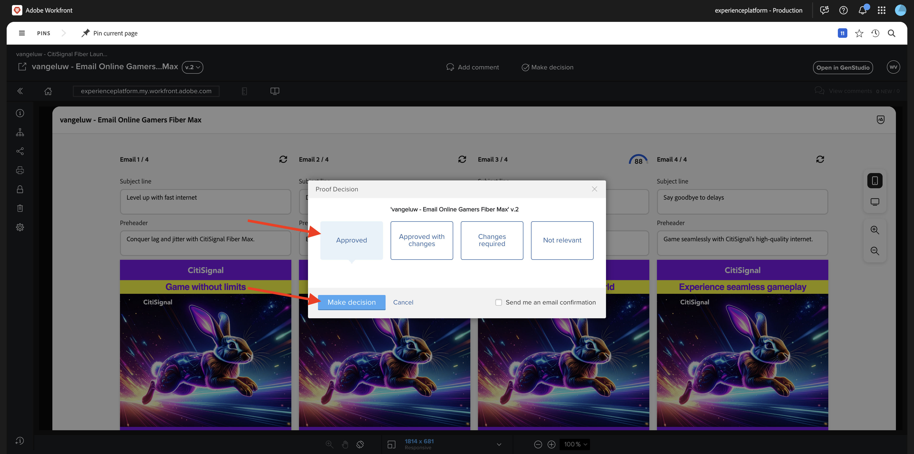
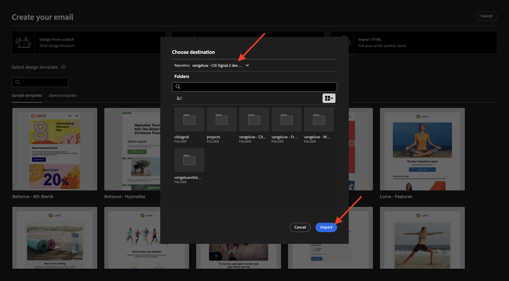
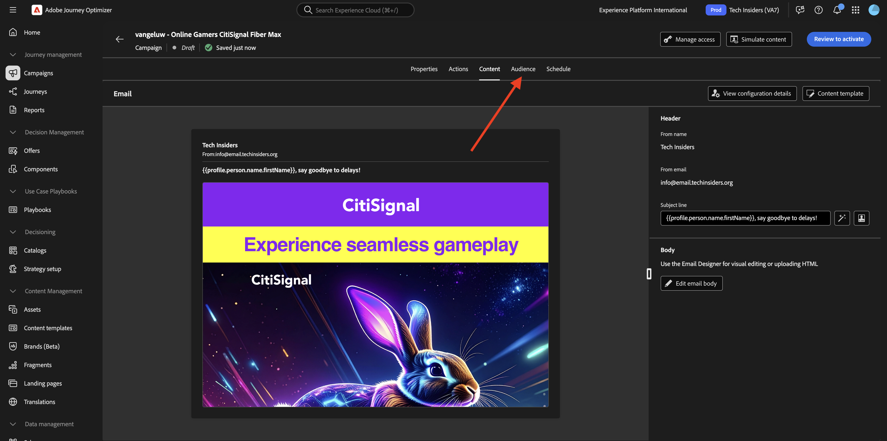

# 1.3.4 Criar experiência de email para o AJO

>[!IMPORTANT]
>
>Para concluir este exercício, você precisa ter acesso a um ambiente do Adobe Journey Optimizer provisionado para a integração com o GenStudio for Performance Marketing, que atualmente está na versão beta.

>[!IMPORTANT]
>
>Para executar todas as etapas deste exercício, é necessário ter acesso a um ambiente existente do Adobe Workfront e, nesse ambiente, criar um fluxo de trabalho de projeto e aprovação. Se você seguir o exercício [Gerenciamento de Fluxo de Trabalho com o Adobe Workfront](./../../../modules/workflow-planning/module1.2/workfront.md){target="_blank"}, terá a configuração necessária disponível.

## 1.3.4.1 Criar e Aprovar Experiência de Email

No menu esquerdo, vá para **Criar**. Selecione **Email**.


Selecione o modelo de **Email** que você importou antes, chamado `--aepUserLdap---citisignal-email-template`. Clique em **Usar**.


Você deverá ver isso. Altere o nome do seu anúncio para `--aepUserLdap-- - Email Online Gamers Fiber Max`.


Em **Parâmetros**, selecione as seguintes opções:

- **Marca**: `--aepUserLdap-- - CitiSignal`
- **Idioma**: `English (US)`
- **Pessoa**: `--aepUserLdap-- - Online Gamers`
- **Produto**: `--aepUserLdap-- - CitiSignal Fiber Max`

Clique em **Selecionar do conteúdo**.


Selecione o ativo `--aepUserLdap-- - neon rabbit.png`. Clique em **Usar**.


Digite o prompt `convince online gamers to start playing online multiplayer games using CitiSignal internet` e clique em **Gerar**.


Você deve ver algo como isso, com quatro variações de email sendo geradas. O modo de exibição padrão mostra o modo de exibição **dispositivo móvel**. Você pode alternar para o modo de exibição de área de trabalho clicando no ícone **computador**.


Para cada email, uma pontuação de conformidade é calculada automaticamente. Clique na pontuação para ver mais detalhes.


Clique em **Exibir e corrigir problemas**.


Você pode ver mais detalhes sobre o que pode fazer para otimizar a pontuação de conformidade.


Em seguida, clique em **Solicitar aprovação**, que se conectará ao Adobe Workfront.


Selecione seu projeto do Adobe Workfront, que deve ser nomeado como `--aepUserLdap-- - CitiSignal Fiber Launch`. Insira seu próprio endereço de email em **Convidar pessoas** e verifique se sua função está definida como **Aprovador**.


Como alternativa, você também pode usar um fluxo de trabalho de aprovação existente no Adobe Workfront. Para fazer isso, clique em **Usar modelo** e selecione o modelo `--aepuserLdap-- - Approval Workflow`. Clique em **Enviar**.


Clique em **Exibir comentários no Workfront**. Você será enviado agora para a Interface do Usuário do Adobe Workfront Proof.


Na interface do Adobe Workfront Proof, clique em **Tomar decisão**.


Selecione **Aprovado** e clique em **Tomar decisão**.



Clique em **Publicar**.


Selecione sua Campanha `--aepUserLdap-- - CitiSignal Fiber Launch Campaign` e clique em **Publicar**.


Clique em **Abrir no Conteúdo**.


As 4 experiências de email agora estão disponíveis em **Conteúdo** > **Experiências**.


## 1.3.4.2 Criar uma campanha no AJO

Faça login no Adobe Journey Optimizer em [Adobe Experience Cloud](https://experience.adobe.com). Clique em **Journey Optimizer**.


Você será redirecionado para a exibição **Página inicial** no Journey Optimizer. Primeiro, verifique se você está usando a sandbox correta. A sandbox a ser usada é chamada `--aepSandboxName--`. Você estará na exibição **Página inicial** da sua sandbox `--aepSandboxName--`.


Agora você criará uma campanha. Ao contrário da jornada baseada em eventos do exercício anterior, que depende de eventos de experiência de entrada, entradas de público-alvo ou saídas para acionar uma jornada para um cliente específico, as campanhas direcionam todo um público-alvo uma vez com conteúdo exclusivo, como boletins informativos, promoções únicas ou informações genéricas ou periodicamente com conteúdo semelhante enviado regularmente, como por exemplo campanhas de aniversário e lembretes.

No menu, vá para **Campanhas** e clique em **Criar campanha**.


Selecione **Agendado - Marketing** e clique em **Criar**.


Na tela de criação da campanha, configure o seguinte:

- **Nome**: `--aepUserLdap--  - Online Gamers CitiSignal Fiber Max`.
- **Descrição**: campanha de fibra para Jogadores Online

Clique em **Ações**.


Clique em **+ Adicionar ação** e selecione **Email**.


Em seguida, selecione uma **configuração de email** existente e clique em **Editar conteúdo**.


Você verá isso. Para a **Linha de assunto**, use esta:

```
{{profile.person.name.firstName}}, say goodbye to delays!
```

Em seguida, clique em **Editar conteúdo**.


Clique em **Importar HTML**.


Em seguida, clique no botão para **Adobe GenStudio for Performance Marketing**.


Você deverá ver uma janela pop-up que mostra todas as experiências de email publicadas no GenStudio for Performance Marketing. Selecione uma das experiências de email disponíveis e clique em **Usar**.


Selecione seu próprio repositório do AEM Assets CS, que deve se chamar `--aepUserLdap-- - CitiSignal dev`, e clique em **Importar**.



Você deverá ver isso. Selecione o botão de imagem ausente e clique em **Selecionar um ativo**.


Vá para a pasta semelhante a esta, começando com **GenStudio.zip....** e selecione a imagem `--aepUserLdap-- - neon rabbit.png`. Clique em **Selecionar**


Você deverá ver isso.


Role para baixo até o rodapé, selecione a palavra **Cancelar inscrição** e clique no ícone **link**.


Defina o **Type** como **Opção de não participação/Cancelamento de assinatura externo** e defina a URL como `https://techinsiders.org/unsubscribe.html` (não é permitido ter uma URL em branco para o link de cancelamento de assinatura).

Clique em **Salvar** e na **seta** no canto superior esquerdo da tela para voltar para a configuração da campanha.


Ir para **Público**.



Clique em **Selecionar audiência**.


Selecione a audiência da lista de assinaturas dos Jogadores Online, que deve se chamar `--aepUserLdap--_SL_Interest_Online_Gaming`. Clique em **Salvar**.


Clique em **Revisar para ativar**.


Se a configuração da sua campanha não tiver problemas, você poderá clicar em **Ativar**.


Sua campanha será ativada, o que leva alguns minutos.


Após alguns minutos, a campanha é ativada e o email será enviado para a lista de assinaturas selecionada.


Você concluiu este exercício agora.

## Próximas etapas

Ir para [Resumo e benefícios](./summary.md){target="_blank"}

Voltar para [GenStudio for Performance Marketing](./genstudio.md){target="_blank"}

Voltar para [Todos os Módulos](./../../../overview.md){target="_blank"}
