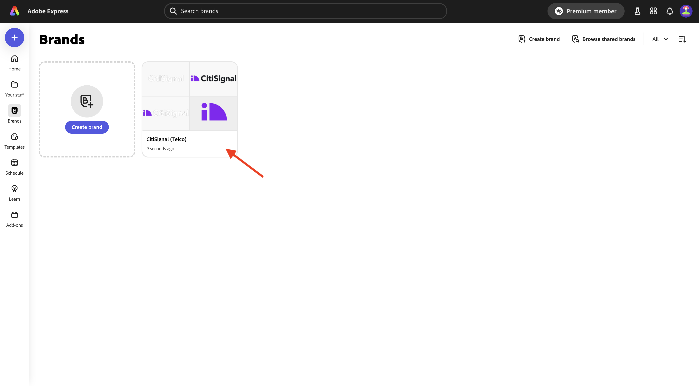
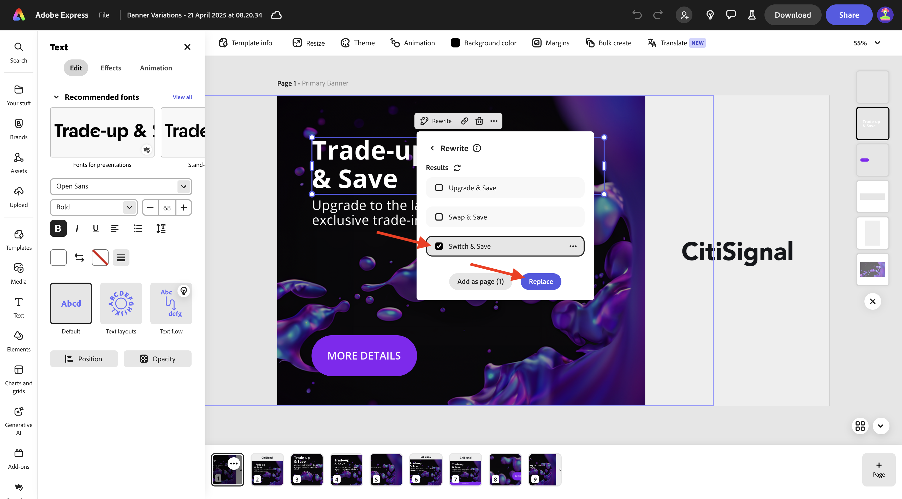
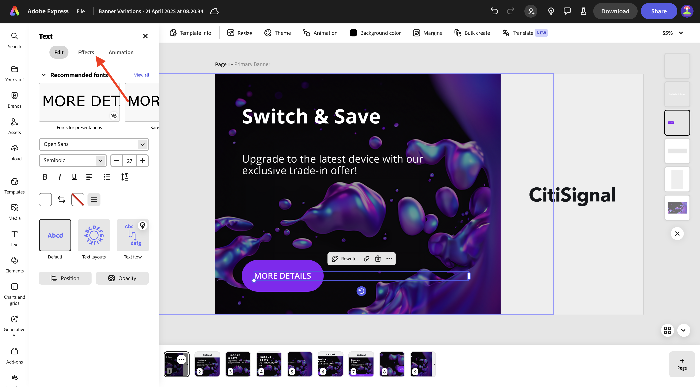
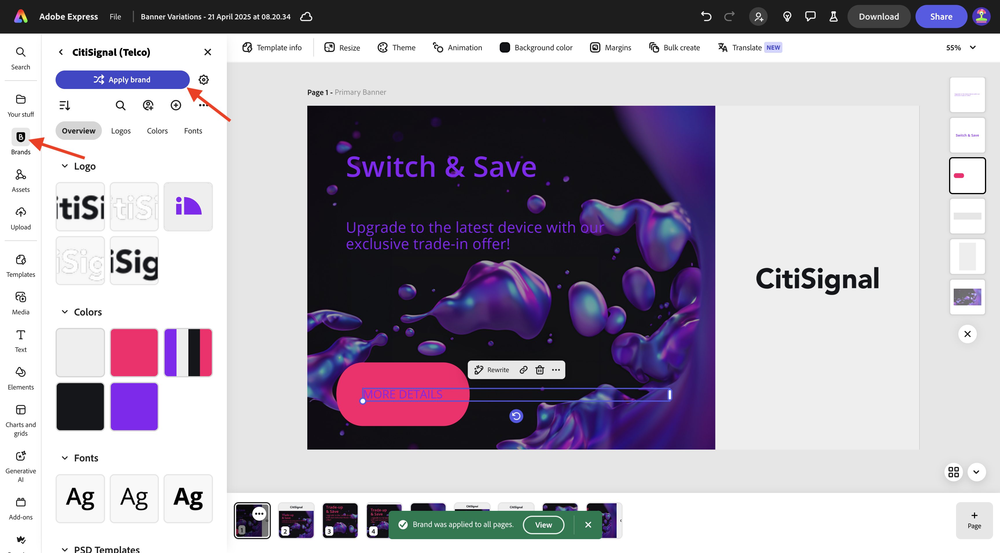
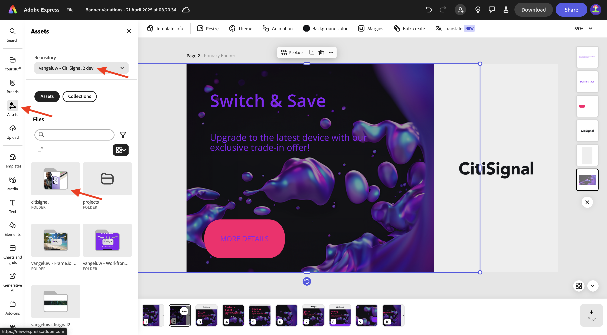
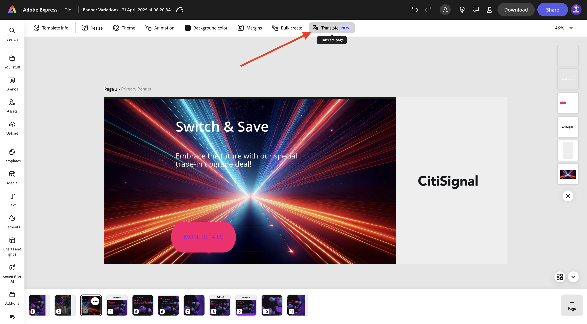

# 1.4.1 Introdução ao Adobe Express

## 1.4.1.1 Fazendo login no Adobe Express

Abra uma nova janela incógnita do navegador e vá para [https://www.adobe.com/home](https://www.adobe.com/home){target="_blank"}. Faça logon usando sua **conta da Empresa ou da Escola** e selecione a conta **`--aepImsOrgName--`**.

O Adobe Express está disponível para você como parte das licenças de sua organização. Para garantir que você tenha acesso ao Adobe Express, é necessário verificar se você está conectado à organização correta. Para fazer isso, clique no ícone **perfil** e verifique qual conta está ativa. A conta que você deveria usar tem o nome `--aepImsOrgName--`.

Clique em **Alternar perfil** para alterar a conta.

Escolha a conta certa no menu, neste caso o **Experience Platform International** (mas essa pode ser uma organização diferente para você).

Quando a conta correta estiver ativa, vá para **Aplicativos** e clique em **Introdução** no cartão **Adobe Express**.

Agora você está conectado ao **Adobe Express**.

## 1.4.1.2 Introdução a partir de um modelo de marca

No Adobe Express, vá para **Marcas**. A biblioteca de modelos de marca provavelmente está vazia no momento. O CitiSignal definiu um modelo de marca anteriormente e agora você deve reutilizar esse modelo existente.

Para fazer isso, vá para [https://www.adobe.com/files/link/1c2f92cf-17bc-4d11-6031-dbd251e6cb57](https://www.adobe.com/files/link/1c2f92cf-17bc-4d11-6031-dbd251e6cb57).

Você deverá ver isso. Clique nos 3 pontos **...**.

Selecione **Fazer uma cópia**.

Após cerca de um minuto, você deve ver uma mensagem confirmando que fez uma cópia pessoal do modelo de marca.

Retorne ao Adobe Express, às **Marcas** e atualize a página. Agora você deve ver o modelo de marca **CitiSignal (Telco)**. Clique para abrir o modelo de marca **CitiSignal (Telco)**.

Em seguida, você deve ver uma biblioteca de ativos, como logotipos, fontes, cores, modelos etc.

Vá para **Modelos Expressos** e clique para abrir o modelo **Variações de Banner**.

Clique em **Iniciar um novo arquivo**.

Você deverá ver isso.

Clique na caixa de texto que diz **Trade-up e Salvar**. Em seguida, selecione **Reescrever**, escolha um estilo e clique em **Gerar**.

Escolha uma variação e clique em **Substituir**.

Em seguida, você deverá ver o texto atualizado.

Em seguida, clique no texto **MAIS DETALHES**.

Selecione **Efeitos**.

Vá para **Forma** e clique em **Exibir tudo**.

Clique no botão **finetune**. Altere o **Tamanho da forma** e clique no botão de cor.

Altere a cor escolhendo outra cor do **tema de cores CitiSignal**.

Você deverá ver o botão alterado.

Em seguida, vá para **Marcas** e clique em **Aplicar Marca**. Em seguida, você verá a aparência da alteração da imagem.

Observe que você também pode detalhar as configurações de **Aplicar marca** clicando no ícone de **engrenagem**.

Em seguida, clique nos 3 pontos **...** na imagem em que você está trabalhando e clique em **Duplicar**.

Você deverá ver uma imagem nova e idêntica. Clique na camada de plano de fundo no lado direito da tela.

>[!IMPORTANT]
>
>Para concluir este exercício, você precisa ter acesso a um ambiente de trabalho do AEM Assets CS Author. Se você seguir o exercício [Adobe Experience Manager Cloud Service &amp; Edge Delivery Services](./../../../modules/asset-mgmt/module2.1/aemcs.md){target="_blank"}, terá acesso a esse ambiente.

Vá para **Assets** no menu esquerdo e selecione o repositório do AEM Assets CS que deve ser nomeado como `--aepUserLdap-- - CitiSignal dev`. Em seguida, vá para a pasta **citisignal**.

Selecione a imagem **homepage-hero-1.png**. Você deverá ver a alteração da camada de plano de fundo.

Selecione a caixa de texto conforme indicado e clique em **Reescrever**. Selecione **Rephrase** e, em seguida, selecione um estilo específico. Clique em **Gerar**.

Selecione uma variante e clique em **Substituir**.

Você deverá ver isso. Em seguida, clique nos 3 pontos **...** na página na parte inferior da página e clique em **Duplicar**.

Na imagem recém-criada, vá para **media** e clique em **Gerar imagem**.

Selecione **Paisagem (4:3)**.

Insira o prompt `laser beams running through space` e clique em **Gerar**.

Em seguida, você deverá ver uma imagem gerada pelo Adobe Firefly. Observe que a camada na qual a imagem foi gerada está totalmente na parte superior.

Mova para baixo a imagem recém-gerada e coloque-a apenas sobre a camada de plano de fundo anterior.

Para remover a camada de plano de fundo antiga, clique nela e selecione **Excluir**.

Ajuste a imagem para que ela cubra toda a tela.

Selecione a caixa de texto **Alternar e Salvar** para alterar a cor da fonte para **branco**.

Alterar a cor da fonte para **branco**.

Selecione a outra caixa de texto para também alterar a cor da fonte para **branco**.

Alterar a cor da fonte para **branco**.

Em seguida, clique em **Redimensionar** e insira uma resolução personalizada de **2600** x **1080**. Verifique se a caixa de seleção de **Expandir imagem** está marcada. Clique em **Redimensionar**.

Você deverá ver isso.

Após alguns minutos, você verá algumas novas variações da imagem. Escolha um e clique em **Manter**.

Você deverá ver isso.

Mova e ajuste a imagem para que ela preencha o espaço disponível.

Em seguida, clique em **Traduzir**.

Escolha alguns idiomas, como **francês**, **holandês** e **espanhol**. Verifique se apenas a página específica em que você está trabalhando está selecionada, que neste caso é a **Página 3**. Clique em **Converter**.

As traduções serão geradas.

Você deverá ver várias novas páginas sendo criadas. Clique no ícone **fechar**.

Verifique as traduções e altere-as se necessário, como neste exemplo, em que a tradução não é a ideal.

Atualize o texto conforme necessário.

Seus ativos estão prontos.

## Próximas etapas

Ir para [Animação e Vídeo no Adobe Express](./ex2.md){target="_blank"}

Voltar para [Adobe Express e Adobe Experience Cloud](./express.md){target="_blank"}

Voltar para [Todos os Módulos](./../../../overview.md){target="_blank"}
