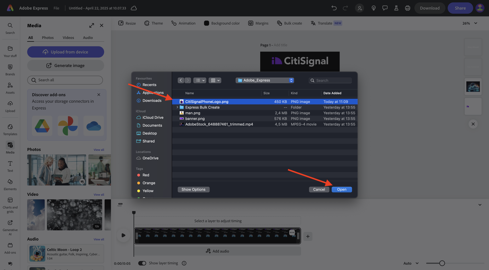
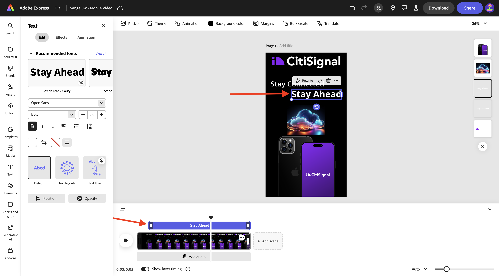
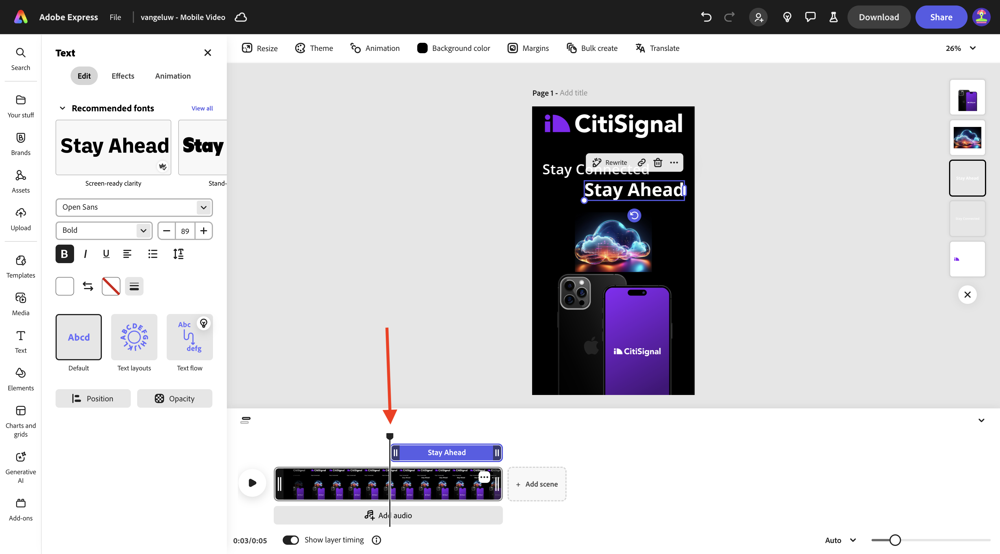

# 1.4.2 Animação e vídeo no Adobe Express

Antes de iniciar este exercício, baixe os ativos necessários do [https://tech-insiders.s3.us-west-2.amazonaws.com/one-adobe/Adobe_Express.zip](https://tech-insiders.s3.us-west-2.amazonaws.com/one-adobe/Adobe_Express.zip){target="_blank"} e descompacte-os na área de trabalho.

## 1.4.2.1 Criar um vídeo

Ir para [https://new.express.adobe.com/](https://new.express.adobe.com/){target="_blank"}. Clique no ícone **+** para criar uma nova **imagem**.

Vá para **Vídeo** e selecione **Vídeo Móvel**.

Você deverá ver isso.

Selecione **Cor de fundo** e escolha **preto**.

Em seguida, adicione o logotipo **CitiSignal**. Vá para **Marcas** e selecione o logotipo branco do CitiSignal. Clique nos 3 pontos **...** e selecione **Colocar**.

Centralize o logotipo do CitiSignal na parte superior da imagem.

Vá para **Texto** e selecione **Adicionar texto**.

Digite o texto `Stay Connected` e coloque a caixa de texto em um local semelhante ao mostrado na imagem abaixo.

Vá para **Texto** e selecione **Adicionar texto**. Digite o texto `Stay Ahead`.

Coloque a caixa de texto em um local semelhante, como mostrado na imagem abaixo.

Selecione a primeira caixa de texto com o texto **Permaneça conectado**. Ir para **Marcas**, para **Fontes**. Clique nos 3 pontos **...** na primeira fonte e clique em **Aplicar**.

Selecione a segunda caixa de texto com o texto **Permaneça à Frente**. Ir para **Marcas**, para **Fontes**. Clique nos 3 pontos **...** na 3ª fonte e clique em **Aplicar**.

Você deverá ver isso. Vá para **Mídia** e selecione **Gerar imagem**.

Digite o prompt `futuristic looking transparent cloud on a black background` e clique em **Gerar**.

Selecione **Paisagem (4:3)**.

Você deverá ver isso. Escolha uma das variações.

Centralizar a imagem gerada. Vá para **Mídia** e clique em **Carregar do dispositivo**.

Navegue até a área de trabalho e acesse a pasta **Adobe_Express** que contém os ativos baixados anteriormente. Selecione o arquivo **CitiSignalPhoneLogo.png** e clique em **Abrir**.

Você deverá ver isso.

Arraste a imagem para baixo para que ela fique semelhante à imagem abaixo.

Altere o nome do projeto para `--aepUserLdap-- - Mobile Video`.

Vá para **Animação** e clique na animação **Slide**.

Clique no ícone **reproduzir** para testar a animação.

Selecione a caixa de texto **Permanecer à Frente**.

Ajuste o controle deslizante da linha de tempo da caixa de texto **Permaneça à Frente** para que ela inicie até a metade.

Selecione o logotipo **CitiSignal**.

Abra as configurações de detalhes na ação **Slide** e altere a duração para 2,5s.

Em seguida, clique em **Baixar**. Selecione o **Formato de arquivo** **MP4** e defina a **Resolução de vídeo** como **1080p**. Clique em **Baixar**.

O arquivo de vídeo será gerado e baixado no computador. Seu primeiro vídeo está pronto.

## 1.4.2.2 Adicionar ao seu vídeo

Feche a exibição **Linha do Tempo**.

Clique nos 3 pontos **...** e selecione **Duplicar**.

Uma nova página será gerada. Clique em **Editar Linha do Tempo** para começar a trabalhar com a nova página.

Clique em **+ Adicionar cena**.

Você deverá ver uma nova cena sendo adicionada.

Navegue até a área de trabalho e acesse a pasta **Adobe_Express** que contém os ativos baixados anteriormente. Selecione o arquivo **`AdobeStock_648887461_trimmed.mp4`** e clique em **Abrir**.

Seu arquivo de vídeo será adicionado à nova cena.

Clique no meio entre as duas cenas e selecione **Adicionar transição**.

Clique em **Ir para preto**.

Altere a **Duração** para 2 segundos. Clique no botão **reproduzir** para testar a transição.

Vá para **Texto** e clique em **Adicionar seu texto**.

Digite o texto `with lightning fast speed from CitiSignal`. Centralize o texto clicando em **Alinhar centralizar**.

Altere o tamanho da fonte para **60**.

## 1.4.2.3 Usar complementos no Adobe Express

Vá para **Complementos** e pesquise pelo complemento **Pré-visualizador Social**.

Clique em **+ Adicionar** para adicionar o complemento.

Selecione o complemento **Visualizador do Social** e clique na opção de visualização **Publicação do Instagram**. Agora é possível visualizar facilmente como sua publicação ficará nas plataformas de redes sociais mais comuns.

## 1.4.2.4 Criar um novo modelo no Adobe Express

Em seguida, clique no botão **Compartilhar** e selecione **Criar um modelo**.

Use o nome `--aepUserLdap-- - Mobile Video`, selecione a marca **CitiSignal (Telco)** e clique em **Salvar modelo**.

O modelo de vídeo agora está salvo no modelo de Marca.

## 1.4.2.5 Salve seu vídeo no AEM Assets CS

Clique novamente em **Compartilhar** e selecione **Salvar na nuvem**. Selecione **AEM Assets**.

Selecione a **Página atual**. Use o nome `--aepUserLdap-- - Mobile Video` e clique em **Selecionar pasta**.

Selecione a pasta **`--aepUserLdap-- - Frame.io PNG`** e clique em **Selecionar**.

Clique em **Carregar 1 ativo**.

Vá para [https://experience.adobe.com/](https://experience.adobe.com/){target="_blank"} e clique em **Experience Manager Assets**.

Selecione o ambiente do AEM Assets CS, que deve se chamar `--aepUserLdap-- - Citi Signal dev`.

Em **Assets**, navegue até a pasta **`--aepUserLdap-- - Frame.io PNG`**. Clique duas vezes no ativo **`--aepUserLdap-- - Mobile Video`** para abri-lo.

O vídeo que foi criado no Adobe Express agora está disponível no Adobe Experience Manager Assets.

## Próximas etapas

Ir para [Criar Assets em Massa no Adobe Express](./ex3.md){target="_blank"}

Voltar para [Adobe Express e Adobe Experience Cloud](./express.md){target="_blank"}

Voltar para [Todos os Módulos](./../../../overview.md){target="_blank"}
