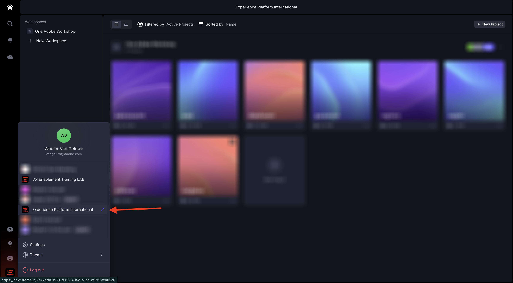
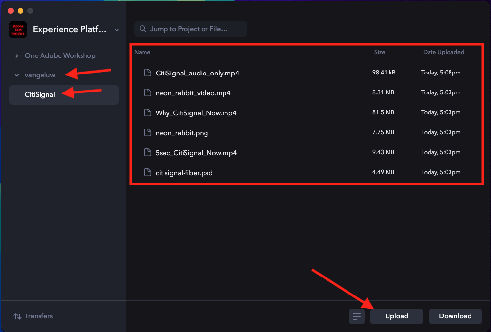

# 1.5.1 Introdução ao Frame.io

>[!NOTE]
>
> A captura de tela abaixo mostra um ambiente específico que está sendo usado. Quando você estiver assistindo a este tutorial, é muito provável que seu ambiente tenha um nome diferente. Quando se inscreveu neste tutorial, você recebeu os detalhes do ambiente que devem ser usados. Siga estas instruções.

Ir para [https://next.frame.io/](https://next.frame.io/). Verifique se você está conectado ao ambiente `--aepImsOrgName--`.

Caso não esteja conectado ao ambiente direito, clique no logotipo no canto inferior esquerdo e clique para selecionar o ambiente que precisa usar.

## 1.5.1.1 Crie seu espaço de trabalho e projeto

Clique em **+ Novo Workspace**.

Para o nome do espaço de trabalho, use: `--aepUserLdap--`. Clique em **Salvar**.

Seu espaço de trabalho foi criado. Em seguida, crie um novo projeto. Clique em **+ Novo projeto**.

Selecione **Em branco** e use o nome `CitiSignal`. Clique em **Criar novo projeto**.

Seu projeto foi criado. Agora é necessário carregar ativos no projeto. Clique em **Carregar**.

Baixe estes arquivos: [https://tech-insiders.s3.us-west-2.amazonaws.com/Frame.io_Assets.zip](https://tech-insiders.s3.us-west-2.amazonaws.com/Frame.io_Assets.zip) no seu desktop e descompacte-os no desktop.

Selecione todos os arquivos e clique em **Abrir**.

>[!NOTE]
>
>Como você pode ver na captura de tela, a pasta **Efeitos Sonoros** não está selecionada no momento. Isso ocorre porque o carregamento manual não oferece suporte ao carregamento de pastas. Em alguns minutos, você instalará o aplicativo Transferência Frame.io, que será usado para carregar essa pasta e seus arquivos.

Após alguns minutos, você verá seus arquivos ficarem disponíveis no Frame.io.

Agora você carregou arquivos manualmente, mas há uma maneira melhor e mais rápida de fazer upload e baixar arquivos de e para Frame.io. A melhor maneira de fazer isso é usar o aplicativo Transferência Frame.io.

## 1.5.1.2 Baixe e configure o aplicativo de transferência Frame.io

Acesse [https://frame.io/transfer](https://frame.io/transfer) e baixe a versão do seu computador.

Instale o aplicativo e depois abra-o.

Quando o aplicativo é aberto, é necessário fazer logon. Clique em **fazer logon**.

Insira o endereço de email da sua conta da Adobe e clique em **Vamos**.

Após a autenticação bem-sucedida, clique em **Abrir o aplicativo de Transferência Frame.io**.

Você deverá ver isso. Para selecionar o ambiente correto, clique em para abrir a lista suspensa.

Selecione o ambiente que você precisa usar para este tutorial, que é o `--aepImsOrgName--`.

Em seguida, você deve ver o espaço de trabalho e o projeto criados anteriormente, juntamente com os arquivos carregados manualmente.

Clique em **Carregar**.

Vá para a pasta usada anteriormente, que contém os arquivos descompactados baixados anteriormente. Selecione a pasta **Efeitos Sonoros** e clique em **Carregar**.

Seus arquivos serão carregados.

Depois de carregada, você verá que a nova pasta fica disponível no Frame.io.

## 1.5.1.3 Configurar o Adobe Premiere Pro Beta

Você já instalou o Adobe Premiere Pro Beta como parte do módulo Introdução. Para usar o Frame.io em combinação com o Adobe Premiere Pro Beta, você pode usar o plug-in que foi desenvolvido para essa integração.

Abra o aplicativo Creative Cloud e procure por `frame.io`.

Role para baixo nos resultados da pesquisa para localizar os **Comentários de Frame.io V4** do plug-in. Clique nele.

Você deverá ver isso. Clique em **Instalar**.

Se o Adobe Premiere Pro Beta estiver aberto, será necessário **Fechar** primeiro antes de instalar o plug-in.

Clique em **OK**. O plug-in está sendo instalado.

Depois que o plug-in for instalado, abra o Adobe Premiere Pro Beta no computador.

## Próximas etapas

Ir para [-](./ex1.md){target="_blank"}

Volte para [Simplifique seu fluxo de trabalho com o Frame.io](./frameio.md){target="_blank"}

Voltar para [Todos os Módulos](./../../../overview.md){target="_blank"}
