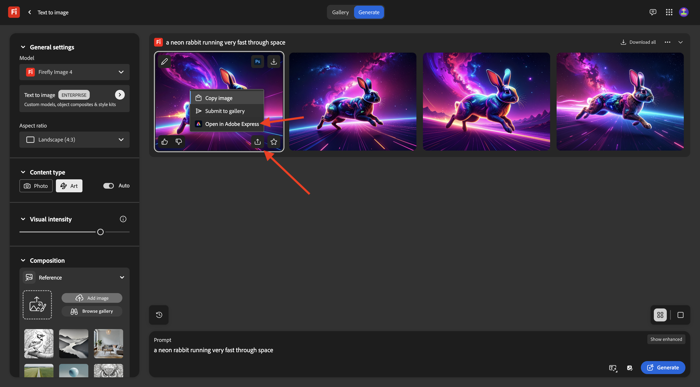
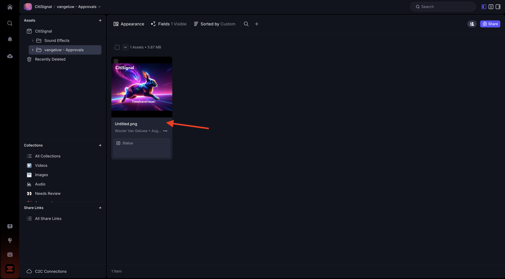
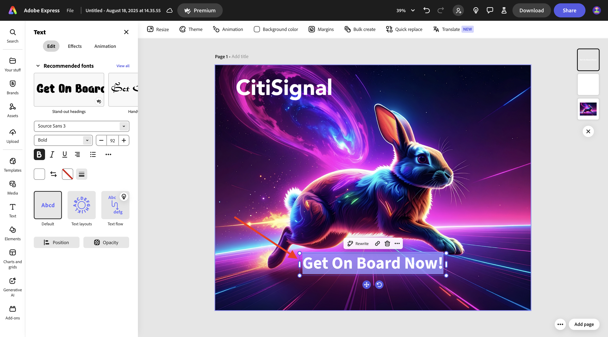
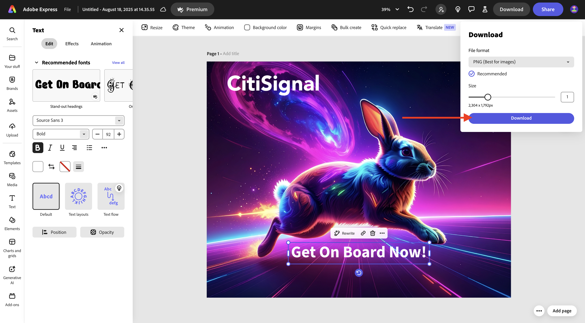

# 1.5.2 Aprovações com Frame.io

>[!NOTE]
>
> A captura de tela abaixo mostra um ambiente específico que está sendo usado. Quando você estiver assistindo a este tutorial, é muito provável que seu ambiente tenha um nome diferente. Quando se inscreveu neste tutorial, você recebeu os detalhes do ambiente que devem ser usados. Siga estas instruções.

Para percorrer o fluxo de trabalho de aprovações no Frame.io, é necessário ter um ativo. Neste exercício, você começará criando esse ativo usando o Adobe Firefly e o Adobe Express. Depois de ter o ativo, você o carregará no Frame.io e o aprovará eventualmente.

## 1.5.2.1 Criar ativo com o Adobe Firefly Services e o Adobe Express

Ir para [https://firefly.adobe.com/](https://firefly.adobe.com/){target="_blank"}. Digite o prompt `a neon rabbit running very fast through space` e clique em **Gerar**.

Você verá várias imagens sendo geradas. Escolha a imagem de que você mais gosta, clique no ícone **Compartilhar** na imagem e selecione **Abrir no Adobe Express**.

Em seguida, você verá a imagem que acabou de gerar ficar disponível no Adobe Express para edição. Agora é necessário adicionar o logotipo CitiSignal na imagem. Para fazer isso, vá para **Marcas**.

Você deverá ver um modelo de marca CitiSignal. que foi criado no GenStudio for Performance Marketing aparecem no Adobe Express. Clique para selecionar um modelo de marca que tenha `CitiSignal` em seu nome.

Vá para **Logotipos** e clique no logotipo **branco** do Citisignal para soltá-lo na imagem.

Posicione o logotipo do CitiSignal na parte superior da imagem, não muito longe do meio.

Ir para **Texto**.

Clique em **Adicionar seu texto**.

Insira o texto `Timetravel now!`, altere a cor e o tamanho da fonte, defina o texto como **Negrito** para ter uma imagem semelhante a esta.

Em seguida, clique em **Compartilhar**.

Clique em **... Mostrar tudo**.

Role para baixo e selecione **Baixar**.

Clique em **Baixar**.

Você terá seu ativo no computador local.

## 1.5.2.2 Aprove seu ativo no Frame.io

Ir para [https://next.frame.io/](https://next.frame.io/). Verifique se você está conectado ao ambiente `--aepImsOrgName--`.

Caso não esteja conectado ao ambiente direito, clique no logotipo no canto inferior esquerdo e clique para selecionar o ambiente que precisa usar.

Vá para o seu espaço de trabalho, que deve ser chamado de `--aepUserLdap--` e abra a pasta **CitiSignal**. Clique no ícone **+** e selecione **Nova Pasta**.

Nomeie a pasta `--aepUserLdap-- - Approvals`. Clique duas vezes na pasta para abri-la.

Agora você fará o upload do arquivo criado no exercício anterior para essa pasta. Clique em **Carregar**.

Selecione o arquivo e clique em **Abrir**.

Você deveria ficar com isso. Clique duas vezes no arquivo para abri-lo.

Ative o ícone para deixar um comentário ancorado.

Insira um comentário, como `Change CTA to "Get on board now!"`. Clique no ícone **enviar** para compartilhar seu comentário.

Você deveria ficar com isso. Ir para **Campos**.

No campo **Status**, altere o status para **Requer Revisão**.

Você deveria ficar com isso. Volte para a pasta clicando na seta para voltar.

Clique nos 3 pontos **...** e selecione **Renomear**.

Altere o nome do arquivo para `version1.png`.

## 1.5.2.3 Fazer alterações de design no Adobe Express

Vá para [https://new.express.adobe.com/your-stuff/files](https://new.express.adobe.com/your-stuff/files) e abra a imagem criada anteriormente novamente.

Altere o texto do CTA para `Get On Board Now!`.

Clique em **Compartilhar** e selecione **Baixar**.

Clique em **Baixar**.

Em seguida, você terá uma nova imagem baixada em seu computador local. Renomeie o arquivo para `version2.png`.

## 1.5.2.4 Aprove a versão 2 no Frame.io

Na pasta no Frame.io, clique no ícone **+** e selecione **Carregar ativo**.

Selecione o arquivo **version2.png** e clique em **Abrir**.

Em seguida, arraste o arquivo **version2.png** para cima do arquivo **version1.png**. Esta ação habilitará o empilhamento de versão no Frame.io.

Você deverá ver isso.

Clique nos 3 pontos **...** na imagem e selecione **Comparar Versões**.

Você deverá ver essa visualização de comparação que mostra ambas as versões do arquivo. Ir para **Campos**.

Altere o campo **Status** para **Aprovado**.

Você deveria ficar com isso. Clique no ícone de seta para voltar para a exibição de pasta.

Clique nos 3 pontos **...** e selecione **Baixar** caso queira usar este arquivo em outro aplicativo.

## Próximas etapas

[1.5.3 Frame.io e Premiere Pro](./ex3.md){target="_blank"}

Volte para [Simplifique seu fluxo de trabalho com o Frame.io](./frameio.md){target="_blank"}

Voltar para [Todos os Módulos](./../../../overview.md){target="_blank"}
